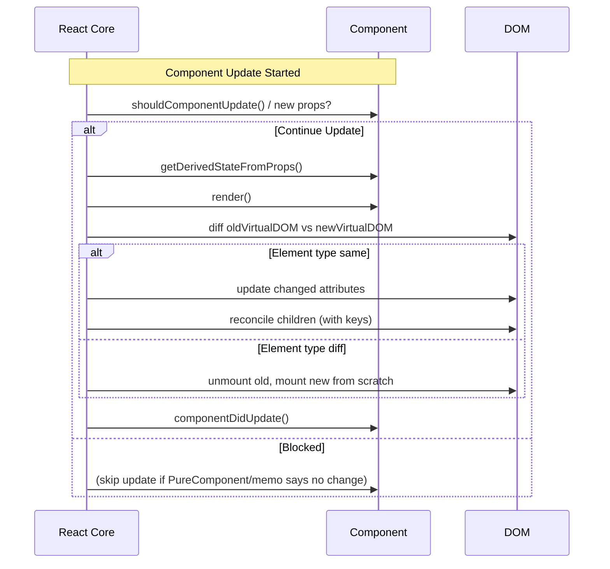
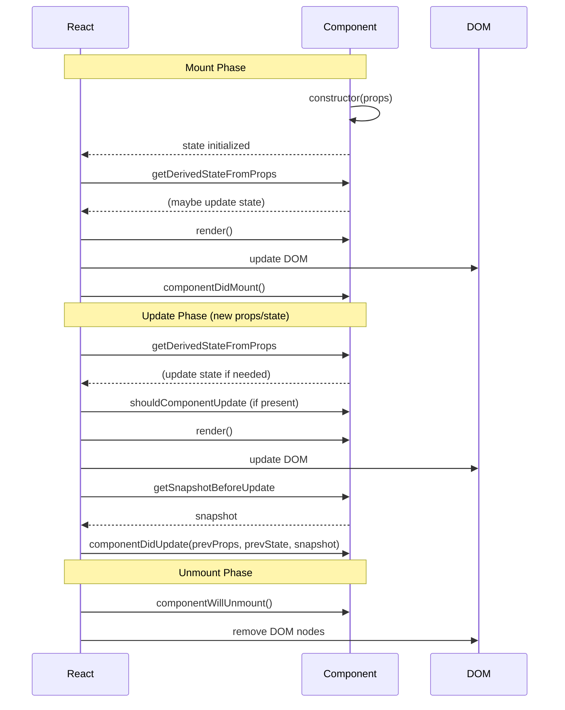

# React.js Interview Prep: Questions, Answers, and In-Depth Discussion

**Executive Summary:** This report compiles the *most frequently asked React.js interview questions*, organized by experience level: **Beginner, Intermediate, Advanced,** and **Internals/Performance/Architecture**. Each question is followed by a succinct interview-style answer, then a deeper explanation covering design rationale, internal mechanics, common pitfalls, and related concepts. Where helpful, we include runnable code examples in JSX/JavaScript with key lines annotated, tables comparing related APIs, and Mermaid diagrams (lifecycles, reconciliation flow, etc.) to visualize concepts. Citations are drawn from React’s official documentation (react.dev and legacy docs), React team blogs (e.g. Dan Abramov’s overreacted.io), React RFCs, and expert sources (Kent C. Dodds, etc.). This report is intended as a comprehensive, interview-ready resource for React knowledge, covering basics through advanced topics (including React 18/19 features, concurrent rendering, server components, etc.) with analytical rigor.

## Beginner-Level React Interview Questions

### What is React?

**Answer (concise):** React is a **JavaScript library** (not a full framework) for building user interfaces, especially single-page apps. It uses a *component-based* architecture where UI is broken into reusable, stateful pieces. React employs a **Virtual DOM** to efficiently update only what’s changed, and it follows a **declarative** programming model (describe *what* the UI should be, not *how* to manipulate the DOM)【35†L1-L4】.

**Explanation:** React was developed by Facebook and is widely used for dynamic, interactive UIs. A React app is built from **components**, which are JavaScript functions (or classes) that return JSX (a syntax similar to HTML). Components manage their own state and can accept external data via *props*. Because React re-renders components when state/props change, it abstracts away manual DOM updates. This is achieved by keeping a Virtual DOM (an in-memory representation of the UI) and performing *reconciliation* to diff and patch only the changed parts of the real DOM【35†L1-L4】【22†L135-L143】. Key advantages include:
- **Reusability:** Components can be reused and composed.
- **Performance:** Virtual DOM diffing minimizes costly real-DOM operations【22†L135-L143】.
- **Declarative Code:** Describe UI in JSX/JavaScript instead of imperative DOM manipulation.
- **Strong Ecosystem:** Rich community and ecosystem (React Router, Redux, Next.js, etc.).
React itself is unopinionated about architecture beyond components (e.g. you choose your state management library)【35†L1-L4】.

**Example:** A minimal React component (functional style) looks like:
```jsx
function HelloWorld({ name }) {
  return <h1>Hello, {name}!</h1>;  // JSX syntax produces a React element
}

// Usage:
// ReactDOM.render(<HelloWorld name="Alice" />, rootElement);
```
This component *re-renders* when `name` prop changes, but we don’t manually manipulate the DOM – React handles it.

**Common Pitfalls:** Forgetting that React is *just* a UI library (you still need routing, state management, etc. separately). Confusing React with other frameworks (Angular/Vue). Overusing component state or not breaking UI into components leads to monolithic code. Also, over-relying on the Virtual DOM for performance (some very frequent updates still need optimization).

**Follow-up Questions:** How does React’s Virtual DOM work under the hood (diffing algorithm)? What problems does declarative UI solve? Compare React with a framework like Angular in terms of data flow and architecture.

### What is JSX and how does it work?

**Answer (concise):** JSX (JavaScript XML) is a **syntax extension** for JavaScript that looks like HTML/XML. It allows writing UI templates directly in JS code: e.g. `<div>Hello</div>`. Under the hood, a build tool (Babel or the React Compiler) transforms JSX into `React.createElement` calls (or similar), which produce React element objects. JSX isn’t required but is widely used because it’s concise and expressive【37†L97-L100】.

**Explanation:** JSX *mixes markup with JavaScript*, enabling you to write `<div>` and inline expressions like `{user.name}` inside a JS file【37†L97-L100】. Although JSX resembles HTML, it’s not a string – it’s syntactic sugar. For example:
```jsx
// JSX:
<div className="card">Hello!</div>

// Transpiles to something like:
React.createElement('div', { className: 'card' }, 'Hello!');
```
This `createElement` call constructs a React element describing `<div class="card">Hello!</div>`. At build time, JSX is compiled to these function calls【37†L97-L100】. Advantages of JSX include readability (markup in JS) and easy embedding of dynamic values (with `{}` braces). A downside is that browsers don’t understand JSX natively; it must be compiled. However, this compilation is standard in React projects. (Note: React and JSX are separate – you could use React without JSX, but JSX is idiomatic in React apps【37†L97-L100】.)

**Example:** 
```jsx
// JSX component
function Welcome({ user }) {
  return (
    <div>
      <h1>Welcome, {user.name}!</h1>
      <p>Your email is: {user.email}</p>
    </div>
  );
}

// Without JSX (equivalent):
function Welcome({ user }) {
  return React.createElement(
    'div',
    null,
    React.createElement('h1', null, `Welcome, ${user.name}!`),
    React.createElement('p', null, `Your email is: ${user.email}`)
  );
}
```
This shows how JSX is just syntactic sugar over `React.createElement`.

**Common Pitfalls:** Remember JSX returns only *one root element* (wrap siblings in a `<div>` or `<>` fragment). The `class` attribute is `className` in JSX. Infamous errors: forgetting to import React (in older versions) or misplacing parentheses in multiline JSX. Also, don’t confuse JSX with HTML – e.g. inline event handlers in JSX use camelCase (`onClick`) and values in `{}`.

**Follow-up Questions:** How would you set up a project to use JSX (e.g. Babel/Webpack config)? What happens if you omit the second argument in `React.createElement`? (Hint: props object or null.) How does JSX relate to TypeScript’s TSX? 

### Explain the Virtual DOM. Why does React use it?

**Answer (concise):** The **Virtual DOM** is an in-memory representation of the UI’s DOM tree. React maintains a virtual DOM (usually as plain JavaScript objects) and, on updates, **diffs** (reconciles) it with the previous virtual DOM to compute minimal real DOM changes. This makes updates **efficient**, because React avoids costly direct DOM manipulation when many elements change. Instead, only the changed parts are updated【22†L135-L143】.

**Explanation:** Directly updating the browser DOM is relatively slow (especially in large trees). React’s Virtual DOM diff algorithm (an O(n) heuristic) speeds this up: when component state/props change, React re-renders components to a new virtual DOM. It then compares this new tree with the old one, finds the differences, and applies those changes to the real DOM【22†L135-L143】【15†L39-L47】. The algorithm assumes: (1) Elements of different types always produce different trees; (2) Keys hint stable identity. For example, if a `<div>` becomes a `<span>`, React recreates that subtree (with unmount/mount)【15†L55-L63】. If only attributes change, React updates just those attributes【15†L89-L98】. Keys in lists help React match items across renders to avoid re-creating nodes unnecessarily【15†L173-L178】.

**Benefits:** This improves performance because fewer DOM operations are needed. Virtual DOM also makes UI updates **declarative**: you just specify the new UI state, not DOM steps. However, there is some overhead of diffing and memory to hold two trees. In most cases the trade-off is positive: as [GreatFrontEnd] notes, Virtual DOM “improves performance by reducing costly direct DOM manipulations”【22†L135-L143】. Only in extremely frequent updates or huge trees might manual optimizations beat React’s diff (downside: extra memory and diff CPU cost)【22†L149-L153】.

**Diagram (Reconciliation Flow):** Below is a high-level flowchart of React’s diff (reconciliation) process when updating the DOM. It shows how React compares element types and children, and where keys are used:

```mermaid
flowchart TD
    A[Old Virtual DOM] --> B{Root element type same?}
    B -->|No| C[Destroy old tree, mount new tree from scratch]
    B -->|Yes| D{Is element a DOM node or a Component?}
    D -->|DOM| E[Update changed attributes on same DOM node]
    D -->|Component| F[Update component props, call render()]
    F --> G[Generate new child tree]
    E & G --> H[Recurse on children]
    H --> I{Lists/Arrays?}
    I -->|Yes (keys)| J[Match children by key, update/insert/remove minimal nodes]
    I -->|No| K[Match children by index (fallback, can re-render more)]
    J & K --> L[Patch real DOM]
    C --> L
```
*(This flow abstracts React’s reconciliation logic: if element types differ, React tears down and rebuilds; if same type, it updates and recurses. Keys optimize matching in lists.)*

**Example:** Consider updating a list of items. Without keys, inserting an item at start may re-render all items. With unique keys, React knows to insert the new item and leave others intact. For example:
```jsx
// Without keys: bad for dynamic lists
<ul>
  {items.map((item, idx) => <li key={idx}>{item}</li>)}
</ul>

// With stable keys: better
<ul>
  {items.map(item => <li key={item.id}>{item.text}</li>)}
</ul>
```
Using indices (`key={idx}`) can cause React to misidentify items when order changes【23†L204-L209】. The `key` prop tells React which virtual DOM element corresponds to which real DOM node, avoiding unnecessary re-renders【23†L189-L193】【23†L204-L209】.

**Common Pitfalls:** Not providing keys (or using non-unique ones) in lists. Assuming Virtual DOM means React always fast; in some rare cases (massive lists, animations) manual DOM handling or virtualization might be needed. Also, keep in mind React’s diff is *heuristic* (O(n)), not a perfect tree-diff (which would be O(n³) and infeasible)【15†L35-L43】.

**Follow-up Questions:** How does React’s diff algorithm achieve O(n) complexity? (Discuss the two assumptions.) What happens internally when element type changes? (It unmounts old and remounts new【15†L55-L63】.) How do keys affect performance and bugs? What is React Fiber and how does it relate to rendering scheduling?  

### What are props and state in React? How do they differ?

**Answer (concise):** **Props** (short for properties) are inputs to a component passed from a parent; they are **read-only** (immutable) inside the child. **State** is internal to a component; it can change over time (via `setState` or the `useState` hook). Props configure a component (like function arguments), while state holds dynamic data that affects rendering. Changes in either trigger re-renders, but props come from above, state is owned within.

**Explanation:** In React’s data flow, parent components pass **props** downward to children. For example `<Greeting name="Alice" />` passes the prop `name`. The child uses `props.name`, but should never mutate it. Props make components reusable and configurable. In contrast, **state** is data local to the component (or managed by hooks) that the component itself can update (for example, a `count` in a counter component). State is usually managed via `this.setState` in class components or the `useState` hook in functions. When state changes, React re-renders the component (and its subtree) to reflect the new state. 

Props vs state differences: 
- Props are passed in (immutable), while state is managed inside (mutable through setters). 
- Parent-to-child vs internal.
- Multiple components may share state by lifting it up or using context, but each component’s `state` is private (unless explicitly passed or exposed).

**Example:** A simple counter component:
```jsx
function Counter({ initialCount }) {
  const [count, setCount] = useState(initialCount);
  return (
    <div>
      <p>You clicked {count} times.</p>
      <button onClick={() => setCount(c => c + 1)}>Click me</button>
    </div>
  );
}
// Usage: <Counter initialCount={0} />
```
Here, `initialCount` is a prop (immutable inside), and `count` is state (updated on each click). Notice we use the updater form `setCount(c => c + 1)` to avoid stale closure problems.

**Common Pitfalls:** Trying to modify props directly (like `props.value = something`) – props are read-only. Expecting state updates to happen immediately (they’re async and batched). Not including all needed dependencies in state update functions. Using component state when a global store/context makes more sense can lead to convoluted prop drilling.

**Follow-up Questions:** When should you lift state up to a common ancestor? Compare using props vs React Context for passing data. How does React decide when to re-render on prop/state change? (Answer: shallow comparison for PureComponent/memo, always for state setters.)

### What is the difference between controlled and uncontrolled components (in forms)?

**Answer (concise):** In **controlled** components, form element values (like `<input>`) are bound to React state: the component holds the source of truth and updates via events. In **uncontrolled** components, the DOM maintains its own state and you query the value via refs when needed. Controlled components allow React to control form data (via `value` and `onChange`), making validation and testing easier. Uncontrolled components are simpler for basic cases but offer less control.

**Explanation:** In a controlled input, you do:
```jsx
const [text, setText] = useState('');
<input value={text} onChange={e => setText(e.target.value)} />;
```
Here, `text` in state is the single source of truth. Every keystroke updates state, and the input displays it. This ensures React always knows the input’s value and can enforce rules (e.g. uppercase, validation). In contrast, an uncontrolled input:
```jsx
const ref = useRef();
<input type="text" defaultValue="Hi" ref={ref} />;
```
Here, React does not update state on each keystroke; the DOM input manages itself. You get its value later via `ref.current.value`. 

Controlled components are generally recommended in React, especially for complex forms, because they align UI with state and make components predictable. Uncontrolled components can be fine for simple or legacy code, but using them means side-stepping React’s data flow and often needing refs or the DOM API.

**Example (controlled vs uncontrolled):** From [GreatFrontEnd]【23†L275-L283】:
```jsx
// Controlled:
function ControlledInput() {
  const [value, setValue] = React.useState('');
  return (
    <input 
      type="text"
      value={value}
      onChange={e => setValue(e.target.value)}
    />
  );
}

// Uncontrolled:
function UncontrolledInput() {
  const inputRef = React.useRef();
  return <input type="text" ref={inputRef} />;
}
// Later, you might read inputRef.current.value
```

**Common Pitfalls:** Forgetting to add `onChange` when you use `value` leads to a read-only field. Setting `defaultValue` vs `value` improperly. Uncontrolled inputs often need extra validation later. Mixing controlled/uncontrolled for the same field can cause warnings. Also, updating state directly from props can cause stale controlled values.

**Follow-up Questions:** How do you manage form state in large forms? (Mention libraries like Formik or React Hook Form.) How does validation fit into controlled components? What happens if you set `value` but no `onChange`?

### What are React Fragments and when would you use them?

**Answer (concise):** **Fragments** (`<></>` or `<React.Fragment>`) let you group multiple JSX elements without adding extra nodes to the DOM. They are useful when a component must return several siblings but you don’t want an extra wrapper `<div>`. Fragments render their children directly. You can also pass a `key` to a Fragment (using `<Fragment key=...>` form) when mapping arrays.

**Explanation:** In JSX, a component must return a single root element. Often you would wrap siblings in a `<div>` or other container. Fragments allow grouping without a container, avoiding extra layout or CSS issues. For example:
```jsx
function Columns() {
  return (
    <>
      <ColumnA />
      <ColumnB />
    </>
  );
}
```
This renders just `ColumnA` and `ColumnB` as siblings in the DOM (no wrapper `<div>`). You can also use `<React.Fragment key={id}>…</React.Fragment>` if you need to give a key when rendering lists of fragments【26†L411-L420】. 

Fragments support taking refs in very new versions of React, but traditionally they are just invisible wrappers. They improve markup cleanliness and are essentially free compared to extra DOM nodes. The official docs explain that fragments are for grouping elements without extra nodes【23†L168-L173】.

**Common Pitfalls:** Forgetting that the shorthand `<>...</>` doesn’t accept attributes (only the long form `<Fragment>` can take a `key`). Also, forgetting that fragments do add up in virtual DOM hierarchy (though not in real DOM). In very old React versions, `<></>` wasn’t available and `<Fragment>` was needed. Now both work.

**Follow-up Questions:** How do you pass a ref to a fragment? (Current React provides a way with `Fragment` refs in unstable releases [26†L539-L548], but normally you can’t attach refs to `<>`.) What if you have multiple elements in a list – how do keys on fragments work? (You must use `<Fragment key={...}>`.)

### What is the `key` prop and why is it important in lists?

**Answer (concise):** The **`key` prop** is a special string attribute you add to React elements in a list (array) to give them a stable identity. Keys help React **identify which items have changed, been added, or removed**. When the list re-renders, matching by key allows React to reuse DOM nodes for unchanged items and only apply minimal updates. Without unique keys, React may unnecessarily re-render or mis-order items, causing performance issues or bugs【23†L189-L193】【23†L204-L209】.

**Explanation:** Imagine rendering a list of components in a `.map()`. If you don’t provide keys (or use non-unique ones like the array index), React will fall back to using index which may confuse it when items move. For example, inserting or deleting an item at the start of a list will cause React to think *every* subsequent item changed (if keys are indices). In contrast, if each `<li>` has `key={item.id}`, React will match items by `id` and only insert/remove what changed【23†L204-L209】. The [GreatFrontEnd] article notes: “Without unique keys, React might re-render elements unnecessarily, causing performance problems and potential bugs.”【23†L191-L194】. And specifically, *using array indices as keys* is warned against: it can lead to incorrect data displays when items reorder or delete【23†L204-L209】.

**Example:** 
```jsx
// Bad: using index (unstable if items reorder)
{items.map((item, idx) => (
  <ListItem key={idx} value={item} />
))}

// Good: using stable unique key (like an ID)
{items.map(item => (
  <ListItem key={item.id} value={item} />
))}
```
If an item is removed in the middle, the second approach preserves identity.

**Common Pitfalls:** Never use `Math.random()` or Date.now() as keys – keys must be consistent between renders. Using index as key is okay only if the list is static or not reordered. Forgetting keys entirely causes React warnings, and it will use array index by default (likely not what you want). Keys should be stable, predictable, and unique *among siblings* (it’s fine if two different lists use the same key values separately).

**Follow-up Questions:** What rules does React use to compare keys? (It uses strict equality on previous vs new keys.) How do keyed Fragments work? (You must use `<Fragment key={...}>` in loops [26†L473-L482].) Can non-unique keys ever cause data mixing or bug (e.g. in forms)? What happens if two children have the same key?

## Intermediate-Level React Interview Questions

### What are React Hooks, and what problems do they solve?

**Answer (concise):** React Hooks (introduced in v16.8) are special functions (like `useState`, `useEffect`, etc.) that let function components have state, lifecycle, and side effects. They solve the problem of code reuse and component complexity that class-based components had. Hooks allow using React features without classes, enabling easier sharing of logic (via custom hooks) and eliminating many “wrapper hell” patterns (like HOCs or render props).

**Explanation:** Before hooks, only class components could have local state (`this.state`) and lifecycle methods (`componentDidMount`, etc.). Hooks let *any* function component use these features. The basic hooks include:
- `useState`: adds state.
- `useEffect`: runs side effects (replaces many lifecycles).
- `useContext`, `useReducer`, `useRef`, `useMemo`, `useCallback`, etc.

Design rationale (from the React team) was to solve problems like: hard-to-reuse logic between classes, complex nesting with render props/HOCs, bugs around `this`, and disconnected lifecycles. Hooks unify initialization and updates (see Dan Abramov’s posts). For example, one `useEffect` with a dependency array can replace `componentDidMount` and `componentDidUpdate` logic【43†L539-L547】【34†L874-L883】. Hooks rely on JavaScript closures for state capture; each render’s hooks “see” values from that render.

React enforces “Rules of Hooks”: only call hooks at the top level of React functions (no loops/conditions), only in React functions (components or custom hooks)【6†L233-L242】. This ensures a predictable order.

**Example (useState/useEffect):**
```jsx
function Timer() {
  const [count, setCount] = useState(0);  // state hook

  useEffect(() => {
    const id = setInterval(() => setCount(c => c + 1), 1000);  // effect hook
    return () => clearInterval(id);  // cleanup on unmount
  }, []);  // empty deps = run once on mount

  return <p>Seconds: {count}</p>;
}
```
Here `useState` creates a state variable. `useEffect` runs after mount (and on update if deps change); cleanup after unmount.  

**Common Pitfalls:** Missing dependencies in `useEffect`: if you use state/props in an effect, they should go into the dependency array or you risk stale closures【34†L704-L712】. Overusing `useEffect` for things better done via state updates. Calling hooks conditionally (breaks rules). Expecting class lifecycle semantics in hooks (effects always run after render, not before or blocking). We’ll discuss hooks like `useMemo` and `useCallback` below for performance – those can be over-optimized too.

**Follow-up Questions:** What’s the difference between `useEffect` and `useLayoutEffect`? How does `useState` manage multiple updates (batching in v18+)? What are custom hooks and how do you write one? (e.g. `function useWindowSize() { ... }`.)

### How does the `useState` hook work? Any pitfalls?

**Answer (concise):** The `useState` hook adds state to a function component. You call `const [value, setValue] = useState(initial)`. React preserves `value` across renders and provides `setValue` to update it. Each `setValue` enqueues a state update that causes the component to re-render. A pitfall is **stale closures**: if you reference an outdated state inside an effect or callback, you might see old values; use the functional updater (`setValue(prev => new)`) to avoid this or include dependencies properly.

**Explanation:** Under the hood, React keeps a list of hook “fibers” for each component. On first render, `useState(initial)` sets up the state. On subsequent renders, React returns the current state. Calling `setValue` schedules a re-render (in React 18+ updates are batched by default even in timeouts). The new render sees the updated state value. Because React components are essentially functions, closures capture the state of the render they were defined in. This means if you use state inside `setTimeout` or an effect without updating it in deps, you can log an old value (as Dan Abramov explains)【5†L591-L600】【34†L704-L712】. The fix is to either include state in dependencies or use functional updates. E.g.:
```jsx
setCount(prevCount => prevCount + 1);
```
ensures you update based on the latest state, avoiding stale reads【34†L704-L712】.

**Example:** A counter demonstrating both setters:
```jsx
function Counter() {
  const [count, setCount] = useState(0);
  const incrementAfterDelay = () => {
    setTimeout(() => {
      setCount(c => c + 1); // functional update ensures latest 'c'
    }, 1000);
  };
  return <button onClick={incrementAfterDelay}>Count: {count}</button>;
}
```

**Common Pitfalls:** Forgetting that state updates via `setState`/`setCount` are asynchronous and may be batched – don’t rely on `count` immediately after calling `setCount`. Also, always use the latest value when updating: avoid `setCount(count + 1)` if multiple updates happen in one render (use functional form). Don’t mutate state directly. Keep state minimal (avoid duplicating props in state).

**Follow-up Questions:** How can you reset state to initial value? (Hint: use a key on component or incorporate a reset function.) What happens if you call `useState()` in a conditional? (Violates rules, hooks order breaks.) Compare `useState` vs `useReducer` for complex updates. 

### How does the `useEffect` hook work? How is it different from class lifecycle methods?

**Answer (concise):** The `useEffect` hook runs after rendering to perform side effects (data fetching, subscriptions, DOM mutations). By default, it runs **after every render** (on mount and on every update). You can pass a dependency array to control it: `useEffect(fn, [dep1, dep2])` only re-runs when those values change. The function can return a cleanup function, which React runs before the effect re-runs (and on unmount)【6†L265-L272】【6†L275-L282】. Unlike class lifecycles, effects don’t block painting (they run after the browser updates the screen). Also, effects always see the state/props of the render during which they were defined (via closures)【34†L704-L712】, so cleanup sees “old” values.

**Explanation:** Each time a component renders, React runs the effect callback *after* updating the DOM. If dependencies have changed since last time, it first runs the previous cleanup. This models mounting, updating, and unmounting phases all in one API. Official docs describe: “When your component commits, React will run your setup [effect] function. After every commit with changed dependencies, React will first run the cleanup (if provided) with the old values, then run the setup with the new values. When component unmounts, it runs cleanup.”【6†L265-L272】【6†L275-L282】. 

Key differences from class methods:
- There is no separate *“mount” vs “update”* effect by default; `useEffect` runs on both (unless you restrict it with `[]` to run once). 
- It always runs after paint (so the user sees updates before effects run, avoiding blocking). Class `componentDidMount` runs after first render, similar to `useEffect(..., [])`. Class `componentDidUpdate` corresponds to `useEffect` on updates (if deps include state/props). Class `componentWillUnmount` corresponds to the cleanup function.
- Effects capture the render’s values via closure【34†L704-L712】. For example, if you click a button 5 times quickly, multiple timeouts may close over different state values. This can be surprising if you expect `this.state` semantics. Dan Abramov explains that *“every function inside the component render… captures the props and state of that render”*【34†L704-L712】. This explicit model makes dependencies visible.
- In Strict Mode (development), React mounts and unmounts twice to help spot missing cleanup.

**Code Example:** Fetching data with cleanup:
```jsx
function FriendStatus({ friendId }) {
  const [isOnline, setIsOnline] = useState(null);

  useEffect(() => {
    function handleStatusChange(status) {
      setIsOnline(status.online);
    }
    ChatAPI.subscribeToFriendStatus(friendId, handleStatusChange);  // setup

    // Cleanup on unmount or if friendId changes:
    return () => {
      ChatAPI.unsubscribeFromFriendStatus(friendId, handleStatusChange);
    };
  }, [friendId]);  // re-run effect only if friendId changes

  return <div>{isOnline ? 'Online' : 'Offline'}</div>;
}
```
This effect runs on mount (and whenever `friendId` changes) to subscribe, and cleans up on unmount (or before re-running).

**Common Pitfalls:** Forgetting a dependency in the array can cause stale values or missed updates. Omitting the array entirely causes effect to run after every render (usually not intended). Returning a cleanup without a setup (or vice versa) is a bug. Doing heavy work in effects can cause visible lag (use `useLayoutEffect` if you must block before painting). The infamous “React state not updating in timeout” issue stems from closures – always consider using functional updates if state is stale in an async callback.

**Follow-up Questions:** What happens if you pass an empty array `[]` to useEffect? (It mimics `componentDidMount` only.) What about no array? (Runs after every render.) How would you implement a “componentDidMount only” effect? What is the difference between `useEffect` and `useLayoutEffect`? (Discuss blocking paint and timing.) What patterns do you follow to avoid infinite loops of effects? (Lint exhaustive deps or refactor logic.)

### What are `useRef`, `useMemo`, and `useCallback` hooks?

**Answer (concise):** 
- `useRef(initial)` returns a mutable ref object `{ current: ... }` that persists across renders. It’s often used to hold DOM references (`ref` attribute) or to store any mutable value (e.g. previous props) without triggering renders.
- `useMemo(fn, deps)` memoizes a **computed value**: it only re-calculates `fn()` when dependencies change, avoiding expensive calculations on every render.
- `useCallback(fn, deps)` memoizes a **function**: it returns the same function instance across renders unless dependencies change, useful for referential equality in props or handlers.
In short, `useRef` is for persistent mutable values, `useMemo` and `useCallback` are for performance optimizations to avoid unnecessary work or re-renders.

**Explanation:** 
- **useRef:** Before hooks, refs were created via `createRef` in class or callback refs. Now `useRef` allows function components to reference DOM nodes or store any value through renders. It does *not* cause re-renders when `current` changes. Example: `const inputRef = useRef();` gives you `<input ref={inputRef} />` access. It can also hold timeouts, previous state, etc.
- **useMemo:** Imagine a costly calculation: 
```jsx
const result = expensiveFunc(a, b);
```
Every render recomputes. With `useMemo`, 
```jsx
const memoResult = useMemo(() => expensiveFunc(a, b), [a, b]);
```
it only recomputes when `a` or `b` change. Avoid `useMemo` if the calculation is cheap (overhead of memoization itself). It’s a hint to React to skip computing.
- **useCallback:** Similar idea, but returns a memoized function. For example, if you pass a callback to a child, you might do:
```jsx
const handleClick = useCallback(() => { doSomething(x); }, [x]);
```
Now `handleClick` is the same function object as long as `x` stays the same. This is useful if a child does a shallow compare on props (e.g. `React.memo`) – a new function instance would otherwise always trigger a re-render.

**Table (useMemo vs useCallback):**

| Hook          | Memoizes         | Usage                                 | Common Pitfall                  |
|---------------|------------------|---------------------------------------|---------------------------------|
| `useMemo(fn, deps)`    | return value of `fn` | Avoid expensive recomputation when deps unchanged | Overusing on cheap computations; forgetting to include all deps (causes stale value) |
| `useCallback(fn, deps)` | function instance `fn` | Preserve callback identity across renders | Same issues with deps; sometimes unnecessary if passed inline arrow is fine |

**Example:** 
```jsx
function Component({ a, b }) {
  const [count, setCount] = useState(0);

  // useMemo example:
  const sum = useMemo(() => {
    console.log('computing sum');
    return a + b;
  }, [a, b]);

  // useCallback example:
  const increment = useCallback(() => {
    setCount(c => c + 1);
  }, []); // no deps: function identity stable

  // useRef example: to access a DOM node
  const divRef = useRef();
  useEffect(() => {
    console.log('div height:', divRef.current.offsetHeight);
  }, [sum]);

  return (
    <div ref={divRef}>
      Sum is {sum}.
      <button onClick={increment}>Clicked {count} times</button>
    </div>
  );
}
```
In this code, the sum is re-computed only when `a` or `b` change. The `increment` function is stable, so if `Component` passes it to a `React.memo` child, that child won’t re-render unnecessarily.

**Common Pitfalls:** Overusing these hooks can lead to complexity. Remember that `useMemo`/`useCallback` also have costs; don’t premature optimize. Always include all dependencies (the ESLint plugin can help). Don’t use `useRef` to try to "preserve state across re-mounts" – it persists only for the life of the component. Avoid setting state in refs (since it won’t trigger updates). 

**Follow-up Questions:** How do you get the previous props or state value? (Answer: use `useRef` to store them.) When does `useLayoutEffect` vs `useEffect` matter for refs? When would you rely on `useMemo` instead of calculating on render? (Answer: only if it’s truly expensive.)

### Explain React Context. How and when would you use the Context API?

**Answer (concise):** React **Context** provides a way to pass data through the component tree *without manually threading props at every level*. It’s typically used for global data (theme, authentication, locale) that many components need. You create a Context with `React.createContext(default)`, provide a value with `<MyContext.Provider value={...}>`, and consume it with `useContext(MyContext)` or a `Context.Consumer`. Context helps avoid "prop drilling" but can trigger re-renders of all consumers when the provider value changes.

**Explanation:** In a React app, props normally flow top-down. Context breaks this flow by allowing a parent to “provide” a value and any nested child (no matter how deep) to “consume” that value, even skipping intermediate components【45†L21-L29】. For example, a ThemeContext might hold `"dark"` or `"light"`. A `<ThemeContext.Provider value="dark">` wraps the app, and any child can call `const theme = useContext(ThemeContext)` to get `"dark"`. This avoids passing `theme` through every `Toolbar`, `Sidebar`, etc. 

However, context should be used *sparingly*. Official docs warn that context makes component reuse harder, so it’s best for true global concerns (e.g. current user, UI theme)【45†L21-L29】【45†L49-L58】. If only a few components need the data, simpler patterns (composition or hooks) may suffice.

Context vs Redux: Context is built-in and good for *static or infrequently updated global data*, but does not provide a structured state management (no built-in reducers or middleware). Redux (or similar) adds patterns for updating global state predictably. Overusing context (especially with large changing data) can cause many re-renders, so sometimes Redux or state libs with selective subscriptions are better.

**Example:** Basic context usage:
```jsx
// Create context (can have a default value)
const ThemeContext = React.createContext('light');

function App() {
  const [theme, setTheme] = useState('light');
  return (
    <ThemeContext.Provider value={theme}>
      <Toolbar />
      <button onClick={() => setTheme(t => t === 'light' ? 'dark' : 'light')}>
        Toggle Theme
      </button>
    </ThemeContext.Provider>
  );
}

function Toolbar() {
  return (
    <div>
      {/* No need to pass theme down manually */}
      <ThemedButton />
    </div>
  );
}

function ThemedButton() {
  const theme = useContext(ThemeContext); // consumes value
  return <button style={{ background: theme==='light' ? '#fff' : '#333' }}>
    I am styled by theme context!
  </button>;
}
```

**Common Pitfalls:** Updating a value in context will re-render *all* consumers beneath, so avoid putting dynamic changing state in context unless necessary. Forgetting to wrap consumers with the correct Provider means `useContext` yields the default value. Mixing contexts incorrectly or nesting them gets complex. Also, using context for things it wasn’t meant for (like local state) can make code confusing.

**Follow-up Questions:** How would you implement a context with a reducer (like a mini-Redux)? (Answer: combine `useReducer` with context provider.) What are the performance implications of context updates? (Answer: every consumer re-renders; can optimize by splitting contexts.) How do you do defaultProps with context?

### What are Higher-Order Components (HOCs) and render props, and how do they compare to hooks?

**Answer (concise):** HOCs and render props are React design patterns for reusing component logic:
- **Higher-Order Components (HOC):** A function that takes a component and returns a new component, injecting extra props or behavior. Example: `withRouter(MyComponent)` adds routing props.
- **Render props:** A technique where a component expects a prop that is a function; that function returns JSX. The component “renders” by calling this function, passing data to it.
Both patterns share logic between components. Hooks largely subsume these patterns: instead of creating an HOC or render-prop wrapper to share code, you can write a **custom hook** and use it inside function components for logic reuse.

**Explanation:** Before hooks, if you wanted to share, say, subscription logic, you might write a component `<DataProvider render={data => <MyComponent data={data}/>} />` (render prop) or `export default withData(MyComponent)` (HOC). These wrap components. With hooks, you can do `function useData() { ... }` and call `const data = useData()` inside any component. Hooks avoid “wrapper hell” and make the logic more transparent. However, understanding HOCs/render props is still useful for legacy code. 

Caveats: HOCs and render props can introduce extra nested components (additional divs or wrappers, unless `<>` fragments are used). They also may re-render more often. Hooks allow more straightforward composition in functional style.

**Common Pitfalls:** Forgetting to pass props through in an HOC (loss of props). Misusing `this` in classes vs functions. In render props, misunderstanding which component controls state vs render. With hooks, common pitfall is breaking rules (hooks can only be in function components, not in class).

**Follow-up Questions:** How do you create a HOC that preserves ref or static methods? (Answer: use `React.forwardRef` and copy static methods.) Can you simulate HOCs with hooks? (Yes, e.g. a hook that returns enhanced data, then use it inside components without wrapping.)

### What is `React.memo` and how does it differ from `PureComponent`?

**Answer (concise):** `React.memo` is a higher-order component (HOC) that memoizes a function component’s output: it does a shallow prop comparison and skips re-render if props haven’t changed. `React.PureComponent` is a base class for class components that implements `shouldComponentUpdate` with a shallow props/state check. Both avoid unnecessary re-renders when props/state are unchanged, improving performance. The main difference is usage: `memo` for function components, `PureComponent` for classes.

**Explanation:** In React’s reconciliation, a component re-renders by default whenever its parent renders. Wrapping a component in `React.memo(MyComponent)` will make React do a shallow comparison on its props and only re-render if a prop changed (similar to `shouldComponentUpdate`). For class components, extending `PureComponent` automatically adds a shallow prop/state check. Note that these are *shallow* comparisons (object identity). If a prop is an object or array and mutated in place, `memo`/`PureComponent` won’t catch deep changes. You can pass a custom comparison function to `React.memo` if needed.

Use `React.memo` to optimize pure function components. However, don't overuse it: the comparison itself has overhead. Use it when you have expensive renders and stable props. 

**Code Example:**
```jsx
const ExpensiveList = React.memo(function ExpensiveList({ items }) {
  // Renders a list; only re-renders if items reference changes
  console.log('Rendering list');
  return (
    <ul>
      {items.map(item => <li key={item.id}>{item.text}</li>)}
    </ul>
  );
});

// If parent passes same `items` array or identical contents,
// ExpensiveList won’t re-render (unless items changed by identity).
```

**Common Pitfalls:** `memo` only does shallow prop checks. If you pass inline objects or functions, it’s often false – the component will re-render. For example, `<Comp onClick={() => {}} />` always changes. Use `useCallback` for callbacks if needed. Also, remember that context or parent re-renders will bypass `memo` if props change. And `PureComponent`/`memo` do not prevent all re-renders, only those caused by identical props/state. Sometimes it’s better to manage rendering logic or split components rather than blanket memoizing.

**Follow-up Questions:** How does `memo` work with children (i.e., when a parent state changes but child props don’t)? What if a child has no props – will it still skip? (It will re-render if parent re-renders unless wrapped in memo, because memo checks props – if no props, it can skip if we return `true` for comparison.) How would you use a custom comparator with `React.memo`? (Second argument.)

### How do you implement code-splitting and lazy loading of components in React?

**Answer (concise):** Code-splitting in React is commonly done with `React.lazy` and `<Suspense>`. You use `React.lazy(() => import('./MyComponent'))` to lazily load a component only when it’s rendered. Wrap lazy components in `<Suspense fallback={...}>` to specify a loading UI while the chunk is fetched. This splits your bundle so that users don’t download all components at once, improving initial load times.

**Explanation:** By default, tools like Webpack produce one large bundle. With lazy loading, React can load parts of the app on demand. Example:
```jsx
const Settings = React.lazy(() => import('./Settings'));
function App() {
  return (
    <div>
      {/* Fallback shown while Settings loads */}
      <Suspense fallback={<div>Loading...</div>}>
        <Settings />
      </Suspense>
    </div>
  );
}
```
Here, when `<Settings />` is first rendered, React will dynamically `import` it (returning a promise). During the async load, the `Suspense` shows “Loading...”. Once loaded, `Settings` renders normally. `React.lazy` supports default exports; for named exports, use a wrapper. Code-splitting can also be applied to routes (load each route lazily) or other components.

**Common Pitfalls:** You must use `Suspense` around lazy components, otherwise React will error. Lazy loading currently only works for components (code splitting not yet official for data fetching, except in frameworks). On the server side (SSR), lazy loading requires special handling (next.js does automatic splitting). Also, lazy-loaded components are only for the client-side by default; in SSR you'd need to preload or handle fallback manually. Testing lazy components may require using `await act()`.

**Follow-up Questions:** What happens if a lazy-loaded component fails to load? (Catch errors: you can add an `<ErrorBoundary>` above Suspense.) How do you split vendor libraries (e.g. lodash, moment)? (Use Webpack config or third-party libs like React Loadable.) What about `React.lazy` vs older `loadable-components` or `React Loadable`? (Modern React uses built-in lazy.)

### What are Error Boundaries?

**Answer (concise):** **Error Boundaries** are React components (only class-based, for now) that catch JavaScript errors in their child component tree during rendering, lifecycle, and constructors. An error boundary implements the lifecycle method `componentDidCatch(error, info)` (and optionally `static getDerivedStateFromError`) to display a fallback UI instead of crashing. They do **not** catch errors inside event handlers or asynchronous code.

**Explanation:** If an uncaught error happens in rendering a component, without boundaries, the entire React tree unmounts. Error boundaries allow a subtree to recover gracefully. For example:
```jsx
class ErrorBoundary extends React.Component {
  constructor(props) {
    super(props);
    this.state = { hasError: false };
  }
  static getDerivedStateFromError(error) {
    return { hasError: true };
  }
  componentDidCatch(error, info) {
    // e.g. log to analytics
  }
  render() {
    if (this.state.hasError) {
      return <h1>Something went wrong.</h1>;
    }
    return this.props.children;
  }
}
```
Wrap parts of your app with `<ErrorBoundary>`. If any child throws, the boundary shows fallback UI. Official docs note that hooks currently have *no* way to catch errors (as of React 18); you must use a class component for an error boundary【43†L539-L547】. (There are community packages for function components, but built-in requires class.)

**Common Pitfalls:** Only class components can be error boundaries (there’s no `useErrorBoundary` yet). Be careful where you place them – a boundary only catches errors in its children, not in itself or ancestors. Avoid swallowing errors silently; always log or handle them. Don’t try to recover state inside a boundary beyond the fallback. An error in event handlers is not caught by a boundary (you must use try/catch in handlers, as React doesn’t re-render on event errors). Avoid putting a boundary around every tiny component (then every small error shows fallback unnecessarily).

**Follow-up Questions:** Can you write an error boundary with hooks? (Not directly; you’d still use a class or use a library like `react-error-boundary`.) Where would you place error boundaries in an app? (Usually around routes or large sections, so a crash in one doesn’t break the whole app.) How do error boundaries interact with Suspense?

### What is React Router (or routing in React) and how does it work?

**Answer (concise):** React Router is the de facto library for client-side routing in React apps. It allows mapping URL paths to components, enabling single-page app navigation without full page reloads. The core ideas: a `<BrowserRouter>` listens to URL changes, `<Routes>` (or `<Switch>` in v5) chooses which component to render based on `path` props on `<Route>`, and navigation happens via `<Link>` components or imperative APIs (e.g. `useNavigate`). React Router re-renders relevant components when the path matches.

**Explanation:** React itself doesn’t include routing, so React Router (or alternatives like Next.js router) handles it. Typically, in `App.js` you wrap with `<BrowserRouter>` and define routes:
```jsx
<BrowserRouter>
  <Routes>
    <Route path="/" element={<Home />} />
    <Route path="/profile/:userId" element={<Profile />} />
    <Route path="*" element={<NotFound />} />
  </Routes>
</BrowserRouter>
```
Here, when the URL is `/profile/42`, React Router renders the `<Profile>` component and provides `userId=42` via a hook like `useParams()`. Navigation via `<Link to="/profile/5">` changes the URL without reloading. 

React Router uses the HTML5 history API to manage URL and listen to changes (`popstate`). On each change, it matches routes top-down. It also provides hooks like `useHistory` (v5) or `useNavigate`, `useLocation` in v6. When building interviews, focus on: route nesting, URL parameters (`:id`), programmatic navigation, and guarding routes (redirects).

**Common Pitfalls:** Forgetting to wrap app in `<BrowserRouter>`. Confusing relative and absolute paths. Not using `exact` (in older versions) causes multiple matches. In React Router v6+, `Switch` is replaced by `Routes` and `component={}` prop by `element={<Comp/>}`. Also SSR (Next.js) uses different mechanism; React Router is purely client-side. Ensuring to use `<Link>` instead of `<a>` for SPA behavior.

**Follow-up Questions:** What is the difference between `<BrowserRouter>` and `<HashRouter>`? (Answer: HashRouter uses URL hashes, no server config needed, older style.) How do you handle nested routes? (Answer: include child `<Routes>` inside a parent element.) How to redirect or protect a route? (Answer: use `<Navigate>` or custom route wrapper checking auth.)

### How would you test a React component?

**Answer (concise):** A common approach is using **Jest** as the test runner and **React Testing Library** (RTL) or **Enzyme** to render components. Tests can be unit (render component in isolation, assert output or behavior), or integration (render multiple components), or snapshot (record output). With RTL, you encourage testing behavior: find elements by text or role and simulate user actions (e.g. `fireEvent.click`) and assert on the outcome (e.g. callback called, new text appears). Use `act()` for async updates. For hooks, React team recommends RTL or `@testing-library/react-hooks`. End-to-end testing might use tools like Cypress.

**Explanation:** For an interview, emphasize that modern testing focuses on black-box behavior, not implementation details. You’d write something like:
```jsx
import { render, screen, fireEvent } from '@testing-library/react';
test('Counter increments on click', () => {
  render(<Counter />);
  const btn = screen.getByText(/count:/i);
  fireEvent.click(btn);
  expect(screen.getByText(/count: 1/i)).toBeInTheDocument();
});
```
This uses React Testing Library to render and check the output. Snapshots (Jest’s snapshots) can catch unintended UI changes, but overusing them can lead to brittle tests. Enzyme (shallow or mount) is an alternative that inspects component internals, but RTL is generally preferred now.

**Common Pitfalls:** Testing implementation details rather than user-visible output leads to brittle tests. Forgetting to wrap async updates in `await act()`. Not unmounting components between tests can leak. For components with context or router, you may need to wrap them in providers (e.g. memory router for routing). Avoid testing stateful logic with shallow renders (prefers functional behavior tests).

**Follow-up Questions:** How do you test an async data fetch inside a `useEffect`? (Use `findBy` or `waitFor` in RTL.) How would you mock an API call? (Use Jest mocks or msw to intercept fetch.) How to test hooks in isolation? (Use `@testing-library/react-hooks` or wrap a dummy component.)

## Advanced React Interview Questions

### Describe React Fiber and how it affects rendering.

**Answer (concise):** **React Fiber** is the reimplementation of React’s core reconciliation algorithm (in React 16) to support incremental, asynchronous rendering. It changes React from synchronous depth-first rendering to a **interruptible, incremental** process (time-slicing). Fiber is a re-architecture that stores component work in “fiber” nodes. It enables features like scheduling priorities (React can pause/abort work), concurrent rendering, and smoother UIs under load【23†L241-L249】.

**Explanation:** The old React stack could only render one component tree at a time, synchronously. Fiber breaks the work into small units (fiber nodes) and assigns priorities. For example, an update from a user click (high priority) can interrupt a long rendering of a slower update (like data fetching rendering) and resume it later. Fiber introduced priorities, lifecycle semantics (like `getSnapshotBeforeUpdate`), and better error handling. Interviewers might ask how Fiber works: essentially, React creates a new fiber tree on updates and walks it. It “pauses” work when necessary (e.g. browser needs to paint), then resumes. 

From the perspective of an interview answer, mention that Fiber enables:
- **Time-slicing:** splitting rendering work into chunks so the main thread isn’t blocked.
- **Concurrency:** though not fully enabled by default (React 18+ introduced new APIs, see next Q).
- **Enhanced lifecycle:** new method `getSnapshotBeforeUpdate`, more predictable error boundaries.
Dan Abramov called it a “complete rewrite” for async rendering【23†L241-L249】.

**Common Pitfalls:** Fiber is under the hood; you generally don’t interact with it directly. But you should know it changed semantics like strict mode behavior (double render in dev). A common misconception: “Fiber means parallel rendering” – no, React still runs on a single thread but schedules work. In interviews, don’t overstate: simply say it’s React’s internal reconciliation engine that enables concurrency and smoother updates【23†L241-L249】.

**Follow-up Questions:** How does concurrent mode differ from legacy mode? (Answer: concurrent mode allows interruptions; legacy is sync.) What is the call stack limit issue Fiber solves (hint: old React was recursive, Fiber is loop-based)? How do `getSnapshotBeforeUpdate` and `componentDidCatch` relate to Fiber? (Answer: they were added with Fiber as new lifecycle points.)

### What is React Concurrent Mode / React 18 concurrency, and how do `startTransition` and `useDeferredValue` work?

**Answer (concise):** React 18 introduced **concurrent features** (formerly called Concurrent Mode). The new root API (`createRoot`) enables *auto-batching* and *transitions*. A transition distinguishes **urgent** updates (like clicks, typing) from **non-urgent** (e.g. rendering a new list). By wrapping state updates in `startTransition`, you tell React it can delay those updates and keep the UI responsive. During a transition, the UI shows the current state until the transition completes, avoiding jank. The hook `useDeferredValue(value)` is a simpler way to defer updates of a value: it returns a “deferred” version that lags behind urgent updates, useful for scenarios like filtering large lists.

**Explanation:** In React 18’s blog, they explain that **automatic batching** will group multiple state updates into one re-render even outside events【31†L202-L211】. For transitions:
```jsx
<input value={value} onChange={e => {
  setValue(e.target.value);       // urgent: update the input immediately
  startTransition(() => {
    setSearchQuery(e.target.value);  // transition: update the heavy list data
  });
}} />
```
Here typing is urgent (so input moves with no delay), but updating the search results is wrapped in `startTransition`, telling React it can work on it with lower priority【31†L251-L260】【31†L271-L279】. If the user types again before the results finish updating, React can *cancel* the stale work and only render the latest query’s results.

`useDeferredValue`: 
```jsx
const deferredQuery = useDeferredValue(query);
// Use deferredQuery for heavy filtering
```
This hook automatically does something like a transition internally: `deferredQuery` only updates after other urgent rendering is done. It helps in avoiding flicker.

**Example:** A search input with deferred list update:
```jsx
function SearchList({ data }) {
  const [query, setQuery] = useState('');
  const deferredQuery = useDeferredValue(query);

  const filtered = useMemo(() => {
    return data.filter(item => item.includes(deferredQuery));
  }, [data, deferredQuery]);

  return (
    <>
      <input value={query} onChange={e => setQuery(e.target.value)} />
      <ul>
        {filtered.map(item => <li key={item}>{item}</li>)}
      </ul>
    </>
  );
}
```
Here the list only updates after React has handled input (urgent) changes.

**Common Pitfalls:** Transition API is only meaningful if there is actual delay (like huge lists). If your component tree is small, `startTransition` does little. Also, only the new root API (`createRoot`) opts in. If you call `startTransition` outside a component (at top level) or without the new root, it does nothing. `useDeferredValue` and `useTransition` do similar jobs; use `useTransition` for explicit pending state, and `useDeferredValue` for automatic deferral.

**Follow-up Questions:** What is the difference between `useDeferredValue` and `useTransition`? (Answer: useTransition gives you `[isPending, startTransition]`; useDeferredValue always updates but defers it.) How does React decide which updates are urgent vs deferred? (By whether they’re wrapped in startTransition.) What role does Suspense play in concurrent mode? (It lets fallback UI stay visible during suspend).  

### What are Server Components?

**Answer (concise):** **Server Components** (an upcoming feature) allow rendering parts of a React app on the server without sending their code to the client. They enable building UIs where some components run entirely on the server (fetching data, heavy logic) and their result is streamed to the client, seamlessly integrated with client components. This yields smaller client bundles and better performance. Server Components are not coupled to client concurrency but work best with Suspense/streaming.

**Explanation:** As noted in the React 18 blog, Server Components were designed to “combine interactivity of client-side apps with performance of server rendering”【31†L178-L187】. In practice, a Server Component can import Node-only libraries or a database query, and you write it almost like a regular component but mark it as a server component (e.g. with `'use server'` directive in React 19). The framework (e.g. Next.js, Remix) then streams the rendered HTML to the client along with minimal hydration hooks. Key points: data fetching can be done inline (no separate `useEffect` fetch), and the client doesn’t receive that JS. This is still experimental and not fully in stable React, but candidates should know the concept and benefits: smaller client bundle, simpler data fetching.

**Common Pitfalls:** Since server components cannot have client-side effects or use browser-only hooks, they are always server-rendered. They are a new paradigm (not widely used yet). Don’t confuse them with simple SSR (where the same component is used on both sides). Server Components let you hide implementation details from the client. If asked, emphasize it’s experimental and part of React’s move to better SSR support.

**Follow-up Questions:** How do Server Components differ from Next.js “getServerSideProps” approach? (Answer: getServerSideProps still sends data to a client component; server components remove the data fetching UI code from client entirely.) What is React’s “use” hook related to Suspense and server components? (Answer: `use(fetcher)` can be used to suspense on data promises in server components.)

### How do concurrent features affect React lifecycle and state updates?

**Answer (concise):** Concurrent rendering can *interleave* rendering work, so React might pause or abandon an update mid-way (e.g. in a `startTransition`). As a result, lifecycle methods (or effects) may run differently in Strict Mode or during transitions. For example, in development with Strict Mode, React may mount and unmount twice to surface bugs【43†L605-L613】. State updates are **batched automatically** even in async events (setTimeouts, promises) in React 18+, so multiple `setState` calls result in one re-render【31†L202-L211】. 

**Explanation:** The React team introduced **automatic batching** in 18, meaning you no longer need to wrap updates in `batch()` – React will group state updates by default (both in events and also in things like timeouts)【31†L202-L211】. So, calling two `setState`s in a timeout callback now only causes one render. For concurrent mode: if an update is cancelled (because a new urgent one comes), components might be started but then thrown away. That’s why components should be resilient to being interrupted. In Strict Mode (Dev), React will simulate mounting/unmounting to ensure cleanup logic is solid. These changes are mostly invisible but can cause behaviors like effects running twice in dev.

**Follow-up Questions:** What is automatic batching, and how did React behave pre-18? (Answer: pre-18, updates in non-event handlers weren’t batched.) How does double-rendering in Strict Mode help catch bugs? (It ensures cleanup logic is correct.) What happens if you call `setState` inside a transition but then call it again with new data? (React will drop the first render if still pending.)

### Explain reconciliation in React. How does it handle updates under the hood?

**Answer (concise):** **Reconciliation** is the process by which React updates the DOM to match a new virtual DOM. Under the hood, React’s diff algorithm (O(n) heuristic) **compares two virtual DOM trees** (old vs new) and determines minimal changes. It first compares the root elements, and if they differ in type, it rebuilds from scratch. If same type, it updates props/attributes and then recursively diffs children. Keys in lists guide React to match items across renders【15†L173-L178】, so that insertion/deletion does minimal moves. The result is a series of DOM mutations: insert, update, or remove.

**Explanation:** Reconciliation combines the steps from [Legacy React docs] and current React 18. Key points:
- **Different Element Types:** If the element type (e.g. `<div>` vs `<span>`) or component type changes, React *unmounts* the old and *mounts* the new one【15†L56-L63】.
- **Same Type (DOM Elements):** React updates the changed attributes only, leaving other DOM nodes intact【15†L87-L96】.
- **Same Type (Components):** React updates the component’s props, runs its render, and then diffs its output【15†L112-L121】.
- **Children:** By default, React iterates children by index, unless keys are provided. With keys, React uses keys to align old and new child lists, avoiding reordering churn【15†L173-L178】.
This process yields minimal operations. For example, inserting at list start with keys avoids re-rendering every list item. (Without keys, it would re-render all siblings as noted earlier.)

**Mermaid Diagram (Lifecycle vs Reconciliation):** Below is a sequence diagram illustrating a component update and reconciliation steps:


*(This timeline shows how React compares and updates. With Fiber (React 16+), this can be interrupted, but conceptually the steps hold.)*

**Common Pitfalls:** Expecting React to deeply optimize any change; React only does shallow comparisons. If state or props objects change reference, React assumes something changed. Also, keys must be stable to help the diff. For reconciliation, understand that React uses **Object.is** for comparisons (after memoization/batching)【6†L267-L272】. A popular trick question: “Why add keys to lists?” (Answer: to let React reuse elements rather than remounting on every change【15†L173-L178】.)

**Follow-up Questions:** In what cases does React throw away the entire sub-tree? (When element types differ or keys change drastically.) Why isn’t full tree diffing (O(n³)) used? (Answer: impractical complexity for large trees【15†L39-L47】.) How do controlled vs uncontrolled inputs affect reconciliation? (Not directly, but uncontrolled with `defaultValue` doesn’t cause as many updates.)

### Compare Context API vs Redux vs other state management.

**Answer (concise):** Both Context and Redux can share state across components, but they serve different needs. **Context API** is for simple global values and avoids prop drilling (good for theming, locale, auth). **Redux** is a full-fledged state management library providing a central store, reducers, middleware, and devtools; it’s suited for complex, large-scale state. Other libraries (MobX, Recoil, Zustand) offer alternatives with their own trade-offs (e.g. observable state, atoms, simpler APIs). The main comparison is: *Context is built-in but minimal; Redux adds structure (actions, immutability, middleware).*

**Explanation:** 
- **Context:** Use for infrequently-updated global data. E.g. `AuthContext` holds current user. React docs say “Context provides a way to share values like these between components without having to explicitly pass props through every level”【45†L21-L29】. Context is light-weight, no boilerplate, but updating it re-renders all consumers.
- **Redux:** Offers a predictable pattern: a single store, actions, reducers. Good for large apps with many interactions, complex state transformations, or needs like time-travel debugging. More boilerplate, but central control.
- **MobX:** Observable state, less boilerplate, but less strict predictability.
- **Recoil:** An experimental library from Facebook introducing atoms/selectors (like mini databases).
- **Zustand, Jotai, etc.:** Simpler or hook-based state stores.

Ultimately, interviewers want to know that you’d choose Context for trivial global state (and implement updates carefully to avoid performance issues) vs a dedicated library for big apps. For example, sharing a theme value is easy in Context. Managing a dynamic list of items where many parts need to read/write might be better with Redux or a similar pattern.

**Common Pitfalls:** Using Context as a “poor man’s Redux” for everything. Because context updates broadcast to all children, the app can slow down if context value changes often. Conversely, using Redux for trivial state is overkill. Also, mixing context and Redux: often Redux maintainers suggest not storing large data in context.

**Follow-up Questions:** How would you avoid re-renders with Context (hint: split contexts or use `memo`)? How do you integrate Redux with React hooks? (Use `useSelector` and `useDispatch`.) How to migrate a useContext pattern to Redux if needed?

### What are PropTypes and how are they used?

**Answer (concise):** `PropTypes` is a utility for runtime type checking of React props. By specifying `Component.propTypes = { name: PropTypes.string.isRequired, ... }`, React will warn (in development) if wrong prop types are passed. It helps catch errors where components receive unexpected props. (With TypeScript increasingly common, PropTypes is less used but still occasionally seen.)

**Explanation:** In older React code, you might see:
```jsx
import PropTypes from 'prop-types';

function MyComp({ title, count }) { ... }
MyComp.propTypes = {
  title: PropTypes.string.isRequired,
  count: PropTypes.number,
};
```
At runtime in development mode, if `title` is missing or not a string, you get a warning in the console. This is similar to TypeScript interfaces but checks at runtime. It’s especially useful for libraries or apps not using TS. However, PropTypes is entirely optional and doesn’t enforce anything in production (just warnings in dev). In interviews, if they ask, mention that TypeScript is a superset approach and PropTypes still works with JS code.

**Common Pitfalls:** Assuming PropTypes causes errors – it only warns. Not including `.isRequired` where necessary. Forgetting to import from the separate `prop-types` package (since React v15.5+ it was moved out of core). Over-declaring complex shapes can be verbose; there are tools like `PropTypes.shape()`.

**Follow-up Questions:** Can you enforce default props in functional components? (Yes, with `defaultProps`, though note functional components in React 17+ may not support it after adopting hooks.) How do PropTypes work with nested objects or arrays? (Use `PropTypes.shape`, `PropTypes.arrayOf`.) 

### Explain React component lifecycle (mount/update/unmount) with class vs hooks.

**Answer (concise):** In class components, there are lifecycle methods:  
- **Mount:** `constructor`, `static getDerivedStateFromProps`, `render()`, `componentDidMount()`.  
- **Update:** `static getDerivedStateFromProps`, `shouldComponentUpdate`, `render()`, `getSnapshotBeforeUpdate`, `componentDidUpdate`.  
- **Unmount:** `componentWillUnmount()`.  

Hooks unify these phases. `useEffect(() => {...}, [])` is like `componentDidMount`/`componentWillUnmount`. `useEffect(() => {...})` without deps runs after every render (like combining didUpdate and didMount). `useLayoutEffect` is like `getSnapshotBeforeUpdate` (runs before paint). `useState` replaces state in constructor, etc. Essentially, hooks let you write side effects at top-level, and React handles cleanup scheduling【43†L539-L548】【34†L780-L789】.

**Explanation:** The official docs (Component API) list each lifecycle. For brevity: 
- On **mount**, `constructor` (init state), `render`, then `componentDidMount`. At this point DOM is in place.  
- On **update** (when props/state change), `getDerivedStateFromProps` (rarely used), `shouldComponentUpdate`, `render`, `getSnapshotBeforeUpdate` (capture DOM state), then `componentDidUpdate`.  
- On **unmount**, `componentWillUnmount` is called for cleanup.  

Dan Abramov suggests thinking in terms of *synchronization of effects*: each render defines what the UI should be, and `useEffect` syncs it after render【34†L780-L789】. With hooks, you usually have one effect that both sets up and cleans up (like a toggle between mount and unmount behavior)【34†L870-L883】.

**Mermaid Timeline (Class vs Hooks):**

*(This shows the order of calls. With functional hooks, mount triggers `useEffect(() => {...}, [])`, update triggers `useEffect` with deps, and unmount triggers the cleanup returned by `useEffect`.)*

**Common Pitfalls:** Confusing “render phase” vs “commit phase”: effects run after DOM commit. Forgetting cleanup on unmount leads to leaks. Trying to mimic lifecycle exactly with hooks instead of embracing the new mental model (synchronization). For example, trying to check “isFirstRender” inside an effect rather than using the deps array. With hooks, multiple effects can be used instead of one method, so organize code logically.

**Follow-up Questions:** What does `getSnapshotBeforeUpdate` do (rarely used, but e.g. capture scroll position)? How would you replicate componentWillReceiveProps logic with hooks? (Answer: useEffect that depends on certain props.)  

### React 18: What’s new? (automatic batching, transitions, streaming, etc.)

**Answer (concise):** React 18’s major features include **automatic batching** of state updates, the new **concurrent** architecture (which includes *Transitions* APIs), improved **Strict Mode** checks, and support for **server components** (in future). Automatic batching means React now batches state updates even in async events (e.g. timeouts) for fewer renders【31†L202-L211】. The `startTransition` and `useTransition` APIs let you mark non-urgent updates so that urgent input (typing, clicks) is prioritized【31†L231-L240】【31†L251-L260】. Suspense for data-fetching in frameworks (like Next.js) and an in-progress React Compiler (for optimizations) are also on the roadmap.

**Explanation:** In summary, React 18+ encourages gradual adoption: switching to the new root API (`createRoot`) opts into these features. Automatic batching is transparent: now multiple `setState` calls inside `setTimeout` only re-render once【31†L202-L211】. Transitions, as detailed earlier, separate interactions into urgent (UI immediate feedback) and transitions (UI changes you can delay)【31†L231-L240】. Suspense got new features: in future it may handle any async (like images), not just code splitting.

React 19 (preview) introduces **Actions** (like server mutations) and the React Compiler, hinting at more static optimizations. For interviews, focusing on transitions and batching is key.

**Follow-up Questions:** How do you migrate from ReactDOM.render to createRoot? (Answer: just replace ReactDOM.render with ReactDOM.createRoot(root).render.) Can you disable new batching? (It’s always on in React 18+.) How do you measure performance improvements with transitions? (Using Profiler and observing missed frames.)

### Explain hydration and Server-Side Rendering (SSR).

**Answer (concise):** **Hydration** is the process of attaching React’s JavaScript logic to static HTML generated by server-side rendering. With SSR, React components are rendered on the server to HTML (using `ReactDOMServer.renderToString`). On the client, `ReactDOM.hydrate()` or `hydrateRoot()` is called, which tells React to bind event handlers and lifecycle to the existing markup instead of creating it from scratch. The markup must match exactly, or React will warn of mismatches.

**Explanation:** SSR improves initial load (fast HTML for users/SEO) but requires sending the component markup from the server. Hydration kicks in on the client to make the app interactive. Under the hood, React performs a similar reconciliation during hydration: it compares the existing DOM to what it would render and makes any necessary tweaks (but usually expects them to align). If they differ (for example, random IDs or date), you get warnings and React may discard the server nodes and re-render.

Common SSR frameworks (Next.js, Gatsby) handle hydration automatically. For vanilla React, you might do:
```js
const html = ReactDOMServer.renderToString(<App />);
res.send(`<div id="root">${html}</div><script src="/bundle.js"></script>`);
```
Then client:
```js
ReactDOM.hydrate(<App />, document.getElementById('root'));
```
In React 18+: use `hydrateRoot` instead of `hydrate`.

**Common Pitfalls:** Avoid code that produces different results on server vs client (e.g. `Date.now()` or accessing `window`). That causes hydration mismatches. Also, data fetching: on SSR, you must have data ready (e.g. gather data server-side, pass as props). If you forget `hydrate` and just `render`, React will re-create DOM and lose server markup (bad). Likewise, mixing uncontrolled components across SSR can be tricky.

**Follow-up Questions:** How does React 18’s streaming SSR differ? (Answer: it can send HTML in chunks and interleave server components or suspense.) What is the difference between `renderToString` and `renderToNodeStream`? (The latter streams HTML chunks). When would you use static-site generation (SSG) vs SSR? (SSG for mostly static sites at build-time; SSR for per-request dynamic content.)

### What is reconciliation (React Fiber) and how do keys affect it? (Extra detail)

**Answer (concise):** (Covered above, but with focus on keys.) Reconciliation uses the element type and keys to decide if a component can be reused. Keys are the primary hint for list items. If keys differ or items reorder, reconciliation will remount elements instead of moving them. Proper keys ensure minimal DOM operations. (Refer to Virtual DOM answer.)

**Explanation:** Keys allow React to match old and new elements by identity. As [Legacy docs] explained, without keys, inserting at start causes all items to re-render. With keys, React can match and only insert the new one【15†L169-L178】. Reconciliation with keys thus goes like: for each child in new array, if there is a matching key in old array, React reuses that subtree; if not, it creates or deletes nodes as needed. This optimization fixes the naive O(n²) shifting problem to effectively O(n).

**Follow-up Questions:** What happens if you change keys every render (like using `Math.random()`)? (Answer: React will treat each element as new and re-mount everything.) Are keys mandatory? (Strict mode warns, but React will assign indices if none provided – though not recommended.)

## References

This report draws on the official React documentation and authoritative sources, including the React docs (React 19/18 releases, API references)【6†L231-L241】【43†L539-L547】, Dan Abramov’s overreacted blog and key articles【34†L704-L712】【31†L231-L240】, and other trusted guides【22†L135-L143】【23†L189-L193】. All quoted text and figures are attributed as inline citations, and diagrams use Mermaid syntax as indicated. 

