# React JS Master Class — From Basics to Architectural Mastery

> **Persona**: Senior Core Engineer @ Meta | Fiber Architecture | Reconciliation | React Internals  
> **Audience**: Developers who want to go beyond tutorials and understand _why_ React works the way it does.

---

## Table of Contents

### Core Concepts

- [Module 1: The Foundation](#module-1-the-foundation) — JSX, Props, Pure Components, Virtual DOM
- [Module 2: State Mechanics](#module-2-state-mechanics) — useState, Batching, Fiber, Reconciliation
- [Module 3: Side Effects & Synchronization](#module-3-side-effects--synchronization) — useEffect, Cleanup, AbortController
- [Module 4: Performance & Memoization](#module-4-performance--memoization) — useMemo, useCallback, React.memo
- [Module 5: Advanced Patterns](#module-5-advanced-patterns) — Compound Components, Render Props, HOCs
- [Module 6: Modern Ecosystem](#module-6-modern-ecosystem) — Server Components, Suspense, Transitions

### Hooks Deep Dive

- [Module 7: Hooks — Complete Guide](#module-7-hooks--complete-guide) — useReducer, useContext, useRef, useImperativeHandle, useLayoutEffect, useDeferredValue, useId, Custom Hooks

### Building Real Apps

- [Module 8: Event Handling & Forms](#module-8-event-handling--forms) — Synthetic Events, Controlled vs Uncontrolled, React Hook Form, OTP Input UI (Interview)
- [Module 9: Component Design Patterns](#module-9-component-design-patterns) — SPA, Presentational/Container, Lifting State Up, Composition
- [Module 10: Routing with React Router](#module-10-routing-with-react-router) — Route config, Dynamic Routes, Nested Routes, Protected Routes
- [Module 11: State Management](#module-11-state-management) — Redux Toolkit, Zustand, Context vs Redux comparison

### Advanced Topics

- [Module 12: Error Boundaries & Portals](#module-12-error-boundaries--portals) — Error Boundaries, react-error-boundary, Portals
- [Module 13: Styling in React](#module-13-styling-in-react) — CSS Modules, Tailwind CSS, Styled-components, Theming
- [Module 14: Testing](#module-14-testing) — Jest, React Testing Library, Async Testing, Mocking APIs
- [Module 15: Project Architecture & Build Tools](#module-15-project-architecture--build-tools) — Feature folders, Vite, Environment Variables
- [Module 16: SSR, SSG, Hydration & Auth Security](#module-16-ssr-ssg-hydration--auth-security) — CSR/SSR/SSG, Hydration, JWT, Token Storage, XSS

### Production & Real-World

- [Module 17: Real-World Concepts](#module-17-real-world-concepts) — Pagination, Infinite Scroll, Debounce/Throttle, TanStack Query, Optimistic UI
- [Module 18: Production, Scaling & Glossary](#module-18-production-scaling--glossary) — Error Handling, Performance Tracking, Interview Comparisons, Glossary

### Ecosystem Libraries

- [Module 19: Essential React Ecosystem Libraries](#module-19-essential-react-ecosystem-libraries) — MUI, shadcn/ui, Radix UI, Axios, SWR, Zod, Jotai, Framer Motion, Recharts, TanStack Table, Socket.io, dnd-kit, Day.js

### Building From Scratch

- [Module 20: Building From Scratch — Custom Router & UI Patterns](#module-20-building-from-scratch--custom-router--ui-patterns) — Manual Routing (pushState + popstate), NavigationContext, Route, Link, useNavigation, Config-Driven Table, useSort, SortableTable, Click-Outside Detection, Modal Portal, useCounter, Accordion

### MNC Interview Preparation

- [Module 21: MNC React Interview Questions](#module-21-mnc-react-interview-questions) — Fiber, Reconciliation, Stale Closures, Key vs Ref, useMemo vs useCallback, OTP Input, Debounce Search, Infinite Scroll, useFetch+Cache, Star Rating, useLocalStorage, Tabs (Compound Components), ErrorBoundary, Auth Flow, Performance Optimization, RSC vs SSR, Quick-fire Q&A (Google · Meta · Amazon · Microsoft · Flipkart · Swiggy · Razorpay)

---

# Module 1: The Foundation

> **Topics**: JSX, Props, and the "Pure Component" Philosophy

---

## 1.1 — Why Does React Exist?

### The Problem (Pre-React World)

In the early 2010s, Facebook's News Feed had a critical bug: the unread message count would show `1` even after reading all messages. The root cause? **Inconsistent DOM state**. Multiple parts of the app were mutating the DOM independently, and keeping them in sync was a manual, error-prone nightmare.

> **The Core Insight**: Instead of asking "how do I update the DOM?", ask "what should the UI look like given this state?" and let a library figure out the _how_.

React was born from this insight. It introduced a **declarative programming model** for UIs.

| Imperative (jQuery Era)                      | Declarative (React)                |
| -------------------------------------------- | ---------------------------------- |
| "Find the element, add a class, update text" | "Given this state, render this UI" |
| You manage the DOM                           | React manages the DOM              |
| Bugs from out-of-sync mutations              | Single source of truth             |

---

## 1.2 — JSX: Syntactic Sugar Over `React.createElement`

### The Why

Writing `React.createElement('div', {className: 'card'}, 'Hello')` for every element is verbose and unreadable. JSX lets you write HTML-like syntax in JavaScript. It's **not** a template language — it's full JavaScript.

### How It Works Under the Hood

The JSX compiler (Babel/SWC) transforms JSX into `React.createElement()` calls:

```jsx
// What you write (JSX)
const element = <h1 className="title">Hello, World!</h1>;

// What the compiler produces
const element = React.createElement(
    "h1", // type
    { className: "title" }, // props
    "Hello, World!", // children
);
```

`React.createElement()` returns a plain JavaScript **object** — a React Element:

```js
// The "Virtual DOM" node — just a plain object!
{
  $$typeof: Symbol(react.element), // Security: prevents XSS via JSON injection
  type: 'h1',
  key: null,
  ref: null,
  props: {
    className: 'title',
    children: 'Hello, World!'
  }
}
```

> **Key Insight**: The Virtual DOM is nothing magical. It's a **tree of plain JavaScript objects** that describes what the real DOM should look like.

### The Virtual DOM Data Flow

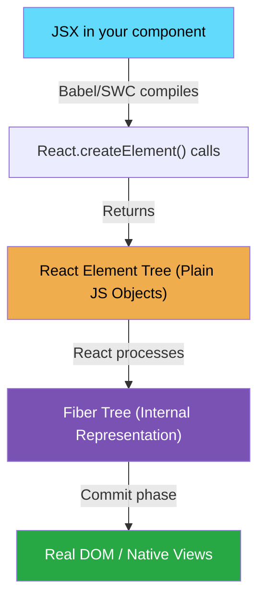

---

## 1.3 — Props: The Contractual Interface of a Component

### The Why

Components need to receive data from their parent. Props are that mechanism. They are the **public API** of a component — read-only, downward-flowing data.

### Key Rule: Props are Immutable

A component must **never** mutate its props. This is not just a convention — it's the foundation of React's predictability model.

### Bad Code vs. Best Practice

```jsx
// ============================================================
// ❌ BAD CODE: Mutating props directly
// ============================================================
function UserCard(props) {
    // NEVER DO THIS — you're mutating the object passed from the parent.
    // This causes unpredictable bugs because the parent's data is now changed.
    props.user.name = props.user.name.toUpperCase(); // ← MUTATION! BUG!

    return <div>{props.user.name}</div>;
}
```

```jsx
// ============================================================
// ✅ BEST PRACTICE: Props are read-only. Derive new values.
// ============================================================

// 1. Destructure props for clarity and readability
function UserCard({ user, onSelect }) {
    // 2. Derive a new value — never mutate the original
    const displayName = user.name.toUpperCase(); // ← SAFE: new const

    // 3. Use the derived value in render
    return (
        <div className="card" onClick={() => onSelect(user.id)}>
            {/* 4. Pass a stable callback identity — covered in Module 4 */}
            <h2>{displayName}</h2>
            <p>{user.email}</p>
        </div>
    );
}

// 5. Define PropTypes or TypeScript interfaces as a contract
// TypeScript (preferred):
// interface UserCardProps {
//   user: { id: string; name: string; email: string };
//   onSelect: (id: string) => void;
// }
```

---

## 1.4 — The Pure Component Philosophy

### The Why

React is built entirely on the concept of **pure functions**. A pure function:

1. Given the same inputs, always returns the same output.
2. Has no side effects (no mutations of external state).

React components **must** be pure with respect to their render output.

### The Mental Model

```
UI = f(state, props)
```

Your component is a pure function. Feed it the same `state` and `props`, get the same UI every time. This is what makes React's reconciliation algorithm possible and reliable.

```jsx
// ============================================================
// ❌ BAD CODE: Impure component — reads external mutable variable
// ============================================================
let globalCounter = 0; // External mutable state — IMPURE!

function ImpureCounter() {
    globalCounter++; // Side effect during render — NEVER DO THIS
    return <div>Count: {globalCounter}</div>;
    // React may call this function multiple times in Strict Mode.
    // Each call increments the counter — completely unpredictable output.
}
```

```jsx
// ============================================================
// ✅ BEST PRACTICE: Pure component — output depends only on props/state
// ============================================================
function PureCounter({ count }) {
    // No external dependencies. No mutations.
    // Given count=5, always renders "Count: 5". Predictable.
    return <div>Count: {count}</div>;
}
```

### Why React StrictMode Double-Invokes Renders

In development, React intentionally calls your render function **twice** to help you catch impurities. If your component is pure, calling it twice has no observable effect. If it's impure, bugs surface immediately.

---

## 1.5 — Component Tree & The Virtual DOM

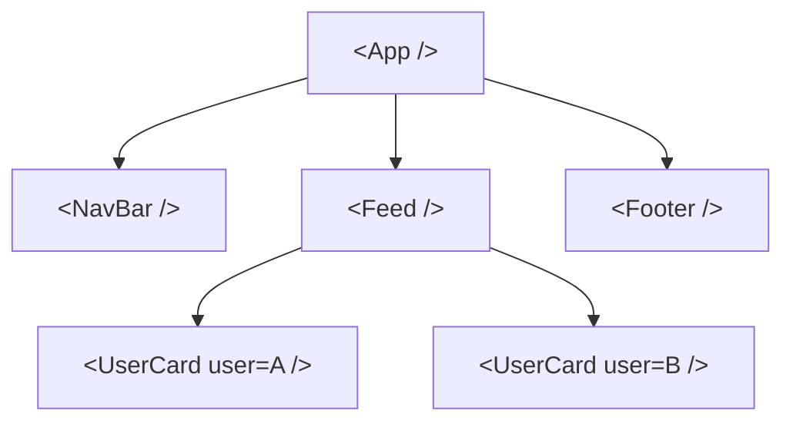

Each node in this tree corresponds to a **React Element** (plain JS object). React maintains a mirror of this tree internally called the **Fiber Tree**, which we'll explore deeply in Module 2.

---

## 1.6 — How React Code Compiles and Builds (Full Pipeline)

> This is one of the most important "behind the scenes" topics. Understanding it removes all the magic from JSX, Babel, and bundlers.

---

### Step 1 — You Write JSX

JSX looks like HTML inside JavaScript, but it is **not valid JavaScript**. Browsers cannot parse it. The browser only understands plain JS, CSS, and HTML.

```jsx
// ❌ Browser cannot run this directly — it's not valid JS
function App() {
    return (
        <div className="app">
            <h1>Hello, {name}!</h1>
            <Button onClick={handleClick}>Click me</Button>
        </div>
    );
}
```

---

### Step 2 — Babel (or SWC) Transforms JSX → `React.createElement`

**Babel** is a JavaScript compiler (transpiler). Its job:

1. Parse your `.jsx` / `.tsx` file into an AST (Abstract Syntax Tree)
2. Transform JSX syntax into valid JavaScript function calls
3. Output plain `.js` that any browser can run

```
JSX Source  ──► Babel Parser ──► AST ──► Transform Plugins ──► Plain JS Output
```

**What Babel does to your JSX:**

```jsx
// ---- WHAT YOU WRITE ----
function App() {
    return (
        <div className="app">
            <h1>Hello</h1>
            <Button color="blue">Click</Button>
        </div>
    );
}
```

```js
// ---- WHAT BABEL OUTPUTS (Classic Transform — React 16 and earlier) ----
// Note: requires `import React from 'react'` at the top of every file
function App() {
    return React.createElement(
        "div", // tag name (string) for HTML elements
        { className: "app" }, // props object (null if no props)
        React.createElement("h1", null, "Hello"), // child 1
        React.createElement(Button, { color: "blue" }, "Click"), // child 2
    );
}
```

```js
// ---- WHAT BABEL OUTPUTS (Automatic JSX Transform — React 17+) ----
// No `import React` needed! Babel auto-imports the jsx() function.
import { jsx as _jsx, jsxs as _jsxs } from "react/jsx-runtime";

function App() {
    return _jsxs("div", {
        className: "app",
        children: [
            _jsx("h1", { children: "Hello" }),
            _jsx(Button, { color: "blue", children: "Click" }),
        ],
    });
}
```

> **Key difference**: The new automatic transform (`react/jsx-runtime`) is more efficient. `jsx()` always takes children as a prop — no variadic arguments. This allows better optimization later.

---

### Step 3 — What `React.createElement` Actually Does

`React.createElement(type, props, ...children)` is a simple factory function. It creates a **React Element** — a plain JavaScript object:

```js
// Signature
React.createElement(
    type, // string ('div', 'h1') for HTML | Component function/class for custom
    props, // object of attributes/props, or null
    ...children, // zero or more child elements or strings
);
```

**Full example — nested JSX → nested createElement calls:**

```jsx
// JSX
const ui = (
    <form onSubmit={handleSubmit}>
        <label htmlFor="email">Email</label>
        <input id="email" type="email" value={email} onChange={setEmail} />
        <button type="submit">Send</button>
    </form>
);

// What createElement produces (a plain JS object tree):
const ui = React.createElement(
    "form",
    { onSubmit: handleSubmit },
    React.createElement("label", { htmlFor: "email" }, "Email"),
    React.createElement("input", {
        id: "email",
        type: "email",
        value: email,
        onChange: setEmail,
    }),
    React.createElement("button", { type: "submit" }, "Send"),
);
```

**The resulting object React holds in memory:**

```js
// React Element — just a plain object (the "Virtual DOM node")
{
  $$typeof: Symbol(react.element),  // anti-XSS security marker
  type: "form",                     // what to render
  key: null,                        // for list reconciliation
  ref: null,                        // for DOM/instance access
  props: {
    onSubmit: handleSubmit,
    children: [
      { type: "label", props: { htmlFor: "email", children: "Email" } },
      { type: "input", props: { id: "email", type: "email", value: email, onChange: setEmail } },
      { type: "button", props: { type: "submit", children: "Send" } },
    ]
  }
}
```

#### `$$typeof: Symbol(react.element)` — Why It Matters

If an attacker injects a JSON string into your app (e.g., from a malicious API response) that looks like a React element object, React checks for `$$typeof`. A `Symbol` **cannot** be serialized to JSON (`JSON.stringify` drops Symbols). So injected JSON can never pass the `$$typeof` check — React refuses to render it as a component. This prevents a class of XSS attacks.

---

### Step 4 — How the Type Field Works

```js
// For HTML elements → type is a string
React.createElement("div", ...)   // type = "div"
React.createElement("span", ...)  // type = "span"

// For custom components → type is the actual function/class reference
React.createElement(MyButton, ...) // type = [Function: MyButton]
React.createElement(Router, ...)   // type = [Function: Router]
```

React uses this to decide:

- **String** → create a real DOM node (`document.createElement("div")`)
- **Function** → call the function and recursively process what it returns
- **Class** → instantiate it and call `.render()`

---

### Step 5 — The Bundler (Vite / Webpack)

Babel handles **syntax transformation** (JSX → JS). But your app has hundreds of files, npm packages, CSS imports, images, etc. That's the bundler's job.

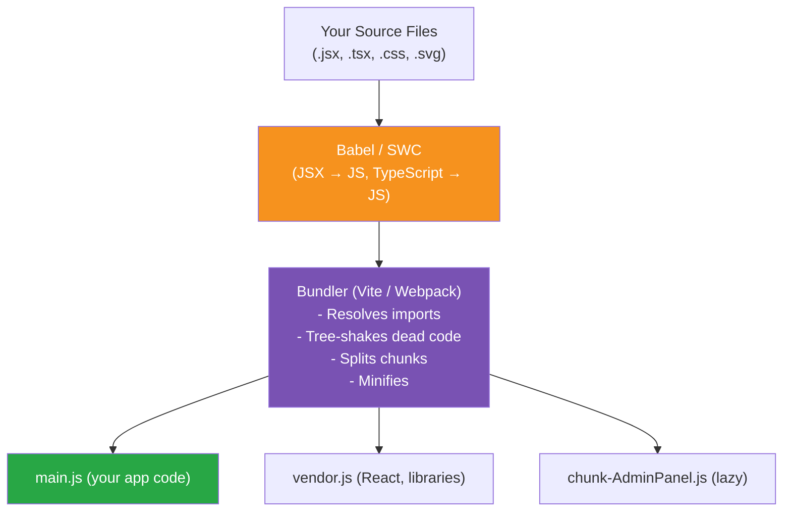

**Vite** (used in this project):

- In **dev mode**: Uses native ES Modules — no bundling. Files are served individually. HMR (Hot Module Replacement) is instant.
- In **prod mode**: Uses Rollup under the hood to bundle, tree-shake, and minify.

**SWC** (Speedy Web Compiler):

- Written in Rust — 20–70× faster than Babel
- Vite uses SWC by default via `@vitejs/plugin-react-swc`
- Does the same JSX → JS transform that Babel does, just much faster

---

### Step 6 — Full End-to-End Pipeline

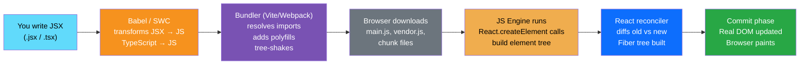

---

### The Classic vs. Automatic JSX Transform

| Feature           | Classic (React ≤ 16)                          | Automatic (React 17+)                   |
| ----------------- | --------------------------------------------- | --------------------------------------- |
| Import required   | `import React from 'react'` in every file     | No manual import needed                 |
| Function used     | `React.createElement()`                       | `jsx()` from `react/jsx-runtime`        |
| Children handling | Variadic `...children` args                   | Always passed as `children` prop        |
| Bundle size       | Slightly larger                               | Slightly smaller (tree-shakeable)       |
| Babel plugin      | `@babel/plugin-transform-react-jsx` (classic) | Same plugin with `runtime: "automatic"` |

---

### Common Questions

**Q: Do I need `import React from 'react'` in React 18?**  
No — with the automatic JSX transform (default in Vite + React 17+), React is auto-imported by the compiler only where needed. You only import React when you use it explicitly (e.g., `React.memo`, `React.createContext`).

**Q: What's the difference between Babel and SWC?**  
Same job (transpile JS/JSX/TS), different implementation. Babel is JavaScript — slow but hugely extensible with plugins. SWC is Rust — extremely fast but fewer ecosystem plugins. Vite defaults to SWC; Create React App uses Babel.

**Q: What is tree-shaking?**  
Bundlers analyze your `import` statements and remove code that is never imported/used. If you import only `{ useState }` from React, the rest of React's source is tree-shaken out of your bundle.

**Q: What is `react/jsx-runtime`?**  
A small module React ships alongside the main `react` package. It exports `jsx()`, `jsxs()`, and `Fragment`. With the automatic transform, Babel/SWC injects `import { jsx } from 'react/jsx-runtime'` at the top of your compiled file — you never write it manually.

---

## 1.7 — Conditional Rendering

React has no special template syntax for conditions (no `v-if`, no `*ngIf`). You use plain JavaScript. There are three common patterns:

### Pattern 1 — `if` / `else` (for complex conditions)

```jsx
function UserGreeting({ user, isLoading }) {
    if (isLoading) {
        return <Spinner />;
    }

    if (!user) {
        return <p>Please log in.</p>;
    }

    return <h1>Welcome back, {user.name}!</h1>;
}
```

### Pattern 2 — Ternary Operator (inline, either/or)

```jsx
function StatusBadge({ isOnline }) {
    return (
        <span className={isOnline ? "badge-green" : "badge-grey"}>
            {isOnline ? "Online" : "Offline"}
        </span>
    );
}
```

### Pattern 3 — Short-Circuit `&&` (render or nothing)

```jsx
function Notification({ unreadCount }) {
    return (
        <div>
            <h1>Inbox</h1>
            {/* Only renders if unreadCount > 0 */}
            {unreadCount > 0 && (
                <span className="badge">{unreadCount} unread</span>
            )}
        </div>
    );
}

// ⚠️ GOTCHA: Never use a number directly with &&
// {items.length && <List />}  ← WRONG: renders "0" as text when items is empty
// {items.length > 0 && <List />}  ← CORRECT: always a boolean
```

### Pattern 4 — Early Return (clearest for guards)

```jsx
function AdminPanel({ user }) {
    if (!user.isAdmin) return null; // Render nothing

    return <div className="admin-panel">...</div>;
}
```

| Pattern       | Use when                                          |
| ------------- | ------------------------------------------------- |
| `if/else`     | Multiple conditions, complex logic, early returns |
| Ternary `? :` | Two alternatives inline in JSX                    |
| `&& `         | Render something OR nothing                       |
| `null` return | Skip render entirely                              |

---

## 1.8 — Fragments: Grouping Without Extra DOM Nodes

JSX requires a **single root element**. But wrapping in a `<div>` adds unnecessary DOM nodes, which can break CSS layouts (like flexbox/grid parents).

**Fragments** solve this — they group JSX without adding any real DOM element.

```jsx
// ❌ BAD: Extra <div> pollutes the DOM — breaks table row, flex/grid layouts
function TableRow() {
    return (
        <div>
            {" "}
            {/* This <div> inside <tr> is invalid HTML! */}
            <td>Name</td>
            <td>Age</td>
        </div>
    );
}

// ✅ GOOD: Fragment groups the cells with zero DOM output
function TableRow() {
    return (
        <>
            <td>Name</td>
            <td>Age</td>
        </>
    );
}

// ✅ Explicit Fragment — needed when you need a key prop (in lists)
import { Fragment } from "react";

function DefinitionList({ terms }) {
    return (
        <dl>
            {terms.map((term) => (
                <Fragment key={term.id}>
                    {" "}
                    {/* <> shorthand can't take a key */}
                    <dt>{term.word}</dt>
                    <dd>{term.definition}</dd>
                </Fragment>
            ))}
        </dl>
    );
}
```

> **Rule**: Use `<>...</>` everywhere. Only switch to `<Fragment key={...}>` when you need to attach a `key` prop — the shorthand syntax doesn't support attributes.

---

## Module 1 Summary

| Concept                   | Key Takeaway                                                                  |
| ------------------------- | ----------------------------------------------------------------------------- |
| **JSX**                   | Syntactic sugar for `React.createElement()`. Compiles to plain JS objects.    |
| **Virtual DOM**           | A tree of plain JS objects. Not magic — just a description of the UI.         |
| **Props**                 | Read-only, downward-flowing data. The public API of a component.              |
| **Pure Components**       | Same inputs → same output. No side effects during render.                     |
| **`$$typeof: Symbol`**    | Security feature preventing JSON-injected XSS attacks.                        |
| **Conditional Rendering** | Use `if/else`, ternary, or `&&` — no special template syntax in React.        |
| **Fragments**             | `<>...</>` groups JSX without extra DOM nodes. Use `<Fragment key>` in lists. |

---

# Module 2: State Mechanics

> **Topics**: `useState`, Batching, and the Reconciliation Algorithm

---

## 2.1 — Why Does State Exist?

Props flow down from parent to child. But what triggers a re-render when _data changes over time_? That's what **state** is for. State is data that belongs to a component and, when changed, triggers a re-render.

---

## 2.2 — `useState` Under the Hood: The Fiber Node

When you call `useState`, React doesn't just create a JavaScript variable. It creates a **hook object** that is stored on the component's **Fiber node**.

### The Fiber Architecture

A Fiber is a unit of work — a JavaScript object representing a component instance. Each component in your tree has a corresponding Fiber node with this (simplified) shape:

```js
// Simplified Fiber Node structure (from React source: ReactFiber.js)
{
  tag: FunctionComponent,     // Type of component
  type: MyComponent,          // The function itself
  key: null,
  stateNode: null,            // DOM node (for host components like 'div')

  // Tree pointers — this is how React traverses the tree
  return: ParentFiber,        // Parent
  child: ChildFiber,          // First child
  sibling: SiblingFiber,      // Next sibling

  // The Hook Linked List — THIS IS CRITICAL
  memoizedState: Hook,        // Head of the hook linked list

  // Work-in-progress: React works on a copy, never the live tree
  alternate: WorkInProgressFiber,

  // Scheduling
  lanes: Lanes,               // Priority of pending work
  flags: Flags,               // What work needs to be done (Update, Placement, etc.)
}
```

### The Hook Linked List — Why Rules of Hooks Matter

Every `useState`, `useEffect`, `useMemo` call creates a **Hook object** that gets appended to a **linked list** on the Fiber node:

```
Fiber.memoizedState
       │
       ▼
  Hook (useState: count=0)
       │ .next
       ▼
  Hook (useState: name='Alice')
       │ .next
       ▼
  Hook (useEffect: [deps])
       │ .next
       ▼
      null
```

React identifies hooks by their **position in this list**, not by name. There is no "magic variable lookup" — React just walks this linked list sequentially on every render.

**This is exactly why the Rules of Hooks exist:**

```jsx
// ============================================================
// ❌ BAD CODE: Hooks inside a conditional — BREAKS THE LINKED LIST
// ============================================================
function BrokenComponent({ isLoggedIn }) {
    const [name, setName] = useState(""); // Hook #1

    if (isLoggedIn) {
        // On first render (isLoggedIn=true): Hook #2 is 'age'
        // On second render (isLoggedIn=false): Hook #2 is skipped!
        // React now tries to read Hook #2 data for the 'theme' hook,
        // but the linked list has 'age' data there. CATASTROPHIC MISMATCH.
        const [age, setAge] = useState(0); // ← ILLEGAL
    }

    const [theme, setTheme] = useState("light"); // Hook #3 (or #2!)
    return (
        <div>
            {name} - {theme}
        </div>
    );
}
```

```jsx
// ============================================================
// ✅ BEST PRACTICE: All hooks at the top level, unconditionally
// ============================================================
function CorrectComponent({ isLoggedIn }) {
    const [name, setName] = useState(""); // Always Hook #1
    const [age, setAge] = useState(0); // Always Hook #2
    const [theme, setTheme] = useState("light"); // Always Hook #3

    // The linked list is ALWAYS the same length. React is happy.
    // Move the conditional INSIDE the hook's usage, not around the hook.
    const displayAge = isLoggedIn ? age : null;

    return (
        <div>
            {name} - {theme} - {displayAge}
        </div>
    );
}
```

---

## 2.3 — `useState` Batching

### The Why

Every `setState` call triggering an immediate re-render would be catastrophically inefficient. React **batches** multiple state updates from the same event handler into a single re-render.

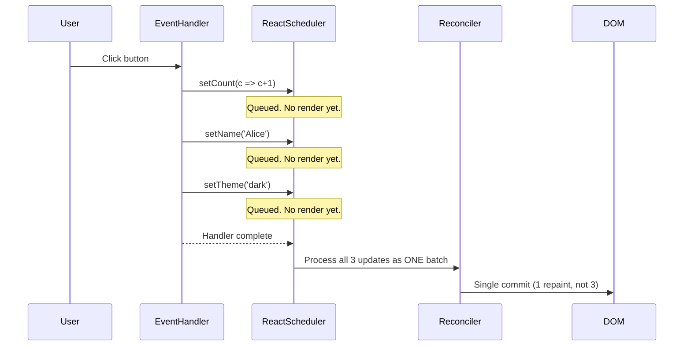

**React 18+**: Automatic Batching extended batching to `setTimeout`, `Promises`, and native event handlers — not just React synthetic events.

```jsx
// ============================================================
// ❌ BAD CODE: Calling setState in a way that creates stale closures
// ============================================================
function Counter() {
    const [count, setCount] = useState(0);

    function handleTripleIncrement() {
        // All three reads of `count` capture the SAME stale value (e.g., 0).
        // After this click, count becomes 1, not 3.
        setCount(count + 1); // reads count=0, schedules update to 1
        setCount(count + 1); // reads count=0 (STALE!), schedules update to 1
        setCount(count + 1); // reads count=0 (STALE!), schedules update to 1
    }

    return <button onClick={handleTripleIncrement}>{count}</button>;
}
```

```jsx
// ============================================================
// ✅ BEST PRACTICE: Use the functional updater form for sequential updates
// ============================================================
function Counter() {
    const [count, setCount] = useState(0);

    function handleTripleIncrement() {
        // Each updater receives the LATEST pending state, not the stale closure.
        // React queues: 0→1, 1→2, 2→3. Final result: 3. Correct!
        setCount((prev) => prev + 1);
        setCount((prev) => prev + 1);
        setCount((prev) => prev + 1);
    }

    return <button onClick={handleTripleIncrement}>{count}</button>;
}
```

---

## 2.4 — The Reconciliation Algorithm (Diffing)

### The Why

When state changes, React needs to figure out what changed in the Virtual DOM and update only those parts in the real DOM. Comparing two arbitrary trees is $O(n^3)$ complexity — too slow. React's reconciliation algorithm achieves $O(n)$ by making two key heuristics:

1. **Elements of different types produce different trees.** (Tear down and rebuild)
2. **The `key` prop signals which child elements are stable across renders.**

### The Diffing Process

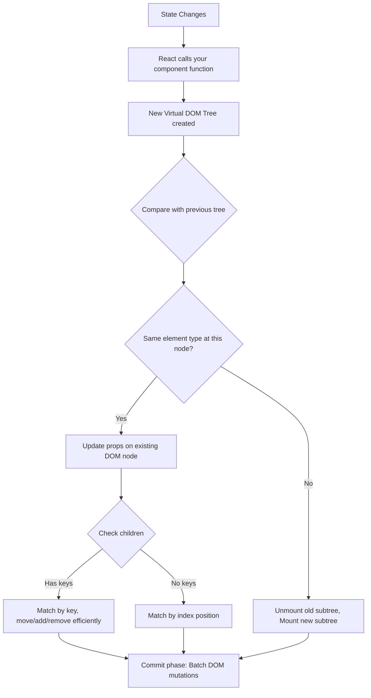

### The `key` Prop: The Silent Performance Hero

```jsx
// ============================================================
// ❌ BAD CODE: Using array index as key
// ============================================================
function TodoList({ todos }) {
    return (
        <ul>
            {todos.map((todo, index) => (
                // If we prepend an item, all indices shift.
                // React thinks *every* item changed and re-renders all of them.
                // If items have internal state (e.g., input values), that state is WRONG.
                <TodoItem key={index} todo={todo} /> // ← DANGEROUS with dynamic lists
            ))}
        </ul>
    );
}
```

```jsx
// ============================================================
// ✅ BEST PRACTICE: Stable, unique IDs as keys
// ============================================================
function TodoList({ todos }) {
    return (
        <ul>
            {todos.map((todo) => (
                // React can now identify this specific item regardless of its position.
                // Prepending an item? React moves existing DOM nodes, creates only 1 new one.
                // Internal state (like a text input) stays with the correct item.
                <TodoItem key={todo.id} todo={todo} /> // ← CORRECT
            ))}
        </ul>
    );
}
```

---

## 2.5 — State Mutation: Who Actually Changes It?

> **The #1 beginner misconception**: "I call `setState`, so React updates the variable in place."  
> **Reality**: React never mutates your existing state. It replaces it with a brand new value — and YOU must never mutate it either.

---

### The Golden Rule

```
Never directly mutate state.
Always give React a brand new value via the setter function.
```

React decides **when** to re-render and **what** the new state is. You only ever _request_ a state change by calling the setter. React does the actual swap inside its Fiber node.

---

### What Happens Internally When You Call `setState`

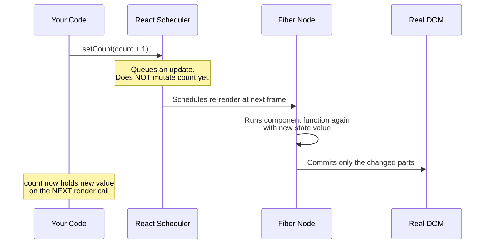

React stores state inside the **Fiber node** (`hook.memoizedState`). When you call `setCount(5)`:

1. React pushes an update object onto a queue on that Fiber node.
2. React schedules a re-render (batched with other updates).
3. On the next render, React runs your component function again.
4. The `useState` hook reads the new value from the update queue and returns it.
5. Your component function sees the NEW value as `count`.

**Between your `setCount()` call and the next render, `count` still holds the OLD value.**

---

### Direct Mutation — Why It Silently Breaks React

```jsx
// ============================================================
// ❌ BAD CODE: Directly mutating state — React has NO IDEA this happened
// ============================================================
const [user, setUser] = useState({ name: "Alice", age: 30 });

function handleBirthday() {
    user.age = 31; // ← MUTATING the object directly
    setUser(user); // ← Passing the SAME object reference
}

// WHY THIS BREAKS:
// React does a shallow reference check: Object.is(prevState, nextState)
// prevState === nextState (same object!) → React thinks NOTHING CHANGED
// → NO re-render → UI stays stuck showing old value
```

```jsx
// ============================================================
// ✅ BEST PRACTICE: Always produce a NEW object / array
// ============================================================
const [user, setUser] = useState({ name: "Alice", age: 30 });

function handleBirthday() {
    setUser({ ...user, age: user.age + 1 }); // ← NEW object via spread
    //      ↑ copies all existing fields, overwrites only `age`
}

// React: Object.is(prevUser, nextUser) → false (different reference)
// → Re-render triggered → UI updates correctly ✔
```

---

### Arrays Are the Same — Never `.push()` / `.splice()` Directly

```jsx
// ============================================================
// ❌ BAD: Mutating array state directly
// ============================================================
const [items, setItems] = useState(["Apple", "Banana"]);

function addItem() {
    items.push("Cherry"); // ← mutates the existing array
    setItems(items); // ← same reference → React skips re-render!
}

function removeFirst() {
    items.splice(0, 1); // ← mutates in-place
    setItems(items); // ← same reference again → broken
}
```

```jsx
// ============================================================
// ✅ BEST PRACTICE: Always return a new array
// ============================================================
const [items, setItems] = useState(["Apple", "Banana"]);

// ADD — spread to create a new array
function addItem() {
    setItems([...items, "Cherry"]); // ✅ new array
}

// REMOVE — filter creates a new array
function removeItem(index) {
    setItems(items.filter((_, i) => i !== index)); // ✅ new array
}

// UPDATE — map creates a new array
function updateItem(index, newValue) {
    setItems(items.map((item, i) => (i === index ? newValue : item))); // ✅ new array
}

// INSERT at position — slice + spread
function insertAt(index, value) {
    setItems([...items.slice(0, index), value, ...items.slice(index)]); // ✅ new array
}
```

---

### Nested Objects — The Deep Clone Trap

```jsx
// ============================================================
// ❌ BAD: Spread only goes one level deep (shallow copy)
// ============================================================
const [profile, setProfile] = useState({
    name: "Alice",
    address: { city: "NYC", zip: "10001" },
});

function updateCity() {
    // BUG: spread copies the `address` REFERENCE, not a new object
    setProfile({ ...profile, address: { city: "LA" } }); // ← missing `zip`!
    // or worse:
    profile.address.city = "LA"; // ← mutates nested object directly
    setProfile({ ...profile }); // ← looks like a new object but nested ref mutated
}
```

```jsx
// ============================================================
// ✅ BEST PRACTICE: Spread at every level you're changing
// ============================================================
function updateCity(newCity) {
    setProfile({
        ...profile, // copy top-level fields
        address: {
            // replace the nested object
            ...profile.address, // copy nested fields
            city: newCity, // override only what changed
        },
    });
}

// For deeply nested state, consider using Immer (same syntax as mutation):
// import produce from 'immer';
// setProfile(produce(profile, draft => { draft.address.city = newCity; }));
```

---

### Why Immer Looks Like Mutation But Isn't

Redux Toolkit uses **Immer** under the hood. In a reducer you can write:

```js
// Inside a Redux Toolkit reducer (Immer-powered)
state.user.age = 31; // Looks like mutation...
state.items.push("Cherry"); // Looks like .push()...
```

Immer wraps your state in a **Proxy**. Any "mutation" you do on the proxy is **recorded** but not applied. At the end, Immer produces a brand new immutable object with all your changes applied. The original state object is untouched.

So even in RTK, you are never actually mutating — Immer creates a new object. This is why you **cannot** use Immer-style writes outside of RTK reducers (plain `useState` does not have Immer).

---

### Quick Reference — Immutable Update Cheat Sheet

| Operation            | ❌ Mutating        | ✅ Immutable                             |
| -------------------- | ------------------ | ---------------------------------------- |
| Update object field  | `obj.x = 1`        | `{ ...obj, x: 1 }`                       |
| Add to array         | `arr.push(x)`      | `[...arr, x]`                            |
| Remove from array    | `arr.splice(i, 1)` | `arr.filter((_, idx) => idx !== i)`      |
| Update array item    | `arr[i] = x`       | `arr.map((v, idx) => idx === i ? x : v)` |
| Nested object update | `obj.a.b = x`      | `{ ...obj, a: { ...obj.a, b: x } }`      |
| Sort array           | `arr.sort()`       | `[...arr].sort()`                        |
| Reverse array        | `arr.reverse()`    | `[...arr].reverse()`                     |

---

## 2.6 — State as a Snapshot

> This is one of the most misunderstood React concepts, and the root cause of most "stale state" bugs.

**State is not a live variable — it's a snapshot frozen at the time of the render.**

When React calls your component function, it passes the current state value in. For the _entire duration of that render_, every reference to `count` (or whatever your state variable is) will return that same frozen value — even if you call `setState` multiple times.

```jsx
// ============================================================
// The confusing example everyone runs into
// ============================================================
function Counter() {
    const [count, setCount] = useState(0);

    function handleClick() {
        setCount(count + 1); // count is 0 here — queues: set to 1
        setCount(count + 1); // count is STILL 0 — queues: set to 1 again!
        setCount(count + 1); // count is STILL 0 — queues: set to 1 again!
        // Result: count becomes 1, not 3
        // Because `count` is the SNAPSHOT value (0) for this entire render
    }

    return <button onClick={handleClick}>{count}</button>;
}
```

Think of it like a **photograph**: when the shutter fires, the image is frozen. You can look at the photo a thousand times and it always shows the same moment. Calling `setState` doesn't change the existing photo — it schedules a new photo (render) to be taken.

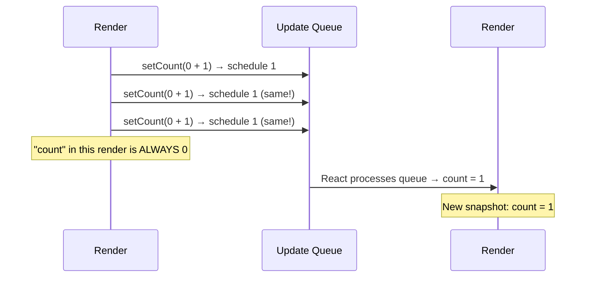

### The Fix: Functional Updater Form

The functional updater `setCount(prev => prev + 1)` does NOT use the snapshot. It receives the latest **queued** value:

```jsx
function Counter() {
    const [count, setCount] = useState(0);

    function handleClick() {
        setCount((prev) => prev + 1); // prev=0 → queues: set to 1
        setCount((prev) => prev + 1); // prev=1 → queues: set to 2
        setCount((prev) => prev + 1); // prev=2 → queues: set to 3
        // Result: count becomes 3 ✔
    }

    return <button onClick={handleClick}>{count}</button>;
}
```

### Stale Closures in `useEffect`

The snapshot model also explains stale closures in `useEffect`:

```jsx
// ❌ STALE CLOSURE BUG
function Timer() {
    const [count, setCount] = useState(0);

    useEffect(() => {
        const id = setInterval(() => {
            setCount(count + 1); // ← `count` is FROZEN at 0 (the snapshot at mount time)
            // This will always set count to 1, never increment beyond
        }, 1000);
        return () => clearInterval(id);
    }, []); // Empty deps — only runs once, captures count=0 forever
}

// ✅ FIX: Use functional updater — no closure dependency on count
useEffect(() => {
    const id = setInterval(() => {
        setCount((prev) => prev + 1); // ← Always works, no stale reference
    }, 1000);
    return () => clearInterval(id);
}, []);
```

---

## Module 2 Summary

| Concept                 | Key Takeaway                                                                            |
| ----------------------- | --------------------------------------------------------------------------------------- |
| **Fiber Node**          | Per-component JS object holding hooks, tree pointers, and scheduling info.              |
| **Hook Linked List**    | Hooks are identified by position. Never call hooks conditionally.                       |
| **Batching**            | Multiple `setState` calls → 1 re-render. Use functional updater for sequential updates. |
| **Reconciliation**      | $O(n)$ diffing using type-equality and `key` heuristics.                                |
| **`key` prop**          | Must be stable and unique. Index keys cause bugs with dynamic lists.                    |
| **State Immutability**  | Never mutate state directly. Always return new objects/arrays via the setter.           |
| **State as a Snapshot** | State is frozen per render. Use functional updater `prev =>` for sequential updates.    |

---

# Module 3: Side Effects & Synchronization

> **Topics**: `useEffect` Lifecycle, Cleanup, and the "Synchronization" Mental Model

---

## 3.1 — The Why: What Is a Side Effect?

A **pure** render function has no side effects. But real apps _need_ side effects:

- Fetching data from an API
- Setting up a WebSocket/subscription
- Directly manipulating the DOM (e.g., focus management)
- Starting/stopping timers

`useEffect` is React's **escape hatch** — a way to synchronize your component with an external system _after_ rendering.

---

## 3.2 — The Correct Mental Model

> **Wrong model**: "I use `useEffect` to run code when the component mounts."  
> **Correct model**: "I use `useEffect` to synchronize my component with an external system."

The difference is subtle but profound. Thinking in terms of _synchronization_ rather than _lifecycle events_ leads to correct cleanup code and avoids bugs.

---

## 3.3 — The `useEffect` Lifecycle

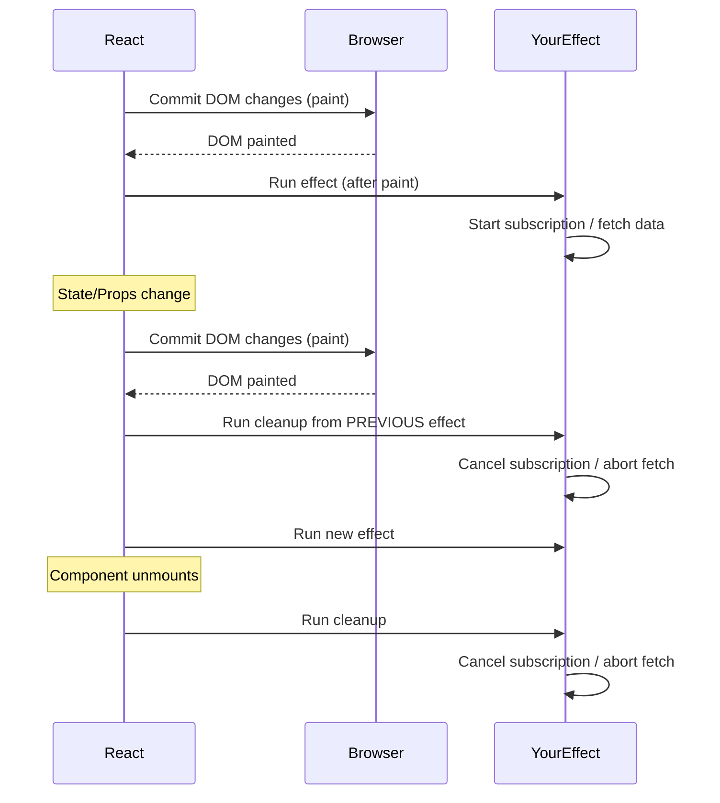

---

## 3.4 — The Dependency Array

The dependency array tells React: **"run this effect again only when these values change."** Choosing the right dependencies is one of the most common sources of bugs in React.

Here's a simple decision tree to pick the right option:

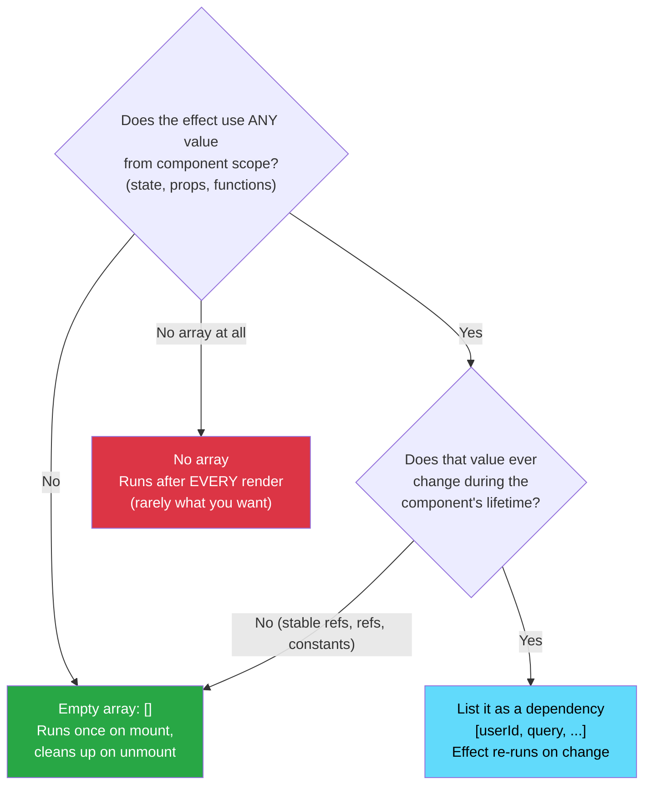

> **The exhaustive-deps ESLint rule**: The `eslint-plugin-react-hooks` rule is not optional. Every value used inside `useEffect` that comes from the component scope _must_ be in the dependency array. Omitting them causes **stale closure bugs** — your effect uses an old value from a previous render and never gets the update.

```jsx
useEffect(() => {
    /* effect */
}); // Runs after EVERY render
useEffect(() => {
    /* effect */
}, []); // Runs once on mount
useEffect(() => {
    /* effect */
}, [userId]); // Runs when userId changes
```

---

## 3.5 — Code Lab: Data Fetching

Fetching data inside `useEffect` has a classic problem: **race conditions**. If `userId` changes quickly while a previous fetch is still in-flight, whichever fetch resolves LAST sets the state — which may be the OLD userId's data. The user sees wrong data.

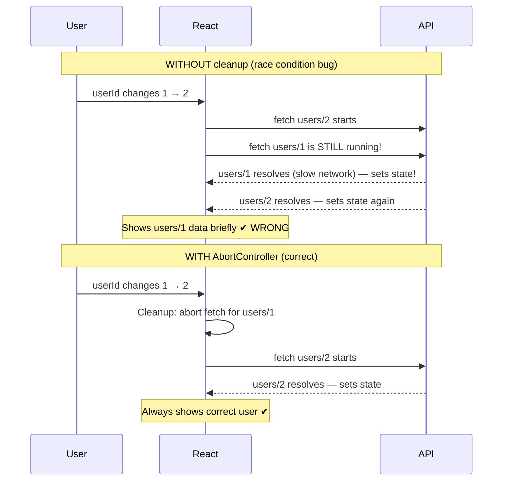

**The fix: `AbortController`** — pass its `signal` to `fetch()`, and in the cleanup function, call `abort()`. When React runs the cleanup (because the effect re-runs), the previous fetch is cancelled.

```jsx
// ============================================================
// ❌ BAD CODE: Classic race condition + missing cleanup
// ============================================================
function UserProfile({ userId }) {
    const [user, setUser] = useState(null);

    useEffect(() => {
        // Problem 1: No cleanup. If userId changes rapidly,
        // multiple fetches race. The last one to resolve wins —
        // which may NOT be the most recent userId. RACE CONDITION.
        fetch(`/api/users/${userId}`)
            .then((res) => res.json())
            .then((data) => {
                // Problem 2: If component unmounts before fetch resolves,
                // this setState call runs on an unmounted component.
                // (Memory leak in older React; warning in dev mode)
                setUser(data);
            });
    }, [userId]); // Correct dep array, but effect body is broken

    return <div>{user?.name}</div>;
}
```

```jsx
// ============================================================
// ✅ BEST PRACTICE: AbortController for cleanup + race condition prevention
// ============================================================
function UserProfile({ userId }) {
    const [user, setUser] = useState(null);
    const [isLoading, setIsLoading] = useState(false);
    const [error, setError] = useState(null);

    useEffect(() => {
        // 1. Create an AbortController for this specific effect run.
        const abortController = new AbortController();

        async function fetchUser() {
            setIsLoading(true);
            setError(null);
            try {
                const res = await fetch(`/api/users/${userId}`, {
                    signal: abortController.signal, // 2. Tie the fetch to this controller
                });
                if (!res.ok) throw new Error("Failed to fetch user");
                const data = await res.json();
                setUser(data);
            } catch (err) {
                // 3. AbortError is expected — don't treat it as a real error
                if (err.name !== "AbortError") {
                    setError(err.message);
                }
            } finally {
                setIsLoading(false);
            }
        }

        fetchUser();

        // 4. Cleanup: This runs before the NEXT effect OR on unmount.
        // If userId changes, this cancels the in-flight fetch for the OLD userId.
        // The race condition is ELIMINATED.
        return () => {
            abortController.abort();
        };
    }, [userId]); // Effect re-runs whenever userId changes

    if (isLoading) return <Spinner />;
    if (error) return <ErrorMessage message={error} />;
    return <div>{user?.name}</div>;
}
```

---

## 3.6 — Code Lab: Event Listeners & Subscriptions

```jsx
// ============================================================
// ❌ BAD CODE: Memory leak — event listener never removed
// ============================================================
function WindowSize() {
    const [size, setSize] = useState(window.innerWidth);

    useEffect(() => {
        // This listener is added on mount and NEVER removed.
        // Every time this component mounts, a new listener is added.
        // If the component mounts/unmounts repeatedly, you accumulate listeners.
        window.addEventListener("resize", () => {
            setSize(window.innerWidth); // Also: new function reference each time
        });
    }, []); // Missing cleanup!

    return <div>Width: {size}px</div>;
}
```

```jsx
// ============================================================
// ✅ BEST PRACTICE: Always return cleanup for subscriptions
// ============================================================
function WindowSize() {
    const [size, setSize] = useState(window.innerWidth);

    useEffect(() => {
        // 1. Define the handler outside so we have a stable reference
        function handleResize() {
            setSize(window.innerWidth);
        }

        // 2. Subscribe
        window.addEventListener("resize", handleResize);

        // 3. Cleanup: remove the EXACT SAME function reference
        return () => {
            window.removeEventListener("resize", handleResize);
        };
    }, []); // Empty array: subscribe once, clean up on unmount

    return <div>Width: {size}px</div>;
}
```

---

## Module 3 Summary

| Concept              | Key Takeaway                                                               |
| -------------------- | -------------------------------------------------------------------------- |
| **Side Effects**     | Anything that reaches "outside" the render (fetch, DOM, subscriptions).    |
| **Mental Model**     | Synchronize with external systems, don't think in lifecycle events.        |
| **Cleanup Function** | Always return cleanup for subscriptions and ongoing async work.            |
| **AbortController**  | The correct tool for canceling fetch requests in `useEffect`.              |
| **Race Conditions**  | Cleanup from previous effect runs before new effect — prevents stale data. |

---

# Module 4: Performance & Memoization

> **Topics**: `useMemo`, `useCallback`, and `React.memo`

---

## 4.1 — The Why: The Default Behavior

By default, every time a React component re-renders, **every child component also re-renders**, and **every value inside the component is recomputed**. For most apps, this is fast enough. JavaScript is quick, and reconciliation is cheap.

But for complex UIs — large lists, heavy computations, frequent parent re-renders — you need to be surgical about what gets recomputed.

> **Golden Rule**: Don't reach for `useMemo`/`useCallback`/`React.memo` preemptively. **Profile first, optimize second.** Premature memoization adds complexity and can actually _hurt_ performance.

---

## 4.2 — `React.memo`: Skip Re-rendering a Component

`React.memo` wraps a component and **prevents it from re-rendering if its props haven't changed** (shallow comparison). Without it, every parent re-render triggers every child re-render, regardless of whether the child's props changed.

**But `React.memo` alone is usually not enough.** If you pass a function as a prop, that function is re-created on every parent render — so `React.memo`'s shallow comparison sees a "new" function and re-renders anyway. You must pair it with `useCallback`.

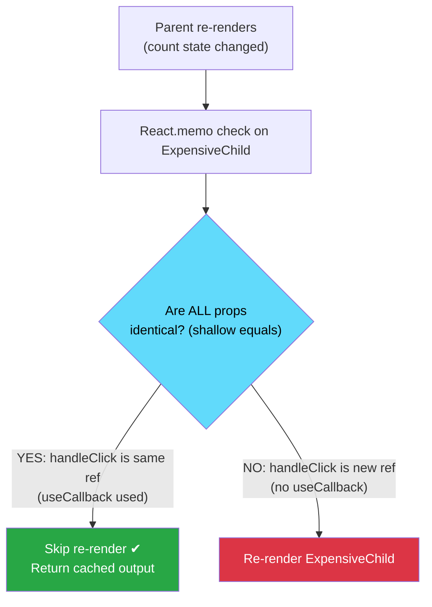

> **Key insight**: `useCallback` + `React.memo` is a **pair**. Using `React.memo` without `useCallback` on function props is usually pointless. Using `useCallback` without `React.memo` on the child is also pointless.

```jsx
// ============================================================
// ❌ BAD CODE: Child re-renders on every parent render
// ============================================================
function ParentComponent() {
    const [count, setCount] = useState(0);
    const [theme, setTheme] = useState("light");

    // This function is RECREATED on every render.
    // Even if ExpensiveChild's props look the same, the function reference is new.
    const handleItemClick = (id) => {
        console.log("clicked", id);
    };

    return (
        <div className={theme}>
            <button onClick={() => setCount((c) => c + 1)}>{count}</button>
            {/* Re-renders on every count change, even though it doesn't use count */}
            <ExpensiveChild onItemClick={handleItemClick} />
        </div>
    );
}

// React.memo won't save us here because handleItemClick is always a new reference
const ExpensiveChild = React.memo(function ExpensiveChild({ onItemClick }) {
    console.log("ExpensiveChild rendered"); // Logs on every parent render!
    return <div onClick={() => onItemClick(1)}>Click me</div>;
});
```

```jsx
// ============================================================
// ✅ BEST PRACTICE: useCallback + React.memo working together
// ============================================================
function ParentComponent() {
    const [count, setCount] = useState(0);
    const [theme, setTheme] = useState("light");

    // useCallback memoizes the function reference.
    // handleItemClick is now the SAME object reference across renders
    // (unless its deps change — here, no deps, so it's stable forever).
    const handleItemClick = useCallback((id) => {
        console.log("clicked", id);
    }, []); // Empty deps: function never changes

    return (
        <div className={theme}>
            <button onClick={() => setCount((c) => c + 1)}>{count}</button>
            {/* Now React.memo works correctly: props didn't change → no re-render */}
            <ExpensiveChild onItemClick={handleItemClick} />
        </div>
    );
}

const ExpensiveChild = React.memo(function ExpensiveChild({ onItemClick }) {
    console.log("ExpensiveChild rendered"); // Only logs when props actually change
    return <div onClick={() => onItemClick(1)}>Click me</div>;
});
```

---

## 4.3 — `useMemo`: Memoize an Expensive Computation

`useMemo` caches the **result** of a function call and only re-runs it when the dependencies change. It's for expensive derived data — filtering large arrays, complex calculations, data transformations.

The mental model: imagine `useMemo` as a sticky note. React writes the answer on the sticky note and reads from it on every render. Only when a dependency changes does it erase the note and recalculate.

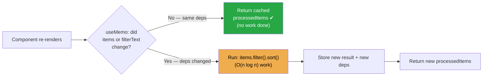

**Bonus benefit**: `useMemo` also gives you a **stable object reference**. If `processedItems` passes unchanged through `useMemo`, it's the exact same array reference as last render. This means child components wrapped in `React.memo` won't re-render because of it.

```jsx
// ============================================================
// ❌ BAD CODE: Expensive computation on every render
// ============================================================
function DataGrid({ items, filterText }) {
    // This filters and sorts thousands of items on EVERY render,
    // even if only the theme changed and items/filterText are the same.
    const processedItems = items
        .filter((item) => item.name.includes(filterText))
        .sort((a, b) => a.name.localeCompare(b.name)); // O(n log n) every render!

    return <Grid data={processedItems} />;
}
```

```jsx
// ============================================================
// ✅ BEST PRACTICE: useMemo for referentially stable expensive values
// ============================================================
function DataGrid({ items, filterText }) {
    // processedItems is ONLY recomputed when items or filterText changes.
    // If the parent re-renders for an unrelated reason, this is skipped.
    const processedItems = useMemo(() => {
        return items
            .filter((item) => item.name.includes(filterText))
            .sort((a, b) => a.name.localeCompare(b.name));
    }, [items, filterText]); // Recompute only when these change

    // BONUS: processedItems is also the same object reference across renders
    // (if deps didn't change), which means child components using React.memo
    // won't be triggered by this value.
    return <Grid data={processedItems} />;
}
```

---

## 4.4 — The Internal Mechanics of Memoization

Memoization in React is stored on the Fiber node's hook linked list, just like `useState`:

```
Fiber.memoizedState
       │
       ▼
  Hook (useMemo) {
    memoizedState: [cachedValue, deps],
    .next → ...
  }
```

On each render, React shallow-compares the new deps against `hook.memoizedState[1]`. If all deps pass `Object.is()` equality, the cached value is returned. Otherwise, the factory is called and the result stored.

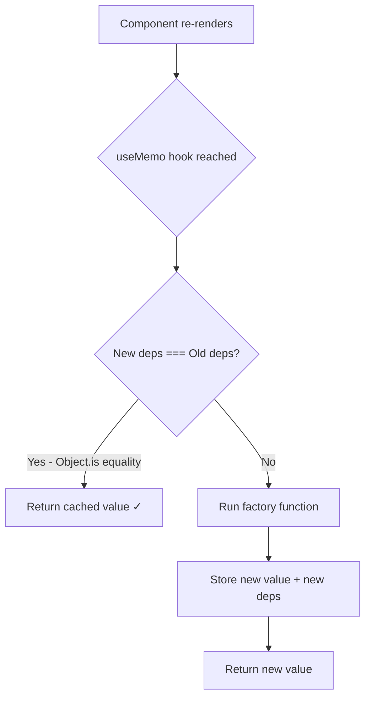

---

## 4.5 — When NOT to Memoize

```jsx
// ❌ POINTLESS memoization — overhead > benefit
const name = useMemo(() => `${firstName} ${lastName}`, [firstName, lastName]);
// String concatenation is microseconds. useMemo adds overhead. Just write:
const name = `${firstName} ${lastName}`; // ✅

// ❌ POINTLESS useCallback on non-passed-down functions
function Component() {
    const handleClick = useCallback(() => {
        setState((s) => s + 1);
    }, []); // This component doesn't use React.memo, so this saves nothing
    return <button onClick={handleClick}>+</button>;
}
```

---

## Module 4 Summary

| Tool          | Purpose                     | Use When                                                |
| ------------- | --------------------------- | ------------------------------------------------------- |
| `React.memo`  | Skip component re-render    | Child is expensive + receives stable props              |
| `useCallback` | Stable function reference   | Passing callbacks to memoized children                  |
| `useMemo`     | Cache expensive computation | Heavy computation that doesn't change with every render |

> **Rule of thumb**: `useCallback` + `React.memo` are a pair. One without the other is often useless. `useMemo` is for expensive derived data.

---

# Module 5: Advanced Patterns

> **Topics**: Compound Components, Render Props, and HOCs

---

## 5.1 — Compound Components

### The Why

Compound components give consumers **flexibility** over the internal structure of a UI while maintaining encapsulated logic. Think of `<select>` and `<option>` in HTML — they're useless apart but powerful together.

The key idea: a **parent component owns the shared state** and passes it down through **Context** to its sub-components. Neither the parent nor consumer needs to explicitly wire props between siblings.

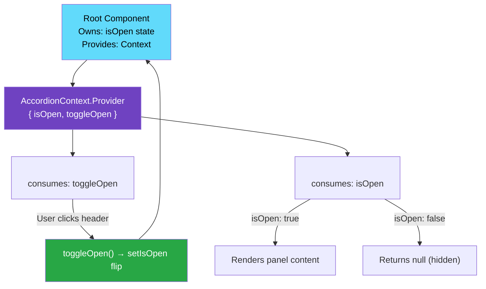

> **Why Context not prop drilling?** With Context, `<Accordion.Header>` and `<Accordion.Panel>` can be nested anywhere in the consumer's JSX tree — they don't need to be direct children of `<Accordion>`. The consumer has full layout control.

```jsx
// ============================================================
// ❌ BAD CODE: Rigid component with too many props for configuration
// ============================================================
<Accordion
    title="FAQ"
    content="..."
    isOpen={true}
    headerStyle={{ color: "red" }}
    iconPosition="left"
    onToggle={handleToggle}
    // ... 15 more props for every UI variation
/>
```

```jsx
// ============================================================
// ✅ BEST PRACTICE: Compound Component Pattern with Context
// ============================================================

// 1. Create a context to share state between compound parts
const AccordionContext = React.createContext(null);

// 2. Build the root container that owns the state
function Accordion({ children, defaultOpen = false }) {
    const [isOpen, setIsOpen] = useState(defaultOpen);
    const toggleOpen = useCallback(() => setIsOpen((o) => !o), []);

    const contextValue = useMemo(
        () => ({ isOpen, toggleOpen }),
        [isOpen, toggleOpen],
    );

    return (
        <AccordionContext.Provider value={contextValue}>
            <div className="accordion">{children}</div>
        </AccordionContext.Provider>
    );
}

// 3. Build named sub-components that consume the context
function AccordionHeader({ children }) {
    const { isOpen, toggleOpen } = useContext(AccordionContext);
    return (
        <button
            className="accordion-header"
            onClick={toggleOpen}
            aria-expanded={isOpen}
        >
            {children}
            <span>{isOpen ? "▲" : "▼"}</span>
        </button>
    );
}

function AccordionPanel({ children }) {
    const { isOpen } = useContext(AccordionContext);
    return isOpen ? <div className="accordion-panel">{children}</div> : null;
}

// 4. Attach sub-components as static properties (clean API)
Accordion.Header = AccordionHeader;
Accordion.Panel = AccordionPanel;

// ============================================================
// Usage: Consumer has full control over structure
// ============================================================
function FAQ() {
    return (
        <Accordion defaultOpen={true}>
            <Accordion.Header>
                <MyCustomIcon /> What is React?
            </Accordion.Header>
            <Accordion.Panel>
                <RichTextContent />
            </Accordion.Panel>
        </Accordion>
    );
}
```

---

## 5.2 — Render Props

### The Why

Render props share **stateful logic** between components by passing a function as a prop. The function receives the shared state and returns JSX. (Before hooks, this was the primary way to share logic. Today, custom hooks are usually preferred, but render props still have their place for rendering-specific sharing.)

The key idea: the component **owns the logic** (state, event handlers) but **delegates rendering** to whoever uses it. It says "here's the data — you decide how to display it."

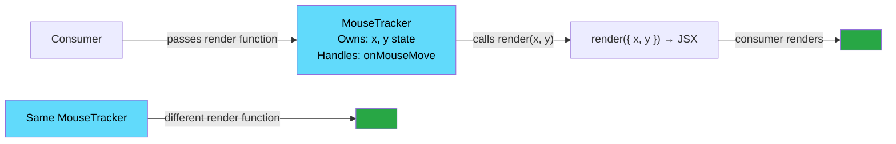

> **Same logic, different UI**: Two consumers use the same `<MouseTracker>` but render the position data completely differently. The logic (state tracking) is reused; the rendering is customized.

```jsx
// ============================================================
// ✅ Render Props Pattern: A mouse-position tracker
// ============================================================

// The component owns the logic (mouse position state)
// but delegates rendering to the consumer via a prop function.
function MouseTracker({ render }) {
    const [position, setPosition] = useState({ x: 0, y: 0 });

    const handleMouseMove = useCallback((e) => {
        setPosition({ x: e.clientX, y: e.clientY });
    }, []);

    return (
        <div onMouseMove={handleMouseMove} style={{ height: "100vh" }}>
            {/* Let the consumer decide how to render position data */}
            {render(position)}
        </div>
    );
}

// Usage: Two completely different UIs sharing the same mouse logic
function App() {
    return <MouseTracker render={({ x, y }) => <Cursor x={x} y={y} />} />;
}
```

---

## 5.3 — Higher-Order Components (HOCs)

### The Why

A HOC is a function that takes a component and returns a new, enhanced component. Useful for cross-cutting concerns like authentication guards, analytics logging, and theming. (Again, custom hooks are often a cleaner modern alternative, but HOCs are still prevalent in many codebases.)

Think of HOCs like electrical adapters: they take an ordinary component and add a layer of capability (auth, logging, theming) around it, without modifying the original component.

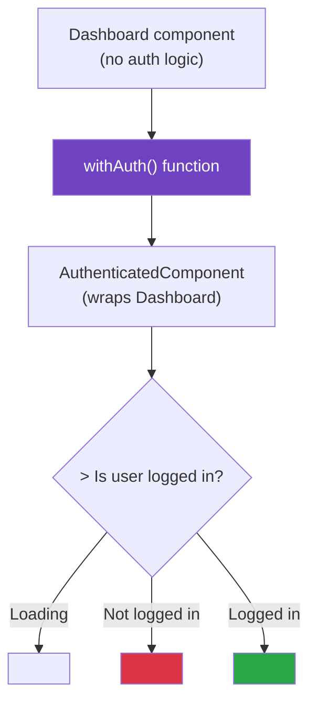

> **The key benefit**: `Dashboard` component itself has zero auth logic. You can apply `withAuth()` to ANY component — `Settings`, `Profile`, `Admin` — and get the same guard behavior re-used.

```jsx
// ============================================================
// ✅ HOC Pattern: Authentication Guard
// ============================================================

// withAuth is a function that takes a component and returns a new component
function withAuth(WrappedComponent) {
    // The returned component has the auth logic baked in
    function AuthenticatedComponent(props) {
        const { user, isLoading } = useAuthContext();

        if (isLoading) return <Spinner />;
        if (!user) return <Navigate to="/login" />;

        // Pass all original props through to the wrapped component
        return <WrappedComponent {...props} user={user} />;
    }

    // Set a displayName for better debugging in React DevTools
    AuthenticatedComponent.displayName = `withAuth(${WrappedComponent.displayName || WrappedComponent.name || "Component"})`;

    return AuthenticatedComponent;
}

// Usage
const ProtectedDashboard = withAuth(Dashboard);
const ProtectedSettings = withAuth(Settings);
```

---

## Module 5 Summary

| Pattern                 | Modern Alternative  | Best Use Case                                |
| ----------------------- | ------------------- | -------------------------------------------- |
| **Compound Components** | (Still relevant)    | Flexible UI kits, design systems             |
| **Render Props**        | Custom Hooks        | Sharing rendering logic                      |
| **HOCs**                | Custom Hooks        | Cross-cutting concerns, third-party wrappers |
| **React.Children**      | Compound components | Iterate/clone children at runtime            |

## 5.4 — `React.Children` and `React.cloneElement`

### The Why

When you build a component that receives `children`, you sometimes need to **inspect**, **filter**, or **inject props** into those children at runtime. `React.Children` and `React.cloneElement` are the built-in APIs for this.

**Common use cases**: Tab components that need to know which tab is active, a Form that injects `name` props into its inputs, an animation wrapper injecting delay into each child.

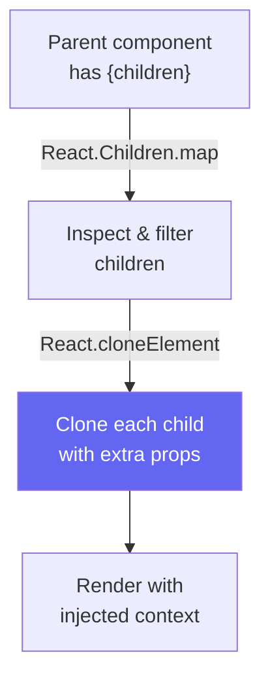

```jsx
import React from "react";

// ============================================================
// EXAMPLE 1: Tab system that injects isActive into each Tab
// ============================================================
function TabGroup({ children }) {
    const [activeIndex, setActiveIndex] = React.useState(0);

    // React.Children.map works like Array.map but handles null,
    // undefined, nested arrays, and fragments correctly.
    const tabs = React.Children.map(children, (child, index) => {
        // React.cloneElement creates a copy of the element with extra props merged in.
        // The child itself never knows — it just receives isActive and onClick.
        return React.cloneElement(child, {
            isActive: index === activeIndex,
            onClick: () => setActiveIndex(index),
        });
    });

    return <div className="tab-group">{tabs}</div>;
}

function Tab({ label, isActive, onClick }) {
    return (
        <button
            onClick={onClick}
            className={isActive ? "tab tab--active" : "tab"}
        >
            {label}
        </button>
    );
}

// Usage — clean and declarative:
function App() {
    return (
        <TabGroup>
            <Tab label="Overview" />
            <Tab label="Settings" />
            <Tab label="Analytics" />
        </TabGroup>
    );
}
```

### `React.Children` API — All Methods

```jsx
// ---- React.Children.map ----
// Like Array.map but handles null/undefined/nested fragments gracefully.
// Returns an array or null if children is null.
React.Children.map(children, (child, index) => {
    return React.cloneElement(child, { key: index, extraProp: "value" });
});

// ---- React.Children.forEach ----
// Like React.Children.map but returns nothing (for side effects only).
React.Children.forEach(children, (child) => {
    if (child.type !== Tab) {
        throw new Error("TabGroup only accepts <Tab> children");
    }
});

// ---- React.Children.count ----
// Count the number of child elements (handles fragments & arrays correctly).
const count = React.Children.count(children); // Returns a number

// ---- React.Children.only ----
// Asserts that children contains exactly ONE child. Throws if not.
const onlyChild = React.Children.only(children);
// Useful for HOC-style components that require a single child.

// ---- React.Children.toArray ----
// Returns children as a flat array. Keys are preserved and prefixed.
// Use this when you need to sort, slice, or filter children.
const childArray = React.Children.toArray(children);
const firstTwo = childArray.slice(0, 2);
const sortedChildren = childArray.sort((a, b) => a.props.order - b.props.order);
```

### `React.cloneElement` — Props Injection

```jsx
// React.cloneElement(element, extraProps, ...newChildren)
//   element    — the React element to clone (a child component)
//   extraProps — object merged with the element's existing props
//   newChildren — optionally replace the element's children

// EXAMPLE: Inject a `delay` prop into every child for staggered animations
function StaggeredGroup({ children }) {
    return (
        <>
            {React.Children.map(children, (child, index) =>
                React.cloneElement(child, {
                    style: {
                        ...child.props.style, // Preserve existing style
                        animationDelay: `${index * 100}ms`, // Add stagger delay
                    },
                }),
            )}
        </>
    );
}

// EXAMPLE: Wrap children to add a border in debug mode
function DebugBoundary({ children, debug }) {
    if (!debug) return children;
    return React.Children.map(children, (child) =>
        React.cloneElement(child, {
            style: { border: "2px solid red", ...child.props.style },
        }),
    );
}
```

> **Modern Note**: `React.Children` + `cloneElement` is a valid pattern but has a downside — it fails to inject into deeply nested children. If you control the child component, **Context** or the **compound component pattern** is often cleaner. But for library-level components where you DON'T control the children, this API is essential.

---

# Module 6: Modern Ecosystem

> **Topics**: Server Components, Suspense, and Transitions

---

## 6.1 — React Server Components (RSC)

### The Why

Traditional React renders everything on the **client**. This means:

- Large JavaScript bundles shipped to the user
- Waterfalls: fetch data → render component → fetch more data → ...
- Sensitive logic (DB queries, API keys) exposed to the client

RSC allows components to render on the **server**, with zero JavaScript sent to the client.

### The Mental Model

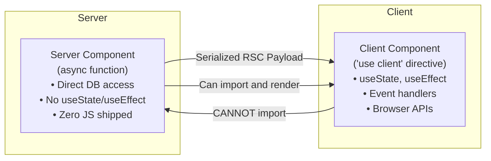

```jsx
// ============================================================
// ✅ Server Component: Async, direct DB access, zero client JS
// ============================================================

// No 'use client' directive = Server Component by default (in Next.js App Router)
async function UserProfilePage({ userId }) {
    // Direct database access — this code NEVER ships to the client
    const user = await db.users.findUnique({ where: { id: userId } });

    return (
        <div>
            <h1>{user.name}</h1>
            {/* Server component renders a client component for interactivity */}
            <FollowButton userId={user.id} />
        </div>
    );
}

// ============================================================
// ✅ Client Component: Handles interaction
// ============================================================
("use client"); // This directive marks it as a Client Component

function FollowButton({ userId }) {
    const [isFollowing, setIsFollowing] = useState(false);

    return (
        <button onClick={() => setIsFollowing((f) => !f)}>
            {isFollowing ? "Unfollow" : "Follow"}
        </button>
    );
}
```

---

## 6.2 — Suspense

### The Why

`Suspense` lets you declaratively specify loading states for any part of the component tree — whether waiting for code to load (lazy loading) or data to resolve (with RSC or data-fetching libraries).

```jsx
// ============================================================
// ✅ Suspense for lazy loading + data fetching
// ============================================================
import { lazy, Suspense } from "react";

// Code-splitting: HeavyChart is only loaded when needed
const HeavyChart = lazy(() => import("./HeavyChart"));

function Dashboard() {
    return (
        <div>
            <h1>Dashboard</h1>
            {/* While HeavyChart's JS is loading, show the fallback */}
            <Suspense fallback={<Skeleton />}>
                <HeavyChart />
            </Suspense>

            {/* Nested Suspense boundaries for granular loading states */}
            <Suspense fallback={<TableSkeleton />}>
                <DataTable /> {/* This might be an async Server Component */}
            </Suspense>
        </div>
    );
}
```

### `React.lazy` + Dynamic Import — Complete Code Splitting Guide

**What is code splitting?** By default, Vite/Webpack bundles your entire app into one JS file. Code splitting breaks it into smaller chunks — the browser only downloads what's needed for the current page. `React.lazy` is the React-native way to do this.

```jsx
import { lazy, Suspense, useState } from "react";

// ---- BASIC LAZY IMPORT ----
// The component file is only downloaded when React is about to render it.
// The argument must be a FUNCTION that returns a dynamic import — not the import itself.
const AdminPanel = lazy(() => import("./pages/AdminPanel"));
const UserProfile = lazy(() => import("./pages/UserProfile"));
const AnalyticsDashboard = lazy(() => import("./pages/AnalyticsDashboard"));

// ---- NAMED EXPORTS (not default export) ----
// If the component is a named export, extract it inside the lazy callback:
const PieChart = lazy(() =>
    import("./charts").then((mod) => ({ default: mod.PieChart })),
);

// ---- LAZY WITH ROUTE-BASED SPLITTING (most common pattern) ----
import { Routes, Route } from "react-router-dom";

function App() {
    return (
        // One Suspense boundary wraps all routes — shows a page-level spinner
        <Suspense fallback={<PageSpinner />}>
            <Routes>
                <Route path="/" element={<Home />} />{" "}
                {/* Eager-loaded: always tiny */}
                <Route path="/admin" element={<AdminPanel />} />{" "}
                {/* Lazy: only for admins */}
                <Route path="/profile" element={<UserProfile />} />
                <Route path="/analytics" element={<AnalyticsDashboard />} />
            </Routes>
        </Suspense>
    );
}

// ---- CONDITIONAL LAZY LOADING ----
// Load a heavy component only when the user actually wants it
function EditorPage() {
    const [showEditor, setShowEditor] = useState(false);

    // Declare the lazy import OUTSIDE the component (module level) — not inside a function!
    // If declared inside, a new lazy() is created every render, breaking the cache.
    return (
        <div>
            <button onClick={() => setShowEditor(true)}>
                Open Rich Text Editor
            </button>
            {showEditor && (
                <Suspense fallback={<div>Loading editor...</div>}>
                    <RichTextEditor />{" "}
                    {/* ~200KB editor downloaded only on button click */}
                </Suspense>
            )}
        </div>
    );
}
// ⚠️ Always define lazy components at module scope:
const RichTextEditor = lazy(() => import("./RichTextEditor")); // ✅ correct placement

// ---- ERROR HANDLING FOR LAZY LOADS ----
// If the network fails during chunk download, wrap with an ErrorBoundary:
function SafeLazy({ component: Component, fallback }) {
    return (
        <ErrorBoundary fallback={<ChunkLoadError />}>
            <Suspense fallback={fallback}>
                <Component />
            </Suspense>
        </ErrorBoundary>
    );
}
```

**What goes in each bundle chunk?**

```mermaid
graph TD
    BUNDLE["main.js<br/>(downloaded immediately)"]
    BUNDLE --> HOME["Home · NavBar · Login<br/>(always needed)"]

    CHUNK1["admin.chunk.js<br/>(downloaded only if /admin)"]
    CHUNK2["analytics.chunk.js<br/>(downloaded only if /analytics)"]
    CHUNK3["editor.chunk.js<br/>(downloaded on button click)"]

    HOME -.->|lazy()| CHUNK1
    HOME -.->|lazy()| CHUNK2
    HOME -.->|lazy()| CHUNK3

    style BUNDLE fill:#6366f1,color:#fff
    style CHUNK1 fill:#28a745,color:#fff
    style CHUNK2 fill:#28a745,color:#fff
    style CHUNK3 fill:#28a745,color:#fff
```

> **Rule of thumb**: Lazy-load anything that is not visible on initial page load — admin pages, dashboards, modals with heavy content, rich text editors, large chart libraries.

---

## 6.3 — Transitions (`useTransition`)

### The Why

Not all state updates are equal. Typing in a search box needs to feel **instant** (high priority). Rendering 10,000 filtered results can be **deferred** (low priority). `useTransition` lets you tell React which updates are non-urgent.

Under the hood, this uses the React **Scheduler** — the same mechanism that powers Concurrent Mode. High-priority updates (typing, clicking) interrupt low-priority updates (background rendering).

```jsx
// ============================================================
// ❌ BAD CODE: Slow filter blocks the input — "janky" UX
// ============================================================
function SearchPage({ items }) {
    const [query, setQuery] = useState("");

    // Filtering 100,000 items on every keystroke blocks the main thread.
    // The input itself feels laggy because re-render must complete before
    // the browser can paint the new input character.
    const filtered = items.filter((i) => i.name.includes(query));

    return (
        <>
            <input value={query} onChange={(e) => setQuery(e.target.value)} />
            <HugeList items={filtered} />
        </>
    );
}
```

```jsx
// ============================================================
// ✅ BEST PRACTICE: useTransition to keep input responsive
// ============================================================
function SearchPage({ items }) {
    const [query, setQuery] = useState("");
    const [deferredQuery, setDeferredQuery] = useState("");
    const [isPending, startTransition] = useTransition();

    function handleChange(e) {
        // 1. Update the input immediately — HIGH PRIORITY
        setQuery(e.target.value);

        // 2. Mark the heavy list filter as a LOW-PRIORITY transition.
        // React will start this work, but will interrupt it if a higher-priority
        // update (e.g., another keystroke) comes in.
        startTransition(() => {
            setDeferredQuery(e.target.value);
        });
    }

    // Only recompute filter with the deferred (possibly stale) query
    const filtered = useMemo(
        () => items.filter((i) => i.name.includes(deferredQuery)),
        [items, deferredQuery],
    );

    return (
        <>
            <input value={query} onChange={handleChange} />
            {/* Show a visual indicator while the transition is pending */}
            {isPending && <span>Updating list...</span>}
            <HugeList items={filtered} />
        </>
    );
}
```

### The React Scheduler: How Priority Works

```mermaid
graph TD
    A[State Update Triggered] --> B{What priority lane?}
    B -->|SyncLane<br/>Clicks, Inputs| C[Run synchronously<br/>before next paint]
    B -->|InputContinuousLane<br/>Drag, Scroll| D[Run before next paint<br/>but can be batched]
    B -->|DefaultLane<br/>Network responses| E[Run soon<br/>non-blocking]
    B -->|TransitionLane<br/>useTransition| F[Run when idle<br/>can be interrupted]
    B -->|IdleLane<br/>Offscreen| G[Run only when<br/>browser is idle]
```

---

## Module 6 Summary

| Feature               | Key Takeaway                                                         |
| --------------------- | -------------------------------------------------------------------- |
| **Server Components** | Run on server, zero JS to client, direct DB access, can't use hooks. |
| **Client Components** | `'use client'` directive, can use all hooks, handles interactivity.  |
| **Suspense**          | Declarative loading boundaries for code splitting and data fetching. |
| **useTransition**     | Mark updates as non-urgent, keeps UI responsive during heavy work.   |
| **Scheduler**         | Priority lanes determine when React processes each update.           |
| **React.lazy**        | Route/component-level code splitting, bundle downloaded on demand.   |

---

## 6.4 — React 19: What's New

React 19 (released December 2024) is the biggest React update in years. It ships new hooks, simplifies patterns, and makes form handling a first-class citizen.

```mermaid
graph LR
    R19["React 19"]
    R19 --> USE["use() hook<br/>Reads Promises & Context"]
    R19 --> ACTIONS["Actions & useActionState<br/>Built-in async form handling"]
    R19 --> OPT["useOptimistic<br/>Instant UI before server confirms"]
    R19 --> FC["ref as prop<br/>No more forwardRef"]
    R19 --> META["Document metadata<br/><title>, <meta> anywhere"]
    R19 --> COMPILER["React Compiler<br/>Auto-memoization"]
    style R19 fill:#6366f1,color:#fff
```

### `use()` — Read a Promise or Context Anywhere

`use()` is a new hook that can be called **inside conditionals and loops** (unlike all other hooks). It reads a Promise (suspending until resolved) or a Context value:

```jsx
import { use, Suspense, createContext } from "react";

// ---- 1. use() with a Promise ----
// Create the promise OUTSIDE the component (not inside render)
const userPromise = fetch("/api/user").then((r) => r.json());

function UserCard() {
    // use() suspends this component until the promise resolves.
    // The nearest <Suspense> shows the fallback while waiting.
    const user = use(userPromise);
    return <div>{user.name}</div>;
}

function App() {
    return (
        <Suspense fallback={<Skeleton />}>
            <UserCard /> {/* Suspended until userPromise resolves */}
        </Suspense>
    );
}

// ---- 2. use() with Context — can be called conditionally ----
const ThemeContext = createContext("light");

function ConditionalThemeReader({ isLoggedIn }) {
    if (!isLoggedIn) return <p>Please log in</p>;

    // This is valid! use() can be inside an if-block, unlike useContext()
    const theme = use(ThemeContext);
    return <div className={theme}>Welcome!</div>;
}
```

### `useActionState` — Async Form Actions (replaces setState + try/catch)

Before React 19, handling form submissions required `useState` for loading state, `useState` for errors, and a `try/catch` block. `useActionState` wraps all of this:

```jsx
import { useActionState } from "react";

// An "action" is an async function that receives the previous state and form data
async function submitContact(prevState, formData) {
    const email = formData.get("email");
    const message = formData.get("message");

    // Validate
    if (!email.includes("@")) {
        return { error: "Invalid email", success: false };
    }

    try {
        await api.post("/contact", { email, message });
        return { error: null, success: true };
    } catch (e) {
        return { error: "Failed to send. Try again.", success: false };
    }
}

function ContactForm() {
    const [state, formAction, isPending] = useActionState(
        submitContact, // The async action function
        { error: null, success: false }, // Initial state
    );
    // state    = result returned by the action (or initial state)
    // formAction = pass this to <form action={...}>
    // isPending  = true while the action is in progress

    if (state.success) return <p>Message sent!</p>;

    return (
        <form action={formAction}>
            <input name="email" type="email" required />
            <textarea name="message" required />
            {state.error && <p className="text-red-500">{state.error}</p>}
            <button type="submit" disabled={isPending}>
                {isPending ? "Sending..." : "Send Message"}
            </button>
        </form>
    );
}
```

### `useOptimistic` — Show Result Before Server Confirms

Show the expected result of a mutation immediately, then auto-revert if the server fails:

```jsx
import { useOptimistic, useState } from "react";

function MessageList({ initialMessages }) {
    const [messages, setMessages] = useState(initialMessages);

    // useOptimistic(currentState, updateFn)
    // → returns [optimisticState, addOptimistic]
    const [optimisticMessages, addOptimisticMessage] = useOptimistic(
        messages,
        (currentMessages, newMessage) => [
            ...currentMessages,
            { ...newMessage, sending: true }, // Mark as "sending"
        ],
    );

    async function sendMessage(formData) {
        const text = formData.get("message");

        // 1. Immediately show the message with sending=true
        addOptimisticMessage({ id: Date.now(), text });

        try {
            // 2. Send to server
            const saved = await api.post("/messages", { text });
            // 3. On success: update real state (removes the optimistic entry)
            setMessages((prev) => [...prev, saved]);
        } catch {
            // 3. On failure: optimistic state is automatically reverted
            alert("Failed to send");
        }
    }

    return (
        <div>
            {optimisticMessages.map((msg) => (
                <div key={msg.id} style={{ opacity: msg.sending ? 0.5 : 1 }}>
                    {msg.text}
                    {msg.sending && " (sending...)"}
                </div>
            ))}
            <form action={sendMessage}>
                <input name="message" />
                <button type="submit">Send</button>
            </form>
        </div>
    );
}
```

### `ref` as a Regular Prop — No More `forwardRef`

In React 19, `ref` is just a prop. You no longer need to wrap components in `forwardRef`:

```jsx
// React 18 — required forwardRef wrapper:
const Input = forwardRef((props, ref) => <input ref={ref} {...props} />);

// React 19 — ref is just a prop:
function Input({ ref, ...props }) {
    return <input ref={ref} {...props} />;
}

// Usage is identical:
function Form() {
    const inputRef = useRef(null);
    return <Input ref={inputRef} placeholder="Focus me" />;
}
```

### Document Metadata — `<title>` Inside Components

In React 19, you can render `<title>`, `<meta>`, and `<link>` tags directly inside any component. React hoists them to `<head>` automatically — no `react-helmet` needed:

```jsx
function ProductPage({ product }) {
    return (
        <>
            {/* React automatically moves these to <head> */}
            <title>{product.name} — MyShop</title>
            <meta name="description" content={product.description} />
            <link
                rel="canonical"
                href={`https://myshop.com/products/${product.slug}`}
            />

            {/* The rest of the page renders normally */}
            <h1>{product.name}</h1>
            <p>{product.price}</p>
        </>
    );
}
```

> **React Compiler (experimental)**: React 19 also ships the React Compiler, which automatically adds memoization (`memo`, `useMemo`, `useCallback`) where needed, analyzed statically at build time. When fully stable, you can remove most manual memoization from your code.

---

# Quick Reference: Rules of Hooks

These rules exist because hooks depend on a **stable, ordered linked list** on the Fiber node.

| Rule                                     | Why                                                         |
| ---------------------------------------- | ----------------------------------------------------------- |
| Only call hooks at the **top level**     | Ensures the linked list is always the same length and order |
| Only call hooks from **React functions** | React must control the Fiber context when hooks are called  |
| Hook order must be **deterministic**     | React identifies hooks by position, not name                |

```jsx
// ✅ ALL hooks at top level, called unconditionally
function MyComponent({ condition }) {
    const [a] = useState(0); // Always Hook #1
    const [b] = useState(""); // Always Hook #2
    const memoVal = useMemo(() => expensiveCalc(a), [a]); // Always Hook #3

    // Conditions go INSIDE the hook's usage or render logic
    const display = condition ? a : b;
    return <div>{display}</div>;
}
```

---

# Architecture Cheat Sheet

```mermaid
graph TD
    subgraph "Your Code"
        JSX["JSX"] -->|compile| CE["React.createElement()"]
        CE -->|returns| VD["Virtual DOM<br/>(Plain JS Objects)"]
    end

    subgraph "React Internals"
        VD -->|processed into| Fiber["Fiber Tree<br/>(Work Units)"]
        Fiber -->|Render Phase| Reconciler["Reconciler<br/>(Diff old vs new)"]
        Reconciler -->|creates| Effects["Effect List<br/>(What changed)"]
        Effects -->|Commit Phase| DOM["Real DOM"]
    end

    subgraph "Scheduling"
        State["setState()"] -->|enqueues| Scheduler["Scheduler<br/>(Priority Lanes)"]
        Scheduler -->|schedules| Reconciler
    end
```

---

# Module 7: Hooks — Complete Guide

> **Topics**: `useReducer`, `useRef`, `useImperativeHandle`, `useContext`, `useLayoutEffect`, `useId`, `useDeferredValue` + Custom Hooks

---

## 7.1 — `useReducer`: State Machine for Complex State

### The Why

`useState` is great for independent, simple values. When you have **complex state transitions** where the next state depends on the previous one in non-trivial ways — or when multiple sub-values are always updated together — `useReducer` gives you a predictable, testable state machine.

> **Mental Model**: `useReducer` is React's built-in Redux. It follows the `(state, action) => newState` pattern.

**The core idea in one sentence**: Instead of calling `setItems()`, `setTotal()`, and `setIsLoading()` separately (which can get out of sync), you dispatch a **single named action** like `{ type: 'ADD_ITEM', payload: item }` and the reducer handles ALL the related state changes atomically in one pure function.

### How the Data Flows

```mermaid
sequenceDiagram
    participant User
    participant Component
    participant Dispatch
    participant Reducer
    participant State

    User->>Component: Click "Add to Cart"
    Component->>Dispatch: dispatch({ type: 'ADD_ITEM', payload: item })
    Dispatch->>Reducer: cartReducer(currentState, action)
    Reducer->>Reducer: Pure function: computes newState
    Note over Reducer: No mutation! Returns completely new object
    Reducer->>State: Returns { items: [...], total: 29.99 }
    State->>Component: React re-renders with new state
    Component->>User: Cart updated�
```

**Why this is better than multiple `useState` calls:**

- Every state transition is **named** (`ADD_ITEM`, `APPLY_DISCOUNT`) — self-documenting
- All related updates happen **atomically** — no possibility of inconsistent state mid-update
- The reducer is a **pure function** — trivially unit-testable without React
- State history is **traceable** — Redux DevTools connects to any `useReducer`

### When to Prefer `useReducer` over `useState`

| Scenario                                 | Use          |
| ---------------------------------------- | ------------ |
| Simple toggle / counter                  | `useState`   |
| Multiple related values updated together | `useReducer` |
| Next state depends on complex logic      | `useReducer` |
| State transitions need to be unit tested | `useReducer` |
| Sharing dispatch via Context             | `useReducer` |

### Internal Mechanics

`useReducer` is stored on the Fiber's hook linked list exactly like `useState`. In fact, in the React source, `useState` is implemented _as a special case of `useReducer`_ with a built-in `basicStateReducer`:

```js
// From React source (ReactFiberHooks.js) — simplified
function useState(initialState) {
    return useReducer(basicStateReducer, initialState);
}
function basicStateReducer(state, action) {
    return typeof action === "function" ? action(state) : action;
}
```

### Code Lab

```jsx
// ============================================================
// ❌ BAD CODE: Multiple useState calls for related state — hard to manage
// ============================================================
function ShoppingCart() {
    const [items, setItems] = useState([]);
    const [total, setTotal] = useState(0);
    const [discount, setDiscount] = useState(0);
    const [isLoading, setIsLoading] = useState(false);

    function addItem(item) {
        // Must update 3 pieces of state manually — easy to forget one
        // and end up with inconsistent state (e.g., items updated but total not)
        setItems((prev) => [...prev, item]);
        setTotal((prev) => prev + item.price);
        // Forgot to handle discount recalculation!
    }
}
```

```jsx
// ============================================================
// ✅ BEST PRACTICE: useReducer for related state transitions
// ============================================================

// 1. Define the initial state as a single object
const initialState = {
    items: [],
    total: 0,
    discount: 0,
    isLoading: false,
};

// 2. Define the reducer — a PURE function, easy to unit test in isolation
function cartReducer(state, action) {
    switch (action.type) {
        case "ADD_ITEM": {
            const newItems = [...state.items, action.payload];
            const newTotal = newItems.reduce((sum, i) => sum + i.price, 0);
            // All related fields updated atomically — no inconsistency possible
            return {
                ...state,
                items: newItems,
                total: newTotal * (1 - state.discount),
            };
        }
        case "APPLY_DISCOUNT":
            return {
                ...state,
                discount: action.payload,
                total: state.total * (1 - action.payload),
            };
        case "SET_LOADING":
            return { ...state, isLoading: action.payload };
        case "CLEAR_CART":
            return initialState;
        default:
            // Always handle unknown actions — prevents silent state corruption
            throw new Error(`Unknown action type: ${action.type}`);
    }
}

function ShoppingCart() {
    // 3. Dispatch actions — descriptive, traceable, debuggable
    const [state, dispatch] = useReducer(cartReducer, initialState);

    function handleAddItem(item) {
        dispatch({ type: "ADD_ITEM", payload: item });
    }

    function handleApplyPromo(code) {
        // Async action — fetch the discount, then dispatch
        dispatch({ type: "SET_LOADING", payload: true });
        fetchDiscount(code).then((rate) => {
            dispatch({ type: "APPLY_DISCOUNT", payload: rate });
            dispatch({ type: "SET_LOADING", payload: false });
        });
    }

    return (
        <div>
            {state.isLoading && <Spinner />}
            <p>Total: ${state.total.toFixed(2)}</p>
            <ItemList items={state.items} onAdd={handleAddItem} />
        </div>
    );
}
```

### Scenario: `useReducer` + `useContext` = Mini Redux

```jsx
// A common, powerful pattern: global state without a library

// 1. Create context for state and dispatch separately
// (splitting them prevents consumers that only need dispatch from re-rendering on state changes)
const CartStateContext = React.createContext(null);
const CartDispatchContext = React.createContext(null);

// 2. Provider wraps the app
function CartProvider({ children }) {
    const [state, dispatch] = useReducer(cartReducer, initialState);
    return (
        <CartStateContext.Provider value={state}>
            <CartDispatchContext.Provider value={dispatch}>
                {children}
            </CartDispatchContext.Provider>
        </CartStateContext.Provider>
    );
}

// 3. Custom hooks for consumption — clean, type-safe API
function useCartState() {
    const ctx = useContext(CartStateContext);
    if (!ctx) throw new Error("useCartState must be used within CartProvider");
    return ctx;
}
function useCartDispatch() {
    const ctx = useContext(CartDispatchContext);
    if (!ctx)
        throw new Error("useCartDispatch must be used within CartProvider");
    return ctx;
}

// 4. Any component deep in the tree can access cart state/dispatch
function CheckoutButton() {
    const { total } = useCartState();
    const dispatch = useCartDispatch();
    return (
        <button onClick={() => dispatch({ type: "CLEAR_CART" })}>
            Checkout — ${total.toFixed(2)}
        </button>
    );
}
```

---

## 7.2 — `useContext`: Dependency Injection for React

### The Why

Props must be passed through every intermediate component even if those components don't use them. This is **prop drilling** — a maintenance nightmare. `useContext` lets any component in the tree subscribe to a value without threading it through every layer.

Think of Context like a **walkie-talkie broadcast**: a Provider station broadcasts a value to the entire area, and any Consumer anywhere in range can tune in and receive it — without routing it manually through every building in between.

### The Prop Drilling Problem (Visualized)

```mermaid
graph TD
    subgraph "Without Context - Prop Drilling"
        APP1["<App><br/>has: theme"] -->|"theme, setTheme"| LAY1["<Layout><br/>doesn't use theme"]
        LAY1 -->|"theme, setTheme"| SID1["<Sidebar><br/>doesn't use theme"]
        SID1 -->|"theme, setTheme"| TOG1["<ThemeToggle><br/>ACTUALLY uses theme"]
        style LAY1 fill:#dc3545,color:#fff
        style SID1 fill:#dc3545,color:#fff
    end

    subgraph "With Context - No Prop Drilling"
        APP2["<ThemeProvider><br/>broadcasts: theme"] --> LAY2["<Layout><br/>no props needed"]
        LAY2 --> SID2["<Sidebar><br/>no props needed"]
        SID2 --> TOG2["<ThemeToggle><br/>useTheme() reads directly"]
        APP2 -.->|"Context broadcast"| TOG2
        style APP2 fill:#28a745,color:#fff
        style TOG2 fill:#28a745,color:#fff
    end
```

### Internal Mechanics

When you call `useContext(MyContext)`, React walks **up** the Fiber tree from the current component, finds the nearest `<MyContext.Provider>`, and returns its `value`. The component is automatically subscribed — any time the provider's `value` reference changes, all consumers re-render.

> **Critical Performance Note**: Context comparison uses `Object.is()`. If you pass a new object literal `value={{ user, theme }}` on every render, ALL consumers re-render on every parent render, even if `user` and `theme` didn't change. Always `useMemo` the context value.

### Code Lab

```jsx
// ============================================================
// ❌ BAD CODE: Prop drilling across 4 levels
// ============================================================
function App() {
    const [theme, setTheme] = useState("light");
    // Must pass theme and setTheme through every layer...
    return <Layout theme={theme} setTheme={setTheme} />;
}
function Layout({ theme, setTheme }) {
    return <Sidebar theme={theme} setTheme={setTheme} />;
}
function Sidebar({ theme, setTheme }) {
    return <ThemeToggle theme={theme} setTheme={setTheme} />;
}
function ThemeToggle({ theme, setTheme }) {
    // This is the ONLY component that actually needed these!
    return (
        <button
            onClick={() => setTheme((t) => (t === "light" ? "dark" : "light"))}
        >
            {theme}
        </button>
    );
}
```

```jsx
// ============================================================
// ✅ BEST PRACTICE: useContext eliminates prop drilling
// ============================================================
const ThemeContext = React.createContext(null);

function ThemeProvider({ children }) {
    const [theme, setTheme] = useState("light");
    const toggleTheme = useCallback(
        () => setTheme((t) => (t === "light" ? "dark" : "light")),
        [],
    );

    // Memoize the value object to prevent unnecessary consumer re-renders
    const value = useMemo(() => ({ theme, toggleTheme }), [theme, toggleTheme]);

    return (
        <ThemeContext.Provider value={value}>{children}</ThemeContext.Provider>
    );
}

// Custom hook with guard — much safer than raw useContext
function useTheme() {
    const ctx = useContext(ThemeContext);
    if (!ctx) throw new Error("useTheme must be used inside ThemeProvider");
    return ctx;
}

// Now any component can access theme directly — no prop drilling
function ThemeToggle() {
    const { theme, toggleTheme } = useTheme();
    return <button onClick={toggleTheme}>{theme}</button>;
}

// Intermediate components are completely clean
function Layout({ children }) {
    return <div>{children}</div>;
}
function Sidebar({ children }) {
    return <nav>{children}</nav>;
}
```

### Context vs. State Management Libraries

| Factor                             | Context                      | Redux/Zustand              |
| ---------------------------------- | ---------------------------- | -------------------------- |
| Frequent updates (every keystroke) | ❌ Can cause many re-renders | ✅ Optimized subscriptions |
| Infrequent updates (theme, auth)   | ✅ Perfect fit               | Overkill                   |
| Complex async logic                | ❌ DIY                       | ✅ Built-in middleware     |
| Bundle size                        | ✅ Zero cost                 | Small cost                 |

---

## 7.3 — `useRef`: Mutable Container & DOM Access

### The Why

`useRef` solves two distinct problems:

1. **DOM access**: Imperatively interact with DOM nodes (focus, scroll, measure).
2. **Mutable container**: Store a value that persists across renders but does NOT trigger a re-render when changed. Like an instance variable on a class.

Think of `useRef` as a **box with a `.current` slot**. React hands you the same box on every render. You can put anything in the slot and read it back, but changing the slot's contents is invisible to React — it won't cause a re-render.

### The Two Use Cases Side-by-Side

```mermaid
graph TD
    subgraph "Use Case 1: DOM Access"
        A["const ref = useRef(null)"] --> B["<input ref={ref} />"]
        B --> C["React sets ref.current = input DOM node"]
        C --> D["ref.current.focus() / .scrollIntoView() / .getBoundingClientRect()"]
        style D fill:#61dafb,color:#000
    end

    subgraph "Use Case 2: Mutable Instance Variable (no re-render)"
        E["const timerRef = useRef(null)"] --> F["timerRef.current = setInterval(...)"]
        F --> G["clearInterval(timerRef.current)"]
        G --> H["No re-render triggered  Persists across renders"]
        style H fill:#28a745,color:#fff
    end
```

> **The golden rule of `useRef`**: If you need React to react to the change, use `useState`. If you just need to remember a value or access a DOM node without triggering a render, use `useRef`.

### Internal Mechanics

`useRef` returns `{ current: initialValue }` — a plain object whose reference is stable across the entire lifetime of the component. It's stored on the Fiber like any hook, but React never reads `.current` for rendering decisions. Changing `.current` is a side effect that's invisible to React.

```mermaid
flowchart LR
    A["useRef(0)"] -->|Returns| B["{ current: 0 }"]
    B -->|Stable reference| C["Same object on every render"]
    C -->|Mutating .current| D["Does NOT cause re-render"]
    C -->|Reading .current| E["Always gets latest value<br/>(no stale closure)"]
```

### Code Lab: DOM Access

```jsx
// ============================================================
// ❌ BAD CODE: Using state for focus management — wasteful re-render
// ============================================================
function SearchBar() {
    const [isFocused, setIsFocused] = useState(false);

    // This causes a re-render just to focus the input!
    useEffect(() => {
        if (isFocused) {
            document.querySelector("#search").focus(); // Fragile querySelector
        }
    }, [isFocused]);

    return <input id="search" onFocus={() => setIsFocused(true)} />;
}
```

```jsx
// ============================================================
// ✅ BEST PRACTICE: useRef for direct DOM imperative access
// ============================================================
function SearchBar() {
    // inputRef.current will point to the actual <input> DOM node
    const inputRef = useRef(null);

    function focusInput() {
        // Direct DOM access — no re-render triggered
        inputRef.current?.focus();
    }

    // Auto-focus on mount
    useEffect(() => {
        inputRef.current?.focus();
    }, []); // Empty deps: run once on mount

    return (
        <div>
            {/* Attach ref to the DOM element */}
            <input ref={inputRef} type="text" placeholder="Search..." />
            <button onClick={focusInput}>Focus</button>
        </div>
    );
}
```

### Code Lab: Mutable Instance Variable

```jsx
// ============================================================
// ❌ BAD CODE: Using state to store a timer ID — causes extra re-render
// ============================================================
function Stopwatch() {
    const [timerId, setTimerId] = useState(null); // Re-renders when set!
    const [elapsed, setElapsed] = useState(0);

    function start() {
        const id = setInterval(() => setElapsed((e) => e + 1), 1000);
        setTimerId(id); // Unnecessary re-render
    }
    function stop() {
        clearInterval(timerId);
        setTimerId(null);
    }
}
```

```jsx
// ============================================================
// ✅ BEST PRACTICE: useRef to store mutable values that don't affect render
// ============================================================
function Stopwatch() {
    // timerRef persists across renders, but changing it won't cause one
    const timerRef = useRef(null);
    const [elapsed, setElapsed] = useState(0);

    function start() {
        // Prevent double-starting
        if (timerRef.current !== null) return;
        timerRef.current = setInterval(() => setElapsed((e) => e + 1), 1000);
    }

    function stop() {
        clearInterval(timerRef.current);
        timerRef.current = null;
    }

    // Cleanup on unmount
    useEffect(() => () => clearInterval(timerRef.current), []);

    return (
        <div>
            <p>{elapsed}s</p>
            <button onClick={start}>Start</button>
            <button onClick={stop}>Stop</button>
        </div>
    );
}
```

### Scenario: Tracking Previous State Value

```jsx
// A common pattern: compare current value to its previous render's value
function usePrevious(value) {
    const prevRef = useRef(undefined);
    useEffect(() => {
        // This runs AFTER render, so prevRef.current holds the PREVIOUS value
        // during the render phase, and updates to current AFTER paint
        prevRef.current = value;
    });
    return prevRef.current;
}

function PriceDisplay({ price }) {
    const prevPrice = usePrevious(price);
    const direction = price > prevPrice ? "↑" : price < prevPrice ? "↓" : "→";
    return (
        <span>
            {direction} ${price}
        </span>
    );
}
```

---

## 7.4 — `useImperativeHandle`: Controlled Ref Exposure

### The Why

By default, you can't attach a `ref` to a function component — there's no instance to attach to. `forwardRef` + `useImperativeHandle` let you:

1. Accept a ref from a parent.
2. Control _exactly_ what the parent can do with it — expose only a specific imperative API, not the entire DOM node.

Think of it as **a reception desk**: the parent can't walk into the back office (raw DOM) directly. The reception desk (`useImperativeHandle`) only gives them access to specific services: "I can book an appointment" (`.play()`), "I can cancel" (`.pause()`). The back office stays protected.

### How the API Exposure Works

```mermaid
graph TD
    PARENT["MoviePage (parent)"] -->|"const playerRef = useRef()"| REF["ref object"]
    REF -->|"<VideoPlayer ref={playerRef} />"| FORWARD["forwardRef wrapper"]
    FORWARD -->|"useImperativeHandle(ref, () => ({ play, pause }))"| API["Exposes LIMITED API:<br/>{ play(), pause(), seek() }"]
    API --> PARENT

    FORWARD --> RAW["Internal videoRef = useRef()<br/>Actual <video> DOM node"]
    RAW -->|"NEVER exposed to parent"| PROTECTED["Protected ✔"]

    style API fill:#28a745,color:#fff
    style PROTECTED fill:#dc3545,color:#fff
```

> **Why not just forward the raw ref?** If you expose the raw `<video>` DOM node, the parent can call ANY DOM method — `videoRef.current.remove()`, or access `.innerHTML`, or do anything else. `useImperativeHandle` lets you define a **contract**: here are the exact methods I support, nothing else.

> **When to use**: Mostly for reusable UI library components (custom inputs, players, modals, canvas). Don't use it in regular app code — prefer props and callbacks.

### Code Lab

```jsx
// ============================================================
// ✅ BEST PRACTICE: Expose a controlled imperative API via useImperativeHandle
// ============================================================
import { forwardRef, useRef, useImperativeHandle } from "react";

// The child component controls what the parent can call
const VideoPlayer = forwardRef(function VideoPlayer({ src }, ref) {
    const videoRef = useRef(null);

    // Expose ONLY play and pause — parent cannot access the raw DOM node
    useImperativeHandle(
        ref,
        () => ({
            play() {
                videoRef.current.play();
            },
            pause() {
                videoRef.current.pause();
            },
            seek(time) {
                videoRef.current.currentTime = time;
            },
            // parent CANNOT access videoRef.current directly — good encapsulation!
        }),
        [],
    ); // deps: recreate the handle only when deps change

    return <video ref={videoRef} src={src} />;
});

// Parent uses the limited imperativeAPI
function MoviePage() {
    const playerRef = useRef(null);

    return (
        <div>
            <VideoPlayer ref={playerRef} src="/movie.mp4" />
            <button onClick={() => playerRef.current.play()}>Play</button>
            <button onClick={() => playerRef.current.pause()}>Pause</button>
            <button onClick={() => playerRef.current.seek(120)}>
                Skip to 2min
            </button>
        </div>
    );
}
```

---

## 7.5 — `useLayoutEffect`: Synchronous Post-DOM Effect

### The Why

`useEffect` runs **after** the browser has painted. For most cases, this is fine. But if your effect reads layout information (element size, position) and immediately sets state based on it, the user sees a flicker: the first paint is "wrong", then the effect corrects it.

`useLayoutEffect` fires **synchronously after DOM mutations but before the browser paints** — the same timing as `componentDidMount`/`componentDidUpdate` in class components.

**Simple analogy**: Imagine painting a wall. `useEffect` is like noticing a smudge AFTER the guests arrive and fixing it while they watch. `useLayoutEffect` is like noticing and fixing the smudge before opening the door — guests never see the imperfection.

### The Paint Timing Difference

```mermaid
sequenceDiagram
    participant React
    participant DOM
    participant useLayoutEffect as useLayoutEffect
    participant Browser
    participant useEffect as useEffect
    participant User

    React->>DOM: Mutate DOM (state change applied)
    React->>useLayoutEffect: Runs SYNCHRONOUSLY — blocks paint
    useLayoutEffect->>DOM: Reads measurements, adjusts layout
    DOM->>Browser: Browser paints
    Browser->>User: User sees CORRECT final state (no flicker)
    React->>useEffect: Runs asynchronously AFTER paint
    Note over useEffect: Safe for data fetching, subscriptions
```

> **Rule of thumb**: Start with `useEffect`. Only switch to `useLayoutEffect` if you see a visual flicker caused by a measurement happening after paint. On the server (SSR), `useLayoutEffect` is skipped entirely — React warns you to use `useEffect` for SSR-compatible code.

### Code Lab: Tooltip Positioning (Flicker Fix)

```jsx
// ============================================================
// ❌ BAD CODE: useEffect for tooltip positioning — visible flicker
// ============================================================
function Tooltip({ text, targetRef }) {
    const [position, setPosition] = useState({ top: 0, left: 0 });

    useEffect(() => {
        // Runs AFTER paint. User sees tooltip at (0,0) for one frame, THEN it moves.
        const rect = targetRef.current.getBoundingClientRect();
        setPosition({ top: rect.bottom, left: rect.left });
    }, []);

    return (
        <div style={position} className="tooltip">
            {text}
        </div>
    );
}
```

```jsx
// ============================================================
// ✅ BEST PRACTICE: useLayoutEffect for layout measurements
// ============================================================
function Tooltip({ text, targetRef }) {
    const [position, setPosition] = useState({ top: 0, left: 0 });

    // Runs AFTER DOM mutation but BEFORE paint — no flicker, ever
    useLayoutEffect(() => {
        const rect = targetRef.current.getBoundingClientRect();
        setPosition({
            top: rect.bottom + window.scrollY,
            left: rect.left + window.scrollX,
        });
    }, [targetRef]);

    return (
        <div style={{ position: "absolute", ...position }} className="tooltip">
            {text}
        </div>
    );
}
```

> **Rule of thumb**: Start with `useEffect`. Only switch to `useLayoutEffect` if you see a visual flicker caused by layout measurement.

---

## 7.6 — `useDeferredValue`: Debounce Without Timers

### The Why

`useDeferredValue` is similar to `useTransition` but works in the opposite direction: instead of wrapping _updates_, you wrap the _value_. React renders with the old (deferred) value first, then re-renders with the new value when the browser is idle. It's like a built-in, frame-aware debounce.

**The Problem it Solves**: You type in a search box. The input should update instantly (every keystroke). But filtering 10,000 items on every keystroke makes the input feel laggy. You need the input to be immediately responsive while the list rendering lags behind.

```mermaid
graph LR
    subgraph "Without useDeferredValue"
        K1["User types 'r'"] --> SLOW1["Filter 10k items NOW\ blocks for 50ms"]
        SLOW1 --> K2["User types 'e' - feels lagg"]
        style SLOW1 fill:#dc3545,color:#fff
    end

    subgraph "With useDeferredValue"
        K3["User types 'r'"] --> INPUT3["Input updates instantly"]
        INPUT3 --> DEFER3["React schedules slow filter as low-priority"]
        DEFER3 --> K4["User types 'e' - input is responsive"]
        DEFER3 -->|"idle frame"| FILTER3["Filter runs with 're' (most recent)"]
        style INPUT3 fill:#28a745,color:#fff
        style FILTER3 fill:#28a745,color:#fff
    end
```

> **Key difference from debounce**: `useDeferredValue` doesn't have a fixed delay like 300ms. React defers it until the browser has a free frame. This is frame-aware and adapts to device speed — fast devices get less delay, slow devices get more.

### `useDeferredValue` vs `useTransition`

|                           | `useTransition`                | `useDeferredValue`              |
| ------------------------- | ------------------------------ | ------------------------------- |
| **You control**           | The state update               | The value                       |
| **Use when**              | You own the setter             | You receive the value as a prop |
| **Marks as low-priority** | The `startTransition` callback | The deferred value's re-renders |

### Scenario: Defer Expensive List Rendering

```jsx
// ============================================================
// ✅ useDeferredValue: Keep input snappy, defer slow rendering
// ============================================================
function SearchPage({ allItems }) {
    const [query, setQuery] = useState("");

    // deferredQuery lags behind query during busy renders
    // The input always shows the latest query (snappy)
    // The list renders with deferredQuery (may be slightly stale but never blocks)
    const deferredQuery = useDeferredValue(query);

    const filteredItems = useMemo(
        () =>
            allItems.filter((item) =>
                item.name.toLowerCase().includes(deferredQuery.toLowerCase()),
            ),
        [allItems, deferredQuery],
    );

    // Visual indicator: list is showing stale results
    const isStale = query !== deferredQuery;

    return (
        <div>
            <input value={query} onChange={(e) => setQuery(e.target.value)} />
            <div
                style={{
                    opacity: isStale ? 0.6 : 1,
                    transition: "opacity 0.2s",
                }}
            >
                <ItemList items={filteredItems} />
            </div>
        </div>
    );
}
```

### `useDeferredValue` vs `useTransition`

|                           | `useTransition`                | `useDeferredValue`              |
| ------------------------- | ------------------------------ | ------------------------------- |
| **You control**           | The state update               | The value                       |
| **Use when**              | You own the setter             | You receive the value as a prop |
| **Marks as low-priority** | The `startTransition` callback | The deferred value's re-renders |

---

## 7.7 — `useId`: Stable, Unique IDs for Accessibility

### The Why

Accessibility requires associating `<label>` with `<input>` via matching `id`/`htmlFor`. Using `Math.random()` or a counter generates IDs that differ between server and client renders, breaking SSR hydration.

**The Problem in Detail**: When Next.js (SSR) renders your page on the server, it generates HTML. Then React runs in the browser and "hydrates" it. If the server generated `id="email-47"` and the browser generates `id="email-12"`, React sees a mismatch and throws a hydration error. `useId` generates IDs using React's own internal tree position — the same on server and client every time.

```mermaid
flowchart TD
    subgraph "Problem: Math.random() IDs"
        S1["Server renders: id='email-0.82'"] --> H1["Browser renders: id='email-0.47'"]
        H1 --> ERR["Hydration Error: IDs don't match"]
        style ERR fill:#dc3545,color:#fff
    end

    subgraph "Solution: useId()"
        S2["Server renders: id=':r0:'"] --> H2["Browser renders: id=':r0:'"]
        H2 --> OK["Hydration succeeds ✔"]
        OK --> A11Y["label + input properly linked for screen readers"]
        style OK fill:#28a745,color:#fff
        style A11Y fill:#28a745,color:#fff
    end
```

> **Important**: `useId` is for **accessibility** (ARIA attributes, label associations), NOT for list `key` props. For list keys, use your data's stable IDs like `item.id`.

```jsx
// ============================================================
// ❌ BAD CODE: Random ID — breaks SSR hydration
// ============================================================
function EmailField() {
    const id = Math.random().toString(36); // Different on server vs client!
    return (
        <>
            <label htmlFor={id}>Email</label>
            <input id={id} type="email" />
        </>
    );
}
```

```jsx
// ============================================================
// ✅ BEST PRACTICE: useId for SSR-safe stable IDs
// ============================================================
function EmailField() {
    // Generates a stable, unique ID that matches between server and client
    const id = useId(); // e.g., ":r0:"

    return (
        <>
            <label htmlFor={id}>Email</label>
            <input id={id} type="email" />
        </>
    );
}

// Reusable form field with multiple associated IDs
function FormField({ label, helperText }) {
    const id = useId();
    const helperId = `${id}-helper`; // Derived IDs from the base ID

    return (
        <div>
            <label htmlFor={id}>{label}</label>
            <input id={id} aria-describedby={helperId} />
            <p id={helperId}>{helperText}</p>
        </div>
    );
}
```

---

## 7.8 — Custom Hooks: Extracting & Sharing Logic

### The Why

When you find yourself duplicating `useEffect` + `useState` logic across multiple components, extract it into a **Custom Hook**. A custom hook is just a function whose name starts with `use` and that calls other hooks internally. It obeys all the Rules of Hooks.

> **Custom hooks share logic, not state.** Each component that calls `useWindowSize()` gets its own isolated state.

### How Custom Hooks Work Internally

When your component calls `useFetch(url)`, React doesn't see a "custom hook" — it sees **a function call that adds more hooks to the Fiber's linked list**. The hooks inside `useFetch` (`useState`, `useEffect`) are appended at the same positions every render, exactly as if you'd written them directly in the component.

```mermaid
graph TD
    COMP["UserCard renders"] --> CH["calls useFetch(url)"]
    CH --> H1["useState(null) → Hook #3 on Fiber"]
    CH --> H2["useState(true) → Hook #4 on Fiber"]
    CH --> H3["useState(null) → Hook #5 on Fiber"]
    CH --> H4["useEffect(...) → Hook #6 on Fiber"]
    H1 --> RETURN["useFetch returns { data, isLoading, error }"]
    RETURN --> COMP2["UserCard uses the returned values"]

    style CH fill:#6f42c1,color:#fff
    style RETURN fill:#28a745,color:#fff
```

**Rules for custom hooks:**

- Name **must** start with `use` — this lets React's linter apply hook rules to it
- Can call any other hooks (built-in or custom)
- Each component calling the same custom hook gets its **own independent state**
- They can accept parameters and return anything (values, functions, objects)

### Scenario Library: 5 Real-World Custom Hooks

```jsx
// ============================================================
// 1. useLocalStorage — persist state to localStorage
// ============================================================
function useLocalStorage(key, initialValue) {
    const [storedValue, setStoredValue] = useState(() => {
        // Lazy initializer: only runs once on mount
        try {
            const item = window.localStorage.getItem(key);
            return item ? JSON.parse(item) : initialValue;
        } catch {
            return initialValue;
        }
    });

    const setValue = useCallback(
        (value) => {
            try {
                // Accept both a value and a function updater (mirrors useState API)
                const valueToStore =
                    value instanceof Function ? value(storedValue) : value;
                setStoredValue(valueToStore);
                window.localStorage.setItem(key, JSON.stringify(valueToStore));
            } catch (error) {
                console.error(
                    `useLocalStorage: failed to set key "${key}"`,
                    error,
                );
            }
        },
        [key, storedValue],
    );

    return [storedValue, setValue];
}

// Usage
function Settings() {
    const [theme, setTheme] = useLocalStorage("theme", "light");
    return (
        <button
            onClick={() => setTheme((t) => (t === "light" ? "dark" : "light"))}
        >
            {theme}
        </button>
    );
}
```

```jsx
// ============================================================
// 2. useFetch — data fetching with loading/error states
// ============================================================
function useFetch(url) {
    const [data, setData] = useState(null);
    const [isLoading, setIsLoading] = useState(true);
    const [error, setError] = useState(null);

    useEffect(() => {
        const abortController = new AbortController();
        setIsLoading(true);
        setError(null);

        fetch(url, { signal: abortController.signal })
            .then((res) => {
                if (!res.ok) throw new Error(`HTTP ${res.status}`);
                return res.json();
            })
            .then(setData)
            .catch((err) => {
                if (err.name !== "AbortError") setError(err.message);
            })
            .finally(() => setIsLoading(false));

        return () => abortController.abort();
    }, [url]); // Re-fetch whenever URL changes

    return { data, isLoading, error };
}

// Usage — clean, no useEffect boilerplate in the component
function UserCard({ userId }) {
    const { data: user, isLoading, error } = useFetch(`/api/users/${userId}`);
    if (isLoading) return <Spinner />;
    if (error) return <p>Error: {error}</p>;
    return <div>{user?.name}</div>;
}
```

```jsx
// ============================================================
// 3. useDebounce — debounce rapidly changing values
// ============================================================
function useDebounce(value, delay = 300) {
    const [debouncedValue, setDebouncedValue] = useState(value);

    useEffect(() => {
        const timer = setTimeout(() => setDebouncedValue(value), delay);
        // Cleanup cancels the timer if value changes before delay elapses
        return () => clearTimeout(timer);
    }, [value, delay]);

    return debouncedValue;
}

// Usage
function SearchInput() {
    const [query, setQuery] = useState("");
    const debouncedQuery = useDebounce(query, 400); // Only fires API call 400ms after typing stops
    const { data } = useFetch(`/api/search?q=${debouncedQuery}`);

    return <input value={query} onChange={(e) => setQuery(e.target.value)} />;
}
```

```jsx
// ============================================================
// 4. useOnClickOutside — detect clicks outside an element
// ============================================================
function useOnClickOutside(ref, handler) {
    useEffect(() => {
        function handleClick(event) {
            // If the click was inside the ref element, do nothing
            if (!ref.current || ref.current.contains(event.target)) return;
            handler(event);
        }

        document.addEventListener("mousedown", handleClick);
        document.addEventListener("touchstart", handleClick);
        return () => {
            document.removeEventListener("mousedown", handleClick);
            document.removeEventListener("touchstart", handleClick);
        };
    }, [ref, handler]); // handler should be stable (useCallback in parent)
}

// Usage: close a dropdown when clicking outside
function Dropdown() {
    const [isOpen, setIsOpen] = useState(false);
    const ref = useRef(null);

    const close = useCallback(() => setIsOpen(false), []);
    useOnClickOutside(ref, close);

    return (
        <div ref={ref}>
            <button onClick={() => setIsOpen((o) => !o)}>Toggle</button>
            {isOpen && <menu>...</menu>}
        </div>
    );
}
```

```jsx
// ============================================================
// 5. useMediaQuery — responsive logic in JS
// ============================================================
function useMediaQuery(query) {
    const [matches, setMatches] = useState(
        () => window.matchMedia(query).matches,
    );

    useEffect(() => {
        const mediaQuery = window.matchMedia(query);
        setMatches(mediaQuery.matches); // Sync in case query changed

        function handleChange(e) {
            setMatches(e.matches);
        }
        mediaQuery.addEventListener("change", handleChange);
        return () => mediaQuery.removeEventListener("change", handleChange);
    }, [query]);

    return matches;
}

// Usage
function ResponsiveNav() {
    const isMobile = useMediaQuery("(max-width: 768px)");
    return isMobile ? <HamburgerMenu /> : <DesktopNav />;
}
```

---

## Module 7 Summary

| Hook                   | Primary Use Case                                          | Key Gotcha                                                                            |
| ---------------------- | --------------------------------------------------------- | ------------------------------------------------------------------------------------- |
| `useReducer`           | Complex state with multiple related fields or transitions | Always handle `default` in switch. Prefer over `useState` when state logic is complex |
| `useContext`           | Sharing state across the tree without prop drilling       | Memoize the context `value` to avoid mass consumer re-renders                         |
| `useRef`               | DOM access + mutable instance variables                   | Mutating `.current` does NOT trigger a re-render                                      |
| `useImperativeHandle`  | Expose a controlled imperative API from a child           | Always pair with `forwardRef`                                                         |
| `useLayoutEffect`      | Synchronous DOM measurement before paint                  | Default to `useEffect`; use this only when you see flicker                            |
| `useDeferredValue`     | Defer rendering of slow content from a received value     | Pair with `useMemo` for the deferred computation                                      |
| `useId`                | SSR-safe unique IDs for accessibility                     | Never use `Math.random()` for IDs in React                                            |
| **Custom Hooks**       | Extract and reuse stateful logic across components        | Name must start with `use`. Shares logic, not state                                   |
| `useDebugValue`        | Show labels in React DevTools for custom hooks            | Only useful inside custom hooks, not components                                       |
| `useSyncExternalStore` | Subscribe to external non-React stores safely             | For browser APIs, third-party stores, Zustand internals                               |

## 7.9 — `useDebugValue`: Custom Hook DevTools Labels

### The Why

When debugging complex apps in **React DevTools**, you can see all hooks and their values. But for custom hooks, the default display just shows the raw state value — not very helpful. `useDebugValue` lets you add a descriptive label that appears in the DevTools inspector.

```jsx
import { useDebugValue, useState, useEffect } from "react";

// ---- BASIC USAGE ----
function useOnlineStatus() {
    const [isOnline, setIsOnline] = useState(navigator.onLine);

    useEffect(() => {
        const handler = () => setIsOnline(navigator.onLine);
        window.addEventListener("online", handler);
        window.addEventListener("offline", handler);
        return () => {
            window.removeEventListener("online", handler);
            window.removeEventListener("offline", handler);
        };
    }, []);

    // Without useDebugValue: DevTools shows "true" or "false"
    // With useDebugValue: DevTools shows "Online" or "Offline"
    useDebugValue(isOnline ? "Online" : "Offline");

    return isOnline;
}

// ---- WITH FORMATTER FUNCTION ----
// The second argument is a formatting function.
// It's ONLY called when DevTools is open — avoids expensive computation in production.
function useUser(userId) {
    const [user, setUser] = useState(null);

    useEffect(() => {
        fetchUser(userId).then(setUser);
    }, [userId]);

    // The formatter runs lazily only when DevTools inspects this hook
    useDebugValue(user, (u) =>
        u ? `User: ${u.name} (${u.role})` : "Loading...",
    );

    return user;
}

// DevTools will show: "User: Alice (admin)" instead of the raw object
```

> **Rule**: Only use `useDebugValue` inside **custom hooks** (not components). It has no effect outside of DevTools — it does nothing in production builds.

## 7.10 — `useSyncExternalStore`: Safe External Subscriptions

### The Why

In React 18+ with concurrent rendering, reading values from external sources (browser APIs, third-party stores, global variables) can lead to **tearing** — different parts of the UI showing inconsistent snapshots of the same data. `useSyncExternalStore` is the API that makes external subscriptions safe with concurrent React.

```jsx
import { useSyncExternalStore } from "react";

// ============================================================
// EXAMPLE 1: Subscribe to window width (browser API)
// ============================================================

// 1. Subscribe function: called by React to register a listener.
//    Must return an unsubscribe function.
function subscribeToWindowWidth(callback) {
    window.addEventListener("resize", callback);
    return () => window.removeEventListener("resize", callback);
}

// 2. Snapshot: returns the CURRENT value from the external store.
//    React calls this to read the value synchronously.
function getWindowWidth() {
    return window.innerWidth;
}

// 3. Server snapshot: value to use during SSR (window doesn't exist on server)
function getServerWidth() {
    return 1280; // Default server-side width
}

function useWindowWidth() {
    return useSyncExternalStore(
        subscribeToWindowWidth, // subscribe
        getWindowWidth, // client snapshot
        getServerWidth, // server snapshot (optional, prevents hydration mismatch)
    );
}

function ResponsiveLayout() {
    const width = useWindowWidth();
    return <div>Window width: {width}px</div>;
}

// ============================================================
// EXAMPLE 2: Subscribe to a custom event-based store
// ============================================================
// This is the pattern used internally by Zustand, Redux, and most state libraries.

class CounterStore {
    constructor() {
        this._count = 0;
        this._listeners = new Set();
    }
    getCount() {
        return this._count;
    }
    increment() {
        this._count++;
        this._listeners.forEach((l) => l()); // Notify all subscribers
    }
    subscribe(listener) {
        this._listeners.add(listener);
        return () => this._listeners.delete(listener); // Unsubscribe
    }
}

const counterStore = new CounterStore();

function useCounter() {
    return useSyncExternalStore(
        (cb) => counterStore.subscribe(cb), // subscribe
        () => counterStore.getCount(), // snapshot
    );
}

function Counter() {
    const count = useCounter();
    return (
        <div>
            <p>Count: {count}</p>
            <button onClick={() => counterStore.increment()}>+1</button>
        </div>
    );
}
```

> **When to use `useSyncExternalStore`**: Use it when subscribing to **external stores** that live outside React (browser APIs, event emitters, non-React libraries). For React state, use `useState`, `useReducer`, or Context. This hook ensures concurrent mode safety — your UI never shows inconsistent data.

---

# Complete Hook Decision Tree

```mermaid
flowchart TD
    A[Need to store data?] -->|Yes| B{Does changing it<br/>need to re-render?}
    B -->|Yes| C{Is the state complex<br/>or multi-field?}
    B -->|No| D[useRef]
    C -->|Simple| E[useState]
    C -->|Complex / related fields| F[useReducer]

    A -->|No - Need a side effect| G{When should it run?}
    G -->|After paint async| H[useEffect]
    G -->|Before paint sync layout| I[useLayoutEffect]

    A -->|No - Need to share data| J{Across the tree?}
    J -->|Yes| K[useContext]
    J -->|No - derive from existing state| L{Expensive computation?}
    L -->|Yes| M[useMemo]
    L -->|Pass as callback to child| N[useCallback + React.memo]

    A -->|No - Need a stable ID| O[useId]
    A -->|No - Defer slow renders| P{You own the update?}
    P -->|Yes| Q[useTransition]
    P -->|No - receiving as prop| R[useDeferredValue]
```

---

# Module 8: Event Handling & Forms

> **Topics**: How React handles events, Controlled vs Uncontrolled components, Form validation, React Hook Form

---

## 8.1 — Event Handling in React

### The Why

In plain HTML, event listeners are strings: `<button onclick="doSomething()">`. React replaces this with a **Synthetic Event System** — a cross-browser wrapper around the browser's native events. This means your code works identically in Chrome, Firefox, and Safari without any extra work.

> **In simple terms**: React intercepts all events at the root of your app (not on each individual element) — a technique called **event delegation**. This is much more memory-efficient than attaching listeners to every DOM node.

### How Synthetic Events Work

```mermaid
graph TD
    A[User clicks a button] --> B[Native Browser Event fires]
    B --> C[React's single root listener catches it]
    C --> D[React creates a SyntheticEvent wrapper]
    D --> E[React walks Fiber tree to find the handler]
    E --> F[Your onClick function is called]
    F --> G[SyntheticEvent is pooled/released]
```

### Code Lab: Event Handling Patterns

```jsx
// ============================================================
// ❌ BAD CODE: Common event handling mistakes
// ============================================================
function BadForm() {
    // Mistake 1: Calling the function immediately instead of passing a reference
    // handleClick() runs RIGHT NOW during render, not on click!
    return <button onClick={handleClick()}>Click</button>;
}

function BadList() {
    const items = ["a", "b", "c"];
    return (
        <ul>
            {items.map((item, i) => (
                // Mistake 2: Creating a new function on every render for every item
                // This defeats React.memo on any child component
                <li key={i} onClick={() => console.log(item)}>
                    {item}
                </li>
            ))}
        </ul>
    );
}
```

```jsx
// ============================================================
// ✅ BEST PRACTICE: Clean event handling
// ============================================================
function GoodForm() {
    const [value, setValue] = useState("");

    // 1. Always pass the function REFERENCE, never call it
    function handleSubmit(event) {
        event.preventDefault(); // Stop the browser from reloading the page
        console.log("Submitted:", value);
    }

    // 2. For inline handlers, use arrow functions that CALL the handler
    function handleChange(event) {
        setValue(event.target.value); // event.target.value is the input's current text
    }

    return (
        <form onSubmit={handleSubmit}>
            <input value={value} onChange={handleChange} />
            <button type="submit">Submit</button>
        </form>
    );
}

// 3. Passing data to handlers: use a curried function or data attribute
function ItemList({ items, onDelete }) {
    return (
        <ul>
            {items.map((item) => (
                // Correct pattern: arrow function that calls the handler with data
                <li key={item.id}>
                    {item.name}
                    <button onClick={() => onDelete(item.id)}>Delete</button>
                </li>
            ))}
        </ul>
    );
}
```

### Common React Events Cheat Sheet

| Event                           | When it fires             | Common use     |
| ------------------------------- | ------------------------- | -------------- |
| `onClick`                       | Mouse click               | Buttons, links |
| `onChange`                      | Input value changes       | Form inputs    |
| `onSubmit`                      | Form submission           | Forms          |
| `onFocus` / `onBlur`            | Element gains/loses focus | Validation     |
| `onKeyDown` / `onKeyUp`         | Keyboard press/release    | Shortcuts      |
| `onMouseEnter` / `onMouseLeave` | Hover start/end           | Tooltips       |

---

## 8.2 — Controlled vs Uncontrolled Components

### The Why

There are two ways to handle form data in React. Understanding the difference prevents a whole category of bugs.

> **Simple analogy**:
>
> - **Controlled** = React is the "source of truth". The input shows exactly what React's state says.
> - **Uncontrolled** = The DOM is the "source of truth". React just reads it when needed.

```mermaid
graph LR
    subgraph Controlled
        S1[React State] -->|value prop| I1[Input Element]
        I1 -->|onChange event| S1
    end

    subgraph Uncontrolled
        I2[Input Element] -->|ref.current.value| R2[Read on demand]
    end
```

### Code Lab

```jsx
// ============================================================
// ❌ BAD CODE: Mixing controlled and uncontrolled — causes React warning
// ============================================================
function MixedInput() {
    const [name, setName] = useState(undefined); // undefined = uncontrolled!

    // When name becomes a string, React switches from uncontrolled to controlled.
    // React warns: "A component is changing an uncontrolled input to be controlled."
    return <input value={name} onChange={(e) => setName(e.target.value)} />;
}
```

```jsx
// ============================================================
// ✅ BEST PRACTICE 1: Controlled Component
// React state is always the truth. Use this for most form inputs.
// ============================================================
function ControlledInput() {
    const [email, setEmail] = useState(""); // Always a string, never undefined/null

    return (
        <input
            type="email"
            value={email} // React controls what's shown
            onChange={(e) => setEmail(e.target.value)} // React updates on every keystroke
        />
    );
}
// ✅ You can: validate on every keystroke, disable submit button, format input live
```

```jsx
// ============================================================
// ✅ BEST PRACTICE 2: Uncontrolled Component with useRef
// Use for file inputs or when you only need the value on submit.
// ============================================================
function UncontrolledForm() {
    const fileInputRef = useRef(null); // Ref to the actual DOM input
    const nameInputRef = useRef(null);

    function handleSubmit(e) {
        e.preventDefault();
        // Read value only when needed — no re-renders during typing
        const name = nameInputRef.current.value;
        const file = fileInputRef.current.files[0];
        console.log(name, file);
    }

    return (
        <form onSubmit={handleSubmit}>
            <input ref={nameInputRef} type="text" defaultValue="" />
            <input ref={fileInputRef} type="file" />{" "}
            {/* File inputs MUST be uncontrolled */}
            <button type="submit">Submit</button>
        </form>
    );
}
```

---

## 8.3 — Forms: Building from Scratch

```jsx
// ============================================================
// ✅ A complete controlled form with validation
// ============================================================
function SignupForm() {
    const [formData, setFormData] = useState({
        name: "",
        email: "",
        password: "",
    });
    const [errors, setErrors] = useState({});
    const [isSubmitting, setIsSubmitting] = useState(false);

    // Single change handler for all fields — uses the input's `name` attribute
    function handleChange(e) {
        const { name, value } = e.target;
        setFormData((prev) => ({ ...prev, [name]: value }));

        // Clear the error for this field as the user types
        if (errors[name]) {
            setErrors((prev) => ({ ...prev, [name]: "" }));
        }
    }

    // Validate and return errors object
    function validate() {
        const newErrors = {};
        if (!formData.name.trim()) newErrors.name = "Name is required";
        if (!formData.email.includes("@"))
            newErrors.email = "Valid email required";
        if (formData.password.length < 8)
            newErrors.password = "Min 8 characters";
        return newErrors;
    }

    async function handleSubmit(e) {
        e.preventDefault();
        const newErrors = validate();

        if (Object.keys(newErrors).length > 0) {
            setErrors(newErrors); // Show errors, don't submit
            return;
        }

        setIsSubmitting(true);
        try {
            await registerUser(formData);
        } finally {
            setIsSubmitting(false);
        }
    }

    return (
        <form onSubmit={handleSubmit} noValidate>
            <div>
                <input
                    name="name" // Must match formData key
                    value={formData.name}
                    onChange={handleChange}
                    placeholder="Full name"
                />
                {errors.name && <span className="error">{errors.name}</span>}
            </div>

            <div>
                <input
                    name="email"
                    type="email"
                    value={formData.email}
                    onChange={handleChange}
                    placeholder="Email"
                />
                {errors.email && <span className="error">{errors.email}</span>}
            </div>

            <div>
                <input
                    name="password"
                    type="password"
                    value={formData.password}
                    onChange={handleChange}
                    placeholder="Password"
                />
                {errors.password && (
                    <span className="error">{errors.password}</span>
                )}
            </div>

            <button type="submit" disabled={isSubmitting}>
                {isSubmitting ? "Creating account..." : "Sign Up"}
            </button>
        </form>
    );
}
```

---

## 8.4 — React Hook Form: Forms Without the Boilerplate

### The Why

Writing `useState` + `onChange` + `validate` for every field gets tedious fast. **React Hook Form (RHF)** handles all that for you, with one huge bonus: it uses **uncontrolled inputs internally**, so your form causes zero re-renders while the user types.

> **Result**: Forms feel instant, even with 50+ fields, because React isn't re-rendering on every keystroke.

```jsx
// ============================================================
// ✅ BEST PRACTICE: React Hook Form — less code, better performance
// ============================================================
import { useForm } from "react-hook-form";

function SignupFormRHF() {
    const {
        register, // Connects an input to RHF
        handleSubmit, // Wraps your submit handler with validation
        formState: { errors, isSubmitting }, // Error and status info
        watch, // Watch a field's value in real time
    } = useForm({
        defaultValues: { name: "", email: "", password: "" },
    });

    // This function only runs if ALL validations pass
    async function onSubmit(data) {
        await registerUser(data); // data = { name, email, password }
    }

    return (
        <form onSubmit={handleSubmit(onSubmit)}>
            {/* register() connects the input to RHF and sets validation rules */}
            <input
                {...register("name", { required: "Name is required" })}
                placeholder="Full name"
            />
            {errors.name && <span>{errors.name.message}</span>}

            <input
                {...register("email", {
                    required: "Email is required",
                    pattern: {
                        value: /\S+@\S+\.\S+/,
                        message: "Invalid email",
                    },
                })}
                placeholder="Email"
            />
            {errors.email && <span>{errors.email.message}</span>}

            <input
                type="password"
                {...register("password", {
                    required: true,
                    minLength: { value: 8, message: "Min 8 characters" },
                })}
                placeholder="Password"
            />
            {errors.password && <span>{errors.password.message}</span>}

            <button type="submit" disabled={isSubmitting}>
                Sign Up
            </button>
        </form>
    );
}
```

---

## 8.4 — Interview Question: Build a 6-Digit OTP Input UI

> **Asked at**: Flipkart, Swiggy, Razorpay, Phonepe, Paytm frontend interviews.
> **Category**: Controlled components · refs · keyboard event handling · useRef array

### Problem Statement

Build a 6-box OTP input where:

1. Only one digit per box
2. Focus **auto-advances** to the next box after typing a digit
3. **Backspace** moves focus back to the previous box and clears it
4. Pasting a full OTP string fills all boxes automatically
5. Only numeric input is accepted

---

### The Mental Model

Each box is an independent `<input>`. We store:

- An array `otp` in state — the source of truth for displayed values
- An array `inputRefs` of refs — so we can imperatively call `.focus()` on any box

```
State:   otp = ['3', '7', '', '', '', '']
Refs:    inputRefs[0..5] → DOM input elements

User types '5' in box index 1:
  → set otp[1] = '5'
  → move focus: inputRefs[2].current.focus()
```

---

### Full Implementation

```jsx
import { useState, useRef } from "react";

const OTPInput = ({ length = 6, onComplete }) => {
    const [otp, setOtp] = useState(Array(length).fill(""));

    // Array of refs — one per input box
    const inputRefs = useRef([]);

    const handleChange = (e, index) => {
        const val = e.target.value;

        // Allow only a single digit 0-9
        if (!/^\d$/.test(val)) return;

        // Update the otp array immutably
        const newOtp = [...otp];
        newOtp[index] = val;
        setOtp(newOtp);

        // Auto-advance focus to next box
        if (index < length - 1) {
            inputRefs.current[index + 1].focus();
        }

        // Fire callback when all digits filled
        if (newOtp.every((d) => d !== "")) {
            onComplete?.(newOtp.join(""));
        }
    };

    const handleKeyDown = (e, index) => {
        if (e.key === "Backspace") {
            if (otp[index] !== "") {
                // Clear current box
                const newOtp = [...otp];
                newOtp[index] = "";
                setOtp(newOtp);
            } else if (index > 0) {
                // Move back to previous box and clear it
                const newOtp = [...otp];
                newOtp[index - 1] = "";
                setOtp(newOtp);
                inputRefs.current[index - 1].focus();
            }
        }
    };

    const handlePaste = (e) => {
        e.preventDefault();
        const pasted = e.clipboardData
            .getData("text")
            .replace(/\D/g, "") // strip non-digits
            .slice(0, length); // cap at length

        if (!pasted) return;

        const newOtp = Array(length).fill("");
        [...pasted].forEach((char, i) => {
            newOtp[i] = char;
        });
        setOtp(newOtp);

        // Focus the first empty box, or the last if all filled
        const nextEmpty = newOtp.findIndex((d) => d === "");
        const focusIndex = nextEmpty === -1 ? length - 1 : nextEmpty;
        inputRefs.current[focusIndex].focus();

        if (newOtp.every((d) => d !== "")) {
            onComplete?.(newOtp.join(""));
        }
    };

    return (
        <div className="flex gap-3">
            {otp.map((digit, index) => (
                <input
                    key={index}
                    ref={(el) => (inputRefs.current[index] = el)} // populate ref array
                    type="text"
                    inputMode="numeric" // numeric keyboard on mobile
                    maxLength={1}
                    value={digit}
                    onChange={(e) => handleChange(e, index)}
                    onKeyDown={(e) => handleKeyDown(e, index)}
                    onPaste={handlePaste}
                    className="w-12 h-12 text-center text-xl border-2 border-gray-300
                     rounded-lg outline-none focus:border-blue-500 caret-transparent"
                />
            ))}
        </div>
    );
};

export default OTPInput;
```

**Usage:**

```jsx
<OTPInput length={6} onComplete={(code) => console.log("OTP entered:", code)} />
```

---

### Key Design Decisions — Explained for Interviews

| Decision                                      | Why                                                                                                                                                           |
| --------------------------------------------- | ------------------------------------------------------------------------------------------------------------------------------------------------------------- |
| `otp` as `string[]` in state                  | Controlled inputs — React is the source of truth. Each box displays `otp[index]`.                                                                             |
| `inputRefs` as `useRef([])`                   | We need to call `.focus()` imperatively — that's a side effect, not render logic. Using `useState` for refs would cause unnecessary re-renders.               |
| `ref={(el) => inputRefs.current[index] = el}` | Callback ref — dynamically assigns each DOM element into the ref array at the right index. Can't use `createRef` in a loop because it resets on every render. |
| `maxLength={1}`                               | Prevents the browser from allowing more than one character in the input — first line of defense.                                                              |
| `inputMode="numeric"`                         | Shows the numeric keypad on mobile (iOS/Android) without using `type="number"` (which has a spinner and allows letters like `e`, `+`).                        |
| `type="text"`                                 | Avoids `type="number"` quirks (leading zeros silently dropped, `e` allowed).                                                                                  |
| `!/^\d$/.test(val)` guard                     | Server-side defense — even if `maxLength` is bypassed, only single digits pass.                                                                               |
| `caret-transparent` Tailwind                  | Hides the text cursor — OTP boxes look cleaner without a blinking caret.                                                                                      |
| `onPaste` on each box                         | Paste event bubbles — attaching it to any one box works, but attaching to all ensures detection regardless of which box is focused.                           |

---

### The `useRef` Array Pattern — Deep Dive

```jsx
// ❌ WRONG: useRef inside loop is illegal (violates Rules of Hooks)
otp.map((_, i) => {
    const ref = useRef(null); // never do this
});

// ❌ WRONG: createRef in render — creates a new ref object every render,
//           losing the DOM node reference
const refs = otp.map(() => React.createRef());

// ✅ CORRECT: Single useRef holding an array, populated via callback refs
const inputRefs = useRef([]);
// Then in JSX:
// ref={(el) => (inputRefs.current[index] = el)}
// React calls this callback with the DOM node when mounted, and null when unmounted.
```

---

### State Flow Diagram

```mermaid
flowchart TD
    A["User types '7' in box 3"] --> B["handleChange(e, 3)"]
    B --> C["Validate: /^\\d$/.test('7') → true"]
    C --> D["newOtp = [...otp]; newOtp[3] = '7'"]
    D --> E["setOtp(newOtp) → re-render, box 3 shows '7'"]
    D --> F["index < 5 → inputRefs.current[4].focus()"]
    E --> G{"All 6 filled?"}
    G -- yes --> H["onComplete('123456')"]
    G -- no --> I["Wait for next input"]

    J["User presses Backspace on box 3 (empty)"] --> K["handleKeyDown(e, 3)"]
    K --> L["otp[3] === '' → go back"]
    L --> M["newOtp[2] = ''  setOtp(newOtp)"]
    M --> N["inputRefs.current[2].focus()"]
```

---

### Common Follow-Up Questions

**Q: Why not use a single `<input type="text" maxLength={6}">` instead of 6 boxes?**  
Single input is simpler but you lose the visual "box-per-digit" UX that OTP flows are designed around. Six separate controlled inputs let you style each box independently (highlight the active one, show error state per digit, etc.).

**Q: How would you make it accessible (a11y)?**

```jsx
<input
  aria-label={`OTP digit ${index + 1} of ${length}`}
  autoComplete={index === 0 ? "one-time-code" : "off"}
  // "one-time-code" lets iOS/Android auto-fill from SMS
  ...
/>
```

**Q: What if someone holds down a key?**  
`onChange` fires for each character inserted. Since `maxLength={1}` and we validate `/^\d$/` (exactly one digit), held keys that produce repeated characters are blocked after the first accepted character moves focus away.

**Q: How to reset the OTP (e.g., on wrong code)?**

```jsx
const reset = () => {
    setOtp(Array(length).fill(""));
    inputRefs.current[0].focus();
};
```

---

## Module 8 Summary

| Concept              | Key Takeaway                                                               |
| -------------------- | -------------------------------------------------------------------------- |
| **Synthetic Events** | Cross-browser event wrappers; React uses event delegation at the root      |
| **Controlled**       | React state = source of truth. Good for live validation, formatting        |
| **Uncontrolled**     | DOM = source of truth. Good for file inputs, simple submit-only forms      |
| **React Hook Form**  | Zero re-renders during typing; less code; built-in validation              |
| **OTP Input UI**     | Controlled `string[]` state + `useRef([])` array + keyboard/paste handling |

---

# Module 9: Component Design Patterns

> **Topics**: Presentational vs Container, Lifting State Up, Composition vs Inheritance, SPA concept

---

## 9.1 — Single Page Application (SPA)

### The Why

Traditional websites reload the entire page on every navigation. SPAs load **once** and update only what changes — making them feel like native apps.

```mermaid
graph TD
    subgraph Traditional Website
        A1[User clicks link] --> B1[Browser requests new page from server]
        B1 --> C1[Server sends full HTML]
        C1 --> D1[Browser reloads entirely]
    end

    subgraph Single Page Application
        A2[User clicks link] --> B2[JavaScript intercepts the click]
        B2 --> C2[React Router updates the URL]
        C2 --> D2[React re-renders only the changed components]
    end
```

React doesn't come with routing built in. **React Router** (covered in Module 10) is the standard library that makes SPAs work.

---

## 9.2 — Presentational vs Container Components

### The Why

Imagine you have a `UserCard` component that both fetches user data from an API **and** decides how to display it. What happens when the designer wants to change the look? You have to dig through API logic. What if you want to reuse the same card design for a different API? You can't — it's all tangled together.

Separating these responsibilities into two types of components solves both problems:

- **Presentational (Dumb) Component**: Only cares about **how things look**. It receives everything it needs via props. It has zero knowledge of APIs, Redux, or business logic. It's like a painting — it shows what you give it.
- **Container (Smart) Component**: Only cares about **how things work**. It fetches data, manages state, and handles logic. It hands the results down to the presentational component. It's like the art curator who gets the painting and knows where to hang it.

```mermaid
graph TD
    API["🌐 API / Redux Store"] -->|fetches data| CC["Container Component<br/>(Smart)<br/>• useState<br/>• useEffect<br/>• API calls<br/>• Business logic"]
    CC -->|passes props| PC["Presentational Component<br/>(Dumb)<br/>• Only JSX<br/>• No logic<br/>• Receives name, avatar, onFollow"]
    PC --> UI["Rendered UI"]

    style CC fill:#f0ad4e,color:#000
    style PC fill:#61dafb,color:#000
    style UI fill:#28a745,color:#fff
```

| Container Component                | Presentational Component       |
| ---------------------------------- | ------------------------------ |
| Knows about data, API calls, state | Knows only about props         |
| Has business logic                 | Has zero business logic        |
| Hard to reuse                      | Highly reusable                |
| Hard to test in isolation          | Easy to test (just pass props) |

```jsx
// ============================================================
// ✅ PATTERN: Container (smart) + Presentational (dumb) split
// ============================================================

// PRESENTATIONAL — only cares about how things look
// Easy to use in Storybook, easy to test, easy to redesign
function UserCardView({ name, avatar, email, onFollow, isFollowing }) {
    return (
        <div className="card">
            
            <h2>{name}</h2>
            <p>{email}</p>
            <button onClick={onFollow}>
                {isFollowing ? "Unfollow" : "Follow"}
            </button>
        </div>
    );
}

// CONTAINER — handles data fetching and logic
// If the design changes, only UserCardView needs updating, not this
function UserCardContainer({ userId }) {
    const { data: user, isLoading } = useFetch(`/api/users/${userId}`);
    const [isFollowing, setIsFollowing] = useState(false);

    if (isLoading) return <Spinner />;

    function handleFollow() {
        setIsFollowing((prev) => !prev);
        followUser(userId); // API call
    }

    // The container feeds data + handlers to the presentational component
    return (
        <UserCardView
            name={user.name}
            avatar={user.avatar}
            email={user.email}
            onFollow={handleFollow}
            isFollowing={isFollowing}
        />
    );
}
```

---

## 9.3 — Lifting State Up

### The Why

Imagine two sibling components — a `CelsiusInput` and a `FahrenheitDisplay`. The user types in Celsius, and the Fahrenheit display should update in sync. But if each component manages its own state, they have **no way to talk to each other** — they're isolated islands.

The solution is to **lift the state up** to their closest shared parent. The parent becomes the single source of truth. It owns the state and **passes it down as props** to both children. When the user types, the child tells the parent (via a callback prop), the parent updates its state, and both children re-render with the new value.

```mermaid
graph TD
    P["Parent Component<br/>🏠 Owns: celsius state<br/>Passes: celsius, setCelsius"]
    CI["CelsiusInput<br/>Receives: value, onChange<br/>Shows: input field"]
    FD["FahrenheitDisplay<br/>Receives: fahrenheit (derived)<br/>Shows: read-only value"]

    P -->|celsius value| CI
    P -->|onChange callback| CI
    P -->|fahrenheit = celsius * 9/5 + 32| FD
    CI -->|user types → calls onChange| P

    style P fill:#7952b3,color:#fff
    style CI fill:#61dafb,color:#000
    style FD fill:#61dafb,color:#000
```

> **Simple rule**: State should live in the lowest common ancestor of all components that need it.

```jsx
// ============================================================
// ❌ BAD CODE: Each component has its own copy of the temperature
// They can never stay in sync!
// ============================================================
function CelsiusInput() {
    const [temp, setTemp] = useState(""); // Its own isolated state
    return <input value={temp} onChange={(e) => setTemp(e.target.value)} />;
}
function FahrenheitDisplay() {
    // No way to know what CelsiusInput has — completely disconnected!
}
```

```jsx
// ============================================================
// ✅ BEST PRACTICE: Lift state to the common parent
// ============================================================
function TemperatureConverter() {
    // The state lives HERE — the common parent of both inputs
    const [celsius, setCelsius] = useState("");

    const fahrenheit = celsius ? ((celsius * 9) / 5 + 32).toFixed(1) : "";

    return (
        <div>
            {/* Parent passes state down + the setter (as a callback) */}
            <input
                value={celsius}
                onChange={(e) => setCelsius(e.target.value)}
                placeholder="Celsius"
            />
            {/* Read-only display — receives derived value as prop */}
            <input value={fahrenheit} readOnly placeholder="Fahrenheit" />
        </div>
    );
}
```

---

## 9.4 — Composition vs Inheritance

### The Why

In Java or C#, you share behavior by extending a base class: `class FancyButton extends Button`. In React, this doesn't work well because components render JSX trees, not objects with methods you can cleanly override.

React's answer is **composition**: instead of _extending_ a component, you _use_ it inside another. You pass content in via `children` (like HTML's slots) or via explicit props. Think of it like LEGO bricks — you never modify a brick, you just connect them together in different ways.

```mermaid
graph LR
    subgraph Inheritance - Avoid
        B1[Button] -->|extends| FB1[FancyButton]
        FB1 -->|extends| PB1[PrimaryFancyButton]
        PB1 -->|deep coupling, brittle| X["❌ Hard to maintain"]
    end

    subgraph Composition - Preferred
        BT[Button variant=primary] -->|used inside| C[Card]
        IC[Icon] -->|used inside| C
        C -->|used inside| P[Page]
        P --> V["✅ Flexible, reusable"]
    end
```

> **Why?** React components are functions. You can pass _anything_ as a prop — including other components (via `children` or explicit props). This gives you all the power of inheritance and more.

```jsx
// ============================================================
// ❌ BAD CODE: Trying to use inheritance for specialization
// ============================================================
// In React, this pattern is almost always wrong.
// You can't inherit JSX or render methods cleanly.
class FancyButton extends Button {
    // Don't do this
    render() {
        return <button className="fancy">{this.props.children}</button>;
    }
}
```

```jsx
// ============================================================
// ✅ BEST PRACTICE 1: Children prop for containment (slots)
// ============================================================
// A generic Box that can contain ANY content
function Card({ children, title, className = "" }) {
    return (
        <div className={`card ${className}`}>
            {title && <h3 className="card-title">{title}</h3>}
            <div className="card-body">{children}</div> {/* children = slot */}
        </div>
    );
}

// Usage — Card doesn't know or care what's inside
function UserProfile({ user }) {
    return (
        <Card title="Profile">
            
            <p>{user.bio}</p>
        </Card>
    );
}

// ✅ BEST PRACTICE 2: Props for specialization (instead of inheritance)
function Button({ children, variant = "default", size = "md", ...rest }) {
    return (
        <button className={`btn btn-${variant} btn-${size}`} {...rest}>
            {children}
        </button>
    );
}

// Specialized "components" are just pre-configured versions via props
const PrimaryButton = (props) => <Button variant="primary" {...props} />;
const DangerButton = (props) => <Button variant="danger" {...props} />;
```

---

## Module 9 Summary

| Concept                      | Key Takeaway                                                     |
| ---------------------------- | ---------------------------------------------------------------- |
| **SPA**                      | One HTML page; React Router swaps views without full page reload |
| **Presentational/Container** | Split "what it looks like" from "how it works" for testability   |
| **Lifting State Up**         | Shared state lives in the lowest common ancestor                 |
| **Composition**              | Pass components as props/children instead of extending classes   |

---

# Module 10: Routing with React Router

> **Topics**: Route configuration, dynamic routes, nested routes, protected routes, navigation

---

## 10.1 — The Why

React renders components. It doesn't, by itself, know anything about URLs. **React Router** bridges the gap — it maps URLs to components, making your SPA feel like a traditional multi-page website (but faster).

Think of React Router as a **traffic controller** inside your app. When the URL changes (either the user typed it, clicked a link, or your code navigated programmatically), React Router looks at the URL and decides which component to render. The browser never actually loads a new page — it all happens inside the same JavaScript environment.

```mermaid
flowchart TD
    URL["URL Changes<br/>/dashboard/profile"] --> RR["React Router<br/>(BrowserRouter)"]
    RR --> M{"Match Routes"}
    M -->|"path=/dashboard"| DL["DashboardLayout renders"]
    DL --> M2{"Match Child Routes"}
    M2 -->|"path=profile"| PP["ProfilePage renders in Outlet"]
    M2 -->|"path=settings"| SP["SettingsPage renders in Outlet"]
    M -->|"path=*"| NF["NotFoundPage renders"]

    style RR fill:#f0ad4e,color:#000
    style DL fill:#7952b3,color:#fff
    style PP fill:#28a745,color:#fff
```

---

## 10.2 — Basic Setup

```jsx
// main.jsx or App.jsx — wrap everything in a Router
import { BrowserRouter, Routes, Route } from "react-router-dom";

function App() {
    return (
        <BrowserRouter>
            {/* BrowserRouter uses the browser's history API to manage URLs */}
            <Routes>
                {/* Each Route maps a URL path to a component */}
                <Route path="/" element={<HomePage />} />
                <Route path="/about" element={<AboutPage />} />
                <Route path="/login" element={<LoginPage />} />
                <Route path="*" element={<NotFoundPage />} />{" "}
                {/* 404 catch-all */}
            </Routes>
        </BrowserRouter>
    );
}
```

---

## 10.3 — Navigation

### How Client-Side Navigation Works

When you click a regular `<a href="/about">`, the browser sends an HTTP request to the server and loads a whole new HTML page. The React app loses all its state — it starts from scratch.

React Router's `<Link>` component **intercepts that click**. Instead of letting the browser navigate, it tells the browser's History API to change the URL silently, then tells React Router to render the right component. No network request. No page reload. The app state is preserved.

```mermaid
sequenceDiagram
    participant User
    participant Link
    participant HistoryAPI
    participant ReactRouter
    participant Component

    User->>Link: Click
    Link->>HistoryAPI: history.pushState('/about')
    HistoryAPI-->>Link: URL updated silently
    Link->>ReactRouter: URL changed to /about
    ReactRouter->>Component: Render AboutPage
    Note over User,Component: No HTTP request. No full page reload.
```

```jsx
// ============================================================
// ✅ Navigation components and hooks
// ============================================================
import { Link, NavLink, useNavigate } from "react-router-dom";

function Navbar() {
    const navigate = useNavigate(); // Programmatic navigation

    function handleLogout() {
        logout(); // Clear auth data
        navigate("/login"); // Redirect after action
    }

    return (
        <nav>
            {/* Link = <a> that doesn't reload the page */}
            <Link to="/">Home</Link>

            {/* NavLink = Link that adds an "active" class when the route matches */}
            <NavLink
                to="/about"
                className={({ isActive }) => (isActive ? "active" : "")}
            >
                About
            </NavLink>

            <button onClick={handleLogout}>Logout</button>
        </nav>
    );
}
```

---

## 10.4 — Dynamic Routes

Dynamic routes have parts that change based on data — like `/users/123` or `/products/shoes`. The colon (`:`) in the route path is a **placeholder** — React Router will match any value there and give it to you via `useParams()`.

Think of it like a template: `"/users/:userId"` is the template, and `/users/123` is one specific instance. The `:userId` part captures whatever is in that position of the URL.

```mermaid
flowchart LR
    U1["URL: /users/42"] --> R["Route: /users/:userId"]
    U2["URL: /users/alice"] --> R
    U3["URL: /users/99"] --> R
    R --> UP["useParams()<br/>{ userId: '42' }<br/>{ userId: 'alice' }<br/>{ userId: '99' }"]
    UP --> F["fetch('/api/users/' + userId)"]
    F --> C["Render UserPage with correct user"]
```

```jsx
import { useParams } from "react-router-dom";

// Route definition in App.jsx:
// <Route path="/users/:userId" element={<UserPage />} />
// The colon (:) marks userId as a URL parameter

function UserPage() {
    const { userId } = useParams(); // Extract the dynamic segment from the URL
    const { data: user } = useFetch(`/api/users/${userId}`);

    return <div>{user?.name}</div>;
}
```

---

## 10.5 — Nested Routes (Layouts)

Nested routes let you share a layout (like a sidebar or navbar) across multiple pages. Without nested routes, you'd have to copy the `<Sidebar>` and `<Header>` into every page component — a maintenance nightmare.

The `<Outlet />` component is the **window** where child routes appear. The parent layout renders once, and only the content inside `<Outlet />` changes as the user navigates between child routes.

```mermaid
graph TD
    subgraph DashboardLayout renders once
        H[Header]
        S[Sidebar]
        O["&lt;Outlet /&gt; — content changes here"]
    end
    O -->|URL: /dashboard| DH[DashboardHome]
    O -->|URL: /dashboard/profile| PP[ProfilePage]
    O -->|URL: /dashboard/settings| SP[SettingsPage]

    style O fill:#f0ad4e,color:#000
    style H fill:#e9ecef,color:#000
    style S fill:#e9ecef,color:#000
```

```jsx
// App.jsx
function App() {
    return (
        <BrowserRouter>
            <Routes>
                {/* Dashboard layout wraps all /dashboard/* routes */}
                <Route path="/dashboard" element={<DashboardLayout />}>
                    {/* index = the default child route (matches /dashboard exactly) */}
                    <Route index element={<DashboardHome />} />
                    <Route path="profile" element={<ProfilePage />} />{" "}
                    {/* /dashboard/profile */}
                    <Route path="settings" element={<SettingsPage />} />{" "}
                    {/* /dashboard/settings */}
                </Route>
            </Routes>
        </BrowserRouter>
    );
}

// DashboardLayout renders the shared sidebar + an Outlet for child routes
import { Outlet } from "react-router-dom";

function DashboardLayout() {
    return (
        <div className="dashboard">
            <Sidebar />
            <main>
                <Outlet /> {/* Child route renders HERE */}
            </main>
        </div>
    );
}
```

---

## 10.6 — Protected Routes

Protected routes redirect unauthenticated users to the login page. The pattern works by wrapping protected child routes in a **guard component** that checks auth state before allowing access.

Here's exactly what happens when an unauthenticated user tries to visit `/dashboard`:

```mermaid
sequenceDiagram
    participant User
    participant ReactRouter
    participant ProtectedRoute
    participant AuthHook
    participant Dashboard

    User->>ReactRouter: Navigate to /dashboard
    ReactRouter->>ProtectedRoute: Render guard component
    ProtectedRoute->>AuthHook: useAuth() — is user logged in?
    AuthHook-->>ProtectedRoute: { user: null, isLoading: false }
    ProtectedRoute->>ReactRouter: return Navigate to='/login'
    ReactRouter->>User: Redirect to /login page

    Note over User,Dashboard: Dashboard never renders for unauthenticated users
```

```jsx
// ============================================================
// ✅ BEST PRACTICE: Protected route wrapper component
// ============================================================
import { Navigate, Outlet } from "react-router-dom";

function ProtectedRoute() {
    const { user, isLoading } = useAuth(); // Your auth hook

    if (isLoading) return <Spinner />; // Wait for auth state to load

    // If not logged in, redirect to login; preserve the intended URL
    if (!user) return <Navigate to="/login" replace />;

    // Logged in — render the protected child route
    return <Outlet />;
}

// App.jsx usage
function App() {
    return (
        <BrowserRouter>
            <Routes>
                <Route path="/login" element={<LoginPage />} />

                {/* All routes inside ProtectedRoute require authentication */}
                <Route element={<ProtectedRoute />}>
                    <Route path="/dashboard" element={<Dashboard />} />
                    <Route path="/profile" element={<Profile />} />
                </Route>
            </Routes>
        </BrowserRouter>
    );
}
```

---

---

## 10.7 — Useful Router Hooks

| Hook                | What it does                                      |
| ------------------- | ------------------------------------------------- |
| `useParams()`       | Get URL parameters like `:userId`                 |
| `useNavigate()`     | Programmatic navigation (`navigate('/home')`)     |
| `useLocation()`     | Get current URL, pathname, search params          |
| `useSearchParams()` | Read/write URL query strings (`?page=2&sort=asc`) |
| `useMatch()`        | Check if the current URL matches a pattern        |
| `useRouteError()`   | Read the error thrown by a route's loader/action  |
| `useLoaderData()`   | Read data returned by a route's `loader` function |

```jsx
// useSearchParams example — URL-driven filter state
function ProductList() {
    const [searchParams, setSearchParams] = useSearchParams();
    const category = searchParams.get("category") || "all"; // Read from URL

    return (
        <div>
            <button onClick={() => setSearchParams({ category: "shoes" })}>
                Shoes
            </button>
            <button onClick={() => setSearchParams({ category: "bags" })}>
                Bags
            </button>
            <ProductGrid category={category} />
        </div>
    );
}
```

---

## 10.8 — React Router v7: Data Mode (`createBrowserRouter`)

React Router v7 introduced a **Data Mode** — a more powerful way to define routes using a route config object instead of JSX. This is the recommended modern approach.

### The Three Modes in React Router v7

| Mode            | When to use                                          | Setup                                    |
| --------------- | ---------------------------------------------------- | ---------------------------------------- |
| **Declarative** | Simple apps, migrating from v5/v6                    | `<BrowserRouter>` + JSX `<Routes>`       |
| **Data**        | Medium/large apps — loaders, actions, error handling | `createBrowserRouter` + `RouterProvider` |
| **Framework**   | Full-stack apps (replaces Remix)                     | File-based routing, SSR, server actions  |

### Data Mode Setup

```jsx
// main.jsx
import { createBrowserRouter, RouterProvider } from "react-router";
import ReactDOM from "react-dom/client";
import Root from "./Root";
import Home from "./Home";
import UserPage from "./UserPage";
import ErrorPage from "./ErrorPage";

const router = createBrowserRouter([
    {
        path: "/",
        element: <Root />, // Layout component with <Outlet>
        errorElement: <ErrorPage />, // Renders if loader throws or component crashes
        children: [
            { index: true, element: <Home /> }, // "/" default
            {
                path: "users/:userId",
                element: <UserPage />,
                errorElement: <UserErrorPage />,
                // ← loader runs BEFORE the component renders
                loader: async ({ params }) => {
                    const res = await fetch(`/api/users/${params.userId}`);
                    if (!res.ok)
                        throw new Response("Not Found", { status: 404 });
                    return res.json(); // returned value is available via useLoaderData()
                },
            },
        ],
    },
]);

ReactDOM.createRoot(document.getElementById("root")).render(
    <RouterProvider router={router} />,
);
```

### `loader` + `useLoaderData`

The `loader` function runs **before** the route component mounts. It fetches data server-side style — no `useEffect`, no loading state needed inside the component.

```jsx
// ❌ OLD WAY (without loaders) — component manages loading state
function UserPage() {
    const { userId } = useParams();
    const [user, setUser] = useState(null);
    const [loading, setLoading] = useState(true);

    useEffect(() => {
        fetch(`/api/users/${userId}`)
            .then((r) => r.json())
            .then((data) => {
                setUser(data);
                setLoading(false);
            });
    }, [userId]);

    if (loading) return <Spinner />;
    return <h1>{user.name}</h1>;
}
```

```jsx
// ✅ NEW WAY — loader fetches before render, component just reads
// Route config:
{
  path: "users/:userId",
  loader: async ({ params }) => {
    const user = await fetchUser(params.userId); // fetch before component mounts
    return user;
  },
  element: <UserPage />,
}

// Component — zero loading state, zero useEffect:
function UserPage() {
  const user = useLoaderData(); // typed data from the loader
  return <h1>{user.name}</h1>;
}
```

```mermaid
sequenceDiagram
    participant Browser
    participant Router as React Router
    participant Loader as Route Loader
    participant Component as UserPage

    Browser->>Router: Navigate to /users/42
    Router->>Loader: Call loader({ params: { userId: "42" } })
    Loader->>Loader: await fetch('/api/users/42')
    Loader-->>Router: return { name: "Alice", ... }
    Router->>Component: Render UserPage — useLoaderData() returns the user
    Note over Component: No loading state needed. Data is already there.
```

### `errorElement` + `useRouteError`

When a loader throws (or a component crashes), React Router renders the `errorElement` instead:

```jsx
// ErrorPage.jsx
import { useRouteError, isRouteErrorResponse } from "react-router";

function ErrorPage() {
  const error = useRouteError();

  if (isRouteErrorResponse(error)) {
    // Error thrown from loader with `throw new Response(...)`
    return (
      <div>
        <h1>{error.status} {error.statusText}</h1>
        <p>{error.data}</p>
      </div>
    );
  }

  // Unexpected runtime error
  return <div>Something went wrong: {error.message}</div>;
}

// Route definition:
{
  path: "users/:userId",
  loader: async ({ params }) => {
    const res = await fetch(`/api/users/${params.userId}`);
    if (!res.ok) throw new Response("User not found", { status: 404 }); // caught by errorElement
    return res.json();
  },
  element: <UserPage />,
  errorElement: <ErrorPage />,   // renders on any error in this route subtree
}
```

### All Route Segment Types

```jsx
createBrowserRouter([
    // Static segment
    { path: "/about", element: <About /> },

    // Dynamic segment — :param
    { path: "/users/:userId", element: <User /> },

    // Optional segment — :lang?
    { path: "/:lang?/docs", element: <Docs /> },
    // Matches /docs AND /en/docs AND /fr/docs

    // Splat / catchall — *
    { path: "/files/*", element: <FileExplorer /> },
    // params["*"] holds the rest of the path

    // Index route — renders at parent URL
    { index: true, element: <Home /> },

    // Layout route — no path, wraps children
    {
        element: <MarketingLayout />, // no `path` = layout only
        children: [
            { index: true, element: <HomeMarketing /> },
            { path: "pricing", element: <Pricing /> },
        ],
    },

    // 404 — catch-all at end
    { path: "*", element: <NotFound /> },
]);
```

---

## 10.9 — v6 → v7 Key Differences

| Feature        | v6                       | v7                                          |
| -------------- | ------------------------ | ------------------------------------------- |
| Package name   | `react-router-dom`       | `react-router`                              |
| Data loading   | `useEffect` in component | `loader` in route config                    |
| Error handling | try/catch in component   | `errorElement` per route                    |
| Route config   | JSX `<Routes>/<Route>`   | `createBrowserRouter([...])`                |
| Provider       | `<BrowserRouter>`        | `<RouterProvider router={router}>`          |
| Form mutations | manual fetch             | `action` functions + `useFetcher`           |
| TypeScript     | manual types             | auto-generated route types (framework mode) |

---

## 10.10 — Alternate Routing Libraries

React Router is the most popular, but not the only option:

### TanStack Router

```bash
npm install @tanstack/react-router
```

```tsx
import {
    createRouter,
    createRoute,
    createRootRoute,
} from "@tanstack/react-router";

const rootRoute = createRootRoute({ component: Root });
const indexRoute = createRoute({
    getParentRoute: () => rootRoute,
    path: "/",
    component: Home,
});
const userRoute = createRoute({
    getParentRoute: () => rootRoute,
    path: "/users/$userId",
    loader: ({ params }) => fetchUser(params.userId),
    component: UserPage,
});

const router = createRouter({
    routeTree: rootRoute.addChildren([indexRoute, userRoute]),
});
```

**Why choose TanStack Router?**

- 100% TypeScript-first — route params and loader data are fully typed automatically
- Built-in search param management with schema validation (Zod)
- Devtools built in
- No implicit `any` — search params, params are all typed

### Wouter

```bash
npm install wouter
```

```jsx
import { Route, Link, Switch } from "wouter";

function App() {
    return (
        <Switch>
            <Route path="/" component={Home} />
            <Route path="/users/:id">{({ id }) => <User id={id} />}</Route>
            <Route>404 Not Found</Route>
        </Switch>
    );
}
```

**Why choose Wouter?**

- Tiny — 2kb gzipped (React Router is ~50kb)
- No context, hook-based
- Perfect for micro-frontends or small apps where bundle size matters

### Next.js App Router (File-based Routing)

```
app/
  page.tsx          → renders at "/"
  about/
    page.tsx        → renders at "/about"
  users/
    [id]/
      page.tsx      → renders at "/users/:id"
      loading.tsx   → automatic Suspense loading state
      error.tsx     → automatic ErrorBoundary
      layout.tsx    → shared layout for /users/*
```

**Why choose Next.js App Router?**

- Zero config routing — file structure = routes
- Server Components by default — data fetching in the component
- Automatic code splitting per route
- Streaming, loading states, and error handling built in

### Comparison Table

| Library            | Bundle Size     | TypeScript         | Data Loading      | SSR                | Best For         |
| ------------------ | --------------- | ------------------ | ----------------- | ------------------ | ---------------- |
| React Router v7    | ~50kb           | Good               | Loaders/Actions   | Via Framework mode | Most SPA apps    |
| TanStack Router    | ~35kb           | Excellent (spec'd) | Loaders (typed)   | Limited            | Type-safe SPAs   |
| Wouter             | ~2kb            | Good               | Manual            | No                 | Small apps       |
| Next.js App Router | N/A (framework) | Excellent          | Server Components | Native             | Full-stack React |

---

## Module 10 Summary

| Concept                       | Key Takeaway                                                                    |
| ----------------------------- | ------------------------------------------------------------------------------- |
| `BrowserRouter`               | Enables URL-based routing using browser history API (Declarative mode)          |
| `createBrowserRouter`         | Object-based router config — enables loaders, actions, errorElement (Data mode) |
| `RouterProvider`              | Replaces `<BrowserRouter>` wrapper in Data mode                                 |
| `Routes` / `Route`            | Maps URL paths to components (Declarative mode)                                 |
| `Link` / `NavLink`            | Client-side navigation without full page reload                                 |
| `useNavigate`                 | Programmatic redirect after actions (login, submit)                             |
| Dynamic routes (`:param`)     | URL segments that carry data — read with `useParams()`                          |
| Optional segments (`:param?`) | Match URL segment optionally                                                    |
| Splat routes (`/*`)           | Catch remaining URL path — read from `params["*"]`                              |
| Index routes                  | Default child rendered at parent URL                                            |
| Layout routes                 | Pathless `element` wrapper — provides `<Outlet>` for children                   |
| Nested routes + `Outlet`      | Shared layouts with swappable content areas                                     |
| Protected routes              | Auth guard using `Navigate` to redirect unauthenticated users                   |
| `loader` + `useLoaderData`    | Fetch data before component renders — no loading state needed                   |
| `errorElement`                | Per-route error boundary — catches loader errors and crashes                    |
| TanStack Router               | Best TypeScript-typed alternative to React Router                               |
| Wouter                        | Tiny (2kb) router for small apps                                                |
| Next.js App Router            | File-based routing for full-stack React with SSR                                |

---

# Module 11: State Management

> **Topics**: Context API (recap), Redux Toolkit, Zustand

---

## 11.1 — When Do You Need a State Management Library?

Before reaching for Redux or Zustand, ask:

Think of state management as a spectrum. On the left side, you have simple local state; on the right, you have a full global store that every component in your app can read from. The further right you go, the more power you get, but also more complexity.

```mermaid
graph LR
    A["useState<br/>Local to 1 component"] --> B["Lift State Up<br/>2-3 nearby components"]
    B --> C["Context API<br/>App-wide, infrequent updates<br/>(theme, auth user)"]
    C --> D["Redux Toolkit<br/>App-wide, frequent updates<br/>Complex logic, DevTools"]
    D --> E["Zustand<br/>App-wide, minimal setup<br/>Medium app size"]

    style A fill:#28a745,color:#fff
    style B fill:#61dafb,color:#000
    style C fill:#f0ad4e,color:#000
    style D fill:#7952b3,color:#fff
    style E fill:#e83e8c,color:#fff
```

| Situation                                                | Solution      |
| -------------------------------------------------------- | ------------- |
| State used in one component                              | `useState`    |
| State shared between a few nearby components             | Lift state up |
| State needed across the whole app (theme, auth, cart)    | Context API   |
| Frequent updates + complex logic + time-travel debugging | Redux Toolkit |
| Simple global state with minimal boilerplate             | Zustand       |

---

## 11.2 — Redux Toolkit (RTK)

### The Why

Here's the problem with plain Redux: to add a simple counter with an increment action, you needed 4+ files (action types, action creators, reducer, and a selector). That's a lot of ceremony for something simple.

Redux Toolkit packages all of these into a **slice** — one file that contains your initial state, your actions, and your reducer together. It also uses a library called **Immer** under the hood, which lets you write code that _looks_ like it's mutating state, but secretly creates a brand new immutable object behind the scenes.

### How the Redux Data Cycle Works

```mermaid
sequenceDiagram
    participant User
    participant Component
    participant Dispatch
    participant Reducer
    participant Store

    User->>Component: Clicks "Add to Cart"
    Component->>Dispatch: dispatch(addItem(product))
    Dispatch->>Reducer: cartSlice.reducers.addItem(state, action)
    Reducer->>Store: Returns new state { items: [..., product] }
    Store->>Component: useSelector re-runs → component re-renders
    Component->>User: Cart shows updated item
```

> **Simple analogy**: Redux Toolkit is to Redux what Create React App was to Webpack — it hides complexity without removing control.

### Core Concepts

| Term         | Simple Explanation                                                    |
| ------------ | --------------------------------------------------------------------- |
| **Store**    | The single global container for all your app's state                  |
| **Slice**    | A piece of the store for one feature (e.g., `cartSlice`, `userSlice`) |
| **Action**   | A message describing what happened (`'cart/addItem'`)                 |
| **Reducer**  | A function that handles an action and returns new state               |
| **Dispatch** | The function you call to send an action to the store                  |
| **Selector** | A function that reads a piece of state from the store                 |

```mermaid
graph TD
    subgraph Store
        CS[cartSlice<br/>items, total]
        US[userSlice<br/>user, isLoggedIn]
        PS[productsSlice<br/>products, filters]
    end

    CompA[CartSummary] -->|useSelector<br/>selectCartTotal| CS
    CompB[ProductCard] -->|dispatch<br/>addItem| CS
    CompC[Navbar] -->|useSelector<br/>selectUser| US

    style Store fill:#f8f9fa,stroke:#dee2e6
    style CS fill:#7952b3,color:#fff
    style US fill:#0d6efd,color:#fff
    style PS fill:#198754,color:#fff
```

### Code Lab: Shopping Cart with RTK

```jsx
// ============================================================
// Step 1: Create a slice (cartSlice.js)
// ============================================================
import { createSlice } from "@reduxjs/toolkit";

const cartSlice = createSlice({
    name: "cart", // Prefix for all action types: 'cart/addItem'
    initialState: {
        items: [],
        total: 0,
    },
    // RTK uses Immer internally — you CAN write mutating code here safely
    // Immer converts it to an immutable update behind the scenes
    reducers: {
        addItem(state, action) {
            state.items.push(action.payload); // Looks like mutation — safe with RTK!
            state.total += action.payload.price;
        },
        removeItem(state, action) {
            state.items = state.items.filter((i) => i.id !== action.payload);
            // Recalculate total
            state.total = state.items.reduce((sum, i) => sum + i.price, 0);
        },
        clearCart(state) {
            state.items = [];
            state.total = 0;
        },
    },
});

// Export action creators (auto-generated by RTK)
export const { addItem, removeItem, clearCart } = cartSlice.actions;

// Export the reducer for the store
export default cartSlice.reducer;

// Export selectors — functions that read from the store
export const selectCartItems = (state) => state.cart.items;
export const selectCartTotal = (state) => state.cart.total;
```

```jsx
// ============================================================
// Step 2: Create the store (store.js)
// ============================================================
import { configureStore } from "@reduxjs/toolkit";
import cartReducer from "./cartSlice";
import userReducer from "./userSlice";

export const store = configureStore({
    reducer: {
        cart: cartReducer, // state.cart is managed by cartSlice
        user: userReducer, // state.user is managed by userSlice
    },
});
```

```jsx
// ============================================================
// Step 3: Provide the store at the top level (main.jsx)
// ============================================================
import { Provider } from "react-redux";
import { store } from "./store";

ReactDOM.createRoot(document.getElementById("root")).render(
    <Provider store={store}>
        {" "}
        {/* Makes store available to all components */}
        <App />
    </Provider>,
);
```

```jsx
// ============================================================
// Step 4: Use in components
// ============================================================
import { useDispatch, useSelector } from "react-redux";
import { addItem, selectCartItems, selectCartTotal } from "./cartSlice";

function CartSummary() {
    // useSelector reads from the store; re-renders when the selected value changes
    const items = useSelector(selectCartItems);
    const total = useSelector(selectCartTotal);

    return (
        <div>
            {items.length} items — ${total.toFixed(2)}
        </div>
    );
}

function ProductCard({ product }) {
    // useDispatch gives you the dispatch function to send actions
    const dispatch = useDispatch();

    return (
        <div>
            <h3>{product.name}</h3>
            <button onClick={() => dispatch(addItem(product))}>
                Add to Cart
            </button>
        </div>
    );
}
```

### Async Actions with `createAsyncThunk`

```jsx
import { createAsyncThunk, createSlice } from "@reduxjs/toolkit";

// createAsyncThunk handles loading/success/error states automatically
export const fetchUser = createAsyncThunk(
    "user/fetchUser", // Action type prefix
    async (userId, { rejectWithValue }) => {
        try {
            const res = await fetch(`/api/users/${userId}`);
            if (!res.ok) throw new Error("Failed");
            return await res.json(); // Becomes action.payload on success
        } catch (err) {
            return rejectWithValue(err.message); // Becomes action.payload on failure
        }
    },
);

const userSlice = createSlice({
    name: "user",
    initialState: { data: null, isLoading: false, error: null },
    reducers: {},
    extraReducers: (builder) => {
        builder
            .addCase(fetchUser.pending, (state) => {
                state.isLoading = true;
                state.error = null;
            })
            .addCase(fetchUser.fulfilled, (state, action) => {
                state.isLoading = false;
                state.data = action.payload;
            })
            .addCase(fetchUser.rejected, (state, action) => {
                state.isLoading = false;
                state.error = action.payload;
            });
    },
});
```

---

## 11.3 — Zustand: Minimal Global State

### The Why

Zustand is a tiny (~1KB) state management library with almost no boilerplate. If Redux Toolkit feels heavy for your project, Zustand is often the right choice.

> **Simple analogy**: Zustand is a global `useState` that any component can read from and write to.

```jsx
// ============================================================
// ✅ Zustand — entire store in one file
// ============================================================
import { create } from "zustand";

// create() returns a hook you use directly in components
const useCartStore = create((set, get) => ({
    // STATE
    items: [],
    total: 0,

    // ACTIONS — functions that update state
    addItem: (item) =>
        set((state) => ({
            items: [...state.items, item],
            total: state.total + item.price,
        })),

    removeItem: (id) => {
        const items = get().items.filter((i) => i.id !== id);
        set({ items, total: items.reduce((sum, i) => sum + i.price, 0) });
    },

    clearCart: () => set({ items: [], total: 0 }),
}));

// ============================================================
// Usage — no Provider, no useSelector, no useDispatch needed!
// ============================================================
function CartSummary() {
    // Subscribe to only what you need — re-renders only when this changes
    const total = useCartStore((state) => state.total);
    const items = useCartStore((state) => state.items);
    return (
        <div>
            {items.length} items — ${total.toFixed(2)}
        </div>
    );
}

function AddToCartButton({ product }) {
    const addItem = useCartStore((state) => state.addItem);
    return <button onClick={() => addItem(product)}>Add</button>;
}
```

### Redux Toolkit vs Zustand vs Context

| Factor                         | Context API                   | Redux Toolkit                    | Zustand                  |
| ------------------------------ | ----------------------------- | -------------------------------- | ------------------------ |
| Setup boilerplate              | Low                           | Medium                           | Very low                 |
| DevTools                       | None built-in                 | Excellent                        | Plugin available         |
| Async handling                 | DIY                           | `createAsyncThunk`               | DIY or middleware        |
| Performance (frequent updates) | ⚠️ Re-renders all consumers   | ✅ Selector-based                | ✅ Selector-based        |
| Bundle size                    | 0 KB                          | ~15 KB                           | ~1 KB                    |
| Best for                       | Theme, auth, infrequent state | Large apps, teams, complex flows | Medium apps, quick setup |

---

## Module 11 Summary

| Tool               | When to Use                                               |
| ------------------ | --------------------------------------------------------- |
| `useState` + props | Local or nearby state                                     |
| Context API        | Infrequent global state (theme, auth)                     |
| Redux Toolkit      | Large apps, complex async, team projects, DevTools needed |
| Zustand            | Medium apps, want global state without Redux complexity   |

---

# Module 12: Error Boundaries & Portals

> **Topics**: Catching render errors, rendering outside the DOM hierarchy

---

## 12.1 — Error Boundaries

### The Why

Imagine your `UserProfile` component tries to read `user.name` but `user` is `null` (maybe the API returned unexpected data). A JavaScript error throws during React's render phase. Without anything to catch it, React **unmounts your entire app**. The user sees a completely blank white screen with no explanation.

Error Boundaries act like the airbags of your app. When a crash happens, they absorb the impact and show a friendly message instead of destroying everything.

```mermaid
graph TD
    subgraph Without Error Boundary
        A1[App] --> B1[Dashboard]
        B1 --> C1[NewsFeed]
        C1 -->|crash!| D1["💥 Error thrown"]
        D1 --> E1["❌ Entire app unmounts<br/>Blank white screen"]
    end

    subgraph With Error Boundary
        A2[App]
        A2 --> EB1["ErrorBoundary #1"]
        A2 --> EB2["ErrorBoundary #2"]
        EB1 --> C2[NewsFeed]
        EB2 --> S2[Sidebar]
        C2 -->|crash!| D2["💥 Error thrown"]
        D2 --> F2["✅ ErrorBoundary catches it<br/>Shows fallback UI"]
        S2 --> G2["✅ Sidebar keeps working normally"]
    end

    style E1 fill:#dc3545,color:#fff
    style F2 fill:#28a745,color:#fff
    style G2 fill:#28a745,color:#fff
```

> **Simple analogy**: Error Boundaries are like try/catch blocks, but for React component rendering.

> **Important**: Error Boundaries are one of the few remaining reasons to use **class components** in modern React. There is no hook equivalent yet (as of React 18). In practice, use a library like `react-error-boundary`.

```jsx
// ============================================================
// ✅ Using react-error-boundary (recommended)
// ============================================================
import { ErrorBoundary } from "react-error-boundary";

function ErrorFallback({ error, resetErrorBoundary }) {
    return (
        <div role="alert">
            <h2>Something went wrong</h2>
            <pre>{error.message}</pre>
            {/* resetErrorBoundary clears the error and re-renders the children */}
            <button onClick={resetErrorBoundary}>Try again</button>
        </div>
    );
}

function App() {
    return (
        <ErrorBoundary
            FallbackComponent={ErrorFallback}
            onError={(error, info) => logErrorToService(error, info)} // Log to Sentry etc.
        >
            <Dashboard />{" "}
            {/* If Dashboard crashes, ErrorFallback shows instead */}
        </ErrorBoundary>
    );
}

// Granular error boundaries — protect individual sections
function FeedPage() {
    return (
        <div>
            <ErrorBoundary FallbackComponent={ErrorFallback}>
                <NewsFeed /> {/* Only this section is "quarantined" */}
            </ErrorBoundary>

            <ErrorBoundary FallbackComponent={ErrorFallback}>
                <Sidebar /> {/* This keeps working even if NewsFeed crashes */}
            </ErrorBoundary>
        </div>
    );
}
```

### What Error Boundaries DO and DON'T catch

| Catches ✅                        | Does NOT catch ❌                             |
| --------------------------------- | --------------------------------------------- |
| Errors in render                  | Errors in event handlers (use try/catch)      |
| Errors in `useEffect` (partially) | Errors in async code (`setTimeout`, promises) |
| Errors in child component trees   | Errors in the boundary itself                 |

---

## 12.2 — Portals

### The Why

Here's the problem: you have a `Modal` component inside a `Card` component. The `Card` has `overflow: hidden` and `z-index: 1`. The modal pops up and... it's clipped by the card! The modal looks broken.

This happens because in the regular DOM, a child is always visually contained within its parent. Portals solve this by letting React render a component's DOM output **somewhere else entirely** — like at the end of `<body>` — while keeping it in the React component tree (so props, context, and events all work normally).

```mermaid
graph TD
    subgraph React Component Tree - logical parent
        App --> Card
        Card --> Modal["Modal component<br/>(in React tree)"
]
    end

    subgraph Real DOM - where it actually renders
        body --> div1["&lt;div class='card'&gt;"]
        body --> div2["&lt;div class='modal-overlay'&gt;<br/>(Portal puts it here!"]
        div1 --> div3["card content"]
    end

    Modal -.->|createPortal| div2

    style Modal fill:#7952b3,color:#fff
    style div2 fill:#28a745,color:#fff
```

> **Simple analogy**: A portal is like a teleporter — the component still exists in the React tree (so events bubble normally), but it physically renders in a different DOM location.

```jsx
// ============================================================
// ✅ Modal using ReactDOM.createPortal
// ============================================================
import { createPortal } from "react-dom";

function Modal({ isOpen, onClose, children }) {
    if (!isOpen) return null;

    // The modal renders into document.body, NOT inside its parent component's DOM node
    // This prevents CSS clipping issues from parent overflow/z-index
    return createPortal(
        <div className="modal-overlay" onClick={onClose}>
            <div className="modal-content" onClick={(e) => e.stopPropagation()}>
                <button className="modal-close" onClick={onClose}>
                    ×
                </button>
                {children}
            </div>
        </div>,
        document.body, // Target DOM node — render here in the actual DOM
    );
}

// Usage — even though Modal renders in body, React events still bubble correctly
function ProductPage() {
    const [isModalOpen, setIsModalOpen] = useState(false);

    return (
        <div style={{ overflow: "hidden" }}>
            {" "}
            {/* Normally this would clip children */}
            <button onClick={() => setIsModalOpen(true)}>View Details</button>
            {/* Modal renders in document.body — completely unaffected by parent's overflow */}
            <Modal isOpen={isModalOpen} onClose={() => setIsModalOpen(false)}>
                <h2>Product Details</h2>
                <p>...</p>
            </Modal>
        </div>
    );
}
```

---

## Module 12 Summary

| Concept                    | Key Takeaway                                                                  |
| -------------------------- | ----------------------------------------------------------------------------- |
| **Error Boundaries**       | Catch render errors in child trees; show fallback UI instead of blank screen  |
| **`react-error-boundary`** | Use this library — cleaner than writing class-based boundaries yourself       |
| **Portals**                | Render a component in a different DOM node while keeping it in the React tree |
| **Portal use cases**       | Modals, tooltips, dropdowns that need to escape CSS containment               |

---

# Module 13: Styling in React

> **Topics**: CSS Modules, Tailwind CSS, Styled-components, Inline styles, Theming

---

## 13.1 — The Styling Landscape

Choosing a styling approach in React is one of the most common decisions a team makes. Here's the mental model: think of a dial from "most traditional CSS" to "most JavaScript-driven".

```mermaid
graph LR
    A["Plain CSS<br/>Global scope<br/>Familiar, simple"] --> B["CSS Modules<br/>Local scope<br/>Best of both worlds"]
    B --> C["Tailwind CSS<br/>Utility classes<br/>No custom CSS needed"]
    C --> D["Styled-components<br/>CSS in JavaScript<br/>Dynamic, component-scoped"]

    style A fill:#e9ecef,color:#000
    style B fill:#61dafb,color:#000
    style C fill:#38bdf8,color:#000
    style D fill:#db7093,color:#fff
```

| Approach              | Scoping         | Runtime cost      | Bundle size         | Best for                |
| --------------------- | --------------- | ----------------- | ------------------- | ----------------------- |
| Plain CSS             | Global          | None              | Small               | Simple apps             |
| **CSS Modules**       | Per-component   | None              | Small               | Most projects           |
| **Tailwind CSS**      | Utility classes | None              | Very small (purged) | Rapid development       |
| **Styled-components** | Per-component   | Small (CSS-in-JS) | Medium              | Design systems          |
| Inline styles         | Per-element     | None              | None                | Dynamic, one-off styles |

---

## 13.2 — CSS Modules

### The Why

Imagine two developers on your team both create a `.button` class in their separate CSS files. In plain CSS, these collide — one overwrites the other, and you get mysterious styling bugs that are very hard to track down.

CSS Modules solve this by **transforming every class name at build time** into a guaranteed-unique string. Your `.button` becomes `Button_button__xK2f3`. Only the component that imports that specific CSS file gets that class name — no collisions, ever.

```mermaid
graph LR
    CF1["Button.module.css<br/>.button { padding: 8px }"] -->|build time| BT["Build Tool<br/>(Vite/Webpack)"]
    CF2["Card.module.css<br/>.button { margin: 4px }"] -->|build time| BT
    BT --> OS1["Button_button__xK2f3"]
    BT --> OS2["Card_button__9tR2m"]
    OS1 --> FH["Final HTML<br/>No collisions!"]
    OS2 --> FH

    style BT fill:#f0ad4e,color:#000
    style FH fill:#28a745,color:#fff
```

```css
/* Button.module.css */
.button {
    padding: 8px 16px;
    border-radius: 4px;
}

.primary {
    background: blue;
    color: white;
}
```

```jsx
// Button.jsx
import styles from "./Button.module.css"; // Vite/Webpack transforms the class names

function Button({ children, variant = "default" }) {
    // styles.button becomes something like "Button_button__xK2f3" at build time
    // This is locally scoped — no other component's .button class can interfere
    return (
        <button
            className={`${styles.button} ${variant === "primary" ? styles.primary : ""}`}
        >
            {children}
        </button>
    );
}
```

---

## 13.3 — Tailwind CSS

### The Why

With Tailwind, instead of writing CSS like this:

```css
.card {
    display: flex;
    flex-direction: column;
    padding: 24px;
    border-radius: 12px;
    box-shadow: 0 4px 6px rgba(0, 0, 0, 0.1);
}
```

You write the equivalent directly in JSX: `className="flex flex-col p-6 rounded-xl shadow-md"`.

At first glance this looks like a mess of class names. But in practice, it means:

- You **never leave your JSX file** to style something
- All styles are **visible at a glance** — no hunting through CSS files
- You **can't accidentally break** unrelated components (no cascading side effects)
- At build time, Tailwind **purges all unused classes** — your final CSS file is tiny

```mermaid
flowchart LR
    DEV["Developer writes:<br/>className='flex p-4 text-blue-500'"] --> BUILD["Build Step<br/>Tailwind scans all files"]
    BUILD -->|Keeps only used classes| PROD["Production CSS<br/>~5KB instead of ~300KB"]
    BUILD -->|Removes unused| TRASH["Unused classes removed"]

    style PROD fill:#28a745,color:#fff
    style TRASH fill:#dc3545,color:#fff
```

> **Result**: Ship UIs faster, zero naming decisions, consistent design tokens, and tiny production CSS (Tailwind removes unused classes at build time).

```jsx
// ============================================================
// ✅ Tailwind CSS — style directly in JSX
// ============================================================
function UserCard({ user }) {
    return (
        // Classes read left to right: flex column, gap, padding, rounded, shadow
        <div className="flex flex-col gap-4 p-6 rounded-xl shadow-md bg-white">
            
            <div>
                <h2 className="text-xl font-semibold text-gray-900">
                    {user.name}
                </h2>
                <p className="text-sm text-gray-500">{user.email}</p>
            </div>
            <button className="w-full py-2 px-4 bg-blue-600 text-white rounded-lg hover:bg-blue-700 transition-colors">
                Follow
            </button>
        </div>
    );
}

// For conditional classes, use the `clsx` library (much cleaner than template strings)
import clsx from "clsx";

function Badge({ status }) {
    return (
        <span
            className={clsx(
                "px-2 py-1 rounded-full text-xs font-medium",
                status === "active" && "bg-green-100 text-green-700",
                status === "inactive" && "bg-gray-100 text-gray-600",
                status === "pending" && "bg-yellow-100 text-yellow-700",
            )}
        >
            {status}
        </span>
    );
}
```

---

## 13.4 — Styled-components (CSS-in-JS)

### The Why

Styled-components lets you write actual CSS inside your JavaScript. The styles are attached to a component, not a class name. This is powerful for **design systems** and **dynamic styling based on props**.

```jsx
import styled from "styled-components";

// ✅ Create a styled component — it's a real React component with styles baked in
const Button = styled.button`
    padding: 8px 16px;
    border-radius: 4px;
    border: none;
    cursor: pointer;

    /* Dynamic styling based on props */
    background: ${(props) =>
        props.variant === "primary" ? "#3b82f6" : "#e5e7eb"};
    color: ${(props) => (props.variant === "primary" ? "white" : "#374151")};

    &:hover {
        opacity: 0.9;
    }
`;

// Usage — looks like a regular React component
function App() {
    return (
        <>
            <Button variant="primary">Save</Button>
            <Button>Cancel</Button>
        </>
    );
}
```

---

## 13.5 — Theming

```jsx
// ============================================================
// ✅ Theming with CSS custom properties (variables) + Context
// Works with ANY styling approach (Modules, Tailwind, Styled-components)
// ============================================================

// 1. Define themes as plain objects
const themes = {
    light: {
        "--color-bg": "#ffffff",
        "--color-text": "#111827",
        "--color-primary": "#3b82f6",
    },
    dark: {
        "--color-bg": "#111827",
        "--color-text": "#f9fafb",
        "--color-primary": "#60a5fa",
    },
};

// 2. Apply CSS variables to :root based on active theme
function ThemeProvider({ children }) {
    const [theme, setTheme] = useState("light");

    useEffect(() => {
        const root = document.documentElement; // The <html> element
        Object.entries(themes[theme]).forEach(([property, value]) => {
            root.style.setProperty(property, value);
        });
    }, [theme]);

    return (
        <ThemeContext.Provider value={{ theme, setTheme }}>
            {children}
        </ThemeContext.Provider>
    );
}

// 3. Use variables in CSS
// .button { background: var(--color-primary); color: var(--color-text); }
```

---

## Module 13 Summary

| Approach                    | When to Choose It                                                   |
| --------------------------- | ------------------------------------------------------------------- |
| **CSS Modules**             | Default choice for most projects — zero runtime cost, scoped styles |
| **Tailwind CSS**            | When you want to move fast and have a design system in place        |
| **Styled-components**       | Dynamic prop-based styling; design system components                |
| **CSS Variables + Context** | Theming that works with any styling approach                        |

## 13.6 — `clsx` and `cn()`: Conditional Class Names

### The Problem

When building components with Tailwind CSS, you constantly concatenate class names based on props and state. String interpolation with template literals gets messy fast:

```jsx
// ❌ Ugly template literal — easy to get wrong, hard to read
<button className={`px-4 py-2 rounded font-medium
    ${variant === "primary" ? "bg-blue-600 text-white" : "bg-gray-100 text-gray-900"}
    ${size === "large" ? "text-lg px-6 py-3" : ""}
    ${disabled ? "opacity-50 cursor-not-allowed" : "hover:bg-blue-700"}
`}>
```

### `clsx` — The Solution

`clsx` is a tiny (228 byte) utility that conditionally joins class names. It accepts strings, objects, and arrays:

```bash
npm install clsx
```

```jsx
import clsx from "clsx";

// ---- Basic usage ----
clsx("px-4 py-2", "rounded"); // "px-4 py-2 rounded"
clsx("base", undefined, null, false); // "base" (falsy values skipped)

// ---- Object syntax — key is class, value is condition ----
clsx({
    "bg-blue-600": variant === "primary",
    "bg-gray-100": variant === "secondary",
    "opacity-50": disabled,
    "cursor-not-allowed": disabled,
});

// ---- Mixed — all three forms together ----
function Button({ variant, size, disabled, className }) {
    return (
        <button
            className={clsx(
                // Always-on base classes
                "px-4 py-2 rounded font-medium transition-colors",
                // Conditional classes: object form
                {
                    "bg-blue-600 text-white hover:bg-blue-700":
                        variant === "primary",
                    "bg-gray-100 text-gray-900 hover:bg-gray-200":
                        variant === "secondary",
                    "bg-red-600 text-white hover:bg-red-700":
                        variant === "danger",
                    "text-lg px-6 py-3": size === "large",
                    "text-xs px-2 py-1": size === "small",
                    "opacity-50 cursor-not-allowed pointer-events-none":
                        disabled,
                },
                // Pass-through className for consumer overrides
                className,
            )}
            disabled={disabled}
        >
            {children}
        </button>
    );
}
```

### `cn()` — Tailwind + clsx + tailwind-merge

The `cn()` pattern is a utility that combines `clsx` and `tailwind-merge`. **Tailwind-merge** resolves conflicting Tailwind classes — when you pass both `"px-4"` and `"px-6"`, it keeps only the last one. Without it, both classes would be applied with unpredictable results.

This is the exact utility generated by **shadcn/ui**:

```bash
npm install clsx tailwind-merge
```

```ts
// src/lib/utils.ts — add once, use everywhere
import { clsx, type ClassValue } from "clsx";
import { twMerge } from "tailwind-merge";

export function cn(...inputs: ClassValue[]) {
    // 1. clsx resolves conditional/nested class arrays
    // 2. twMerge resolves conflicting Tailwind classes
    return twMerge(clsx(inputs));
}
```

```tsx
// Usage — cn handles both conditionals AND Tailwind conflicts:
import { cn } from "@/lib/utils";

function Card({
    className,
    elevated = false,
}: {
    className?: string;
    elevated?: boolean;
}) {
    return (
        <div
            className={cn(
                // Base classes
                "rounded-lg border bg-white p-4",
                // Conditional
                elevated && "shadow-lg",
                // Consumer override — twMerge ensures "p-8" wins over "p-4"
                className,
            )}
        />
    );
}

// Consumer:
<Card className="p-8 bg-slate-50" />;
// Without twMerge: "rounded-lg border bg-white p-4 p-8 bg-slate-50" — conflict!
// With twMerge:    "rounded-lg border p-8 bg-slate-50" — correct!
```

> **Best practice**: Create `src/lib/utils.ts` with `cn()` in every Tailwind project. Import it instead of string interpolation for all dynamic class names.

---

# Module 14: Testing

> **Topics**: Jest, React Testing Library, component testing, mocking APIs

---

## 14.1 — The Why: What to Test and Why

> **Key philosophy (from the React Testing Library docs)**: _"The more your tests resemble the way your software is used, the more confidence they can give you."_

Don't test implementation details (what's in state, which function was called). Test **what the user sees and can do**.

Here's a mental map of the testing pyramid. The base is broad (many cheap unit tests), the top is narrow (few expensive E2E tests):

```mermaid
graph BT
    UT["Unit Tests<br/>∘ Jest<br/>∘ Fast, cheap, isolated<br/>∘ Test pure functions and hooks"] --> CT["Component Tests<br/>∘ React Testing Library<br/>∘ Test one component in isolation"]
    CT --> IT["Integration Tests<br/>∘ React Testing Library<br/>∘ Multiple components working together"]
    IT --> E2E["End-to-End Tests<br/>∘ Cypress / Playwright<br/>∘ Full user flows in real browser<br/>∘ Slowest, most realistic"]

    style UT fill:#28a745,color:#fff
    style CT fill:#61dafb,color:#000
    style IT fill:#f0ad4e,color:#000
    style E2E fill:#dc3545,color:#fff
```

> **Rule of thumb**: Write many unit tests, a good number of component tests, fewer integration tests, and just a handful of E2E tests for your most critical flows (like checkout or login).

| Test type        | What it tests                                  | Tools                 |
| ---------------- | ---------------------------------------------- | --------------------- |
| Unit test        | A single function or hook                      | Jest                  |
| Component test   | A component's rendered output and interactions | React Testing Library |
| Integration test | Multiple components working together           | React Testing Library |
| E2E test         | Full user flows in a real browser              | Cypress, Playwright   |

---

## 14.2 — Jest Basics

```js
// A pure function to test
function add(a, b) {
    return a + b;
}

// Jest test file: add.test.js
describe("add()", () => {
    it("adds two positive numbers", () => {
        expect(add(2, 3)).toBe(5); // Exact equality
    });

    it("handles negative numbers", () => {
        expect(add(-1, 1)).toBe(0);
    });

    it("returns a number", () => {
        expect(typeof add(1, 2)).toBe("number");
    });
});

// Common Jest matchers
expect(value).toBe(5); // Strict equality (===)
expect(value).toEqual({ a: 1 }); // Deep equality (for objects/arrays)
expect(value).toBeTruthy(); // Any truthy value
expect(value).toBeNull();
expect(arr).toHaveLength(3);
expect(fn).toThrow("error message"); // Function throws
```

---

## 14.3 — React Testing Library

React Testing Library (RTL) renders your component in a virtual DOM and lets you interact with it **as a user would**.

The key idea: RTL doesn't give you access to React state or component internals. You can only interact with what's actually rendered in the DOM — text, buttons, inputs, ARIA roles. This mirrors how a real user (or a screen reader) experiences the page.

```mermaid
sequenceDiagram
    participant Test
    participant RTL
    participant VirtualDOM
    participant Component

    Test->>RTL: render(<Button>Save</Button>)
    RTL->>VirtualDOM: Mount component
    VirtualDOM->>Component: Runs component function
    Component-->>VirtualDOM: Returns JSX → DOM
    Test->>RTL: screen.getByText('Save')
    RTL->>VirtualDOM: Find element with text 'Save'
    VirtualDOM-->>Test: Returns DOM element
    Test->>RTL: userEvent.click(element)
    RTL->>Component: Fires click event
    Component-->>VirtualDOM: State change → re-render
    Test->>RTL: expect(handleClick).toHaveBeenCalled()
```

```jsx
// Button.test.jsx
import { render, screen, fireEvent } from "@testing-library/react";
import userEvent from "@testing-library/user-event";
import { Button } from "./Button";

describe("Button component", () => {
    it("renders the button text", () => {
        render(<Button>Save</Button>);

        // getByText: finds element by its visible text — like a user reading the screen
        expect(screen.getByText("Save")).toBeInTheDocument();
    });

    it("calls onClick when clicked", async () => {
        const handleClick = jest.fn(); // Mock function — tracks calls
        render(<Button onClick={handleClick}>Save</Button>);

        // userEvent is more realistic than fireEvent — simulates real user interaction
        await userEvent.click(screen.getByText("Save"));

        expect(handleClick).toHaveBeenCalledTimes(1);
    });

    it("is disabled when the disabled prop is passed", () => {
        render(<Button disabled>Save</Button>);
        expect(screen.getByRole("button", { name: "Save" })).toBeDisabled();
    });
});
```

---

## 14.4 — Testing Async Components

```jsx
// UserCard.test.jsx — testing a component that fetches data
import { render, screen, waitFor } from "@testing-library/react";

// Mock the fetch call — we don't want real HTTP requests in unit tests
global.fetch = jest.fn(() =>
    Promise.resolve({
        ok: true,
        json: () =>
            Promise.resolve({
                id: "1",
                name: "Alice",
                email: "alice@test.com",
            }),
    }),
);

describe("UserCard", () => {
    afterEach(() => jest.clearAllMocks()); // Reset mocks between tests

    it("shows loading state initially", () => {
        render(<UserCard userId="1" />);
        expect(screen.getByText("Loading...")).toBeInTheDocument();
    });

    it("shows user name after data loads", async () => {
        render(<UserCard userId="1" />);

        // waitFor keeps checking until the assertion passes or times out
        await waitFor(() => {
            expect(screen.getByText("Alice")).toBeInTheDocument();
        });
    });

    it("shows error message on fetch failure", async () => {
        fetch.mockRejectedValueOnce(new Error("Network error"));
        render(<UserCard userId="1" />);

        await waitFor(() => {
            expect(
                screen.getByText(/something went wrong/i),
            ).toBeInTheDocument();
        });
    });
});
```

---

## 14.5 — RTL Query Cheat Sheet

| Query            | When to use                                | Throws if not found?   |
| ---------------- | ------------------------------------------ | ---------------------- |
| `getBy...`       | Element must exist                         | Yes                    |
| `queryBy...`     | Element may or may not exist               | No (returns null)      |
| `findBy...`      | Element appears asynchronously             | Yes (after async wait) |
| `...ByRole`      | Prefer this! Uses ARIA roles               | —                      |
| `...ByText`      | By visible text content                    | —                      |
| `...ByLabelText` | Form inputs by their label                 | —                      |
| `...ByTestId`    | Last resort — adds `data-testid` attribute | —                      |

---

## Module 14 Summary

| Concept                 | Key Takeaway                                                        |
| ----------------------- | ------------------------------------------------------------------- |
| **Test what users see** | Don't test state/implementation; test rendered output and behavior  |
| **Jest**                | Test runner + assertion library; mocking, spies, timers             |
| **RTL**                 | Renders components; query by role/text (not implementation details) |
| **`findBy`**            | Use for elements that appear after async operations                 |
| **Mock `fetch`**        | Replace HTTP calls in tests with `jest.fn()`                        |

## 14.6 — Vitest: The Vite-Native Test Runner

**What it is**: Vitest is the test runner for Vite projects. It's API-compatible with Jest (same `describe`, `it`, `expect`, `vi.fn()`) but runs natively inside Vite — meaning the same config, same transforms, near-instant startup, and built-in TypeScript support.

**Why use it over Jest**: Zero configuration for Vite projects. Tests run in the same Vite context (same alias resolution, same env variables). Uses native ES modules — no Babel transpilation needed. Up to 5x faster hot-reloading of test files.

```bash
# Install
npm install -D vitest @testing-library/react @testing-library/jest-dom jsdom
```

```ts
// vite.config.ts — add test config block
import { defineConfig } from "vite";
import react from "@vitejs/plugin-react";

export default defineConfig({
    plugins: [react()],
    test: {
        environment: "jsdom", // Simulate browser DOM (like JSDOM in Jest)
        globals: true, // Allow describe/it/expect without importing
        setupFiles: "./src/setupTests.ts", // Like Jest's setupFilesAfterFramework
        coverage: {
            provider: "v8", // "v8" | "istanbul"
            reporter: ["text", "html"],
        },
    },
});
```

```ts
// src/setupTests.ts — same as Jest setup
import "@testing-library/jest-dom"; // Adds .toBeInTheDocument() etc.
```

```tsx
// Writing a test — identical to Jest + RTL
import { render, screen, fireEvent } from "@testing-library/react";
import { describe, it, expect, vi } from "vitest"; // Or use globals: true above
import Counter from "./Counter";

describe("Counter", () => {
    it("increments the count when button is clicked", () => {
        render(<Counter />);
        const button = screen.getByRole("button", { name: /increment/i });
        fireEvent.click(button);
        expect(screen.getByText("1")).toBeInTheDocument();
    });

    it("calls onCountChange when updated", () => {
        const mockFn = vi.fn(); // vi.fn() replaces jest.fn()
        render(<Counter onCountChange={mockFn} />);
        fireEvent.click(screen.getByRole("button", { name: /increment/i }));
        expect(mockFn).toHaveBeenCalledWith(1);
    });
});
```

```json
// package.json scripts
{
    "scripts": {
        "test": "vitest", // Watch mode
        "test:run": "vitest run", // Single pass (CI)
        "test:coverage": "vitest run --coverage"
    }
}
```

> **Vitest vs Jest**: If you're using Vite (which most new React projects do), prefer Vitest. It's faster, has no config, and uses the same module system as your app. If you have an existing Create React App project with Jest, keep Jest — migration is optional.

## 14.7 — MSW (Mock Service Worker): Realistic API Mocking

**What it is**: MSW intercepts HTTP requests at the **network level** (using a Service Worker in browsers, or Node.js interceptors in tests) and returns mock responses. Your components make real `fetch`/Axios calls — they just get intercepted before hitting the server.

**Why use it over `jest.fn()`**: When you mock `fetch` directly, you mock the function — not the network. With MSW, your component code remains untouched. If you change from `fetch` to Axios, your mocks still work. Tests are much closer to reality.

```bash
npm install -D msw
npx msw init public/  # Creates public/mockServiceWorker.js for browser mode
```

```ts
// src/mocks/handlers.ts — define your mock API endpoints
import { http, HttpResponse } from "msw";

export const handlers = [
    // GET /api/users — returns a list of users
    http.get("/api/users", () => {
        return HttpResponse.json([
            { id: 1, name: "Alice", email: "alice@example.com" },
            { id: 2, name: "Bob", email: "bob@example.com" },
        ]);
    }),

    // POST /api/users — creates a user
    http.post("/api/users", async ({ request }) => {
        const body = await request.json();
        return HttpResponse.json({ id: 3, ...body }, { status: 201 });
    }),

    // GET /api/users/:id — returns one user or 404
    http.get("/api/users/:id", ({ params }) => {
        if (params.id === "999") {
            return new HttpResponse(null, { status: 404 });
        }
        return HttpResponse.json({ id: Number(params.id), name: "Alice" });
    }),
];
```

```ts
// src/mocks/server.ts — Node.js server for Jest/Vitest tests
import { setupServer } from "msw/node";
import { handlers } from "./handlers";

export const server = setupServer(...handlers);
```

```ts
// src/setupTests.ts — start/stop the mock server around each test
import { server } from "./mocks/server";
import { beforeAll, afterAll, afterEach } from "vitest";

beforeAll(() => server.listen()); // Start intercepting before tests
afterEach(() => server.resetHandlers()); // Reset any test-specific overrides
afterAll(() => server.close()); // Stop intercepting when done
```

```tsx
// Using MSW in a test — no mocking needed in the test file itself!
import { render, screen, waitFor } from "@testing-library/react";
import { server } from "../mocks/server";
import { http, HttpResponse } from "msw";
import UserList from "./UserList";

describe("UserList", () => {
    it("renders the list of users", async () => {
        render(<UserList />);
        // Component makes a real fetch("/api/users") — MSW intercepts + returns mock data
        await waitFor(() => {
            expect(screen.getByText("Alice")).toBeInTheDocument();
            expect(screen.getByText("Bob")).toBeInTheDocument();
        });
    });

    it("shows error when server fails", async () => {
        // Override handler just for this test
        server.use(
            http.get(
                "/api/users",
                () => new HttpResponse(null, { status: 500 }),
            ),
        );
        render(<UserList />);
        await waitFor(() => {
            expect(
                screen.getByText(/something went wrong/i),
            ).toBeInTheDocument();
        });
        // After test: server.resetHandlers() restores the original handlers
    });
});
```

> **MSW is the gold standard** for API mocking in React tests. It's also used in Storybook to mock APIs for component stories, and in local development with `msw/browser` to prototype without a running backend.

---

# Module 15: Project Architecture & Build Tools

> **Topics**: Folder structure, feature-based architecture, Vite, environment variables

---

## 15.1 — Folder Structure Best Practices

There is no single "correct" structure, but here are two proven patterns:

Think of folder structures like organizing a kitchen. "Group by Type" is like putting all knives together, all spoons together — it works well when the kitchen is small. "Feature-based" is like organizing by meal: everything you need for breakfast in one drawer, dinner in another. For large teams working on distinct features, this is far more productive.

```mermaid
graph TD
    subgraph Group-by-Type - Small Apps
        SRC1[src/]
        SRC1 --> COMP1[components/ - ALL components]
        SRC1 --> PAGES1[pages/ - ALL pages]
        SRC1 --> HOOKS1[hooks/ - ALL hooks]
        COMP1 -->|problem at scale| P1["To work on 'auth':<br/>Search across 5 folders"]
    end

    subgraph Feature-based - Large Apps Recommended
        SRC2[src/features/]
        SRC2 --> AUTH[auth/]
        SRC2 --> CART[cart/]
        AUTH --> ACOMP[components/]
        AUTH --> AHOOK[hooks/]
        AUTH --> ASTORE[store/]
        AUTH -->|advantage| A2["Everything for auth<br/>in one place"]
    end

    style P1 fill:#dc3545,color:#fff
    style A2 fill:#28a745,color:#fff
```

### Pattern 1: Group by Type (small-medium apps)

```
src/
├── components/       # Reusable UI components
├── pages/            # One file per route/page
├── hooks/            # Custom hooks
├── services/         # API call functions
├── utils/            # Pure helper functions
├── store/            # Redux/Zustand store
├── context/          # React Context providers
└── assets/           # Images, fonts
```

### Pattern 2: Feature-based (large apps — recommended)

```
src/
├── features/
│   ├── auth/
│   │   ├── components/      # LoginForm, RegisterForm
│   │   ├── hooks/           # useAuth, useLogin
│   │   ├── services/        # authApi.js
│   │   ├── store/           # authSlice.js
│   │   └── index.js         # Public API of the feature
│   ├── cart/
│   │   ├── components/
│   │   └── ...
│   └── products/
│       └── ...
├── shared/                  # Shared across features
│   ├── components/          # Button, Modal, Spinner
│   ├── hooks/               # useDebounce, useLocalStorage
│   └── utils/
└── app/
    ├── App.jsx
    ├── store.js
    └── router.jsx
```

> **Why feature-based?** When you work on a feature, all its related files are in one folder. You never have to hunt across 5 directories to find what you need.

---

## 15.2 — Vite: The Modern Build Tool

Vite replaces Create React App and is dramatically faster. Here's the key reason why:

**Create React App (Webpack)** bundles your entire application before starting the dev server. It has to process every file, every import, and produce one big JavaScript bundle. On a large project this can take 30-60 seconds just to start.

**Vite** uses the browser's native **ES Module** support. Instead of bundling, it just serves your files as-is. When the browser requests `App.jsx`, Vite transforms that one file and sends it. Nothing is pre-bundled. Starting the dev server takes under a second, regardless of project size.

```mermaid
graph TD
    subgraph Vite Dev Server - Instant Start
        B2[Browser requests /src/App.jsx] --> V2[Vite transforms only that file]
        V2 --> R2[Browser gets the file]
        R2 --> B2B[Browser imports dependencies as needed]
        B2B -->|lazy, on-demand| V2
    end

    subgraph Webpack / CRA - Slow Start
        B1[npm start] --> W1["Bundle entire app<br/>(ALL files at once)"]
        W1 -->|30-60 seconds| DEV[Dev server ready]
    end

    style V2 fill:#28a745,color:#fff
    style W1 fill:#dc3545,color:#fff
```

|                  | Create React App          | Vite                             |
| ---------------- | ------------------------- | -------------------------------- |
| Dev server start | Slow (bundles everything) | Instant (uses native ES modules) |
| Hot reload       | Seconds                   | Milliseconds                     |
| Build speed      | Slow                      | Fast (uses Rollup)               |
| Configuration    | Opaque                    | Simple `vite.config.js`          |

```bash
# Create a new React project with Vite
npm create vite@latest my-app -- --template react
```

```js
// vite.config.js — common configuration
import { defineConfig } from "vite";
import react from "@vitejs/plugin-react";
import path from "path";

export default defineConfig({
    plugins: [react()],
    resolve: {
        alias: {
            "@": path.resolve(__dirname, "./src"), // Import with @ instead of ../../..
        },
    },
    server: {
        port: 3000,
        proxy: {
            // Proxy /api calls to your backend during development (avoids CORS)
            "/api": "http://localhost:5000",
        },
    },
});
```

---

## 15.3 — Environment Variables

```bash
# .env.development — only used in development
VITE_API_URL=http://localhost:5000
VITE_APP_NAME=MyApp Dev

# .env.production — only used in production build
VITE_API_URL=https://api.myapp.com
VITE_APP_NAME=MyApp
```

```jsx
// Access in your components — Vite prefixes all env vars with VITE_
const API_URL = import.meta.env.VITE_API_URL;
const IS_DEV = import.meta.env.DEV; // Boolean: true in development
const IS_PROD = import.meta.env.PROD; // Boolean: true in production

// ⚠️ SECURITY: NEVER put secrets (API keys, tokens) in VITE_ env vars!
// They are embedded in the built JavaScript bundle — visible to anyone.
// Secrets must stay on the server.
```

---

## Module 15 Summary

| Concept                   | Key Takeaway                                                                 |
| ------------------------- | ---------------------------------------------------------------------------- |
| **Feature-based folders** | Co-locate related files; scale to large teams                                |
| **Vite**                  | Instant dev server, fast HMR, simple config                                  |
| **`@` alias**             | Clean imports: `@/components/Button` instead of `../../../components/Button` |
| **`VITE_` prefix**        | Required for env vars; never store secrets here                              |

---

# Module 16: SSR, SSG, Hydration & Auth Security

> **Topics**: CSR vs SSR vs SSG, Next.js basics, Hydration, JWT, Token storage, XSS

---

## 16.1 — CSR vs SSR vs SSG

These three rendering strategies answer the question: **where and when is the HTML for your page generated?** Understanding this is crucial because it affects page load speed, SEO, and how you architect your data fetching.

```mermaid
timeline
    title When does each strategy render the HTML?
    section SSG - Static Site Generation
        Deploy time : All pages pre-built as HTML files
                    : Developer runs build
                    : HTML ready before any user visits
    section SSR - Server-Side Rendering
        Request time : User requests a page
                     : Server fetches data
                     : Server renders HTML
                     : Browser receives ready HTML
    section CSR - Client-Side Rendering
        Browser time : User requests a page
                     : Server sends empty HTML + JS
                     : Browser downloads JS
                     : React runs and renders UI
```

|                             | CSR (Client-Side Rendering)    | SSR (Server-Side Rendering)   | SSG (Static Site Generation)     |
| --------------------------- | ------------------------------ | ----------------------------- | -------------------------------- |
| **Where rendering happens** | Browser (JavaScript)           | Server (on each request)      | Build time (once)                |
| **Initial page load**       | Slow (JS must download first)  | Fast (HTML arrives ready)     | Fastest (pre-built HTML)         |
| **SEO**                     | Poor (bots see empty HTML)     | Excellent                     | Excellent                        |
| **Data freshness**          | Always fresh (client fetches)  | Always fresh (server fetches) | Stale until rebuild              |
| **Use case**                | Dashboards, authenticated apps | News sites, product pages     | Blogs, docs, marketing           |
| **React tool**              | Create React App / Vite        | Next.js (App Router)          | Next.js (`generateStaticParams`) |

```mermaid
graph TD
    subgraph CSR
        A1[Browser requests page] --> B1[Server sends empty HTML + JS bundle]
        B1 --> C1[Browser runs JS] --> D1[React renders UI]
    end

    subgraph SSR
        A2[Browser requests page] --> B2[Server fetches data + renders HTML]
        B2 --> C2[Browser shows ready HTML instantly]
        C2 --> D2[React hydrates interactive features]
    end

    subgraph SSG
        A3[Build time: pre-render all pages to HTML files]
        B3[Browser requests page] --> C3[CDN serves pre-built HTML instantly]
        C3 --> D3[React hydrates]
    end
```

---

## 16.2 — Hydration

### What is Hydration?

When Next.js does SSR or SSG, the server sends **ready-made HTML**. The browser shows it instantly (fast!). Then React "wakes up" — it attaches event listeners and makes the static HTML **interactive**. This process is called **hydration**.

Think of it in two phases:

```mermaid
sequenceDiagram
    participant Server
    participant Browser
    participant React
    participant User

    Server->>Browser: Sends pre-rendered HTML (static, not interactive)
    Browser->>User: Displays HTML instantly (user sees content)
    Note over Browser,User: Page looks complete but buttons don't work yet
    Browser->>React: Downloads and runs React JS bundle
    React->>Browser: Walks the existing DOM nodes
    React->>Browser: Attaches event listeners, initializes state
    Note over Browser,User: Page is now fully interactive (Hydration complete)
    User->>Browser: Clicks a button ✔ Works!
```

> **Simple analogy**: The server sends a printed photograph (HTML). Hydration is React breathing life into it — adding click handlers, state, and interactivity.

### Hydration Mismatch — A Common Bug

```jsx
// ============================================================
// ❌ BAD CODE: Server and client render different HTML — hydration mismatch
// ============================================================
function Clock() {
    // Server renders with server's time. Client renders with client's time.
    // They're different! React throws a hydration error.
    return <div>{new Date().toLocaleTimeString()}</div>; // ← MISMATCH
}

// ============================================================
// ✅ FIX: Render a consistent value on first render, update after hydration
// ============================================================
function Clock() {
    const [time, setTime] = useState(""); // Empty on both server and client

    useEffect(() => {
        // This only runs on the client, AFTER hydration — no mismatch
        setTime(new Date().toLocaleTimeString());
        const id = setInterval(
            () => setTime(new Date().toLocaleTimeString()),
            1000,
        );
        return () => clearInterval(id);
    }, []);

    return <div>{time || "..."}</div>;
}
```

---

## 16.3 — Authentication & JWT Security

### JWT (JSON Web Token) — What It Is

When you log in, the server verifies your credentials and creates a **JWT** — a signed string that says "this user is Alice with ID 123." Your browser stores this token and sends it with every future request. The server reads the token, verifies its signature, and knows who you are — without touching a database.

```mermaid
sequenceDiagram
    participant User
    participant Browser
    participant Server
    participant DB

    User->>Browser: Login with email + password
    Browser->>Server: POST /auth/login { email, password }
    Server->>DB: Verify credentials
    DB-->>Server: credentials valid
    Server->>Server: Create JWT: header.payload.signature
    Server-->>Browser: JWT token
    Browser->>Browser: Store token (cookie or memory)

    Note over User,DB: Later requests…
    Browser->>Server: GET /api/profile + JWT
    Server->>Server: Verify JWT signature (no DB needed)
    Server-->>Browser: Profile data
```

```
eyJhbGciOiJIUzI1NiJ9.eyJ1c2VySWQiOiIxMjMifQ.SIGNATURE
      (header)              (payload)            (signature)
```

### Token Storage: The Security Dilemma

| Storage               | XSS Risk | CSRF Risk                | Accessible to JS     | Recommendation            |
| --------------------- | -------- | ------------------------ | -------------------- | ------------------------- |
| `localStorage`        | ❌ HIGH  | ✅ None                  | Yes                  | **Avoid** for auth tokens |
| `sessionStorage`      | ❌ HIGH  | ✅ None                  | Yes                  | **Avoid** for auth tokens |
| **`httpOnly` Cookie** | ✅ None  | ⚠️ Needs CSRF protection | No                   | **Recommended**           |
| Memory (React state)  | ✅ None  | ✅ None                  | Yes (during session) | Good, but lost on refresh |

> **Why `localStorage` is dangerous for auth tokens**: Any JavaScript on your page can read `localStorage`. If an attacker injects malicious JavaScript (XSS), they steal the token instantly. `httpOnly` cookies cannot be read by any JavaScript — only sent automatically by the browser.

```jsx
// ============================================================
// ❌ BAD CODE: Storing JWT in localStorage (XSS vulnerable)
// ============================================================
async function login(credentials) {
    const { token } = await authApi.login(credentials);
    localStorage.setItem("token", token); // ← Any JS can steal this!
}

function useAuthHeader() {
    return { Authorization: `Bearer ${localStorage.getItem("token")}` };
}
```

```jsx
// ============================================================
// ✅ BEST PRACTICE 1: httpOnly cookies (set by server)
// The server sets: Set-Cookie: token=...; HttpOnly; Secure; SameSite=Strict
// Browser automatically sends the cookie — your JS never touches the token
// ============================================================
async function login(credentials) {
    await authApi.login(credentials); // Server sets httpOnly cookie automatically
    // No token handling in JS needed!
}

// Requests automatically include the cookie
fetch("/api/profile", { credentials: "include" }); // credentials: 'include' sends cookies
```

```jsx
// ============================================================
// ✅ BEST PRACTICE 2: In-memory token (for SPAs without httpOnly cookie support)
// ============================================================
// Store token in a module-level variable — never in localStorage
let accessToken = null;

export function setToken(token) {
    accessToken = token;
}
export function getToken() {
    return accessToken;
}
export function clearToken() {
    accessToken = null;
}

// Combine with a refresh token in httpOnly cookie for persistence across refreshes
```

---

## 16.4 — XSS Prevention in React

React automatically **escapes** all values rendered in JSX, making most XSS attacks impossible.

```jsx
const userInput = '<script>alert("XSS")</script>';

// React escapes this — the browser shows the literal text, not a script
// Safe: React converts < to &lt; etc.
return <div>{userInput}</div>;
```

**The only dangerous React API: `dangerouslySetInnerHTML`**

```jsx
// ============================================================
// ❌ DANGEROUS: Raw HTML injection — XSS risk!
// ============================================================
function RiskyComponent({ htmlContent }) {
    // If htmlContent comes from a user or untrusted source, this is an XSS hole
    return <div dangerouslySetInnerHTML={{ __html: htmlContent }} />;
}

// ============================================================
// ✅ SAFE: Sanitize before using dangerouslySetInnerHTML
// ============================================================
import DOMPurify from "dompurify"; // npm install dompurify

function SafeHtmlRenderer({ htmlContent }) {
    const sanitized = DOMPurify.sanitize(htmlContent); // Remove malicious tags/attrs
    return <div dangerouslySetInnerHTML={{ __html: sanitized }} />;
}
```

---

## Module 16 Summary

| Concept                       | Key Takeaway                                             |
| ----------------------------- | -------------------------------------------------------- |
| **CSR**                       | Best for private, auth-gated dashboards                  |
| **SSR**                       | Best for public pages that need SEO and fresh data       |
| **SSG**                       | Best for content that doesn't change often (blogs, docs) |
| **Hydration**                 | React attaches interactivity to server-rendered HTML     |
| **JWT in httpOnly cookies**   | Most secure storage — JS can't read it, XSS-proof        |
| **`dangerouslySetInnerHTML`** | Only use with DOMPurify sanitization                     |

---

# Module 17: Real-World Concepts

> **Topics**: Pagination, Infinite scrolling, Debouncing/Throttling, TanStack Query, Optimistic UI

---

## 17.1 — Pagination

Pagination is the practice of splitting a large list of data into smaller **pages** (chunks), loading only what the user needs right now. Instead of fetching 10,000 products at once and overwhelming the browser, you fetch 20 at a time.

**Why store the current page in the URL instead of in React state?**

- **Shareable**: `yoursite.com/products?page=5` — paste this link and someone else lands on exactly page 5
- **Bookmarkable**: the browser tab remembers which page you were on after a refresh
- **Browser back button works**: pressing back goes to page 4, not page 1
- **URL is the single source of truth**: no risk of state getting out of sync with what the user sees

Here's how the data flows when a user clicks "Next":

```mermaid
flowchart LR
    A[User clicks Next] --> B["setSearchParams({ page: n+1 })"]
    B --> C[URL becomes ?page=2]
    C --> D[useSearchParams reads page=2]
    D --> E[useFetch called with page=2&limit=20]
    E --> F[API returns next 20 items]
    F --> G[ProductGrid re-renders with new items]

    style A fill:#61dafb,color:#000
    style G fill:#28a745,color:#fff
```

```jsx
// ============================================================
// ✅ URL-driven pagination (shareable, bookmarkable)
// ============================================================
function ProductsPage() {
    const [searchParams, setSearchParams] = useSearchParams();
    const page = parseInt(searchParams.get("page") || "1", 10);
    const limit = 20;

    const { data, isLoading } = useFetch(
        `/api/products?page=${page}&limit=${limit}`,
    );

    return (
        <div>
            <ProductGrid products={data?.items} />

            <div className="pagination">
                <button
                    onClick={() => setSearchParams({ page: page - 1 })}
                    disabled={page <= 1 || isLoading}
                >
                    ← Previous
                </button>

                <span>
                    Page {page} of {data?.totalPages}
                </span>

                <button
                    onClick={() => setSearchParams({ page: page + 1 })}
                    disabled={page >= data?.totalPages || isLoading}
                >
                    Next →
                </button>
            </div>
        </div>
    );
}
```

---

## 17.2 — Infinite Scrolling

Infinite scrolling is an alternative to pagination buttons. More content loads automatically as the user scrolls down — like Twitter, Instagram, or a news feed.

The brain of this feature is the browser's **IntersectionObserver API**. It watches a specific element (called a **sentinel** — an invisible `<div>` placed at the very bottom of your list) and fires a callback the moment that element becomes visible on screen.

You never need to listen to scroll events, calculate positions, or do any math. The browser does all of that. You just react to the observer's callback: "sentinel is visible → load more."

```mermaid
sequenceDiagram
    participant User
    participant Browser
    participant Observer as IntersectionObserver
    participant React
    participant API

    User->>Browser: Scrolls down the page
    Browser->>Observer: Checks visibility of sentinel div
    Observer->>React: Sentinel is 100% visible — fires callback!
    React->>React: setPage(prev => prev + 1)
    React->>API: fetch('/api/feed?page=2')
    API-->>React: Returns next batch of items
    React->>React: setItems(prev => [...prev, ...newItems])
    React->>User: New items appear seamlessly at the bottom
    Note over User,React: Process repeats as user keeps scrolling
```

**Key terms:**

- **Sentinel element**: The invisible `<div ref={loaderRef}>` sitting at the end of your list. It acts as a trigger point — once visible, it signals "the user has scrolled to the bottom."
- **`threshold: 1.0`**: Fires when 100% of the sentinel is visible. Use `0` for "fire as soon as one pixel is visible."
- **`observer.disconnect()`**: Cleanup in `useEffect`'s return function — prevents memory leaks from lingering observers.

```jsx
// ============================================================
// ✅ Infinite scroll using Intersection Observer
// Intersection Observer fires when an element enters/leaves the viewport
// ============================================================
function InfiniteFeed() {
    const [items, setItems] = useState([]);
    const [page, setPage] = useState(1);
    const [hasMore, setHasMore] = useState(true);
    const [isLoading, setIsLoading] = useState(false);
    const loaderRef = useRef(null); // Attach to the sentinel element

    // Load data whenever page changes
    useEffect(() => {
        async function loadMore() {
            setIsLoading(true);
            const res = await fetch(`/api/feed?page=${page}`);
            const data = await res.json();
            setItems((prev) => [...prev, ...data.items]);
            setHasMore(data.hasNextPage);
            setIsLoading(false);
        }
        loadMore();
    }, [page]);

    // Watch the loader element — when it becomes visible, load more
    useEffect(() => {
        const observer = new IntersectionObserver(
            (entries) => {
                if (entries[0].isIntersecting && hasMore && !isLoading) {
                    setPage((prev) => prev + 1); // Load next page
                }
            },
            { threshold: 1.0 }, // Fire when 100% visible
        );

        if (loaderRef.current) observer.observe(loaderRef.current);
        return () => observer.disconnect(); // Cleanup
    }, [hasMore, isLoading]);

    return (
        <div>
            {items.map((item) => (
                <FeedCard key={item.id} item={item} />
            ))}
            {/* This invisible sentinel triggers loading when scrolled into view */}
            <div ref={loaderRef}>
                {isLoading && <Spinner />}
                {!hasMore && <p>You've reached the end!</p>}
            </div>
        </div>
    );
}
```

---

## 17.3 — Debouncing vs Throttling

Both debounce and throttle solve the same root problem: a function is being triggered too frequently (like on every keystroke or every scroll pixel), and calling an API or doing an expensive calculation that often would be wasteful and slow.

They both slow down how often a function is called, but in very different ways:

> **Simple analogy**:
>
> - **Debounce** — like an elevator door: every time someone new approaches, it resets the "close" timer. The door only closes after nobody approaches for 5 seconds. For search: wait until typing stops, then call the API once.
> - **Throttle** — like a security camera: it takes a snapshot every 10 seconds, no matter what's happening in front of it. Consistent, predictable rate. For scroll events: fire at most once every 200ms.

```mermaid
graph TD
    subgraph "User types 'react' quickly (5 keystrokes)"
        K["r → e → a → c → t (within 200ms)"]
    end

    subgraph "Debounce 300ms — fire only after user STOPS"
        D1["Timer starts on 'r'"] --> D2["'e' resets timer"]
        D2 --> D3["'a' resets timer"]
        D3 --> D4["'c' resets timer"]
        D4 --> D5["'t' resets timer"]
        D5 -->|"300ms of silence"| D6["API called ONCE with 'react'"]
        style D6 fill:#28a745,color:#fff
    end

    subgraph "Throttle 200ms — fire at steady intervals"
        T1["Scroll starts → fires immediately"] -->|"200ms"| T2["Fires again"]
        T2 -->|"200ms"| T3["Fires again"]
        T3 --> T4["Events in between are ignored"]
        style T1 fill:#61dafb,color:#000
    end
```

> **When to use which**: Use **debounce** for things driven by user input where you only care about the final state (search box, form validation). Use **throttle** for continuous stream events where missing some events is fine but stopping is not (scroll position, window resize, mouse move).

```jsx
// useDebounce is in Module 7.8 — reusing it here:
function SearchInput() {
    const [query, setQuery] = useState("");
    const debouncedQuery = useDebounce(query, 300); // API call fires 300ms after typing stops

    const { data } = useFetch(`/api/search?q=${debouncedQuery}`);

    return <input value={query} onChange={(e) => setQuery(e.target.value)} />;
}

// Throttle implementation
function useThrottle(value, interval = 200) {
    const [throttledValue, setThrottledValue] = useState(value);
    const lastUpdated = useRef(Date.now());

    useEffect(() => {
        const now = Date.now();
        if (now - lastUpdated.current >= interval) {
            setThrottledValue(value);
            lastUpdated.current = now;
        } else {
            const timerId = setTimeout(
                () => {
                    setThrottledValue(value);
                    lastUpdated.current = Date.now();
                },
                interval - (now - lastUpdated.current),
            );
            return () => clearTimeout(timerId);
        }
    }, [value, interval]);

    return throttledValue;
}
```

---

## 17.4 — TanStack Query (React Query)

### The Why

Every app that fetches data needs: loading state, error state, caching, refetching on focus, pagination, and more. Writing this with raw `useEffect` in every component is exhausting. **TanStack Query** handles all of it.

> **Think of it as a smart cache** for your server data. It knows when data is fresh, when to refetch, and how to synchronize across multiple components.

### How the Cache Lifecycle Works

TanStack Query stores each piece of server data in a **cache**, uniquely identified by a key you provide (`queryKey`). The data moves through these states automatically:

```mermaid
graph LR
    IDLE["Idle<br/>No data yet"] -->|"Component mounts"| FETCH["Fetching<br/>HTTP request in flight"]
    FETCH -->|"Success"| FRESH["Fresh<br/>Data is up to date"]
    FETCH -->|"Failure"| ERR["Error<br/>Request failed"]
    FRESH -->|"staleTime expires"| STALE["Stale<br/>Data exists but may be old"]
    STALE -->|"Window refocused / component re-mounts"| BG["Background Refetch<br/>Showing old data, fetching new"]
    BG -->|"Success"| FRESH
    ERR -->|"Retry (up to retry count)"| FETCH

    style FRESH fill:#28a745,color:#fff
    style FETCH fill:#61dafb,color:#000
    style STALE fill:#f0ad4e,color:#000
    style ERR fill:#dc3545,color:#fff
    style BG fill:#6f42c1,color:#fff
```

**Key concept — `staleTime`**: This is how long TanStack Query trusts the cached data. If `staleTime` is 5 minutes, then for 5 minutes after a successful fetch, any component that needs this data gets it from cache instantly — no network call. After 5 minutes the data is "stale" and will be refetched in the background when the component re-mounts or the window regains focus.

### Why This Beats Raw useEffect

With useEffect, if two components on the page both need `userProfile`, they each make their own API call. With TanStack Query, if they use the same `queryKey`, they share **one** cache entry and **one** HTTP request:

```mermaid
sequenceDiagram
    participant C1 as UserProfile component
    participant C2 as UserSidebar component
    participant Cache as TanStack Cache
    participant API

    C1->>Cache: useQuery(["user", 1])
    Cache->>API: GET /api/users/1 (FIRST request)
    API-->>Cache: Returns { name: "Alice" }
    Cache-->>C1: data loaded

    C2->>Cache: useQuery(["user", 1])
    Cache-->>C2: Returns cached data instantly — NO new request!

    Note over C1,API: Without TanStack Query: 2 identical API requests
    Note over C1,API: With TanStack Query: 1 request shared by all consumers
```

```jsx
// ============================================================
// ✅ TanStack Query — replaces manual useEffect data fetching
// ============================================================
import {
    QueryClient,
    QueryClientProvider,
    useQuery,
    useMutation,
    useQueryClient,
} from "@tanstack/react-query";

// Setup — wrap your app
const queryClient = new QueryClient({
    defaultOptions: {
        queries: {
            staleTime: 5 * 60 * 1000, // Data is "fresh" for 5 minutes — no refetch
            retry: 2, // Retry failed requests twice
        },
    },
});

function App() {
    return (
        <QueryClientProvider client={queryClient}>
            <MyApp />
        </QueryClientProvider>
    );
}

// ============================================================
// Fetching data with useQuery
// ============================================================
function UserProfile({ userId }) {
    const {
        data: user,
        isLoading,
        isError,
        error,
    } = useQuery({
        queryKey: ["user", userId], // Unique cache key — like an address for this data
        queryFn: () => fetch(`/api/users/${userId}`).then((r) => r.json()),
        // Benefits you get for FREE:
        // ✅ Caching: same userId → no duplicate requests
        // ✅ Background refetch when tab regains focus
        // ✅ Shared: multiple components with same key use one request
    });

    if (isLoading) return <Spinner />;
    if (isError) return <p>Error: {error.message}</p>;
    return <div>{user.name}</div>;
}

// ============================================================
// Mutations (create, update, delete) with useMutation
// ============================================================
function FollowButton({ userId }) {
    const queryClient = useQueryClient();

    const followMutation = useMutation({
        mutationFn: (id) =>
            fetch(`/api/users/${id}/follow`, { method: "POST" }),
        onSuccess: () => {
            // Invalidate the user cache so it refetches fresh data
            queryClient.invalidateQueries({ queryKey: ["user", userId] });
        },
    });

    return (
        <button
            onClick={() => followMutation.mutate(userId)}
            disabled={followMutation.isPending}
        >
            {followMutation.isPending ? "Following..." : "Follow"}
        </button>
    );
}
```

---

## 17.5 — Optimistic UI Updates

### The Why

When a user likes a post, they shouldn't have to wait for the server to confirm before seeing the heart turn red. **Optimistic UI** updates the UI immediately, then rolls back if the server fails.

The word "optimistic" means we're **assuming the request will succeed**. In the real world, most requests do succeed — so showing the result instantly feels snappy and responsive. The rare failure triggers a rollback the user barely notices.

### The Three-Phase Pattern

Every optimistic update follows exactly this flow:

```mermaid
sequenceDiagram
    participant User
    participant UI
    participant Cache as TanStack Cache
    participant API

    User->>UI: Clicks Like ❤️
    UI->>Cache: onMutate: save snapshot of current data
    Cache->>Cache: Immediately update likes count + 1
    Cache->>UI: Re-renders with new count (instant!)
    UI->>API: POST /api/posts/1/like (happening in background)

    alt Request Succeeds
        API-->>Cache: onSettled: invalidateQueries
        Cache->>API: Background refetch to sync true server state
        API-->>Cache: Confirmed count stored
    else Request Fails
        API-->>Cache: onError: restore the saved snapshot
        Cache->>UI: Rolls back to previous likes count
        UI->>User: Shows error notification
    end
```

**The three callback hooks you always use together:**

1. **`onMutate`**: Runs BEFORE the API call. Save a snapshot of the current data, then immediately update the cache to the "assumed success" state.
2. **`onError`**: Runs IF the API call fails. Restore the snapshot to undo the optimistic change.
3. **`onSettled`**: Runs always (success or failure). Invalidate the query to get the definitive server state, syncing any edge cases.

```jsx
// ============================================================
// ✅ Optimistic update with TanStack Query
// ============================================================
function LikeButton({ postId, initialLikes }) {
    const queryClient = useQueryClient();

    const likeMutation = useMutation({
        mutationFn: () =>
            fetch(`/api/posts/${postId}/like`, { method: "POST" }),

        // 1. Before the request, immediately update the cache
        onMutate: async () => {
            // Cancel any outgoing refetches (they'll overwrite optimistic update)
            await queryClient.cancelQueries({ queryKey: ["post", postId] });

            // Snapshot the previous data so we can roll back on error
            const previousPost = queryClient.getQueryData(["post", postId]);

            // Optimistically update — user sees this instantly
            queryClient.setQueryData(["post", postId], (old) => ({
                ...old,
                likes: old.likes + 1,
                isLiked: true,
            }));

            return { previousPost }; // Pass snapshot to onError
        },

        // 2. If the request fails, roll back to the snapshot
        onError: (err, variables, context) => {
            queryClient.setQueryData(["post", postId], context.previousPost);
        },

        // 3. Always refetch after success or error to sync with server
        onSettled: () => {
            queryClient.invalidateQueries({ queryKey: ["post", postId] });
        },
    });

    return (
        <button onClick={() => likeMutation.mutate()}>
            ❤️{" "}
            {queryClient.getQueryData(["post", postId])?.likes ?? initialLikes}
        </button>
    );
}
```

---

## Module 17 Summary

| Concept             | Key Takeaway                                                          |
| ------------------- | --------------------------------------------------------------------- |
| **Pagination**      | Keep current page in URL (`?page=2`) — shareable and bookmarkable     |
| **Infinite scroll** | Use `IntersectionObserver` to detect when sentinel element is visible |
| **Debounce**        | Delay execution until input stops (search fields)                     |
| **Throttle**        | Limit execution rate regardless of input (scroll/resize)              |
| **TanStack Query**  | Automatic caching, deduplication, background refetch for server data  |
| **Optimistic UI**   | Update UI first, roll back on error — feels instant to users          |

---

# Module 18: Production, Scaling & Glossary

> **Topics**: Error handling strategies, logging, monitoring, performance tracking

---

## 18.1 — Production Error Handling Strategy

In a real production app, errors come from three different places. Each needs its own handling mechanism:

1. **Render errors** — A component crashes while rendering (accessing `.name` on `undefined`, a missing prop, etc.). These can ONLY be caught by React Error Boundaries.
2. **Async errors** — A `fetch()` call fails, a Promise rejects, or an API returns a non-200 status. `try/catch` in `useEffect` or event handlers handles these.
3. **Silent failures** — The API returns an unexpected shape, a value is `null` when you expected an object. These don't throw errors — they corrupt the UI silently.

```mermaid
graph TD
    APP["Your React App"]
    APP --> RE["Render Error<br/>(component throws during render)"]
    APP --> AE["Async Error<br/>(fetch fails, Promise rejects)"]
    APP --> SE["Silent Error<br/>(unexpected data shape)"]

    RE -->|caught by| EB["Error Boundary<br/>(class component wrapper)"]
    AE -->|caught by| TC["try/catch in<br/>useEffect / event handler"]
    SE -->|caught by| VAL["Optional chaining + guards<br/>(data?.user?.name ?? 'N/A')"]

    EB --> LOG["logError() → Sentry / Datadog"]
    TC --> LOG
    VAL --> LOG

    EB --> UI1["Fallback UI<br/>'Something went wrong. Refresh?'"]
    TC --> UI2["Error state in component<br/>'Could not load data'"]
    VAL --> UI3["Safe fallback value<br/>(empty state or placeholder)"]

    style RE fill:#dc3545,color:#fff
    style AE fill:#f0ad4e,color:#000
    style SE fill:#6f42c1,color:#fff
    style LOG fill:#28a745,color:#fff
```

> **The key mindset**: Errors in production are **inevitable**. Your job is not to prevent all errors — it's to **catch them gracefully**, **log them** so your team knows what's failing, and **show the user a friendly fallback** rather than a blank broken screen.

```jsx
// ============================================================
// ✅ Layered error handling — the full production pattern
// ============================================================

// Layer 1: Global error boundary catches render errors
// Layer 2: Async errors caught in try/catch within useEffect or event handlers
// Layer 3: API errors normalized and surfaced to users

// Centralized error logging service
function logError(error, context = {}) {
    // In production, send to Sentry, Datadog, etc.
    if (import.meta.env.PROD) {
        Sentry.captureException(error, { extra: context });
    } else {
        console.error("[DEV ERROR]", error, context);
    }
}

// API client with centralized error handling
async function apiCall(url, options = {}) {
    try {
        const res = await fetch(url, {
            ...options,
            headers: {
                "Content-Type": "application/json",
                ...options.headers,
            },
        });

        if (res.status === 401) {
            // Unauthorized — redirect to login
            clearToken();
            window.location.href = "/login";
            return;
        }

        if (!res.ok) {
            const errorData = await res.json().catch(() => ({}));
            throw new Error(errorData.message || `HTTP ${res.status}`);
        }

        return res.json();
    } catch (error) {
        logError(error, { url, options });
        throw error; // Re-throw so the calling component can handle UI
    }
}
```

---

## 18.2 — Performance Tracking

Performance in React comes in two layers:

1. **Component render performance** — How fast does React re-render your components? Measured with the **React Profiler API**.
2. **Real-world user experience** — How does your app feel to actual users on real devices? Measured with **Core Web Vitals**.

### Core Web Vitals — What Google (and Users) Measure

Google uses three metrics to score your site's user experience. These affect SEO rankings and directly correlate with user satisfaction:

```mermaid
graph TD
    CWV["Core Web Vitals"]

    CWV --> LCP["LCP — Largest Contentful Paint<br/>When does the main content appear?<br/>Target: under 2.5s"]
    CWV --> FID["FID — First Input Delay<br/>How quickly does the page respond to clicks?<br/>Target: under 100ms"]
    CWV --> CLS["CLS — Cumulative Layout Shift<br/>Does content jump around?<br/>Target: under 0.1"]

    LCP -->|common causes| L1["Slow server, large unoptimized images,<br/>render-blocking JS in head"]
    FID -->|common causes| F1["Long JavaScript tasks blocking the main thread"]
    CLS -->|common causes| C1["Images without width/height,<br/>late-loading ads/banners"]

    L1 -->|fix with| L2["SSR, image lazy loading,<br/>code splitting, CDN"]
    F1 -->|fix with| F2["Code splitting, defer non-critical scripts,<br/>use Web Workers"]
    C1 -->|fix with| C2["Always set width & height on img tags,<br/>reserve space for dynamic content"]

    style LCP fill:#28a745,color:#fff
    style FID fill:#61dafb,color:#000
    style CLS fill:#f0ad4e,color:#000
```

**Plain-English translations:**

- **LCP**: How long until the user sees the main content (hero image, article text)? Users hate staring at a spinner.
- **FID**: The user clicked a button — how long until the page actually responded? A frozen page kills trust.
- **CLS**: As the page loads, does content shift/jump? If a button moves as you're about to click it, that's bad CLS — extremely frustrating on mobile.

### React Profiler API — Find Slow Components

```jsx
import { Profiler } from "react";

function onRenderCallback(
    id, // Component name
    phase, // "mount" or "update"
    actualDuration, // Time spent rendering (ms)
    baseDuration, // Estimated render time without memoization
    startTime,
    commitTime,
) {
    // Log slow renders to your monitoring service
    if (actualDuration > 16) {
        // 16ms = 60fps budget
        logPerformanceWarning({ id, phase, actualDuration });
    }
}

function App() {
    return (
        <Profiler id="App" onRender={onRenderCallback}>
            <Dashboard />
        </Profiler>
    );
}

// Core Web Vitals monitoring
import { getCLS, getFID, getLCP } from "web-vitals";

getCLS((metric) => logToAnalytics("CLS", metric)); // Cumulative Layout Shift
getFID((metric) => logToAnalytics("FID", metric)); // First Input Delay
getLCP((metric) => logToAnalytics("LCP", metric)); // Largest Contentful Paint
```

---

## 18.3 — Interview-Focused: Key Comparisons

These comparisons come up constantly in React interviews. Knowing the distinction clearly and concisely is what separates senior from junior candidates.

### How to Pick the Right Tool

```mermaid
graph TD
    Q1{"Do you need state shared<br/>across components?"}
    Q1 -->|No| LOCAL["useState / useReducer<br/>Local component state"]
    Q1 -->|Yes| Q2{"How frequently does<br/>it update?"}
    Q2 -->|"Rarely (theme, auth, locale)"| CTX["Context API<br/>Simple, no extra library"]
    Q2 -->|"Frequently (cart, UI, filters)"| Q3{"Is the app complex?<br/>Multiple features?"}
    Q3 -->|No| ZUSTAND["Zustand<br/>Simpler API, less boilerplate"]
    Q3 -->|Yes| REDUX["Redux Toolkit<br/>Devtools, time-travel, middleware"]

    style LOCAL fill:#28a745,color:#fff
    style CTX fill:#61dafb,color:#000
    style ZUSTAND fill:#f0ad4e,color:#000
    style REDUX fill:#6f42c1,color:#fff
```

### Virtual DOM vs Real DOM

|                   | Real DOM                            | Virtual DOM                     |
| ----------------- | ----------------------------------- | ------------------------------- |
| Location          | Browser memory, rendered            | JavaScript memory, not rendered |
| Update cost       | Expensive (triggers reflow/repaint) | Cheap (just object comparison)  |
| How React uses it | Final target                        | Intermediate description        |
| Update strategy   | Direct mutation                     | Diff → batch → commit           |

### `useMemo` vs `useCallback`

|         | `useMemo`               | `useCallback`                              |
| ------- | ----------------------- | ------------------------------------------ |
| Returns | A **value**             | A **function**                             |
| Use for | Expensive computed data | Stable function references                 |
| Example | Filtered/sorted arrays  | Event handlers passed to memoized children |

### Redux vs Context API

|                  | Context API              | Redux Toolkit             |
| ---------------- | ------------------------ | ------------------------- |
| Boilerplate      | Low                      | Medium                    |
| DevTools         | None                     | Excellent (time-travel)   |
| Frequent updates | Re-renders all consumers | Only subscribed selectors |
| Async            | DIY                      | `createAsyncThunk`        |
| Best for         | Theme, auth, config      | Complex app-wide state    |

## 18.4 — TypeScript with React: Generic Components and Types

TypeScript makes React components safer and self-documenting. This section covers the most important patterns you'll use daily.

### Typing Props — The Foundation

```tsx
// ---- BASIC TYPED PROPS ----
interface ButtonProps {
    label: string;
    onClick: () => void;
    variant?: "primary" | "secondary" | "danger"; // Optional union type
    disabled?: boolean;
    children?: React.ReactNode; // Accepts any valid JSX content
}

function Button({
    label,
    onClick,
    variant = "primary",
    disabled = false,
}: ButtonProps) {
    return (
        <button
            onClick={onClick}
            disabled={disabled}
            className={`btn btn-${variant}`}
        >
            {label}
        </button>
    );
}
```

### `React.ReactNode` vs `React.FC` vs `React.PropsWithChildren`

```tsx
// ---- React.ReactNode — what can be rendered ----
// Use this for any prop that accepts JSX children
type ContentProp = {
    header: React.ReactNode; // Can be string, number, JSX, null, array of JSX...
    body: React.ReactNode;
};

// ---- React.FC is DISCOURAGED (legacy) ----
// Avoid React.FC — it implicitly adds children which is confusing
const OldWay: React.FC<{ name: string }> = ({ name }) => <p>{name}</p>;

// Preferred: explicit function declaration with typed props
function NewWay({ name }: { name: string }) {
    return <p>{name}</p>;
}

// ---- React.PropsWithChildren — when you need { children } added ----
// Adds `children?: React.ReactNode` to your props type
type CardProps = React.PropsWithChildren<{
    title: string;
    padding?: number;
}>;

function Card({ title, padding = 16, children }: CardProps) {
    return (
        <div style={{ padding }}>
            <h2>{title}</h2>
            {children}
        </div>
    );
}
```

### Generic Components — The Power Pattern

Generic components work with any data type while remaining fully type-safe. This is essential for reusable components like lists, tables, dropdowns, and autocomplete:

```tsx
// ---- GENERIC LIST COMPONENT ----
interface ListProps<T> {
    items: T[];
    getKey: (item: T) => string | number;
    renderItem: (item: T) => React.ReactNode;
    emptyMessage?: string;
}

function List<T>({ items, getKey, renderItem, emptyMessage = "No items" }: ListProps<T>) {
    if (items.length === 0) return <p>{emptyMessage}</p>;
    return (
        <ul>
            {items.map((item) => (
                <li key={getKey(item)}>{renderItem(item)}</li>
            ))}
        </ul>
    );
}

// Usage — TypeScript infers T from items:
interface User { id: number; name: string; role: string; }
interface Product { sku: string; title: string; price: number; }

// T is inferred as User
<List<User>
    items={users}
    getKey={(u) => u.id}
    renderItem={(u) => <span>{u.name} — {u.role}</span>}
/>

// T is inferred as Product
<List<Product>
    items={products}
    getKey={(p) => p.sku}
    renderItem={(p) => <span>{p.title}: ${p.price}</span>}
/>
```

### Typing `useState`, `useRef`, and `useReducer`

```tsx
// ---- useState ----
const [count, setCount] = useState(0); // Inferred: number
const [user, setUser] = useState<User | null>(null); // Explicit generic needed
const [items, setItems] = useState<string[]>([]); // Array of strings

// ---- useRef ----
const inputRef = useRef<HTMLInputElement>(null); // DOM element ref
const counterRef = useRef<number>(0); // Mutable value ref

// Access:
inputRef.current?.focus(); // Optional chaining because it starts null
counterRef.current++; // Direct access, no null check needed after init

// ---- useReducer ----
type CounterState = { count: number; step: number };
type CounterAction =
    | { type: "increment" }
    | { type: "decrement" }
    | { type: "setStep"; payload: number }
    | { type: "reset" };

function counterReducer(
    state: CounterState,
    action: CounterAction,
): CounterState {
    switch (action.type) {
        case "increment":
            return { ...state, count: state.count + state.step };
        case "decrement":
            return { ...state, count: state.count - state.step };
        case "setStep":
            return { ...state, step: action.payload };
        case "reset":
            return { count: 0, step: 1 };
        default:
            return state; // TypeScript ensures this is exhaustive
    }
}

const [state, dispatch] = useReducer(counterReducer, { count: 0, step: 1 });
dispatch({ type: "increment" }); // ✅ OK
dispatch({ type: "setStep", payload: 5 }); // ✅ OK — payload required
dispatch({ type: "unknown" }); // ❌ TypeScript error!
```

### Typing Event Handlers

```tsx
// ---- React's event types ----
// Pattern: React.{EventType}Event<{HTMLElement}>

function FormExample() {
    // Input change
    const handleInputChange = (e: React.ChangeEvent<HTMLInputElement>) => {
        console.log(e.target.value, e.target.checked);
    };

    // Form submit
    const handleSubmit = (e: React.FormEvent<HTMLFormElement>) => {
        e.preventDefault();
        const form = e.currentTarget;
        const data = new FormData(form);
    };

    // Button click
    const handleClick = (e: React.MouseEvent<HTMLButtonElement>) => {
        console.log(e.clientX, e.clientY);
    };

    // Keyboard
    const handleKeyDown = (e: React.KeyboardEvent<HTMLInputElement>) => {
        if (e.key === "Enter") submitForm();
    };

    // Select change
    const handleSelect = (e: React.ChangeEvent<HTMLSelectElement>) => {
        console.log(e.target.value);
    };

    // Textarea change
    const handleTextarea = (e: React.ChangeEvent<HTMLTextAreaElement>) => {
        console.log(e.target.value);
    };

    // Drag
    const handleDrop = (e: React.DragEvent<HTMLDivElement>) => {
        const files = e.dataTransfer.files;
    };

    return (
        <form onSubmit={handleSubmit}>
            <input onChange={handleInputChange} onKeyDown={handleKeyDown} />
            <button onClick={handleClick}>Submit</button>
        </form>
    );
}
```

### `React.ComponentProps` — Extending HTML Elements

```tsx
// ---- Extend built-in HTML props ----
// Inherit all <input> props and add your own
interface InputProps extends React.ComponentProps<"input"> {
    label: string;
    error?: string;
}

function Input({ label, error, ...rest }: InputProps) {
    // ...rest contains all standard HTML input attributes (type, value, onChange, etc.)
    return (
        <div>
            <label>{label}</label>
            <input {...rest} className={error ? "border-red-500" : ""} />
            {error && <p className="text-red-500">{error}</p>}
        </div>
    );
}

// Usage: automatically gets all input props
<Input
    label="Email"
    type="email"
    value={email}
    onChange={setEmail}
    error="Invalid"
/>;

// ---- Extend a React component's props ----
import { Button } from "@/components/ui/button";

interface LoadingButtonProps extends React.ComponentProps<typeof Button> {
    isLoading: boolean;
}

function LoadingButton({
    isLoading,
    children,
    disabled,
    ...rest
}: LoadingButtonProps) {
    return (
        <Button disabled={isLoading || disabled} {...rest}>
            {isLoading ? <Spinner /> : children}
        </Button>
    );
}
```

### Typing Context

```tsx
// ---- Type-safe Context ----
interface AuthContextType {
    user: User | null;
    login: (email: string, password: string) => Promise<void>;
    logout: () => void;
    isLoading: boolean;
}

// Create context with a typed default value
// Using null assertion (!) says "I guarantee this will be provided"
const AuthContext = createContext<AuthContextType | null>(null);

// Custom hook that ensures context exists
function useAuth(): AuthContextType {
    const ctx = useContext(AuthContext);
    if (!ctx) throw new Error("useAuth must be used inside <AuthProvider>");
    return ctx;
}

function AuthProvider({ children }: { children: React.ReactNode }) {
    const [user, setUser] = useState<User | null>(null);
    const [isLoading, setIsLoading] = useState(false);

    const login = async (email: string, password: string) => {
        setIsLoading(true);
        const user = await api.post<User>("/auth/login", { email, password });
        setUser(user.data);
        setIsLoading(false);
    };

    const logout = () => setUser(null);

    return (
        <AuthContext.Provider value={{ user, login, logout, isLoading }}>
            {children}
        </AuthContext.Provider>
    );
}
```

## 18.5 — `flushSync`: Force Synchronous Rendering

By default, React batches all state updates and applies them together at the end. Sometimes you need React to synchronously apply a state update and repaint the DOM **right now** — before the next line of code runs.

```jsx
import { flushSync } from "react-dom";

// ============================================================
// USE CASE: Scroll to a newly added item immediately after rendering
// ============================================================
function MessageThread({ messages }) {
    const bottomRef = useRef(null);
    const [items, setItems] = useState(messages);

    function addMessage(newMessage) {
        // If we just called setItems(...) + scrollIntoView(), the scroll
        // would happen BEFORE React re-renders — the new item isn't in the DOM yet!

        // flushSync forces React to: update state → re-render → update DOM
        // ALL synchronously, before continuing to the next line.
        flushSync(() => {
            setItems((prev) => [...prev, newMessage]);
        });

        // NOW the new item is in the DOM — scroll works correctly
        bottomRef.current?.scrollIntoView({ behavior: "smooth" });
    }

    return (
        <div>
            {items.map((msg) => (
                <MessageBubble key={msg.id} {...msg} />
            ))}
            <div ref={bottomRef} />
        </div>
    );
}

// ============================================================
// USE CASE: Third-party library integration
// ============================================================
// Some libraries (D3, Canvas, etc.) need the DOM to be updated before they run.
function onDataReceived(data) {
    flushSync(() => setChartData(data)); // DOM updated synchronously
    d3Chart.update(); // Now D3 can measure the new layout
}
```

> **Warning**: `flushSync` opts out of React's batching and concurrency optimizations. Only use it when you specifically need the DOM updated synchronously before the next operation. It's an escape hatch, not a routine tool.

## 18.6 — Lighthouse & Core Web Vitals: Measuring Real Performance

**Lighthouse** is a Google tool (built into Chrome DevTools) that audits your web app for Performance, Accessibility, SEO, and Best Practices. It scores each from 0–100.

The Performance score is based on **Core Web Vitals** — a set of user-centric metrics that measure loading, interactivity, and layout stability:

```mermaid
graph LR
    subgraph Core Web Vitals
        LCP["LCP — Largest Contentful Paint<br/>< 2.5s = Good<br/>2.5–4s = Needs Work<br/>> 4s = Poor<br/>Measures: loading speed (largest image/heading)"]
        CLS["CLS — Cumulative Layout Shift<br/>< 0.1 = Good<br/>> 0.25 = Poor<br/>Measures: layout stability (content jumping around)"]
        INP["INP — Interaction to Next Paint<br/>< 200ms = Good<br/>> 500ms = Poor<br/>Measures: interactivity responsiveness"]
    end
    LCP --> FIX1["Fix: Preload images, lazy load below-fold, fast server"]
    CLS --> FIX2["Fix: Reserve space for images/ads, avoid inserting above content"]
    INP --> FIX3["Fix: Break up long tasks, use useTransition, web workers"]
```

### Common React-Specific Performance Fixes

| Metric   | React Cause                   | Fix                                             |
| -------- | ----------------------------- | ----------------------------------------------- |
| High LCP | Large bundle blocks rendering | `React.lazy` + code splitting, tree shaking     |
| High LCP | SSR missing                   | Use Next.js SSR/SSG for content pages           |
| High CLS | Images without dimensions     | Always set `width` and `height` on ``      |
| High CLS | Skeleton skipping             | Keep skeleton the same height as loaded content |
| High INP | Expensive re-renders          | `React.memo`, `useMemo`, `useTransition`        |
| High INP | Large event handlers          | Debounce, move work off main thread             |

### How to Run a Lighthouse Audit

```
1. Open Chrome DevTools (F12)
2. Go to "Lighthouse" tab
3. Select: Performance, Accessibility, Best Practices, SEO
4. Set Device: Mobile (stricter, better baseline)
5. Click "Analyze page load"
6. After results: click each metric for specific fix recommendations
```

### Measuring in Code with `web-vitals`

```jsx
// Install: npm install web-vitals
import { onCLS, onINP, onLCP, onFCP, onTTFB } from "web-vitals";

// Measure and log Core Web Vitals
function reportWebVitals(metric) {
    // metric: { name, value, delta, id, entries }
    console.log(metric.name, metric.value); // "LCP", 1450

    // Send to analytics:
    fetch("/api/vitals", {
        method: "POST",
        body: JSON.stringify({
            name: metric.name,
            value: Math.round(metric.value),
            page: window.location.pathname,
        }),
    });
}

onLCP(reportWebVitals); // Largest Contentful Paint
onCLS(reportWebVitals); // Cumulative Layout Shift
onINP(reportWebVitals); // Interaction to Next Paint (replaces FID)
onFCP(reportWebVitals); // First Contentful Paint
onTTFB(reportWebVitals); // Time to First Byte (server response)

// In Next.js: export from pages/_app.js
export function reportWebVitals(metric) {
    console.log(metric);
}
```

---

> Plain-English explanations of every technical term used in this guide.

| Term                             | Plain-English Explanation                                                                  |
| -------------------------------- | ------------------------------------------------------------------------------------------ |
| **Babel/SWC**                    | Tools that translate modern JavaScript (including JSX) into code browsers can understand   |
| **Batching**                     | React groups multiple state updates together and does one re-render instead of many        |
| **Commit phase**                 | The step where React actually updates the real DOM (after deciding what changed)           |
| **Controlled component**         | A form input whose value is driven by React state                                          |
| **CSR**                          | Client-Side Rendering — JavaScript runs in the browser and builds the UI there             |
| **CSS-in-JS**                    | Writing CSS styles inside JavaScript files (e.g., styled-components)                       |
| **Debounce**                     | Wait until something stops happening for N milliseconds before reacting                    |
| **Declarative**                  | Describe _what_ you want, not _how_ to get it. React is declarative; jQuery was imperative |
| **Derived state**                | A value computed from existing state/props — not stored separately                         |
| **Dispatch**                     | Sending an action to the Redux store (or `useReducer`)                                     |
| **Event delegation**             | One listener at the top of the DOM tree handles events for all children                    |
| **Fiber**                        | React's internal unit of work — a JavaScript object representing one component             |
| **Functional updater**           | `setState(prev => ...)` — uses the latest state, not a stale closure                       |
| **HOC (Higher-Order Component)** | A function that takes and returns an enhanced component                                    |
| **Hydration**                    | React attaches interactivity to HTML that was rendered on the server                       |
| **Idempotent**                   | Doing something multiple times has the same result as doing it once                        |
| **Immutable**                    | Cannot be changed — React requires you to replace objects, not mutate them                 |
| **Imperative**                   | Describing _how_ to do something step by step (opposite of declarative)                    |
| **Intersection Observer**        | Browser API that fires when an element scrolls into/out of view                            |
| **JWT (JSON Web Token)**         | A signed, self-contained token proving a user's identity                                   |
| **Lazy loading**                 | Only downloading code or data when it's actually needed                                    |
| **Linked list**                  | A chain of objects where each points to the next — React uses this for hooks               |
| **Memoization**                  | Caching the result of an expensive calculation to reuse it if inputs didn't change         |
| **Mutation**                     | Directly modifying an existing object or array (React asks you not to do this)             |
| **Optimistic UI**                | Updating the UI immediately assuming success, rolling back if the server fails             |
| **Portal**                       | Rendering a React component into a different DOM element than its parent                   |
| **Pure function**                | A function that always returns the same output for the same input, with no side effects    |
| **Race condition**               | Two async operations compete — whichever finishes last "wins", producing wrong results     |
| **Reconciliation**               | React's process of comparing the old and new Virtual DOM to find what changed              |
| **Reducer**                      | A function `(state, action) => newState` — pure, predictable state transitions             |
| **Render phase**                 | When React calls your component functions and builds the new Virtual DOM                   |
| **Selector**                     | A function that reads a specific piece of state from the Redux store                       |
| **Side effect**                  | Anything that reaches outside of React's pure rendering — API calls, DOM access, timers    |
| **Slice (RTK)**                  | A piece of Redux state + its actions + its reducer, all in one place                       |
| **SPA**                          | Single Page Application — one HTML page; JavaScript swaps views without full reloads       |
| **SSG**                          | Static Site Generation — pages are built at deploy time, not on each request               |
| **SSR**                          | Server-Side Rendering — the server builds the HTML for every request                       |
| **Stale closure**                | A function that "remembers" an old value of a variable from a previous render              |
| **Synthetic Event**              | React's cross-browser wrapper around native browser events                                 |
| **Throttle**                     | Limit how often a function fires — at most once per N milliseconds                         |
| **Tree shaking**                 | Build tools remove unused code from the final bundle automatically                         |
| **Uncontrolled component**       | A form input whose value is managed by the DOM, not React state                            |
| **Virtual DOM**                  | A tree of plain JavaScript objects that describes what the UI should look like             |
| **XSS (Cross-Site Scripting)**   | An attack where malicious JavaScript is injected into and executed on a page               |

---

# Module 19: Essential React Ecosystem Libraries

> **Topics**: UI Libraries, HTTP clients, State, Schema validation, Tables, Animation, Charts, Real-time, Drag & Drop, Dates

Every React project uses a set of battle-tested third-party libraries. This module gives you a quick, practical introduction to the most widely used ones — what they do, why you'd pick them, and how they look in real code.

```mermaid
graph TD
    REACT["Your React App"]

    REACT --> UI["UI / Styling<br/>MUI · Chakra · shadcn/ui<br/>Radix UI · Ant Design"]
    REACT --> STATE["State Management<br/>Redux Toolkit · Zustand<br/>Jotai · Recoil"]
    REACT --> DATA["Data Fetching<br/>TanStack Query · SWR · Axios"]
    REACT --> FORM["Forms & Validation<br/>React Hook Form · Formik<br/>Zod · Yup"]
    REACT --> ROUTE["Routing<br/>React Router · TanStack Router"]
    REACT --> ANIM["Animation<br/>Framer Motion · React Spring"]
    REACT --> CHART["Charts & Tables<br/>Recharts · TanStack Table"]
    REACT --> RT["Real-time<br/>Socket.io"]
    REACT --> DND["Drag & Drop<br/>React DnD · dnd-kit"]
    REACT --> UTIL["Utilities<br/>Day.js · Lodash · clsx"]

    style REACT fill:#61dafb,color:#000
    style UI fill:#6f42c1,color:#fff
    style STATE fill:#dc3545,color:#fff
    style DATA fill:#28a745,color:#fff
    style FORM fill:#f0ad4e,color:#000
```

---

## 19.1 — MUI (Material UI): The Most Popular React UI Framework

**What it is**: A complete React component library implementing Google's Material Design. Gives you 50+ pre-built, accessible components — buttons, dialogs, tables, forms, navigation — with consistent theming.

**Why use it**: Fastest way to build a professional-looking UI without designing from scratch. WCAG-compliant out of the box. Strong TypeScript support and theming system.

```mermaid
graph LR
    subgraph MUI Architecture
        THEME["ThemeProvider<br/>(colors, fonts, spacing)"] --> COMP["MUI Components<br/>Button · TextField · Dialog<br/>DataGrid · AppBar · Drawer"]
        COMP --> SX["sx prop or styled()<br/>One-off overrides"]
        COMP --> THEME2["theme.palette.primary.main<br/>Design tokens from ThemeProvider"]
    end
```

```jsx
import { ThemeProvider, createTheme } from "@mui/material/styles";
import {
    Button,
    TextField,
    Card,
    CardContent,
    Stack,
    Typography,
} from "@mui/material";

// 1. Create a custom theme — override any design token
const theme = createTheme({
    palette: {
        primary: { main: "#6366f1" }, // Indigo
        mode: "dark", // Dark mode globally
    },
    typography: {
        fontFamily: "Inter, sans-serif",
    },
});

// 2. Wrap your app in ThemeProvider
function App() {
    return (
        <ThemeProvider theme={theme}>
            <LoginForm />
        </ThemeProvider>
    );
}

// 3. Use components — they auto-consume the theme
function LoginForm() {
    const [email, setEmail] = useState("");

    return (
        <Card sx={{ maxWidth: 400, mx: "auto", mt: 8 }}>
            {/* sx prop = inline styling using theme tokens */}
            <CardContent>
                <Typography variant="h5" mb={2}>
                    Sign In
                </Typography>
                <Stack spacing={2}>
                    <TextField
                        label="Email"
                        type="email"
                        value={email}
                        onChange={(e) => setEmail(e.target.value)}
                        fullWidth
                    />
                    <TextField label="Password" type="password" fullWidth />
                    <Button variant="contained" fullWidth size="large">
                        Login
                    </Button>
                </Stack>
            </CardContent>
        </Card>
    );
}
```

### Key MUI Props Reference

Almost every MUI component shares this common set of top-level props. Memorizing these means you rarely need to visit the docs for basic usage.

| Prop        | Used By                                           | Values                                                                           | What it controls                                    |
| ----------- | ------------------------------------------------- | -------------------------------------------------------------------------------- | --------------------------------------------------- |
| `variant`   | Button, TextField, Badge, Chip, Typography, Alert | `"contained"` `"outlined"` `"text"`                                              | Visual style — filled vs bordered vs ghost          |
| `color`     | Button, TextField, Checkbox, Switch, Chip         | `"primary"` `"secondary"` `"error"` `"warning"` `"info"` `"success"` `"inherit"` | Maps to your theme palette token                    |
| `size`      | Button, TextField, IconButton, Chip, Avatar       | `"small"` `"medium"` `"large"`                                                   | Controls padding and font size                      |
| `fullWidth` | Button, TextField, Select                         | `true` / `false`                                                                 | Stretches to 100% container width                   |
| `disabled`  | All interactive components                        | `true` / `false`                                                                 | Grays out and blocks all interaction                |
| `sx`        | Every MUI component                               | CSS object with theme tokens                                                     | Inline style with theme awareness                   |
| `component` | Box, Typography, Button, Card                     | Any HTML tag or React component                                                  | Changes what HTML element is rendered (polymorphic) |

### The `sx` Prop — Complete Guide

The `sx` prop is MUI's most powerful feature. It accepts regular CSS plus theme shortcuts and responsive breakpoint objects — all in one place.

```jsx
// ---- 1. SPACING SHORTHANDS  (1 unit = theme.spacing(1) = 8px by default) ----
<Box sx={{
    p: 2,       // padding: 16px (all four sides)
    pt: 1,      // padding-top: 8px
    pb: 3,      // padding-bottom: 24px
    px: 2,      // padding-left + padding-right: 16px
    py: 1,      // padding-top + padding-bottom: 8px
    m: "auto",  // margin: auto (center horizontally)
    mb: 4,      // margin-bottom: 32px
    gap: 2,     // gap between flex/grid children: 16px
}} />

// ---- 2. COLOR SHORTHANDS — uses theme palette tokens ----
<Box sx={{
    color: "text.primary",           // theme.palette.text.primary
    color: "text.secondary",         // theme.palette.text.secondary (lighter)
    bgcolor: "background.paper",     // theme.palette.background.paper
    bgcolor: "primary.main",         // theme.palette.primary.main
    borderColor: "divider",          // theme.palette.divider
    // Raw values also work:
    bgcolor: "#f1f5f9",
}} />

// ---- 3. RESPONSIVE VALUES — mobile-first breakpoints ----
// Default breakpoints: xs≥0  sm≥600px  md≥900px  lg≥1200px  xl≥1536px
<Box sx={{
    fontSize:       { xs: "0.875rem", sm: "1rem", md: "1.125rem" },
    flexDirection:  { xs: "column",   md: "row" },
    display:        { xs: "none",     md: "flex" },   // Hidden on mobile
    width:          { xs: "100%",     sm: "50%",  md: "33%" },
    p:              { xs: 2,          md: 4 },
}} />

// ---- 4. PSEUDO-SELECTORS — target states and child elements ----
<Button sx={{
    // State pseudo-classes
    "&:hover":         { bgcolor: "primary.dark", transform: "translateY(-1px)" },
    "&:active":        { transform: "translateY(0)" },
    "&:focus-visible": { outline: "3px solid", outlineColor: "primary.main" },

    // MUI state classes (applied by the library itself)
    "&.Mui-disabled":  { opacity: 0.5 },
    "&.Mui-error":     { color: "error.main" },
    "&.Mui-selected":  { bgcolor: "action.selected" },

    // Target internal MUI sub-components using their classes
    "& .MuiButton-startIcon": { mr: 0.5 },
    "& .MuiInputBase-root":   { borderRadius: 2 },
}} />
```

### TextField Props — Every Attribute Explained

`TextField` is a composite component wrapping Label + Input + HelperText. Each part is independently configurable:

```jsx
<TextField
    label="Email address" // Floating label that shrinks on focus
    placeholder="user@example.com" // Placeholder text when input is empty
    type="email" // HTML input type: "text" | "email" | "password" | "number" | "tel"
    value={email} // Controlled: current value
    onChange={(e) => setEmail(e.target.value)} // Change handler
    defaultValue="test@email.com" // Uncontrolled: initial value
    error={!!errors.email} // true → red border + red label
    helperText={errors.email?.message} // Text shown below the input (use for errors or hints)
    variant="outlined" // "outlined" | "filled" | "standard"
    size="small" // "small" | "medium"
    fullWidth // 100% container width
    required // Adds asterisk (*) to label
    disabled={isSubmitting} // Locks field during form submission
    autoFocus // Auto-focuses this field on mount
    autoComplete="email" // Browser autocomplete hint
    multiline // Renders a <textarea> instead of <input>
    rows={4} // Fixed number of rows (multiline only)
    maxRows={8} // Max rows before scrolling (use with minRows)
    // InputProps: props for the MUI InputBase wrapper
    InputProps={{
        startAdornment: <InputAdornment position="start">$</InputAdornment>, // Icon/text before input
        endAdornment: (
            <InputAdornment position="end">
                <IconButton>
                    <Visibility />
                </IconButton>
            </InputAdornment>
        ),
        readOnly: true, // Makes input uneditable but still focusable
    }}
    // inputProps: props for the raw <input> HTML element
    inputProps={{
        maxLength: 255,
        min: 0, // For type="number"
        max: 100,
        step: 1,
        pattern: "[0-9]*",
        "aria-label": "Search",
    }}
    // FormHelperTextProps: style the helper text
    FormHelperTextProps={{ sx: { color: "text.secondary" } }}
/>
```

### Button Props — Every Option Explained

```jsx
<Button
    variant="contained" // "contained" (filled) | "outlined" (border) | "text" (ghost)
    color="primary" // "primary" | "secondary" | "error" | "warning" | "success"
    size="medium" // "small" | "medium" | "large"
    fullWidth // 100% width
    disabled={isLoading} // Disabled state
    startIcon={<CloudUpload />} // Icon displayed BEFORE the button text
    endIcon={<ArrowForward />} // Icon displayed AFTER the button text
    onClick={handleClick}
    type="submit" // "button" | "submit" | "reset"
    href="/dashboard" // Renders as <a href="/dashboard"> when set
    component={RouterLink} // Use React Router's Link for SPA navigation
    disableElevation // Removes box-shadow on contained variant
    disableRipple // Removes the click ripple effect
    sx={{ textTransform: "none" }} // By default MUI uppercases button text — this fixes it
>
    Save Changes
</Button>;

{
    /* LoadingButton from @mui/lab — shows spinner during async ops */
}
import { LoadingButton } from "@mui/lab";
<LoadingButton
    loading={isSubmitting}
    loadingPosition="start" // Spinner position: "start" | "end" | "center"
    startIcon={<SaveIcon />}
    variant="contained"
>
    Save
</LoadingButton>;
```

### Grid System — Every Prop Explained

MUI Grid implements a 12-column responsive layout using flexbox:

```jsx
import Grid from "@mui/material/Grid";

<Grid
    container // Makes this the flex row PARENT — required on the wrapper
    spacing={3} // Gap between items: theme.spacing(3) = 24px
    rowSpacing={2} // Gap between rows only
    columnSpacing={3} // Gap between columns only
    direction="row" // "row" (default) | "column" | "row-reverse" | "column-reverse"
    justifyContent="space-between" // "flex-start" | "center" | "flex-end" | "space-between" | "space-around"
    alignItems="stretch" // "flex-start" | "center" | "flex-end" | "stretch" | "baseline"
    wrap="wrap" // "wrap" | "nowrap" | "wrap-reverse"
>
    {/* Each child is a Grid item */}
    <Grid
        item
        xs={12} // Occupy all 12 columns on extra-small (mobile) → full width
        sm={6} // 6 of 12 columns on small+ → 50% width
        md={4} // 4 of 12 columns on medium+ → 33% width
        lg={3} // 3 of 12 columns on large+ → 25% width
    >
        <Card>Content A</Card>
    </Grid>
    <Grid item xs={12} md={8}>
        <Card>Content B (takes 2/3 on desktop)</Card>
    </Grid>
</Grid>;
```

### Typography Variants

```jsx
// Semantic heading levels (h1–h6) — vary font size automatically
<Typography variant="h1">Largest Heading</Typography>   // renders <h1>
<Typography variant="h2">Large Heading</Typography>
<Typography variant="h3">Medium Heading</Typography>
<Typography variant="h4">Small Heading</Typography>
<Typography variant="h5">Smaller Heading</Typography>
<Typography variant="h6">Smallest Heading</Typography>  // renders <h6>

// Body and UI text
<Typography variant="subtitle1">Subtitle (bold-ish body)</Typography>
<Typography variant="subtitle2">Small subtitle</Typography>
<Typography variant="body1">Regular paragraph text</Typography>   // renders <p>
<Typography variant="body2">Smaller body text</Typography>
<Typography variant="caption">Tiny label text</Typography>
<Typography variant="overline">OVERLINE CATEGORY</Typography>     // uppercase + letter-spacing
<Typography variant="button">BUTTON TEXT STYLE</Typography>       // uppercase + tracking

// Key Typography props
<Typography
    variant="h4"
    component="h1"       // Visual h4 style but semantic h1 — great for SEO
    color="text.secondary"  // Lighter gray
    align="center"       // "left" | "center" | "right" | "justify"
    noWrap               // Single line, overflow hidden with ellipsis
    gutterBottom         // Adds margin-bottom (like a natural paragraph)
    fontWeight={700}     // Override font weight inline
>
    Dashboard
</Typography>
```

### Stack Component — Simplest Layout

```jsx
import { Stack } from "@mui/material";

// Stack = flexbox in one direction with automatic spacing
<Stack
    direction="row" // "row" (horizontal) | "column" (vertical, default)
    spacing={2} // Gap between children: theme.spacing(2) = 16px
    alignItems="center" // Cross-axis: center vertically when direction="row"
    justifyContent="flex-end" // Main-axis: push children to end
    flexWrap="wrap" // Wrap if children overflow
    useFlexGap // Use gap instead of margin (better for wrapping)
    divider={<Divider flexItem orientation="vertical" />} // Auto-dividers between items
>
    <Avatar src={user.avatar} />
    <Typography>{user.name}</Typography>
    <Button>Edit</Button>
</Stack>;
```

### createTheme — Full Configuration Reference

```jsx
import { createTheme, ThemeProvider } from "@mui/material/styles";

const theme = createTheme({
    // ---- PALETTE ----
    palette: {
        mode: "light", // "light" | "dark" — affects all default colors
        primary: {
            main: "#6366f1", // Your brand color — REQUIRED
            light: "#818cf8", // Auto-calculated if omitted
            dark: "#4f46e5",
            contrastText: "#fff", // Text shown ON primary-colored backgrounds
        },
        secondary: { main: "#ec4899" },
        error: { main: "#ef4444" },
        warning: { main: "#f59e0b" },
        info: { main: "#3b82f6" },
        success: { main: "#10b981" },
        background: {
            default: "#f8fafc", // Page body background
            paper: "#ffffff", // Card, dialog, menu backgrounds
        },
        text: {
            primary: "#0f172a",
            secondary: "#64748b",
            disabled: "#94a3b8",
        },
        divider: "#e2e8f0", // Color of <Divider> components
    },

    // ---- TYPOGRAPHY ----
    typography: {
        fontFamily: "Inter, system-ui, -apple-system, sans-serif",
        fontSize: 14, // Base font size in px
        h1: { fontSize: "3rem", fontWeight: 800 },
        h2: { fontSize: "2.25rem", fontWeight: 700 },
        h4: { fontSize: "1.5rem", fontWeight: 600 },
        body1: { fontSize: "1rem", lineHeight: 1.6 },
        button: { textTransform: "none" }, // Stop MUI from uppercasing all buttons globally
    },

    // ---- SHAPE ----
    shape: { borderRadius: 8 }, // Default border-radius applied to all components

    // ---- SPACING ----
    spacing: 8, // 1 spacing unit = 8px. theme.spacing(2) = 16px

    // ---- GLOBAL COMPONENT OVERRIDES ----
    components: {
        MuiButton: {
            defaultProps: {
                disableElevation: true, // No shadow on contained buttons
                variant: "contained", // Make "contained" the default variant
            },
            styleOverrides: {
                root: ({ theme }) => ({
                    borderRadius: theme.shape.borderRadius,
                    padding: "8px 20px",
                }),
            },
        },
        MuiTextField: {
            defaultProps: {
                variant: "outlined",
                size: "small",
            },
        },
        MuiCard: {
            defaultProps: { elevation: 0 },
            styleOverrides: {
                root: { border: "1px solid #e2e8f0" },
            },
        },
    },
});
```

> **MUI vs Tailwind**: MUI gives you complete pre-built components with a design system. Tailwind gives you utility classes and you build the components yourself. Many teams use Tailwind + shadcn/ui as a lighter alternative.

---

## 19.2 — shadcn/ui + Radix UI: The Modern Component Approach

**What it is**: shadcn/ui is NOT a library you install as a dependency. It's a **collection of copy-paste components** built on top of **Radix UI** primitives.

**Radix UI** provides fully accessible, unstyled headless components (Dialog, Dropdown, Tooltip, etc.) — the behavior and accessibility logic without any visual styling. **shadcn/ui** adds Tailwind-based styling on top.

**Why use it**: You own the code — components live in your `src/components/ui/` folder and you can modify them freely. No fighting a library's opinionated styles.

```mermaid
graph TD
    RADIX["Radix UI Primitives<br/>(accessible behavior only)<br/>Dialog · DropdownMenu · Tooltip<br/>Select · Popover · Tabs"]
    RADIX -->|"shadcn/ui adds Tailwind styling"| SHADCN["shadcn/ui components<br/>(in YOUR codebase, fully editable)"]
    SHADCN --> USAGE["Your components use them<br/>as a starting point"]
    style RADIX fill:#6f42c1,color:#fff
    style SHADCN fill:#28a745,color:#fff
```

```bash
# Install a component — copies the code into your project
npx shadcn-ui@latest add button
npx shadcn-ui@latest add dialog
npx shadcn-ui@latest add dropdown-menu
```

```jsx
// src/components/ui/button.tsx — generated by shadcn, you own it
// You can read and modify this code directly

import { Button } from "@/components/ui/button";
import {
    Dialog,
    DialogContent,
    DialogHeader,
    DialogTitle,
    DialogTrigger,
} from "@/components/ui/dialog";

function DeleteConfirm({ onConfirm }) {
    return (
        <Dialog>
            {/* Radix handles: focus trap, keyboard nav, ARIA, body scroll lock */}
            <DialogTrigger asChild>
                <Button variant="destructive">Delete Account</Button>
            </DialogTrigger>
            <DialogContent>
                <DialogHeader>
                    <DialogTitle>Are you sure?</DialogTitle>
                </DialogHeader>
                <p>This action cannot be undone.</p>
                <div className="flex gap-2 justify-end mt-4">
                    <Button variant="outline">Cancel</Button>
                    <Button variant="destructive" onClick={onConfirm}>
                        Delete
                    </Button>
                </div>
            </DialogContent>
        </Dialog>
    );
}
```

### The `asChild` Prop — Radix's Most Important Pattern

By default, Radix renders its own HTML element (a `<button>`, a `<div>`, etc.). The `asChild` prop tells Radix: **"Don't render your own element — merge all the behavior and accessibility props onto MY child component instead."**

This is what makes Radix truly headless and composable:

```jsx
import { DialogTrigger } from "@radix-ui/react-dialog";
import { Button } from "@/components/ui/button";  // Your own styled button

// WITHOUT asChild — two nested elements: Radix's <button> wrapping your <Button>
<DialogTrigger>
    <Button>Open</Button>   // ❌ Results in <button><button>Open</button></button>
</DialogTrigger>

// WITH asChild — Radix merges onto your Button — one clean element
<DialogTrigger asChild>
    <Button>Open</Button>   // ✅ Results in <button aria-haspopup="dialog">Open</button>
</DialogTrigger>

// asChild also works with React Router's <Link>:
<NavigationMenuLink asChild>
    <Link to="/about">About</Link>   // Gets all the nav link ARIA attributes applied
</NavigationMenuLink>
```

### Radix UI Data Attributes — For Styling

Radix automatically adds `data-*` attributes to reflect component state. Instead of managing open/closed CSS classes yourself, you target these data attributes in your CSS. **shadcn/ui uses these extensively for Tailwind animations.**

| Component           | Data Attribute     | Values                                          | Meaning                               |
| ------------------- | ------------------ | ----------------------------------------------- | ------------------------------------- |
| All                 | `data-state`       | `"open"` / `"closed"`                           | Whether the component is open/visible |
| Checkbox            | `data-state`       | `"checked"` / `"unchecked"` / `"indeterminate"` | Checked state                         |
| DropdownMenu > Item | `data-highlighted` | present / absent                                | Focused/hovered item                  |
| DropdownMenu > Item | `data-disabled`    | present / absent                                | Disabled item                         |
| Select              | `data-placeholder` | present / absent                                | No value selected yet                 |
| Tabs > Trigger      | `data-state`       | `"active"` / `"inactive"`                       | Which tab is selected                 |
| RadioGroup > Item   | `data-state`       | `"checked"` / `"unchecked"`                     | Radio selection                       |

```css
/* Animate dialog open/close using data-state — CSS approach */
[data-state="open"] {
    animation: slideIn 150ms ease;
}
[data-state="closed"] {
    animation: slideOut 150ms ease;
}

/* Tailwind approach (what shadcn/ui uses) */
/* data-[state=open]:animate-in  data-[state=closed]:animate-out */
```

```jsx
// Tailwind conditional classes based on Radix data attributes:
<DialogContent className="
    data-[state=open]:animate-in
    data-[state=open]:fade-in-0
    data-[state=open]:zoom-in-95
    data-[state=closed]:animate-out
    data-[state=closed]:fade-out-0
    data-[state=closed]:zoom-out-95
">
```

### Key Radix Primitive Props

Every Radix component has a Root that holds state. Here are the most important props across primitives:

```jsx
// ---- CONTROLLED vs UNCONTROLLED ----
// Uncontrolled (Radix manages state internally):
<Dialog defaultOpen={false}>...</Dialog>

// Controlled (you manage state via React):
<Dialog open={isOpen} onOpenChange={setIsOpen}>...</Dialog>

// ---- DIALOG / SHEET / ALERT DIALOG ----
<Dialog
    open={isOpen}            // boolean — controlled open state
    onOpenChange={setIsOpen} // called with new boolean when state should change
    modal={true}             // true (default) = blocks background, traps focus
>
    <DialogPortal>           // Renders content at document.body level (avoids z-index issues)
        <DialogOverlay />    // The dark backdrop
        <DialogContent>      // The dialog box itself
            <DialogTitle />  // Required for accessibility (can be visually hidden)
            <DialogDescription />  // Describes the dialog for screen readers
            <DialogClose />  // Closes the dialog
        </DialogContent>
    </DialogPortal>
</Dialog>

// ---- DROPDOWN MENU ----
<DropdownMenu>
    <DropdownMenuTrigger asChild>
        <Button>Options</Button>
    </DropdownMenuTrigger>
    <DropdownMenuContent
        align="end"          // Align relative to trigger: "start" | "center" | "end"
        side="bottom"        // Which side to open: "top" | "right" | "bottom" | "left"
        sideOffset={4}       // Gap in px between trigger and menu
        alignOffset={0}      // Shift alignment by px
        avoidCollisions      // Auto-reposition if it would overflow viewport
    >
        <DropdownMenuItem onSelect={() => console.log("clicked")}>  // Called on click
            Edit
        </DropdownMenuItem>
        <DropdownMenuSeparator />
        <DropdownMenuItem disabled>Archived (unavailable)</DropdownMenuItem>
    </DropdownMenuContent>
</DropdownMenu>

// ---- SELECT ----
<Select value={selected} onValueChange={setSelected}>
    <SelectTrigger>
        <SelectValue placeholder="Select a role" />
    </SelectTrigger>
    <SelectContent
        position="popper"  // "popper" (near trigger) | "item-aligned" (like native select)
    >
        <SelectItem value="admin">Admin</SelectItem>
        <SelectItem value="editor">Editor</SelectItem>
        <SelectItem value="viewer">Viewer</SelectItem>
    </SelectContent>
</Select>

// ---- TOOLTIP ----
<TooltipProvider delayDuration={300}>   // ms delay before tooltip appears
    <Tooltip>
        <TooltipTrigger asChild>
            <IconButton aria-label="Settings"><Settings /></IconButton>
        </TooltipTrigger>
        <TooltipContent side="top" sideOffset={4}>
            Settings
        </TooltipContent>
    </Tooltip>
</TooltipProvider>
```

### How Accessibility Is Built In

Radix handles the following automatically so you don't have to:

- **`role` attributes** — `role="dialog"`, `role="menu"`, `role="menuitem"`, `role="listbox"`
- **`aria-*` attributes** — `aria-expanded`, `aria-haspopup`, `aria-selected`, `aria-disabled`, `aria-labelledby`, `aria-describedby`
- **Focus trap** — keyboard focus stays inside Dialogs (Tab/Shift+Tab cycle through focusable elements)
- **Focus restoration** — focus returns to the trigger element when the dialog closes
- **Keyboard navigation** — Arrow keys navigate menus, Enter/Space activate items, Escape closes everything
- **Body scroll lock** — background page doesn't scroll while a modal is open
- **Portal rendering** — content renders at `document.body` level to avoid z-index and clip issues

> **shadcn/ui Philosophy**: You copy the component source into your project and own it completely. No version conflicts, no style overrides fighting the library. When a component doesn't fit your needs, edit it directly.

---

## 19.3 — Axios: The HTTP Client

**What it is**: A Promise-based HTTP client that wraps the browser's `fetch` API with better defaults: automatic JSON parsing, request/response interceptors, timeout support, and cleaner error handling.

**Why use it over raw `fetch`**: `fetch` doesn't reject on 4xx/5xx errors — you must manually check `res.ok`. Axios throws automatically. Interceptors let you add auth headers and handle 401s in one place.

```mermaid
sequenceDiagram
    participant Component
    participant Axios
    participant Interceptor
    participant API

    Component->>Axios: axios.get('/api/user')
    Axios->>Interceptor: Request interceptor runs
    Interceptor->>Interceptor: Adds Authorization header automatically
    Interceptor->>API: GET /api/user + Bearer token
    API-->>Interceptor: Response interceptor runs
    Interceptor-->>Interceptor: If 401: redirect to /login
    Interceptor-->>Axios: If 200: extract data
    Axios-->>Component: Returns { data, status, headers }
```

```jsx
import axios from "axios";

// ============================================================
// ✅ Create a configured Axios instance — use this everywhere
// ============================================================
const api = axios.create({
    baseURL: import.meta.env.VITE_API_URL, // e.g., https://api.myapp.com
    timeout: 10000, // 10 second timeout
    headers: { "Content-Type": "application/json" },
});

// Request interceptor — add auth token to every request automatically
api.interceptors.request.use((config) => {
    const token = getToken(); // From your auth module
    if (token) config.headers.Authorization = `Bearer ${token}`;
    return config;
});

// Response interceptor — handle auth errors globally
api.interceptors.response.use(
    (response) => response, // 2xx: pass through
    (error) => {
        if (error.response?.status === 401) {
            clearToken();
            window.location.href = "/login"; // Session expired
        }
        return Promise.reject(error); // Re-throw for component-level handling
    },
);

// Usage in a component or custom hook
async function fetchUser(userId) {
    const { data } = await api.get(`/users/${userId}`); // data is already parsed JSON
    return data;
}

async function createPost(postData) {
    const { data } = await api.post("/posts", postData);
    return data;
}
```

> **Axios vs fetch**: For simple apps, `fetch` with a custom hook is fine. For large apps with auth, retries, and many API calls, Axios interceptors save significant boilerplate.

### axios.create() Config Object — All Options

When you call `axios.create(config)`, every property of that config becomes the default for ALL requests made through that instance. Individual requests can override these defaults.

```jsx
const api = axios.create({
    // ---- BASE ----
    baseURL: "https://api.myapp.com/v1", // Prepended to every relative URL
    timeout: 10000, // Request timeout in ms. 0 = no timeout.

    // ---- HEADERS ----
    headers: {
        "Content-Type": "application/json", // Default to JSON
        Accept: "application/json",
        "X-App-Version": "2.1.0", // Custom header sent on all requests
    },

    // ---- AUTH ----
    withCredentials: true, // Send cookies and HTTP auth headers cross-origin (needed for sessions)
    auth: { username: "admin", password: "secret" }, // HTTP Basic auth (overrides Authorization header)

    // ---- RESPONSE ----
    responseType: "json", // "arraybuffer" | "blob" | "document" | "json" | "text" | "stream"
    // Use "blob" for file downloads, "arraybuffer" for binary data

    // ---- PARAMS ----
    params: { api_key: "abc123" }, // Query params appended to EVERY request URL
    paramsSerializer: (params) => new URLSearchParams(params).toString(),

    // ---- PROXY ----
    proxy: { host: "127.0.0.1", port: 9000 }, // Route through a proxy server

    // ---- TRANSFORMS ----
    // Mutate request/response data before handlers run
    transformRequest: [
        function (data, headers) {
            return JSON.stringify(data); // Custom serialization
        },
    ],
    transformResponse: [
        function (data) {
            return typeof data === "string" ? JSON.parse(data) : data;
        },
    ],
});
```

### Axios Response Object — What You Get Back

Every successful Axios call resolves with a response object containing these properties:

```jsx
const response = await api.get("/users/1");

// response object structure:
{
    data:       { id: 1, name: "Alice", email: "alice@example.com" },  // Parsed response body (JSON by default)
    status:     200,             // HTTP status code
    statusText: "OK",            // HTTP status message
    headers: {                   // Response headers from the server
        "content-type": "application/json",
        "x-rate-limit-remaining": "99",
    },
    config: { ... },             // The Axios config object used for this request
    request: XMLHttpRequest,     // The underlying XMLHttpRequest object
}

// Common usage — only need data:
const { data: user } = await api.get("/users/1");
console.log(user.name);  // "Alice"
```

### Axios Error Object — Handling Failures

Axios rejects the promise for any non-2xx response. The caught error has this structure:

```jsx
try {
    const { data } = await api.post("/users", newUser);
} catch (error) {
    // ---- SERVER ERRORS (4xx, 5xx) ----
    if (error.response) {
        // The server responded with a non-2xx status
        console.log(error.response.status); // 404, 422, 500, etc.
        console.log(error.response.data); // Server's error body: { message: "Not found" }
        console.log(error.response.headers); // Response headers

        // Granular handling:
        if (error.response.status === 404) toast.error("Not found");
        if (error.response.status === 422)
            setErrors(error.response.data.errors);
        if (error.response.status === 429)
            toast.error("Too many requests — slow down!");
    }
    // ---- NETWORK ERRORS (no response) ----
    else if (error.request) {
        // Request was made but no response received (timeout, network down, CORS)
        console.log("Network error:", error.message);
        toast.error("No internet connection");
    }
    // ---- CONFIG ERRORS ----
    else {
        // Error setting up the request (bad config, malformed URL)
        console.log("Setup error:", error.message);
    }
}
```

### Cancelling Requests with AbortController

When a component unmounts mid-request, you should cancel the pending request to avoid setting state on an unmounted component:

```jsx
function useUserData(userId) {
    const [user, setUser] = useState(null);

    useEffect(() => {
        const controller = new AbortController(); // Browser-native API

        api.get(`/users/${userId}`, {
            signal: controller.signal, // Axios watches this signal
        })
            .then(({ data }) => setUser(data))
            .catch((error) => {
                if (axios.isCancel(error)) return; // Ignore cancel errors
                console.error("Fetch failed:", error);
            });

        return () => controller.abort(); // Cancel on component unmount
    }, [userId]);

    return user;
}
```

### Making Multiple Concurrent Requests

```jsx
// axios.all is just Promise.all with nicer syntax
import axios from "axios";

async function fetchDashboardData() {
    const [usersRes, postsRes, statsRes] = await Promise.all([
        api.get("/users"),
        api.get("/posts"),
        api.get("/stats"),
    ]);

    return {
        users: usersRes.data,
        posts: postsRes.data,
        stats: statsRes.data,
    };
}

// With axios.spread (axios helper to destructure parallel results):
const [users, posts] = await axios.all([api.get("/users"), api.get("/posts")]);
```

---

## 19.4 — SWR: Stale-While-Revalidate Data Fetching

**What it is**: A React hooks library for data fetching by Vercel. Simpler than TanStack Query. The name "SWR" comes from the HTTP caching strategy: serve stale data immediately, then revalidate in the background.

**Why use it**: Minimal setup, great for read-heavy apps, built-in cache, deduplication, and focus revalidation.

```jsx
import useSWR from "swr";

// SWR needs a "fetcher" function — you define it once
const fetcher = (url) => fetch(url).then((res) => res.json());

function UserProfile({ userId }) {
    // SWR: key (cache identity) + fetcher
    const {
        data: user,
        error,
        isLoading,
    } = useSWR(`/api/users/${userId}`, fetcher);

    // Features you get for FREE:
    // ✅ Deduplication: two components with same key → one request
    // ✅ Revalidation on window focus
    // ✅ Automatic retry on error
    // ✅ Real-time updates when data changes elsewhere

    if (isLoading) return <Spinner />;
    if (error) return <p>Failed to load</p>;
    return <div>{user.name}</div>;
}
```

**SWR vs TanStack Query**: TanStack Query is more powerful (mutations, pagination, infinite query, devtools). SWR is simpler and lighter. Pick SWR for read-heavy apps; TanStack Query for full CRUD apps.

### useSWR Options — Complete Reference

`useSWR(key, fetcher, options)` — the third argument controls caching and revalidation behavior:

```jsx
const { data, error, isLoading, isValidating, mutate } = useSWR(
    "/api/user", // Key: uniquely identifies this data in the cache
    fetcher, // Function that returns a Promise
    {
        // ---- REVALIDATION ----
        revalidateOnFocus: true, // Re-fetch when browser tab regains focus (default: true)
        revalidateOnReconnect: true, // Re-fetch when network comes back online (default: true)
        revalidateIfStale: true, // Always re-fetch on mount if data is stale (default: true)
        revalidateOnMount: true, // Re-fetch once when component mounts (default: true)
        refreshInterval: 0, // Poll every N milliseconds. 0 = no polling (default: 0)
        refreshWhenHidden: false, // Continue polling when browser tab is hidden (default: false)
        refreshWhenOffline: false, // Continue polling when offline (default: false)

        // ---- ERROR HANDLING ----
        shouldRetryOnError: true, // Retry after error (default: true)
        errorRetryCount: 3, // Max retry attempts (default: unlimited)
        errorRetryInterval: 5000, // Wait ms between retries (default: 5000ms)
        onError: (error) => console.error("SWR error:", error), // Called on every error
        onSuccess: (data) => console.log("Got data:", data), // Called on every success

        // ---- DEDUPLICATION ----
        dedupingInterval: 2000, // During this window, identical keys share one request (default: 2000ms)

        // ---- FALLBACK ----
        fallbackData: [], // Data used while loading (like a default / skeleton)
        keepPreviousData: true, // Show previous data while new key's data loads (great for pagination)

        // ---- TIMING ----
        loadingTimeout: 3000, // ms before firing onLoadingSlow callback
        onLoadingSlow: (key) =>
            toast("Loading is taking longer than expected…"),

        // ---- SSR / NEXT.JS ----
        fallback: {
            // Pre-hydrated data (set via SWRConfig on server)
            "/api/user": { id: 1, name: "Alice" },
        },

        // ---- SUSPENSE MODE ----
        suspense: false, // Integrate with React Suspense (default: false)
    },
);

// Return values:
// data        — the fetched value (undefined while loading for first time)
// error       — error object if fetch failed
// isLoading   — true only on the FIRST load when there is no cached data
// isValidating — true any time a request is in-flight (initial + revalidation)
// mutate      — function to manually update or revalidate this cached data
```

### mutate() — Manual Cache Updates

`mutate` lets you manually update the cached data without a network request, or force a revalidation. This is the SWR pattern for handling mutations (POST/PUT/DELETE):

```jsx
// ---- OPTIMISTIC UPDATE PATTERN ----
async function handleLike(postId) {
    // 1. Optimistically update the cache immediately
    mutate(
        (currentData) => ({
            ...currentData,
            likes: currentData.likes + 1,
            isLiked: true,
        }),
        false, // false = don't revalidate from server yet
    );

    // 2. Send the actual API call
    try {
        await api.post(`/posts/${postId}/like`);
        mutate(); // 3. Revalidate to sync with server truth
    } catch {
        mutate(); // 4. On error, revalidate to rollback the optimistic update
    }
}

// ---- GLOBAL MUTATION (mutate from outside the hook) ----
import { mutate } from "swr";

async function logout() {
    await api.post("/auth/logout");
    // Clear this key from the SWR cache:
    mutate("/api/user", undefined, false); // key, nextData, shouldRevalidate
}
```

### SWRConfig — Global Configuration

Wrap your app with `SWRConfig` to set defaults for all `useSWR` calls, including a shared global fetcher:

```jsx
import { SWRConfig } from "swr";

const globalFetcher = (url) => api.get(url).then((res) => res.data); // Using your axios instance

function App() {
    return (
        <SWRConfig
            value={{
                fetcher: globalFetcher, // Now you can omit the fetcher from every useSWR()
                revalidateOnFocus: false, // Override default: don't re-fetch on tab focus
                errorRetryCount: 2,
                onError: (error) => {
                    if (error.response?.status === 401) {
                        window.location.href = "/login";
                    }
                },
            }}
        >
            <Router />
        </SWRConfig>
    );
}

// Now in any component — no fetcher needed:
function UserProfile() {
    const { data } = useSWR("/api/user"); // Uses globalFetcher automatically
    return <div>{data?.name}</div>;
}
```

### useSWRMutation — For POST/PUT/DELETE

`useSWRMutation` is the SWR hook for write operations (mutations). It doesn't auto-fetch — it waits for you to call `trigger()`:

```jsx
import useSWRMutation from "swr/mutation";

async function createUser(url, { arg }) {
    // arg = whatever you pass to trigger()
    return api.post(url, arg).then((res) => res.data);
}

function CreateUserForm() {
    const {
        trigger, // Call this to run the mutation
        isMutating, // true while the mutation is in progress
        data, // Result of the last successful mutation
        error, // Error from the last failed mutation
        reset, // Reset data/error to initial state
    } = useSWRMutation("/api/users", createUser);

    async function handleSubmit(formData) {
        try {
            const newUser = await trigger(formData); // Pass payload as argument
            toast.success(`Created ${newUser.name}`);
        } catch {
            toast.error("Failed to create user");
        }
    }

    return (
        <form onSubmit={handleSubmit(onSubmit)}>
            ...
            <Button type="submit" disabled={isMutating}>
                {isMutating ? "Creating..." : "Create User"}
            </Button>
        </form>
    );
}
```

---

## 19.5 — Zod: Runtime Schema Validation

**What it is**: A TypeScript-first schema declaration and validation library. You define the shape of your data with Zod, then validate user input, API responses, or environment variables against it at runtime.

**Why use it**: Catches bad data at the boundary (form submission, API response) before it corrupts your app's state. Pairs perfectly with React Hook Form.

```mermaid
flowchart LR
    INPUT["User input / API response"] --> ZOD["Zod schema<br/>.parse() or .safeParse()"]
    ZOD -->|"Valid data"| APP["TypeScript type<br/>fully inferred"]
    ZOD -->|"Invalid data"| ERR["Detailed error messages<br/>{ field: 'email', message: 'Invalid email' }"]
    style APP fill:#28a745,color:#fff
    style ERR fill:#dc3545,color:#fff
```

```jsx
import { z } from "zod";
import { useForm } from "react-hook-form";
import { zodResolver } from "@hookform/resolvers/zod";

// 1. Define your schema — this is your source of truth
const registerSchema = z.object({
    name: z.string().min(2, "Name must be at least 2 characters"),
    email: z.string().email("Enter a valid email address"),
    password: z
        .string()
        .min(8, "Password must be at least 8 characters")
        .regex(/[A-Z]/, "Must contain an uppercase letter")
        .regex(/[0-9]/, "Must contain a number"),
    age: z.number().min(18, "Must be 18 or older").optional(),
});

// TypeScript type is automatically inferred — no duplicate type definitions!
type RegisterFormData = z.infer<typeof registerSchema>;

// 2. Connect to React Hook Form via zodResolver
function RegisterForm() {
    const {
        register,
        handleSubmit,
        formState: { errors },
    } = useForm<RegisterFormData>({
        resolver: zodResolver(registerSchema), // Validation runs on submit
    });

    const onSubmit = (data: RegisterFormData) => {
        // data is fully typed and validated — safe to send to API
        api.post("/auth/register", data);
    };

    return (
        <form onSubmit={handleSubmit(onSubmit)}>
            <input {...register("email")} placeholder="Email" />
            {errors.email && <span>{errors.email.message}</span>}

            <input {...register("password")} type="password" />
            {errors.password && <span>{errors.password.message}</span>}

            <button type="submit">Register</button>
        </form>
    );
}
```

### Zod Type Builders — Complete Reference

Every Zod schema starts with one of these type builders. Chain validation methods after them.

```jsx
import { z } from "zod";

// ---- PRIMITIVE TYPES ----
z.string(); // Validates a string
z.number(); // Validates a number
z.boolean(); // Validates true/false
z.date(); // Validates a Date object
z.bigint(); // Validates BigInt
z.symbol(); // Validates Symbol
z.undefined(); // Must be undefined
z.null(); // Must be null
z.any(); // Accepts anything (disables type checking — use sparingly)
z.unknown(); // Like any but TypeScript treats it as unknown (safer)
z.never(); // Never valid — used in exhaustive checks
z.void(); // For functions returning void

// ---- STRING VALIDATORS ----
z.string()
    .min(2, "Must be at least 2 characters")
    .max(100, "Cannot exceed 100 characters")
    .length(10, "Must be exactly 10 characters")
    .email("Invalid email format")
    .url("Invalid URL format")
    .uuid("Must be a valid UUID")
    .cuid() // CUID format (another unique ID format)
    .startsWith("https://")
    .endsWith(".com")
    .includes("@")
    .regex(/^[a-zA-Z]+$/, "Letters only")
    .trim() // Strips whitespace before validation
    .toLowerCase() // Coerces to lowercase
    .toUpperCase();

// ---- NUMBER VALIDATORS ----
z.number()
    .min(0, "Must be non-negative")
    .max(100, "Cannot exceed 100")
    .int("Must be a whole number") // Rejects decimals
    .positive("Must be positive") // > 0
    .negative("Must be negative") // < 0
    .nonnegative("Must be >= 0") // >= 0
    .nonpositive() // <= 0
    .multipleOf(5) // Must be divisible by 5
    .finite() // Rejects Infinity and -Infinity
    .safe(); // Must be within Number.MIN_SAFE_INTEGER to MAX_SAFE_INTEGER

// ---- OBJECT ----
z.object({
    name: z.string(),
    age: z.number().optional(),
    address: z.object({
        // Nested objects
        street: z.string(),
        city: z.string(),
    }),
})
    .strict() // Reject unknown keys (default: strip them)
    .passthrough() // Allow unknown keys through (default: strip)
    .strip() // Silently remove unknown keys (DEFAULT behavior)
    .pick({ name: true }) // Keep only these fields
    .omit({ age: true }) // Drop these fields
    .extend({ phone: z.string() }) // Add extra fields
    .merge(anotherSchema) // Merge two object schemas
    .partial() // Make all fields optional
    .required(); // Make all fields required (reverse of partial)

// ---- ARRAY ----
z.array(z.string()) // Array of strings
    .min(1, "At least one item required")
    .max(10, "Max 10 items")
    .length(3, "Must have exactly 3")
    .nonempty("Cannot be empty");

z.tuple([z.string(), z.number()]); // Fixed-length tuple: [string, number]

// ---- UNION / DISCRIMINATED UNION ----
z.union([z.string(), z.number()]); // Either a string OR a number
z.string().or(z.number()); // Same thing, chainable
z.discriminatedUnion("type", [
    // Faster union that checks a discriminant field first
    z.object({ type: z.literal("admin"), adminLevel: z.number() }),
    z.object({ type: z.literal("user"), email: z.string().email() }),
]);

// ---- ENUM & LITERALS ----
z.enum(["admin", "editor", "viewer"]); // Must be one of these exact strings
z.literal("active"); // Must be exactly "active"
z.literal(42); // Must be exactly 42

// ---- OPTIONAL, NULLABLE, DEFAULT ----
z.string().optional(); // Value can be string OR undefined
z.string().nullable(); // Value can be string OR null
z.string().nullish(); // string | null | undefined
z.string().default("hello"); // Uses "hello" when value is undefined
```

### .refine() and .superRefine() — Custom Validators

Use `.refine()` when Zod's built-in validators aren't enough:

```jsx
// ---- .refine() — add one custom validation rule ----
const passwordSchema = z
    .string()
    .min(8)
    .refine((val) => /[A-Z]/.test(val), {
        message: "Password must contain at least one uppercase letter",
    })
    .refine((val) => /[0-9]/.test(val), {
        message: "Password must contain at least one number",
    });

// ---- Cross-field validation: passwords must match ----
const signupSchema = z
    .object({
        password: z.string().min(8),
        confirmPassword: z.string(),
    })
    .refine((data) => data.password === data.confirmPassword, {
        message: "Passwords do not match",
        path: ["confirmPassword"], // Which field gets the error
    });

// ---- .transform() — coerce or reshape valid data ----
const ageSchema = z
    .string()
    .transform((val) => parseInt(val, 10)) // Converts "25" → 25
    .pipe(z.number().min(18)); // Then validates the number

// Input: "25" (string) → Output: 25 (number) — fully type-safe
```

### .parse() vs .safeParse()

```jsx
// .parse() — throws ZodError if invalid (use when you control the input)
try {
    const user = userSchema.parse(rawData); // Returns typed, validated data
} catch (error) {
    console.log(error.errors); // Array of ZodIssue objects
}

// .safeParse() — never throws, returns a result object (use at API boundaries)
const result = userSchema.safeParse(rawData);
if (result.success) {
    const user = result.data; // Typed validated data
} else {
    const issues = result.error.issues;
    // Each issue: { code, message, path: ["field", "nested"] }
    const fieldErrors = Object.fromEntries(
        issues.map((i) => [i.path.join("."), i.message]),
    );
}

// .parseAsync() / .safeParseAsync() — for schemas using async .refine()
const result = await userSchema.safeParseAsync(rawData);
```

> **Zod + TypeScript tip**: `z.infer<typeof mySchema>` gives you a TypeScript type that exactly matches your Zod schema. This means ONE source of truth for both runtime validation and static type checking.

---

## 19.6 — Jotai: Atomic State Management

**What it is**: A minimalist state management library based on the **atom** model (popularized by Recoil). Each piece of state is an "atom" — a small, independent unit. Components subscribe only to the atoms they need.

**Why use it**: Zero boilerplate compared to Redux. More fine-grained than Context (only consumers of a specific atom re-render when it changes). Perfect for medium-complexity global state.

```mermaid
graph TD
    ATOM1["atom: userAtom<br/>{ name, email }"] --> C1["UserHeader<br/>subscribes"]
    ATOM1 --> C2["ProfilePage<br/>subscribes"]
    ATOM2["atom: themeAtom<br/>'dark' or 'light'"] --> C3["NavBar<br/>subscribes"]
    ATOM2 --> C4["Settings<br/>subscribes"]
    C1 -->|"changes userAtom"| ATOM1
    ATOM1 -->|"only C1, C2 re-render"| C2
    ATOM2 -->|"only C3, C4 re-render"| C4
    style ATOM1 fill:#6f42c1,color:#fff
    style ATOM2 fill:#6f42c1,color:#fff
```

```jsx
import { atom, useAtom, useAtomValue, useSetAtom } from "jotai";

// 1. Define atoms — outside components, at module level
const userAtom = atom(null); // Initial value: null
const themeAtom = atom("light"); // Initial value: 'light'

// 2. Derived atom — computed from other atoms (like useMemo for atoms)
const isDarkAtom = atom((get) => get(themeAtom) === "dark");

// 3. Use in any component — no Provider needed for simple cases!
function UserHeader() {
    const user = useAtomValue(userAtom); // Read-only (no setter)
    return <h1>Hello, {user?.name}</h1>;
}

function ThemeToggle() {
    const [theme, setTheme] = useAtom(themeAtom); // Read + write
    return (
        <button
            onClick={() => setTheme((t) => (t === "light" ? "dark" : "light"))}
        >
            {theme}
        </button>
    );
}

function LoginButton() {
    const setUser = useSetAtom(userAtom); // Write-only (no re-render on read)
    const login = async () => {
        const user = await api.post("/auth/login", credentials);
        setUser(user);
    };
    return <button onClick={login}>Login</button>;
}
```

### Atom Variants — Advanced Patterns

Jotai provides powerful atom variants for persistence, async data, and computed values:

```jsx
import { atom, useAtom } from "jotai";
import { atomWithStorage, atomWithReset, loadable } from "jotai/utils";

// ---- atomWithStorage — persist to localStorage / sessionStorage ----
// The value automatically reads from and writes to localStorage.
const themeAtom = atomWithStorage("theme", "light");
// key: "theme" — the localStorage key
// "light" — the default value if localStorage has no stored value

function ThemeToggle() {
    const [theme, setTheme] = useAtom(themeAtom);
    // Refreshing the page preserves the user's theme choice!
    return (
        <button onClick={() => setTheme(theme === "light" ? "dark" : "light")}>
            Current theme: {theme}
        </button>
    );
}

// ---- atomWithReset — atom with a reset-to-default capability ----
import { atomWithReset, useResetAtom } from "jotai/utils";

const filtersAtom = atomWithReset({
    search: "",
    category: "all",
    sortBy: "newest",
});

function FilterBar() {
    const [filters, setFilters] = useAtom(filtersAtom);
    const resetFilters = useResetAtom(filtersAtom); // One call resets everything

    return (
        <div>
            <input
                value={filters.search}
                onChange={(e) =>
                    setFilters((f) => ({ ...f, search: e.target.value }))
                }
            />
            <button onClick={resetFilters}>Clear all filters</button>
        </div>
    );
}

// ---- Async atoms — fetching data ----
// An async read atom suspends (shows Suspense fallback) while loading.
const userAtomAsync = atom(async () => {
    const response = await fetch("/api/user");
    return response.json();
});

// ---- loadable() — handle loading/error in component without Suspense ----
const loadableUserAtom = loadable(userAtomAsync);

function UserHeader() {
    const userState = useAtomValue(loadableUserAtom);
    // userState.state: "loading" | "hasData" | "hasError"

    if (userState.state === "loading") return <Skeleton />;
    if (userState.state === "hasError") return <p>Error loading user</p>;
    return <h1>Hello, {userState.data.name}</h1>;
}

// ---- Write-only atoms — atoms with custom action logic ----
const countAtom = atom(0);
const incrementAtom = atom(
    null, // No read value (this is a write-only atom)
    (get, set, amount = 1) => {
        // set function replaces the setter
        set(countAtom, get(countAtom) + amount);
    },
);

function Counter() {
    const count = useAtomValue(countAtom);
    const increment = useSetAtom(incrementAtom);
    return <button onClick={() => increment(5)}>+5 (count: {count})</button>;
}
```

### Provider — Scoping Atoms

By default atoms are global. Use `Provider` to create isolated atom instances — useful for widgets that appear multiple times on the same page:

```jsx
import { Provider } from "jotai";

const cartAtom = atom([]);

// Each Provider creates its own separate universe of atom state
function App() {
    return (
        <div>
            <Provider>
                <ShoppingCart storeId="store-a" /> {/* Has its own cartAtom */}
            </Provider>
            <Provider>
                <ShoppingCart storeId="store-b" />{" "}
                {/* Completely separate cartAtom */}
            </Provider>
        </div>
    );
}
```

> **Jotai vs Zustand**: Both are lightweight. Zustand uses a single store with methods (similar to Redux). Jotai uses atoms — more granular, only components that read a specific atom re-render when it changes. Jotai is better for fine-grained independent state slices. Zustand is better for complex state with many actions acting on related data.

---

## 19.7 — Framer Motion: Production-Grade Animations

**What it is**: The most popular React animation library. Declarative, spring-physics-based animations with minimal code.

**Why use it**: CSS animations can't easily animate elements entering/leaving the DOM, animate between layout positions, or sync multiple elements. Framer Motion handles all of this with a simple API.

```mermaid
graph LR
    subgraph Framer Motion Capabilities
        A1["mount/unmount animations<br/>AnimatePresence"] --> A2["Layout animations<br/>layout prop"]
        A2 --> A3["Gesture animations<br/>whileHover, whileTap, drag"]
        A3 --> A4["Orchestration<br/>stagger, delayChildren"]
        A4 --> A5["Shared element transitions<br/>layoutId"]
    end
```

```jsx
import { motion, AnimatePresence } from "framer-motion";

// ============================================================
// 1. Basic animation — fade + slide in on mount
// ============================================================
function Card({ title }) {
    return (
        <motion.div
            initial={{ opacity: 0, y: 20 }} // Starting state
            animate={{ opacity: 1, y: 0 }} // End state
            exit={{ opacity: 0, y: -20 }} // When removed
            transition={{ duration: 0.3, ease: "easeOut" }}
            className="card"
        >
            {title}
        </motion.div>
    );
}

// ============================================================
// 2. AnimatePresence — animate elements leaving the DOM
// ============================================================
function NotificationList({ notifications }) {
    return (
        <AnimatePresence>
            {notifications.map((n) => (
                <motion.div
                    key={n.id}
                    initial={{ opacity: 0, x: 100 }}
                    animate={{ opacity: 1, x: 0 }}
                    exit={{ opacity: 0, x: 100 }} // Only works inside AnimatePresence
                    transition={{ type: "spring", stiffness: 300, damping: 25 }}
                >
                    {n.message}
                </motion.div>
            ))}
        </AnimatePresence>
    );
}

// ============================================================
// 3. Gesture animations
// ============================================================
function LikeButton() {
    return (
        <motion.button
            whileHover={{ scale: 1.1 }} // Scale up on hover
            whileTap={{ scale: 0.95 }} // Scale down on click
            transition={{ type: "spring", stiffness: 400, damping: 17 }}
        >
            ❤️ Like
        </motion.button>
    );
}

// ============================================================
// 4. Layout animation — smoothly animate when position changes
// ============================================================
function TabBar({ tabs, activeTab, setActiveTab }) {
    return (
        <div className="flex gap-4">
            {tabs.map((tab) => (
                <button
                    key={tab}
                    onClick={() => setActiveTab(tab)}
                    className="relative px-4 py-2"
                >
                    {tab}
                    {activeTab === tab && (
                        // layoutId: Framer smoothly animates the underline between tabs
                        <motion.div
                            layoutId="underline"
                            className="h-0.5 bg-blue-500 absolute bottom-0 left-0 right-0"
                        />
                    )}
                </button>
            ))}
        </div>
    );
}
```

### motion.\* Props — Complete Reference

Every HTML and SVG element has a `motion.*` counterpart (`motion.div`, `motion.button`, `motion.svg`, `motion.path`, etc.). These components accept all normal HTML props PLUS these animation props:

```jsx
<motion.div
    // ---- ANIMATION STATES ----
    initial={{ opacity: 0, scale: 0.8, x: -50 }} // Start state (before animation begins)
    animate={{ opacity: 1, scale: 1, x: 0 }} // Target state (animated FROM initial TO here)
    exit={{ opacity: 0, scale: 0.8, x: 50 }} // State to animate to when removed from DOM
    // exit only works when wrapped in <AnimatePresence>

    // ---- TRANSITION ----
    transition={{
        // Type of animation:
        type: "spring", // "spring" (physics-based) | "tween" (CSS-like) | "inertia"
        stiffness: 300, // [spring] How stiff (higher = snappier). Default: 100
        damping: 20, // [spring] How quickly it stops (higher = less bouncy). Default: 10
        mass: 1, // [spring] Weight of object. Higher = slower
        // For type: "tween":
        duration: 0.3, // Animation duration in seconds
        ease: "easeOut", // "linear" | "easeIn" | "easeOut" | "easeInOut" | [0.25, 0.1, 0.25, 1]
        // Timing:
        delay: 0.1, // Wait N seconds before starting animation
        delayChildren: 0.2, // Delay children animations (use with variants)
        staggerChildren: 0.05, // Stagger each child N seconds apart (use with variants)
        repeat: Infinity, // Repeat N times (-1 = infinite, Infinity = forever)
        repeatType: "reverse", // "loop" | "reverse" | "mirror"
        repeatDelay: 1, // Wait N seconds between repeats
        // Per-property overrides (animate different properties with different transitions):
        opacity: { duration: 0.2 },
        x: { type: "spring", stiffness: 400 },
    }}
    // ---- GESTURES ----
    whileHover={{ scale: 1.05, boxShadow: "0 8px 30px rgba(0,0,0,0.2)" }} // While mouse is over
    whileTap={{ scale: 0.95 }} // While being clicked/pressed
    whileFocus={{ scale: 1.02 }} // While keyboard-focused
    whileDrag={{ opacity: 0.8 }} // While being dragged (requires drag prop)
    // ---- DRAG ----
    drag // Allow free-form dragging (both axes)
    drag="x" // Constrain to horizontal axis only
    drag="y" // Constrain to vertical axis only
    dragConstraints={{ top: 0, right: 300, bottom: 300, left: 0 }} // Pixel boundaries
    dragConstraints={constraintRef} // Pass a ref to a container element
    dragElastic={0.2} // Elasticity when dragging past constraints (0 = rigid)
    dragMomentum={true} // Throw momentum after release
    onDragEnd={(event, info) => {
        console.log(info.point.x, info.point.y); // Final position
        console.log(info.velocity.x, info.velocity.y); // Velocity at release
    }}
    // ---- LAYOUT ----
    layout // Automatically animate any CSS layout changes (flex, grid position)
    layoutId="hero-image" // Matches this element across route changes for shared transitions
    // ---- VARIANTS — coordinate multiple element animations ----
    variants={containerVariants} // Named animation states (defined externally)
    initial="hidden" // Which variant state to start in
    animate="visible" // Which variant state to animate to
    exit="exit" // Which variant state to animate out to
/>
```

### Variants — Coordinating Multiple Elements

Variants let you define all animation states as named objects and coordinate parent + children animations:

```jsx
// Define variants outside the component (plain objects, no re-creation)
const containerVariants = {
    hidden: { opacity: 0 },
    visible: {
        opacity: 1,
        transition: {
            staggerChildren: 0.1, // Each child animates 100ms after the previous
            delayChildren: 0.3, // Wait 300ms before starting children animations
        },
    },
    exit: {
        opacity: 0,
        transition: { staggerChildren: 0.05, staggerDirection: -1 },
    },
};

const itemVariants = {
    hidden: { y: 20, opacity: 0 },
    visible: {
        y: 0,
        opacity: 1,
        transition: { type: "spring", stiffness: 300, damping: 24 },
    },
    exit: { y: -20, opacity: 0 },
};

function AnimatedList({ items }) {
    return (
        // Parent: controls when children start animating via transition.staggerChildren
        <motion.ul
            variants={containerVariants}
            initial="hidden"
            animate="visible"
            exit="exit"
        >
            {items.map((item) => (
                // Children: automatically inherit the parent's initial/animate/exit states
                // No need to specify initial/animate here — they propagate from parent
                <motion.li key={item.id} variants={itemVariants}>
                    {item.name}
                </motion.li>
            ))}
        </motion.ul>
    );
}
```

### AnimatePresence — Animating Unmount

React removes elements from the DOM instantly. `AnimatePresence` intercepts this and lets the `exit` animation play first:

```jsx
import { AnimatePresence, motion } from "framer-motion";
import { useState } from "react";

function Modal({ isOpen, onClose, children }) {
    return (
        // mode: how multiple children animate
        // "sync" (default) — new content appears and old exits at the same time
        // "wait" — old content exits BEFORE new content appears (prevents overlap)
        // "popLayout" — exiting element is removed from layout flow immediately
        <AnimatePresence mode="wait">
            {isOpen && (
                // key is required when rendering a single conditional child
                <motion.div
                    key="modal"
                    className="fixed inset-0 flex items-center justify-center"
                    initial={{ opacity: 0 }}
                    animate={{ opacity: 1 }}
                    exit={{ opacity: 0 }} // This plays because of AnimatePresence
                    onClick={onClose}
                >
                    <motion.div
                        className="bg-white rounded-xl p-8"
                        initial={{ scale: 0.9, y: 20 }}
                        animate={{ scale: 1, y: 0 }}
                        exit={{ scale: 0.9, y: 20 }}
                        onClick={(e) => e.stopPropagation()}
                        transition={{
                            type: "spring",
                            damping: 25,
                            stiffness: 300,
                        }}
                    >
                        {children}
                    </motion.div>
                </motion.div>
            )}
        </AnimatePresence>
    );
}
```

---

## 19.8 — Recharts: Composable Charts

**What it is**: A chart library built entirely with React components and SVG. Every part of a chart (axes, lines, bars, tooltips, legends) is a React component you compose together.

**Why use it**: Fits naturally into React's component model. You can render custom tooltips, click handlers, and conditional styles like any other React component.

```jsx
import {
    LineChart,
    Line,
    BarChart,
    Bar,
    XAxis,
    YAxis,
    CartesianGrid,
    Tooltip,
    Legend,
    ResponsiveContainer,
} from "recharts";

const data = [
    { month: "Jan", revenue: 4000, users: 240 },
    { month: "Feb", revenue: 3000, users: 139 },
    { month: "Mar", revenue: 6000, users: 380 },
    { month: "Apr", revenue: 8000, users: 430 },
];

// ✅ Composable chart — each visual element is a component
function RevenueChart() {
    return (
        <ResponsiveContainer width="100%" height={300}>
            <LineChart data={data}>
                <CartesianGrid strokeDasharray="3 3" />
                <XAxis dataKey="month" />
                <YAxis />
                <Tooltip
                    formatter={(value) => [
                        `$${value.toLocaleString()}`,
                        "Revenue",
                    ]}
                />
                <Legend />
                <Line
                    type="monotone"
                    dataKey="revenue"
                    stroke="#6366f1"
                    strokeWidth={2}
                    dot={{ r: 4 }}
                    activeDot={{ r: 6 }}
                />
            </LineChart>
        </ResponsiveContainer>
    );
}
```

### Recharts Component Props — All Chart Elements Explained

```jsx
// ---- ResponsiveContainer ----
// Required wrapper — makes chart fill its parent's width instead of using fixed pixels.
<ResponsiveContainer
    width="100%"        // "100%" (recommended) or a pixel value
    height={300}        // Pixel height (required when using width="100%")
    aspect={16 / 9}     // Aspect ratio — use instead of height to maintain ratio on resize
    minWidth={300}      // Don't get smaller than this
    debounce={50}       // ms to debounce resize events (improves performance)
/>

// ---- XAxis & YAxis ----
<XAxis
    dataKey="month"          // Which property from your data objects to display as labels
    type="category"          // "category" (strings) | "number" (numeric scale)
    domain={["auto", "auto"]} // [min, max] for type="number". "auto" = use data range
    tickCount={5}            // Number of tick marks to show
    tick={{ fill: "#64748b", fontSize: 12 }}  // Style the tick labels
    tickLine={false}         // Hide the small lines at each tick
    axisLine={false}         // Hide the axis line itself
    hide={false}             // Hide the entire axis
    label={{ value: "Month", position: "insideBottom", offset: -5 }}  // Axis label
    tickFormatter={(value) => value.slice(0, 3)}  // Format the displayed labels
    angle={-45}              // Rotate tick labels
    interval={0}             // Show every tick (0) or skip some (1, 2...)
/>

<YAxis
    domain={[0, "auto"]}     // Always start from 0
    tickFormatter={(v) => `$${v.toLocaleString()}`}  // Format as currency
    width={80}               // Width of the axis column (to fit long labels)
    unit=" USD"              // Append a unit to each tick label
    yAxisId="left"           // Multiple Y-axes: give each an ID
    orientation="left"       // "left" (default) | "right"
/>

// ---- Line (for LineChart) ----
<Line
    type="monotone"          // Curve type: "linear" | "monotone" | "step" | "stepBefore" | "stepAfter" | "natural"
    dataKey="revenue"        // Which property from data objects to draw
    stroke="#6366f1"         // Line color
    strokeWidth={2}          // Line thickness in pixels
    strokeDasharray="5 5"    // Dashed line pattern (5px dash, 5px gap)
    dot={{ r: 4, fill: "#fff", stroke: "#6366f1", strokeWidth: 2 }}  // Data point circle
    activeDot={{ r: 6, onClick: (e, p) => console.log(p) }}          // Hover dot
    hide={false}             // Toggle line visibility
    connectNulls={false}     // Skip gaps where data is null vs connect across them
    name="Revenue"           // Display name used in Legend and Tooltip
    yAxisId="left"           // Which Y-axis to plot against (for dual-axis charts)
    animationDuration={1500} // Animation duration in ms
/>

// ---- Bar (for BarChart) ----
<Bar
    dataKey="users"
    fill="#6366f1"           // Bar fill color
    stroke="#4f46e5"         // Bar border color
    strokeWidth={0}          // Bar border width
    radius={[4, 4, 0, 0]}   // Border radius: [top-left, top-right, bottom-right, bottom-left]
    maxBarSize={60}          // Maximum bar width in pixels
    barSize={20}             // Fixed bar width in pixels
    stackId="a"              // Stack multiple Bars with the same stackId
    onClick={(data, index) => console.log("Clicked bar:", data)}
    // Per-bar coloring using Cell component:
    // <Bar ...><Cell key={i} fill={data.isPositive ? "green" : "red"} /></Bar>
/>

// ---- Tooltip ----
<Tooltip
    // Custom tooltip component — receives { active, payload, label } props
    content={({ active, payload, label }) => {
        if (!active || !payload?.length) return null;
        return (
            <div className="bg-white border border-gray-200 rounded p-3 shadow-lg">
                <p className="font-medium">{label}</p>
                {payload.map((entry) => (
                    <p key={entry.name} style={{ color: entry.color }}>
                        {entry.name}: {entry.value.toLocaleString()}
                    </p>
                ))}
            </div>
        );
    }}
    formatter={(value, name) => [`$${value}`, name]}  // Simple value formatter (without custom content)
    labelFormatter={(label) => `Month: ${label}`}      // Format the label (X-axis value)
    cursor={{ stroke: "#e2e8f0", strokeWidth: 1 }}     // Crosshair style
    wrapperStyle={{ zIndex: 50 }}                       // Style the tooltip wrapper div
/>

// ---- CartesianGrid ----
<CartesianGrid
    strokeDasharray="3 3"  // Grid line dash pattern
    stroke="#f0f0f0"       // Grid line color
    vertical={false}       // Only horizontal lines (cleaner look)
    horizontal={true}
/>

// ---- Legend ----
<Legend
    verticalAlign="bottom"   // "top" | "middle" | "bottom"
    align="center"           // "left" | "center" | "right"
    layout="horizontal"      // "horizontal" | "vertical"
    formatter={(value) => value.charAt(0).toUpperCase() + value.slice(1)}  // Format legend label
    onClick={(data) => console.log("Legend click:", data)}  // Toggle series on click
/>
```

### All Recharts Chart Types

```jsx
// LineChart — trends over time
import { LineChart } from "recharts";

// AreaChart — like LineChart but with filled area under the line
import { AreaChart, Area } from "recharts";
<Area
    type="monotone"
    dataKey="revenue"
    stroke="#6366f1"
    fill="#6366f1"
    fillOpacity={0.1}
/>;

// BarChart — comparisons between categories
import { BarChart, Bar } from "recharts";

// ComposedChart — mix Lines, Bars, and Areas in one chart
import { ComposedChart } from "recharts";
<ComposedChart data={data}>
    <Bar dataKey="users" fill="#6366f1" />
    <Line dataKey="revenue" stroke="#ec4899" />
</ComposedChart>;

// PieChart — proportions
import { PieChart, Pie, Cell } from "recharts";
<PieChart>
    <Pie
        data={pieData}
        dataKey="value"
        cx="50%"
        cy="50%"
        innerRadius={60}
        outerRadius={80}
    >
        {pieData.map((entry, index) => (
            <Cell key={index} fill={COLORS[index % COLORS.length]} />
        ))}
    </Pie>
    <Tooltip />
</PieChart>;

// RadarChart — multi-dimension comparison (spider chart)
import { RadarChart, Radar, PolarGrid, PolarAngleAxis } from "recharts";

// ScatterChart — correlation between two variables
import { ScatterChart, Scatter, ZAxis } from "recharts";
```

---

## 19.9 — TanStack Table (React Table): Headless Data Tables

**What it is**: A headless table library — it manages the table logic (sorting, filtering, pagination, row selection) but renders NO HTML. You supply the JSX.

**Why use it**: UI libraries' tables are rigid. TanStack Table gives you full control over every `<tr>`, `<td>`, and class name while handling all the complex state logic.

```jsx
import {
    useReactTable,
    getCoreRowModel,
    getSortedRowModel,
    getFilteredRowModel,
    getPaginationRowModel,
    flexRender,
} from "@tanstack/react-table";

const columns = [
    { accessorKey: "name", header: "Name", cell: (info) => info.getValue() },
    { accessorKey: "email", header: "Email" },
    {
        accessorKey: "status",
        header: "Status",
        cell: (info) => <Badge status={info.getValue()} />, // Custom cell renderer
    },
];

function UsersTable({ data }) {
    const [sorting, setSorting] = useState([]);
    const [globalFilter, setGlobalFilter] = useState("");

    const table = useReactTable({
        data,
        columns,
        state: { sorting, globalFilter },
        onSortingChange: setSorting,
        onGlobalFilterChange: setGlobalFilter,
        getCoreRowModel: getCoreRowModel(),
        getSortedRowModel: getSortedRowModel(),
        getFilteredRowModel: getFilteredRowModel(),
        getPaginationRowModel: getPaginationRowModel(),
    });

    return (
        <div>
            <input
                value={globalFilter}
                onChange={(e) => setGlobalFilter(e.target.value)}
                placeholder="Search all columns..."
            />
            <table>
                <thead>
                    {table.getHeaderGroups().map((headerGroup) => (
                        <tr key={headerGroup.id}>
                            {headerGroup.headers.map((header) => (
                                <th
                                    key={header.id}
                                    onClick={header.column.getToggleSortingHandler()}
                                >
                                    {flexRender(
                                        header.column.columnDef.header,
                                        header.getContext(),
                                    )}
                                    {{ asc: " ↑", desc: " ↓" }[
                                        header.column.getIsSorted()
                                    ] ?? ""}
                                </th>
                            ))}
                        </tr>
                    ))}
                </thead>
                <tbody>
                    {table.getRowModel().rows.map((row) => (
                        <tr key={row.id}>
                            {row.getVisibleCells().map((cell) => (
                                <td key={cell.id}>
                                    {flexRender(
                                        cell.column.columnDef.cell,
                                        cell.getContext(),
                                    )}
                                </td>
                            ))}
                        </tr>
                    ))}
                </tbody>
            </table>
            {/* Pagination */}
            <div>
                <button
                    onClick={() => table.previousPage()}
                    disabled={!table.getCanPreviousPage()}
                >
                    ←
                </button>
                <span>
                    Page {table.getState().pagination.pageIndex + 1} of{" "}
                    {table.getPageCount()}
                </span>
                <button
                    onClick={() => table.nextPage()}
                    disabled={!table.getCanNextPage()}
                >
                    →
                </button>
            </div>
        </div>
    );
}
```

### Column Definition — Every Option Explained

The `columns` array is the heart of TanStack Table. Each object defines how one column behaves and renders:

```jsx
const columns = [
    // ---- ACCESSOR COLUMN (most common — maps to a data property) ----
    {
        accessorKey: "name", // Reads data[row].name automatically
        // OR use accessorFn for computed values:
        accessorFn: (row) => `${row.firstName} ${row.lastName}`, // Computed column

        id: "fullName", // REQUIRED when using accessorFn (no accessorKey)
        header: "Full Name", // String header, OR a render function:
        header: (
            { column }, // Function header — for sortable column with indicator
        ) => (
            <button onClick={column.getToggleSortingHandler()}>
                Name{" "}
                {column.getIsSorted() === "asc"
                    ? "↑"
                    : column.getIsSorted() === "desc"
                      ? "↓"
                      : "⇅"}
            </button>
        ),

        cell: (info) => info.getValue(), // Render the cell value (default)
        cell: (
            { row, getValue }, // Custom cell renderer — full power of JSX
        ) => (
            <div className="flex items-center gap-2">
                <Avatar src={row.original.avatar} />
                <span className="font-medium">{getValue()}</span>
            </div>
        ),
        // row.original = the raw data object for this row
        // row.index = 0-based position in the data array
        // getValue() = result of accessorKey or accessorFn

        // ---- SORTING ----
        enableSorting: true, // Allow this column to be sorted (default: true)
        sortingFn: "alphanumeric", // "auto" | "alphanumeric" | "datetime" | "text" | custom function
        invertSorting: false, // Flip asc/desc order
        sortDescFirst: false, // Start descending on first click

        // ---- FILTERING ----
        enableColumnFilter: true, // Allow this column to be filtered
        enableGlobalFilter: true, // Include in global search filter
        filterFn: "includesString", // "includes" | "includesString" | "equalsString" | "between" | "betweenInclusive" | custom

        // ---- SIZING ----
        size: 200, // Default width in pixels
        minSize: 50, // Minimum resizable width
        maxSize: 500, // Maximum resizable width
        enableResizing: true, // Allow user to resize this column

        // ---- VISIBILITY ----
        enableHiding: true, // Allow this column to be hidden via column visibility
    },

    // ---- DISPLAY COLUMN (no data accessor — for actions, checkboxes, etc.) ----
    {
        id: "actions",
        header: () => null, // No header
        cell: (
            { row }, // row.original has the full data item
        ) => (
            <DropdownMenu>
                <DropdownMenuTrigger asChild>
                    <Button variant="ghost" size="icon">
                        <MoreHorizontal />
                    </Button>
                </DropdownMenuTrigger>
                <DropdownMenuContent>
                    <DropdownMenuItem onClick={() => onEdit(row.original)}>
                        Edit
                    </DropdownMenuItem>
                    <DropdownMenuItem onClick={() => onDelete(row.original.id)}>
                        Delete
                    </DropdownMenuItem>
                </DropdownMenuContent>
            </DropdownMenu>
        ),
    },

    // ---- ROW SELECTION COLUMN ----
    {
        id: "select",
        header: ({ table }) => (
            <Checkbox
                checked={table.getIsAllPageRowsSelected()}
                indeterminate={table.getIsSomePageRowsSelected()}
                onCheckedChange={(value) =>
                    table.toggleAllPageRowsSelected(!!value)
                }
                aria-label="Select all"
            />
        ),
        cell: ({ row }) => (
            <Checkbox
                checked={row.getIsSelected()}
                disabled={!row.getCanSelect()}
                onCheckedChange={(value) => row.toggleSelected(!!value)}
                aria-label="Select row"
            />
        ),
        enableSorting: false,
        enableHiding: false,
    },
];
```

### useReactTable API — Key Methods

```jsx
const table = useReactTable({ data, columns, ...models });

// ---- STATE GETTERS ----
table.getState(); // Full table state object { sorting, filtering, pagination, etc. }
table.getState().pagination; // { pageIndex: 0, pageSize: 10 }
table.getState().sorting; // [{ id: "name", desc: false }]
table.getState().rowSelection; // { "0": true, "2": true } — row index → selected

// ---- ROWS ----
table.getRowModel().rows; // All currently visible rows (after filtering + pagination)
table.getCoreRowModel().rows; // All rows (before pagination filtering)
table.getPrePaginationRowModel().rows; // All filtered rows before pagination (for count)
table.getSelectedRowModel().rows; // Only selected rows

// ---- HEADERS ----
table.getHeaderGroups(); // Array of header groups (usually just one)
table.getFlatHeaders(); // All header objects flattened

// ---- PAGINATION ----
table.nextPage(); // Go to next page
table.previousPage(); // Go to previous page
table.setPageIndex(3); // Jump to a specific page
table.setPageSize(25); // Change rows per page
table.getPageCount(); // Total number of pages
table.getCanNextPage(); // boolean — is there a next page?
table.getCanPreviousPage(); // boolean — is there a previous page?

// ---- VISIBILITY ----
table.setColumnVisibility({ email: false }); // Hide the "email" column
table.getVisibleFlatColumns(); // All currently visible columns

// ---- SELECTION ----
table.toggleAllRowsSelected(); // Select/deselect all rows
table.getIsAllRowsSelected(); // boolean
table.getIsSomeRowsSelected(); // boolean
table.resetRowSelection(); // Clear all selection
```

---

## 19.10 — Socket.io: Real-Time Communication

**What it is**: A library for real-time, bidirectional communication between browser and server. Built on WebSockets with fallbacks (polling) for older environments.

**Why use it**: Chat apps, live notifications, collaborative editing, live dashboards — any feature where the server needs to push data to the client without polling.

```mermaid
sequenceDiagram
    participant ClientA as Client A (Browser)
    participant Server as Socket.io Server
    participant ClientB as Client B (Browser)

    ClientA->>Server: connect()
    ClientB->>Server: connect()
    Note over Server: Server tracks connected clients

    ClientA->>Server: emit('send-message', { text: 'Hello!' })
    Server->>ClientB: emit('new-message', { text: 'Hello!', from: 'Alice' })
    Note over ClientB: Receives instantly — no polling!

    Server->>ClientA: emit('new-message', { text: 'Hello!', from: 'Alice' })
    Note over Server: Server can also broadcast to EVERYONE
```

```jsx
import { useEffect, useState, useRef } from "react";
import { io } from "socket.io-client";

function ChatRoom({ roomId }) {
    const [messages, setMessages] = useState([]);
    const [inputText, setInputText] = useState("");
    const socketRef = useRef(null);

    useEffect(() => {
        // 1. Connect when component mounts
        socketRef.current = io(import.meta.env.VITE_SOCKET_URL, {
            query: { roomId },
        });

        const socket = socketRef.current;

        // 2. Listen for events from the server
        socket.on("new-message", (message) => {
            setMessages((prev) => [...prev, message]);
        });

        socket.on("user-joined", (user) => {
            setMessages((prev) => [
                ...prev,
                { text: `${user.name} joined the room`, type: "system" },
            ]);
        });

        // 3. Cleanup — disconnect when component unmounts
        return () => socket.disconnect();
    }, [roomId]);

    function sendMessage() {
        if (!inputText.trim()) return;
        // 4. Emit events to the server
        socketRef.current.emit("send-message", {
            text: inputText,
            roomId,
        });
        setInputText("");
    }

    return (
        <div>
            <div className="messages">
                {messages.map((msg, i) => (
                    <div
                        key={i}
                        className={msg.type === "system" ? "text-gray-400" : ""}
                    >
                        {msg.text}
                    </div>
                ))}
            </div>
            <div className="flex gap-2">
                <input
                    value={inputText}
                    onChange={(e) => setInputText(e.target.value)}
                    onKeyDown={(e) => e.key === "Enter" && sendMessage()}
                />
                <button onClick={sendMessage}>Send</button>
            </div>
        </div>
    );
}
```

### Socket.io-Client Options — Complete Reference

```jsx
import { io } from "socket.io-client";

const socket = io("https://api.myapp.com", {
    // ---- CONNECTION ----
    path: "/socket.io", // Server endpoint path (must match server config)
    transports: ["websocket", "polling"], // ["websocket"] = WebSocket only (faster, no HTTP upgrade)
    upgrade: true, // Try to upgrade from polling to WebSocket after connecting
    forceNew: false, // Force a new connection even if one is cached

    // ---- AUTH ----
    auth: { token: getToken() }, // Sent to server's io.use() middleware for authentication
    // On server: io.use((socket, next) => { socket.handshake.auth.token })
    query: { roomId: "chat-1" }, // URL query params: ws://server/?roomId=chat-1

    // ---- RECONNECTION ----
    reconnection: true, // Auto-reconnect on disconnect (default: true)
    reconnectionAttempts: 5, // Max reconnection attempts before giving up (default: Infinity)
    reconnectionDelay: 1000, // ms wait before first retry (default: 1000)
    reconnectionDelayMax: 5000, // Max ms between retries, grows exponentially (default: 5000)
    randomizationFactor: 0.5, // Add jitter to delay to prevent thundering herd

    // ---- TIMEOUTS ----
    timeout: 20000, // Connection timeout in ms (default: 20000)

    // ---- NAMESPACE ----
    // To connect to a specific namespace (must match server):
    // const chatSocket = io("https://api.myapp.com/chat");
    // const adminSocket = io("https://api.myapp.com/admin");
});
```

### Socket Events — Built-in & Custom

```jsx
// ---- BUILT-IN LIFECYCLE EVENTS ----
socket.on("connect", () => {
    console.log("Connected! Socket ID:", socket.id);
});

socket.on("disconnect", (reason) => {
    // reason: "io server disconnect" | "io client disconnect" | "transport close" | "transport error" | "ping timeout"
    console.log("Disconnected:", reason);
    if (reason === "io server disconnect") {
        // Server explicitly disconnected this client — reconnect manually
        socket.connect();
    }
    // Other reasons will auto-reconnect if reconnection is enabled
});

socket.on("connect_error", (error) => {
    // Authentication failure, server unreachable, etc.
    console.error("Connection failed:", error.message);
    if (error.message === "Authentication failed") {
        redirectToLogin();
    }
});

socket.on("reconnect", (attemptNumber) => {
    console.log(`Reconnected after ${attemptNumber} attempts`);
});

socket.on("reconnect_attempt", (attemptNumber) => {
    console.log(`Reconnection attempt ${attemptNumber}...`);
});

socket.on("reconnect_failed", () => {
    console.error("All reconnection attempts failed");
    showOfflineBanner();
});

// ---- EMITTING EVENTS WITH ACKNOWLEDGMENTS ----
// Acknowledgment = callback the server calls to confirm it received the message
socket.emit("send-message", { text: "Hello" }, (ack) => {
    // Server sends: callback({ status: "ok", messageId: "abc" })
    if (ack.status === "ok") {
        console.log("Message delivered, ID:", ack.messageId);
    }
});

// ---- VOLATILE EVENTS — Fire and forget (dropped if disconnected) ----
socket.volatile.emit("cursor-position", { x: 150, y: 200 });

// ---- ONCE — Listen to exactly one occurrence ----
socket.once("server-ready", (data) => {
    console.log("Server is ready:", data);
    // Listener removed automatically after first call
});

// ---- REMOVING LISTENERS ----
const handler = (data) => console.log(data);
socket.on("message", handler);
socket.off("message", handler); // Remove specific listener
socket.off("message"); // Remove ALL listeners for "message"
socket.removeAllListeners(); // Remove all listeners for all events
```

### Rooms and Namespaces — Conceptual Overview

```jsx
// ---- NAMESPACES — separate communication channels (/chat, /admin) ----
// Client: connect to a specific namespace with a URL path
const chatSocket = io("https://api.myapp.com/chat"); // Only receives /chat events
const adminSocket = io("https://api.myapp.com/admin"); // Only receives /admin events

// Server (Node.js):
// const chatNs = io.of("/chat");
// chatNs.on("connection", (socket) => { ... });

// ---- ROOMS — server-side grouping within a namespace ----
// Rooms are a SERVER concept — clients join/leave rooms via emit events.
// Example: "join-room" event that your server handles:

socket.emit("join-room", { roomId: "project-123" });
// Server: socket.join("project-123");
// Server: io.to("project-123").emit("user-joined", { userId });
// All members of "project-123" receive this.
```

---

## 19.11 — dnd-kit: Drag and Drop

**What it is**: A modern, lightweight drag-and-drop toolkit for React. Accessible, touch-friendly, and highly customizable. The modern successor to React DnD.

**Why use it**: Sortable lists, kanban boards, file upload zones, reorderable columns. Browser native drag events are notoriously difficult to handle correctly — dnd-kit abstracts all of it.

```jsx
import {
    DndContext,
    closestCenter,
    KeyboardSensor,
    PointerSensor,
    useSensor,
    useSensors,
} from "@dnd-kit/core";
import {
    arrayMove,
    SortableContext,
    sortableKeyboardCoordinates,
    useSortable,
    verticalListSortingStrategy,
} from "@dnd-kit/sortable";
import { CSS } from "@dnd-kit/utilities";

// Individual sortable item
function SortableItem({ id, label }) {
    const {
        attributes,
        listeners,
        setNodeRef,
        transform,
        transition,
        isDragging,
    } = useSortable({ id });

    return (
        <div
            ref={setNodeRef}
            style={{
                transform: CSS.Transform.toString(transform),
                transition,
                opacity: isDragging ? 0.5 : 1,
            }}
            {...attributes}
            {...listeners} // Makes the element draggable
            className="p-3 bg-white border rounded cursor-grab"
        >
            ⠿ {label}
        </div>
    );
}

// Parent container
function SortableList() {
    const [items, setItems] = useState([
        { id: "1", label: "Task 1" },
        { id: "2", label: "Task 2" },
        { id: "3", label: "Task 3" },
    ]);

    const sensors = useSensors(
        useSensor(PointerSensor),
        useSensor(KeyboardSensor, {
            coordinateGetter: sortableKeyboardCoordinates,
        }),
    );

    function handleDragEnd(event) {
        const { active, over } = event;
        if (active.id !== over?.id) {
            setItems((items) => {
                const oldIndex = items.findIndex((i) => i.id === active.id);
                const newIndex = items.findIndex((i) => i.id === over.id);
                return arrayMove(items, oldIndex, newIndex); // Reorder array
            });
        }
    }

    return (
        <DndContext
            sensors={sensors}
            collisionDetection={closestCenter}
            onDragEnd={handleDragEnd}
        >
            <SortableContext
                items={items.map((i) => i.id)}
                strategy={verticalListSortingStrategy}
            >
                <div className="flex flex-col gap-2">
                    {items.map((item) => (
                        <SortableItem
                            key={item.id}
                            id={item.id}
                            label={item.label}
                        />
                    ))}
                </div>
            </SortableContext>
        </DndContext>
    );
}
```

### dnd-kit Core Concepts — Deep Dive

#### DndContext Props

`DndContext` is the root wrapper. It manages drag state and fires lifecycle events:

```jsx
<DndContext
    sensors={sensors}                     // Which input methods trigger drag (pointer, keyboard, touch)
    collisionDetection={closestCenter}    // How to detect when dragged item "overlaps" a droppable

    // ---- LIFECYCLE EVENTS ----
    onDragStart={({ active }) => {
        // active.id = id of the item being dragged
        // Use this to show a drag overlay or change cursor
        setActiveId(active.id);
    }}
    onDragOver={({ active, over }) => {
        // Fires continuously while dragging over other elements
        // over?.id = the droppable/sortable currently under the pointer
        // Use this for multi-container drag (kanban): moving item to another list
    }}
    onDragEnd={({ active, over }) => {
        setActiveId(null);
        if (!over || active.id === over.id) return;
        // Reorder or move item here
    }}
    onDragCancel={() => {
        // User pressed Escape or drag was cancelled (e.g. touched outside)
        setActiveId(null);
    }}
>
```

#### Sensors — What Starts a Drag

Sensors define how users initiate drag. Use multiple sensors to support mouse, touch, and keyboard:

```jsx
import {
    PointerSensor,
    KeyboardSensor,
    TouchSensor,
    MouseSensor,
    useSensor,
    useSensors,
} from "@dnd-kit/core";

const sensors = useSensors(
    // PointerSensor — handles both mouse and touch via Pointer Events API
    useSensor(PointerSensor, {
        activationConstraint: {
            distance: 8, // Must move 8px before drag starts (prevents accidental drags on click)
            // OR:
            delay: 250, // Must hold for 250ms before drag starts (good for touch)
            tolerance: 5, // Allow 5px of movement during delay window
        },
    }),

    // KeyboardSensor — enable drag via arrow keys (for accessibility)
    useSensor(KeyboardSensor, {
        coordinateGetter: sortableKeyboardCoordinates, // dnd-kit helper for sortable lists
    }),

    // TouchSensor — touch events with better mobile defaults than PointerSensor
    useSensor(TouchSensor, {
        activationConstraint: { delay: 250, tolerance: 5 },
    }),
);
```

#### Collision Detection Strategies

Collision detection determines when a dragged item "lands" on a droppable target:

```jsx
import {
    closestCenter, // Finds the droppable whose CENTER is closest to dragged item's center
    // Best for: sortable lists (items shift around the dragged item)
    closestCorners, // Finds droppable whose CORNERS are closest
    // Best for: kanban boards with non-overlapping columns
    rectIntersection, // Finds droppable that has the most OVERLAP AREA with dragged item
    // Best for: grid layouts, file browsers
    pointerWithin, // Finds droppable the POINTER is currently inside
    // Most intuitive but can fail for large dragged items
} from "@dnd-kit/core";

// For kanban: combine strategies — use pointerWithin first, fall back to closestCenter
import {
    pointerWithin,
    rectIntersection,
    getFirstCollision,
} from "@dnd-kit/core";

const customCollision = (args) => {
    const pointerCollisions = pointerWithin(args);
    if (pointerCollisions.length > 0) return pointerCollisions;
    return rectIntersection(args);
};
```

#### useSortable Return Values — Explained

```jsx
const {
    attributes,    // Spread onto the element: aria-roledescription, aria-describedby, etc.
    listeners,     // Spread onto drag handle: onPointerDown, onKeyDown, etc.
    setNodeRef,    // Ref callback — attach to the DOM element so dnd-kit can measure it
    transform,     // { x, y, scaleX, scaleY } — the current position offset while dragging
    transition,    // CSS transition string (e.g. "transform 200ms ease") or undefined
    isDragging,    // true while this item is being actively dragged
    isOver,        // true when another item is being dragged OVER this item
    active,        // The currently dragging item (or null)
    over,          // The droppable/sortable currently hovered (or null)
} = useSortable({ id: item.id });

// Common usage pattern:
<div
    ref={setNodeRef}                                  // Required: lets dnd-kit track position/size
    style={{
        transform: CSS.Transform.toString(transform), // Move element while dragging
        transition,                                   // Smooth animation when others shift
        opacity: isDragging ? 0.4 : 1,               // Dim the original while dragging
    }}
    {...attributes}  // Accessibility attributes
    {...listeners}   // Makes the element a drag handle (move to a child for separate handle)
>
```

#### DragOverlay — Showing a Custom Drag Preview

Instead of moving the original element, use `DragOverlay` to render a "ghost" that follows the cursor — prevents layout shifts and allows custom styling:

```jsx
import { DragOverlay } from "@dnd-kit/core";
import { createPortal } from "react-dom";

function SortableList() {
    const [activeId, setActiveId] = useState(null);
    const activeItem = items.find((i) => i.id === activeId);

    return (
        <DndContext
            onDragStart={({ active }) => setActiveId(active.id)}
            onDragEnd={(event) => {
                setActiveId(null);
                handleDragEnd(event);
            }}
        >
            <SortableContext
                items={items.map((i) => i.id)}
                strategy={verticalListSortingStrategy}
            >
                {items.map((item) => (
                    <SortableItem key={item.id} {...item} />
                ))}
            </SortableContext>

            {/* Portal renders outside the list to avoid clipping/z-index issues */}
            {createPortal(
                <DragOverlay>
                    {activeItem ? (
                        <div className="opacity-90 shadow-xl scale-105">
                            {/* Renders the SAME visual as the item but floats above everything */}
                            <SortableItem {...activeItem} isDragOverlay />
                        </div>
                    ) : null}
                </DragOverlay>,
                document.body,
            )}
        </DndContext>
    );
}
```

---

## 19.12 — Day.js: Lightweight Date Handling

**What it is**: A 2KB alternative to Moment.js for parsing, formatting, and manipulating dates. Moment.js is 70KB and was deprecated in 2020. Day.js has the same API, a fraction of the size.

```jsx
import dayjs from "dayjs";
import relativeTime from "dayjs/plugin/relativeTime";
import utc from "dayjs/plugin/utc";

dayjs.extend(relativeTime);
dayjs.extend(utc);

// Parsing
const date = dayjs("2024-06-15");
const fromApi = dayjs(post.createdAt); // ISO string from server

// Formatting
dayjs().format("MMMM D, YYYY"); // "March 28, 2026"
dayjs().format("HH:mm"); // "14:30"
dayjs(post.createdAt).format("MMM D"); // "Jan 5"

// Relative time (requires relativeTime plugin)
dayjs("2024-01-01").fromNow(); // "2 years ago"
dayjs().add(2, "day").fromNow(); // "in 2 days"

// Manipulation
dayjs().add(7, "day"); // 7 days from now
dayjs().subtract(1, "month"); // Last month
dayjs().startOf("week"); // Start of this week

// Comparison
dayjs("2026-01-01").isBefore(dayjs()); // true
dayjs().diff(dayjs("2020-01-01"), "year"); // 6 (years difference)

// In a component
function PostCard({ post }) {
    return (
        <div>
            <h2>{post.title}</h2>
            <time
                dateTime={post.createdAt}
                title={dayjs(post.createdAt).format("MMMM D, YYYY")}
            >
                {dayjs(post.createdAt).fromNow()} {/* "3 hours ago" */}
            </time>
        </div>
    );
}
```

### Day.js Format Tokens — Reference Table

The `format()` method uses format strings made up of tokens. Each token is replaced with the corresponding date part:

| Token  | Output example  | Meaning                            |
| ------ | --------------- | ---------------------------------- |
| `YYYY` | `2026`          | 4-digit year                       |
| `YY`   | `26`            | 2-digit year                       |
| `MMMM` | `March`         | Full month name                    |
| `MMM`  | `Mar`           | 3-letter month abbreviation        |
| `MM`   | `03`            | 2-digit month (01–12)              |
| `M`    | `3`             | Month without leading zero (1–12)  |
| `DD`   | `28`            | 2-digit day (01–31)                |
| `D`    | `28`            | Day without leading zero (1–31)    |
| `dddd` | `Saturday`      | Full weekday name                  |
| `ddd`  | `Sat`           | 3-letter weekday abbreviation      |
| `d`    | `6`             | Day of week (0=Sunday, 6=Saturday) |
| `HH`   | `14`            | 24-hour hour (00–23)               |
| `H`    | `14`            | 24-hour without leading zero       |
| `hh`   | `02`            | 12-hour hour (01–12)               |
| `h`    | `2`             | 12-hour without leading zero       |
| `mm`   | `30`            | Minutes (00–59)                    |
| `ss`   | `45`            | Seconds (00–59)                    |
| `A`    | `PM`            | AM or PM (uppercase)               |
| `a`    | `pm`            | am or pm (lowercase)               |
| `x`    | `1711584000000` | Unix timestamp in milliseconds     |
| `X`    | `1711584000`    | Unix timestamp in seconds          |
| `Z`    | `+05:30`        | UTC offset                         |

```jsx
// Common format patterns:
dayjs().format("YYYY-MM-DD"); // "2026-03-28" — ISO date (for inputs)
dayjs().format("MMM D, YYYY"); // "Mar 28, 2026" — short readable date
dayjs().format("MMMM D, YYYY"); // "March 28, 2026" — full readable date
dayjs().format("D MMM YYYY"); // "28 Mar 2026" — European style
dayjs().format("MM/DD/YYYY"); // "03/28/2026" — US style
dayjs().format("HH:mm"); // "14:30" — 24-hour time
dayjs().format("h:mm A"); // "2:30 PM" — 12-hour time
dayjs().format("MMMM D, YYYY h:mm A"); // "March 28, 2026 2:30 PM"
dayjs().format("ddd, MMM D"); // "Sat, Mar 28"
```

### Day.js Methods — Complete Reference

```jsx
import dayjs from "dayjs";

// ---- CREATION ----
dayjs(); // Current date and time
dayjs("2026-03-28"); // From ISO string
dayjs("2026-03-28T14:30:00Z"); // From ISO datetime with timezone
dayjs(1711584000000); // From Unix timestamp (milliseconds)
dayjs(new Date()); // From JavaScript Date object
dayjs.unix(1711584000); // From Unix timestamp (seconds)

// ---- GETTERS — extract specific parts ----
dayjs().year(); // 2026 (full 4-digit year)
dayjs().month(); // 2 (0-indexed! January = 0, March = 2)
dayjs().date(); // 28 (day of month, 1-31)
dayjs().day(); // 6 (day of week: 0=Sunday, 6=Saturday)
dayjs().hour(); // 14 (0-23)
dayjs().minute(); // 30 (0-59)
dayjs().second(); // 45 (0-59)
dayjs().millisecond(); // 500 (0-999)

// ---- MANIPULATION — returns a NEW Day.js object (immutable!) ----
dayjs().add(7, "day"); // 7 days from now
dayjs().add(1, "month"); // Same day next month
dayjs().add(2, "year"); // 2 years from now
dayjs().add(3, "hour"); // 3 hours from now
dayjs().subtract(30, "minute"); // 30 minutes ago
dayjs().subtract(1, "week"); // Last week

// Units: "millisecond" | "second" | "minute" | "hour"
//        "day" | "week" | "month" | "quarter" | "year"

// ---- START / END OF UNIT ----
dayjs().startOf("day"); // Today at 00:00:00.000
dayjs().endOf("day"); // Today at 23:59:59.999
dayjs().startOf("week"); // Sunday (or Monday with locale) of this week
dayjs().startOf("month"); // First day of current month
dayjs().startOf("year"); // January 1 of current year
dayjs().endOf("month"); // Last day of current month

// ---- COMPARISON ----
dayjs("2026-01-01").isBefore(dayjs()); // true (Jan 1 is before now)
dayjs("2026-12-31").isAfter(dayjs()); // true (Dec 31 is after now)
dayjs("2026-03-28").isSame(dayjs(), "day"); // true if today is March 28
dayjs("2026-03-28").isSame(dayjs(), "month"); // true if current month is March
// Units for isSame: "year" | "month" | "week" | "day" | "hour" | "minute" | "second"

// ---- DIFFERENCE ----
dayjs("2020-01-01").diff(dayjs(), "year"); // -6 (2020 is 6 years before 2026)
dayjs().diff("2020-01-01", "month"); // ~75 (months since Jan 2020)
dayjs("2026-12-31").diff(dayjs(), "day"); // ~278 (days until year end)
// Second argument: unit. Third argument: true = include decimals
dayjs("2026-03-28").diff("2026-03-01", "day", true); // 27 (exact, with decimal)

// ---- DISPLAY ----
dayjs().toISOString(); // "2026-03-28T14:30:00.000Z" — for APIs
dayjs().toJSON(); // Same as toISOString()
dayjs().toString(); // "Sat, 28 Mar 2026 14:30:00 GMT"
dayjs().toDate(); // JavaScript Date object (for third-party libs)
dayjs().valueOf(); // 1711584600000 — Unix timestamp ms (for comparisons)
dayjs().unix(); // 1711584600 — Unix timestamp seconds
dayjs().isValid(); // true — always check this when parsing user/API input!
```

### Day.js Plugins — Extending Functionality

Day.js is minimal by default. Additional features come from official plugins:

```jsx
import dayjs from "dayjs";

// ---- relativeTime — "2 hours ago", "in 3 days" ----
import relativeTime from "dayjs/plugin/relativeTime";
dayjs.extend(relativeTime);
dayjs("2024-01-01").fromNow(); // "2 years ago"
dayjs("2024-01-01").from("2024-06-01"); // "5 months ago" (from a specific date)
dayjs("2026-12-31").toNow(); // "in 9 months"

// ---- utc — work in UTC time ----
import utc from "dayjs/plugin/utc";
dayjs.extend(utc);
dayjs.utc(); // Current time in UTC
dayjs.utc("2026-03-28T14:30Z").local(); // Convert UTC to local time
dayjs("2026-03-28").utc().format(); // Convert local to UTC

// ---- timezone — work with specific timezones ----
import timezone from "dayjs/plugin/timezone";
dayjs.extend(utc); // timezone requires utc
dayjs.extend(timezone);
dayjs().tz("America/New_York"); // Current time in NY
dayjs().tz("Asia/Kolkata"); // Current time in India (IST)
dayjs.tz("2026-03-28 14:30", "America/Los_Angeles"); // Parse in specific tz

// ---- duration — fixed time spans (not anchored to a date) ----
import duration from "dayjs/plugin/duration";
dayjs.extend(duration);
const dur = dayjs.duration(2, "hours");
dur.asMinutes(); // 120
dur.humanize(); // "2 hours"

// ---- isBetween — check if a date falls between two others ----
import isBetween from "dayjs/plugin/isBetween";
dayjs.extend(isBetween);
dayjs("2026-03-15").isBetween("2026-01-01", "2026-12-31"); // true
dayjs("2026-03-15").isBetween("2026-01-01", "2026-12-31", "month", "[]"); // inclusive

// ---- weekday — locale-aware weekday numbers ----
import weekday from "dayjs/plugin/weekday";
dayjs.extend(weekday);
dayjs().weekday(0); // First day of this week (locale-aware)
dayjs().weekday(6); // Last day of this week

// ---- customParseFormat — parse non-standard date strings ----
import customParseFormat from "dayjs/plugin/customParseFormat";
dayjs.extend(customParseFormat);
dayjs("28/03/2026", "DD/MM/YYYY"); // European date format
dayjs("March 28 2026", "MMMM D YYYY"); // Written out format
dayjs("03-28-2026 2:30pm", "MM-DD-YYYY h:mma"); // With time
```

---

## Module 19 Summary

| Library            | Category      | Star Rating | Best For                                      |
| ------------------ | ------------- | ----------- | --------------------------------------------- |
| **MUI**            | UI Components | ⭐⭐⭐⭐⭐  | Enterprise apps, design system out-of-the-box |
| **shadcn/ui**      | UI Components | ⭐⭐⭐⭐⭐  | Full control, Tailwind-first, modern projects |
| **Radix UI**       | Headless UI   | ⭐⭐⭐⭐⭐  | Accessible primitives, bring your own styles  |
| **Axios**          | HTTP Client   | ⭐⭐⭐⭐⭐  | Large apps needing interceptors + auth        |
| **SWR**            | Data Fetching | ⭐⭐⭐⭐    | Simple read-heavy apps                        |
| **TanStack Query** | Data Fetching | ⭐⭐⭐⭐⭐  | Full CRUD, mutations, devtools                |
| **Zod**            | Validation    | ⭐⭐⭐⭐⭐  | TypeScript schema + form + API validation     |
| **Jotai**          | State         | ⭐⭐⭐⭐    | Atomic state, simpler than Redux              |
| **Framer Motion**  | Animation     | ⭐⭐⭐⭐⭐  | Production animations, gestures, layout       |
| **Recharts**       | Charts        | ⭐⭐⭐⭐    | Composable SVG charts in React                |
| **TanStack Table** | Tables        | ⭐⭐⭐⭐⭐  | Headless, sortable, filterable data grids     |
| **Socket.io**      | Real-time     | ⭐⭐⭐⭐⭐  | Chat, live updates, collaborative features    |
| **dnd-kit**        | Drag & Drop   | ⭐⭐⭐⭐⭐  | Sortable lists, kanban boards                 |
| **Day.js**         | Dates         | ⭐⭐⭐⭐⭐  | Lightweight Moment.js replacement             |

---

# Module 20: Building From Scratch — Custom Router & UI Patterns

> **Source**: `elements/` project — a real implementation of routing, tables, dropdowns, modals, and custom hooks built **without** any routing or UI library.

---

## 20.1 — Manual Routing (No React Router)

> **The Core Question**: What exactly does React Router do, and how would we replicate it from scratch?

React Router is convenient but it is just a wrapper around three browser primitives:

1. `window.location.pathname` — the current URL path
2. `window.history.pushState()` — change the URL without a page reload
3. The `popstate` event — fires when the user clicks browser Back / Forward

Understanding these primitives lets you build your own router — and deeply understand how React Router itself works.

### The Three-Piece Architecture

```
NavigationContext   →   tracks currentPath, exposes navigate()
     ↓
useNavigation       →   custom hook — consumes context cleanly
     ↓
Route + Link        →   components that use the hook
```

---

### Step 1 — NavigationContext: The Single Source of Truth

```jsx
// context/Navigation.js
import { createContext, useState, useEffect } from "react";

const NavigationContext = createContext();

function NavigationProvider({ children }) {
    // 1. Read the real URL on first render
    const [currentPath, setCurrentPath] = useState(window.location.pathname);

    useEffect(() => {
        // 2. Listen for browser Back / Forward button — these fire "popstate"
        const handler = () => {
            setCurrentPath(window.location.pathname);
        };
        window.addEventListener("popstate", handler);
        return () => window.removeEventListener("popstate", handler); // cleanup!
    }, []);

    // 3. Programmatic navigation — used by the <Link> component
    const navigate = (to) => {
        // pushState(state, title, url) — changes URL bar without HTTP request
        window.history.pushState({}, "", to);
        setCurrentPath(to);
    };

    return (
        <NavigationContext.Provider value={{ currentPath, navigate }}>
            {children}
        </NavigationContext.Provider>
    );
}

export { NavigationProvider };
export default NavigationContext;
```

**Why `pushState` doesn't fire `popstate`**: `pushState` is a programmatic call — the browser only fires `popstate` for user-triggered navigation (Back/Forward buttons). So after calling `pushState` we manually call `setCurrentPath(to)` ourselves.

```mermaid
sequenceDiagram
    participant User
    participant Link
    participant pushState
    participant NavigationContext
    participant Route

    User->>Link: Click /accordion
    Link->>pushState: window.history.pushState({}, "", "/accordion")
    pushState-->>Link: URL bar updated (no reload)
    Link->>NavigationContext: setCurrentPath("/accordion")
    NavigationContext-->>Route: currentPath = "/accordion"
    Route->>Route: path === currentPath → render children
```

---

### Step 2 — `useNavigation` Custom Hook

Instead of calling `useContext(NavigationContext)` everywhere, we wrap it in a custom hook:

```jsx
// hooks/useNavigation.js
import { useContext } from "react";
import NavigationContext from "../context/Navigation.js";

function useNavigation() {
    return useContext(NavigationContext);
}

export default useNavigation;
```

**Why this pattern?**

- Hides the context import detail from consumers
- If the implementation ever changes (e.g., swap context for Zustand), only this file changes
- Makes testing easier — you can mock `useNavigation` in one place

---

### Step 3 — `<Route>` Component

```jsx
// components/Routes.js
import useNavigation from "../hooks/useNavigation";

function Route({ path, children }) {
    const { currentPath } = useNavigation();

    // If URL matches → render children. Otherwise → render nothing.
    if (path === currentPath) {
        return children;
    }
    return null;
}

export default Route;
```

This is the entire routing logic. A `<Route>` is just a conditional render. React Router's `<Route>` does the same thing at its core — with many more features layered on top.

---

### Step 4 — `<Link>` Component

```jsx
// components/Link.jsx
import classNames from "classnames";
import useNavigation from "../hooks/useNavigation";

function Link({ to, children, className, activeClassName }) {
    const { navigate, currentPath } = useNavigation();

    // Merge base classes + active class when path matches
    const classes = classNames(
        "text-blue-500",
        className,
        currentPath === to && activeClassName, // active styling
    );

    const handler = (event) => {
        // Allow Cmd+Click / Ctrl+Click to open in new tab (native browser behavior)
        if (event.metaKey || event.ctrlKey) {
            return;
        }
        event.preventDefault(); // prevent full page reload
        navigate(to); // client-side navigation
    };

    return (
        <a onClick={handler} href={to} className={classes}>
            {children}
        </a>
    );
}

export default Link;
```

**Key details:**

- `event.preventDefault()` — stops the browser from sending an HTTP GET request
- `metaKey / ctrlKey` guard — lets Cmd+Click open a new tab (important for UX)
- `href={to}` is still set — so right-click → "Open in new tab" works, and SEO crawlers still find links

---

### Step 5 — Wiring It All Together

```jsx
// index.js — wrap the entire app in NavigationProvider
import { NavigationProvider } from "./context/Navigation";
import App from "./App";

root.render(
    <NavigationProvider>
        <App />
    </NavigationProvider>,
);

// App.js — use Route to conditionally render pages
import Route from "./components/Routes";
import SideBar from "./components/SideBar";

export default function App() {
    return (
        <div className="container mx-auto grid grid-cols-6 gap-4 mt-4">
            <SideBar />
            <div className="col-span-5">
                <Route path="/accordion">
                    <AccordionPage />
                </Route>
                <Route path="/dropdown">
                    <DropdownPage />
                </Route>
                <Route path="/buttonpage">
                    <ButtonPage />
                </Route>
                <Route path="/modal">
                    <ModalPage />
                </Route>
                <Route path="/table">
                    <TablePage />
                </Route>
                <Route path="/counter">
                    <CounterPage initialCount={1} />
                </Route>
            </div>
        </div>
    );
}

// SideBar.jsx — uses <Link> with activeClassName
function SideBar() {
    const links = [
        { label: "Accordion", path: "/accordion" },
        { label: "DropDown", path: "/dropdown" },
        { label: "Buttons", path: "/buttonpage" },
        { label: "Modal", path: "/modal" },
        { label: "Table", path: "/table" },
        { label: "Counter", path: "/counter" },
    ];

    return (
        <div className="sticky top-0 flex flex-col items-start">
            {links.map((link) => (
                <Link
                    to={link.path}
                    key={link.label}
                    className="mb-3"
                    activeClassName="font-bold border-l-4 border-blue-500 pl-2"
                >
                    {link.label}
                </Link>
            ))}
        </div>
    );
}
```

---

### Custom Router vs React Router — Comparison

| Feature                | Custom Router (elements/)                | React Router v6                     |
| ---------------------- | ---------------------------------------- | ----------------------------------- |
| URL sync               | `window.location.pathname` + `pushState` | Same internally                     |
| Back/Forward           | `popstate` listener                      | Same internally                     |
| Route matching         | Exact string match only                  | Pattern matching, wildcards, params |
| Active link            | Manual `currentPath === to`              | `NavLink` with `isActive`           |
| Nested routes          | Not supported                            | `<Outlet>` pattern                  |
| Dynamic params (`:id`) | Not supported                            | `useParams()`                       |
| Protected routes       | Not supported                            | Wrapper component pattern           |
| Bundle size            | 0 KB (no dependency)                     | ~50 KB                              |

> **When to build custom**: Single-page apps with simple flat navigation, learning exercises, or environments where you can't add dependencies. For any production app with nested routes or auth, use React Router.

---

## 20.2 — Config-Driven Table + SortableTable Pattern

The `elements/` project implements a reusable, config-driven table with sort support — entirely without an external table library.

### The Column Config Pattern

Instead of hardcoding `<td>` jsx, each column is described as a config object:

```js
// Each column config object has:
const config = [
    {
        label: "Name", // Column header text
        render: (row) => row.name, // How to render a cell
        sortValue: (row) => row.name, // Value used for sorting (optional)
    },
    {
        label: "Score",
        render: (row) => <b>{row.score}</b>, // render() can return JSX
        sortValue: (row) => row.score,
    },
    {
        label: "Actions",
        render: (row) => <button>Edit {row.id}</button>,
        // No sortValue → this column is not sortable
    },
];
```

**Benefits**: Add/remove/reorder columns by editing config. No JSX changes in the Table component itself.

---

### `Table` Component

```jsx
// components/Table.jsx
import { Fragment } from "react";

const Table = ({ data, config, keyFn }) => {
    // Render header row — if a column defines header(), call it (used by SortableTable)
    const renderHeaders = config.map((column) => {
        if (column.header) {
            return <Fragment key={column.label}>{column.header()}</Fragment>;
        }
        return <th key={column.label}>{column.label}</th>;
    });

    // Render data rows
    const renderedRows = data.map((rowData) => {
        const renderedCells = config.map((column) => (
            <td key={column.label} className="p-3">
                {column.render(rowData)}
            </td>
        ));
        return (
            <tr className="border-b" key={keyFn(rowData)}>
                {renderedCells}
            </tr>
        );
    });

    return (
        <table className="table-auto border-spacing-2">
            <thead>
                <tr className="border-b-2">{renderHeaders}</tr>
            </thead>
            <tbody>{renderedRows}</tbody>
        </table>
    );
};

export default Table;
```

**Key design decisions:**

- `keyFn` prop — caller provides the key function (e.g., `(row) => row.id`). Table doesn't assume the shape of data.
- `column.header()` — escape hatch for SortableTable to inject clickable headers with sort icons. Regular Table just renders `column.label`.
- `Fragment` used in header rendering — when `column.header()` returns a `<th>`, wrapping in `<Fragment key>` avoids an extra DOM node.

---

### `useSort` Custom Hook

```jsx
// hooks/useSort.jsx
import { useState } from "react";

const useSort = (config, data) => {
    const [sortOrder, setSortOrder] = useState(null); // "asc" | "desc" | null
    const [sortBy, setSortBy] = useState(null); // column label

    // Toggle cycle: null → asc → desc → null
    const setSortColumn = (label) => {
        if (sortBy && label !== sortBy) {
            // Clicked a different column → reset to asc
            setSortOrder("asc");
            setSortBy(label);
            return;
        }
        if (sortOrder === null) {
            setSortOrder("asc");
            setSortBy(label);
        } else if (sortOrder === "asc") {
            setSortOrder("desc");
            setSortBy(label);
        } else {
            setSortOrder(null);
            setSortBy(null);
        }
    };

    // Compute sorted data during render (no extra useEffect needed)
    let sortedData = data;
    if (sortBy && sortOrder) {
        const { sortValue } = config.find((col) => col.label === sortBy);
        sortedData = [...data].sort((a, b) => {
            const valA = sortValue(a);
            const valB = sortValue(b);
            const direction = sortOrder === "asc" ? 1 : -1;

            if (typeof valA === "string") {
                return valA.localeCompare(valB) * direction;
            }
            return (valA - valB) * direction;
        });
    }

    return { sortBy, sortOrder, sortedData, setSortColumn };
};

export default useSort;
```

**Why sort in the hook body (not `useEffect`)?**  
Sorting is a pure derivation of `data + sortBy + sortOrder`. It has no side effects. Computing it during render is correct and efficient — React re-runs the function when state changes, so `sortedData` is always fresh. No need for `useEffect`.

**Why `[...data].sort()` and not `data.sort()`?**  
`Array.prototype.sort()` mutates in place. Mutating state (or props) breaks React's reference equality check. Always spread to a new array first.

---

### `SortableTable` — Composition Pattern

`SortableTable` wraps `Table` and injects sort functionality via the `header()` override in config:

```jsx
// components/SortableTable.jsx
import { FaCaretUp, FaCaretDown } from "react-icons/fa";
import useSort from "../hooks/useSort";
import Table from "./Table";

const SortableTable = (props) => {
    const { config, data } = props;
    const { sortBy, sortOrder, sortedData, setSortColumn } = useSort(
        config,
        data,
    );

    // Override each sortable column's header with a clickable version
    const updatedConfig = config.map((column) => {
        if (!column.sortValue) return column; // non-sortable columns untouched

        return {
            ...column,
            header: () => (
                <th
                    className="cursor-pointer hover:bg-gray-100 rounded"
                    onClick={() => setSortColumn(column.label)}
                >
                    <div className="flex items-center">
                        {getSortIcon(column.label, sortBy, sortOrder)}
                        {column.label}
                    </div>
                </th>
            ),
        };
    });

    return <Table {...props} config={updatedConfig} data={sortedData} />;
};

// Icon helper — show both arrows when not sorted, single arrow when sorted
function getSortIcon(label, sortBy, sortOrder) {
    if (label !== sortBy || sortOrder === null) {
        return (
            <div>
                <FaCaretUp />
                <FaCaretDown />
            </div>
        );
    }
    if (sortOrder === "asc")
        return (
            <div>
                <FaCaretUp />
            </div>
        );
    if (sortOrder === "desc")
        return (
            <div>
                <FaCaretDown />
            </div>
        );
}

export default SortableTable;
```

**The Composition Insight**: `SortableTable` doesn't rewrite `Table`. It passes through all props unchanged (`{...props}`) and overrides only `config` and `data`. This is the **Wrapper / Decorator** component pattern — extend behavior without modifying the base component.

---

## 20.3 — Button with `classnames` + `tailwind-merge`

The `Button` component in `elements/` shows the production pattern for combining variant props with Tailwind:

```jsx
// components/Button.jsx
import className from "classnames";
import { twMerge } from "tailwind-merge";

const Button = ({
    children,
    primary,
    secondary,
    success,
    warning,
    danger,
    outline,
    rounded,
    ...rest // ...rest captures onClick, type, disabled, etc.
}) => {
    const classes = twMerge(
        className(rest.className, "flex items-center px-3 py-1.5 border", {
            // Solid variants
            "border-blue-500 bg-blue-500 text-white": primary,
            "border-gray-900 bg-gray-900 text-white": secondary,
            "border-green-500 bg-green-500 text-white": success,
            "border-yellow-400 bg-yellow-400 text-white": warning,
            "border-red-500  bg-red-500  text-white": danger,
            // Modifiers
            "rounded-full": rounded,
            "bg-white": outline,
            "text-blue-500": outline && primary,
            "text-gray-900": outline && secondary,
            "text-green-500": outline && success,
            "text-yellow-400": outline && warning,
            "text-red-500": outline && danger,
        }),
    );

    return (
        <button {...rest} className={classes}>
            {children}
        </button>
    );
};
```

**PropTypes for mutual exclusivity** — validates that only one variant is passed:

```jsx
Button.propTypes = {
    checkVariationValue: ({ primary, secondary, success, warning, danger }) => {
        const count =
            Number(!!primary) +
            Number(!!secondary) +
            Number(!!success) +
            Number(!!warning) +
            Number(!!danger);
        if (count > 1) {
            throw new Error("Only 1 variation is expected!");
        }
    },
};
```

**Usage:**

```jsx
<Button primary>Save</Button>
<Button danger outline rounded onClick={handleDelete}>Delete</Button>
<Button secondary disabled>Loading...</Button>
```

---

## 20.4 — Dropdown with Click-Outside Detection (`useRef`)

The Dropdown component shows the canonical pattern for detecting clicks outside a component:

```jsx
// components/DropDown.jsx
import { useState, useEffect, useRef } from "react";

function DropDown({ options, value, onChange }) {
    const [isOpen, setIsOpen] = useState(false);
    const divEl = useRef(); // ref attached to the dropdown's root div

    useEffect(() => {
        const handler = (event) => {
            if (!divEl.current) return;
            // If the click target is NOT inside our div → close
            if (!divEl.current.contains(event.target)) {
                setIsOpen(false);
            }
        };
        // true = capture phase — fires before any inner onClick handlers
        document.addEventListener("click", handler, true);
        return () => document.removeEventListener("click", handler);
    }, []);

    const handleOptionSelect = (option) => {
        setIsOpen(false);
        onChange(option);
    };

    return (
        <div ref={divEl} className="w-48 relative">
            <Panel onClick={() => setIsOpen((o) => !o)}>
                {value?.label || "Select a color"}
            </Panel>
            {isOpen && (
                <Panel className="absolute top-full">
                    {options.map((option) => (
                        <div
                            key={option.id}
                            className="hover:bg-sky-100 rounded cursor-pointer p-3"
                            onClick={() => handleOptionSelect(option)}
                        >
                            {option.label}
                        </div>
                    ))}
                </Panel>
            )}
        </div>
    );
}
```

**Why `capture: true` on the event listener?**  
The event propagation order is: capture phase (window → target) → bubble phase (target → window). By listening in the capture phase, the document handler fires _before_ the dropdown's own click handlers. This ensures the outside-click detection works even if an inner element calls `event.stopPropagation()`.

**Why `useRef` instead of `useState` for the DOM node?**  
`useRef` does not cause re-renders when `.current` changes. We only need the DOM node for the `contains()` check — we never want to trigger a render from it.

---

## 20.5 — Modal with `ReactDOM.createPortal`

```jsx
// components/Modal.jsx
import { useEffect } from "react";
import ReactDOM from "react-dom";

const Modal = ({ onClose, children, actionBar }) => {
    useEffect(() => {
        // Prevent background scroll while modal is open
        document.body.classList.add("overflow-hidden");
        return () => document.body.classList.remove("overflow-hidden");
    }, []);

    return ReactDOM.createPortal(
        <div>
            {/* Semi-transparent overlay — clicking it closes the modal */}
            <div
                className="fixed inset-0 bg-gray-100 opacity-80"
                onClick={onClose}
            />
            {/* Modal panel — centered via inset-60 */}
            <div className="fixed inset-60 p-10 bg-white">
                <div className="flex flex-col justify-between h-full">
                    {children}
                    <div className="flex justify-end">{actionBar}</div>
                </div>
            </div>
        </div>,
        document.querySelector(".modal-container"), // render OUTSIDE the React tree
    );
};
```

**Why `createPortal`?**  
The modal needs `position: fixed` relative to the viewport. If it's deeply nested inside a parent with `transform`, `filter`, or `will-change` CSS, `position: fixed` becomes relative to that parent instead of the viewport. By portaling to `.modal-container` (a `<div>` directly inside `<body>`), the modal always escapes CSS stacking context issues.

**Setup in `index.html`:**

```html
<body>
    <div id="root"></div>
    <div class="modal-container"></div>
    <!-- portal target -->
</body>
```

**The `overflow-hidden` cleanup**: The `useEffect` cleanup removes the class when the modal unmounts. Without cleanup, scrolling would stay locked after the modal closes.

---

## 20.6 — `useCounter` Custom Hook

```jsx
// hooks/useCounter.jsx
import { useState, useEffect } from "react";

const useCounter = (initialCount) => {
    const [count, setCount] = useState(initialCount);

    useEffect(() => {
        console.log(count); // side effect — log whenever count changes
    }, [count]);

    const handleClick = (incrementBy) => {
        setCount(count + incrementBy);
    };

    return { handleClick, count };
};

export default useCounter;
```

**Usage:**

```jsx
// pages/CounterPage.jsx
const CounterPage = ({ initialCount }) => {
    const { count, handleClick } = useCounter(initialCount);

    return (
        <div>
            <h1>count is {count}</h1>
            <Button onClick={() => handleClick(1)}>Increment</Button>
        </div>
    );
};
```

**Why extract to a hook?**

- The `CounterPage` component becomes purely presentational — no logic
- `useCounter` can be reused by any component that needs a counter with logging
- Logic can be tested independently without rendering any component

---

## 20.7 — Accordion with Functional `setState`

```jsx
// components/Accordion.jsx
import { useState } from "react";
import { GoChevronDown, GoChevronLeft } from "react-icons/go";

function Accordion({ items }) {
    const [expandedItem, setExpandedItem] = useState(null); // index or null

    const handleClick = (nextIndex) => {
        setExpandedItem((currentExpandedIndex) => {
            // Toggle: clicking the open item closes it
            if (currentExpandedIndex === nextIndex) return null;
            return nextIndex;
        });
    };

    return (
        <div className="border-x border-t rounded">
            {items.map((item, index) => {
                const isExpanded = index === expandedItem;
                return (
                    <div key={item.id}>
                        <div
                            className="flex justify-between p-3 bg-gray-50 border-b cursor-pointer items-center"
                            onClick={() => handleClick(index)}
                        >
                            {item.label}
                            <span className="text-2xl">
                                {isExpanded ? (
                                    <GoChevronDown />
                                ) : (
                                    <GoChevronLeft />
                                )}
                            </span>
                        </div>
                        {isExpanded && (
                            <div className="border-b p-5">{item.content}</div>
                        )}
                    </div>
                );
            })}
        </div>
    );
}
```

**The functional updater in `setExpandedItem`**: Uses `(currentExpandedIndex) => ...` form — not because it needs stale-closure safety here (only one state value), but because it makes the toggle logic self-contained and readable: "given the current value, decide the next value."

---

## Module 20 Summary

| Pattern                     | Key Mechanism                                                   | When to Use                                      |
| --------------------------- | --------------------------------------------------------------- | ------------------------------------------------ |
| **Custom Router**           | `pushState` + `popstate` + Context                              | Learning, tiny apps, no-library constraint       |
| **`<Route>`**               | Simple conditional render (`path === currentPath`)              | Always — even React Router does this at its core |
| **`<Link>`**                | `preventDefault` + `navigate()` + `metaKey` guard               | All client-side nav links                        |
| **Config-Driven Table**     | Column config `{ label, render, sortValue }` drives all output  | Reusable data tables across the app              |
| **`useSort` hook**          | Sort state + derived `sortedData` computed in hook body         | Extract sort logic from any component            |
| **SortableTable**           | Wraps Table, overrides `header()` in config — decorator pattern | Add sort to Table without modifying Table        |
| **Click-Outside Detection** | `useRef` + `document.addEventListener` capture phase            | Dropdowns, popovers, context menus               |
| **Modal Portal**            | `ReactDOM.createPortal` to `.modal-container` beside `<body>`   | Modals, toasts — escape CSS stacking context     |
| **Custom Hook**             | Extract `useState` + `useEffect` + handlers into reusable hook  | Any logic shared by 2+ components                |

---

# Module 21: MNC React Interview Questions

> **Companies covered**: Google, Meta (Facebook), Amazon, Microsoft, Flipkart, Swiggy, Zomato, Razorpay, Phonepe, Paytm, Uber, LinkedIn, Adobe, Atlassian, Walmart Labs
> **Format**: Each question includes what the interviewer is really testing, followed by a complete answer with code where applicable.

---

## 21.1 — Conceptual / Theory Questions

---

### Q1: What is the difference between `key` and `ref`? (Google, Meta)

**What they're testing**: Understanding of React internals — reconciliation vs imperative DOM access.

|                   | `key`                                                   | `ref`                                                   |
| ----------------- | ------------------------------------------------------- | ------------------------------------------------------- |
| Purpose           | Helps reconciliation identify list items across renders | Gives direct access to a DOM node or component instance |
| Where used        | On elements inside `.map()` lists                       | On any element or component                             |
| Affects render?   | Yes — wrong keys cause unnecessary unmount/remount      | No — changing a ref never triggers a re-render          |
| Accessible in JS? | No — `props.key` is `undefined` in children             | Yes — `ref.current` holds the node                      |
| React sees it?    | Internally only                                         | You access it directly                                  |

```jsx
// key — tell React which item is which across renders
items.map((item) => <Card key={item.id} data={item} />);

// ref — get DOM node for focus, measurements, animations
const inputRef = useRef(null);
<input ref={inputRef} />;
inputRef.current.focus(); // imperative DOM call
```

> **Critical gotcha**: Never use array index as `key` for reorderable/deletable lists. React uses the key to match the previous fiber to the new one — wrong keys force unnecessary unmount/remount, destroying DOM state (scroll position, input value, animations).

---

### Q2: Explain React Fiber. Why was it introduced? (Meta, Microsoft)

**What they're testing**: Deep understanding of React internals beyond the surface API.

**Pre-Fiber (React ≤ 15) — The Stack Reconciler problem**:  
React's old reconciler was synchronous and recursive. Once it started reconciling a tree, it couldn't pause — it had to process the entire tree to completion. This meant a large tree update could block the main thread for 100ms+, causing dropped frames and unresponsive UIs.

**Fiber — Incremental Rendering**:  
Fiber is React's internal reconciliation engine rewritten from scratch (shipped in React 16). Key concepts:

```
A Fiber = a unit of work — a JS object representing one component
          in the component tree, with pointers to:
          - child (first child fiber)
          - sibling (next sibling fiber)
          - return (parent fiber)
          - memoizedState (hooks linked list)
          - pendingProps / memoizedProps
          - flags (what work needs doing: Update, Placement, Deletion)
```

**What Fiber enables**:

1. **Interruptible rendering** — React can pause reconciliation mid-tree and yield to the browser for higher-priority work
2. **Priority lanes** — user interactions (clicks, typing) are high priority; data fetching updates are low priority
3. **Concurrent Mode** — `useTransition`, `useDeferredValue`, `Suspense` all depend on Fiber's ability to work on multiple render trees simultaneously
4. **Error boundaries** — Fiber maintains a `alternate` work-in-progress tree, so errors don't corrupt the committed tree

> **One-line answer**: "Fiber replaced the synchronous recursive stack reconciler with an interruptible, linked-list-based unit of work, enabling React to pause, abort, and prioritize renders — which is the foundation of Concurrent Mode."

---

### Q3: What happens when you call `setState` inside `useEffect`? (Amazon, Flipkart)

**What they're testing**: Understanding of the render cycle and when to avoid re-render loops.

```jsx
useEffect(() => {
    setState(newValue); // ← triggers a re-render AFTER the current render finishes
}, [dependency]);
```

**The sequence**:

1. Component renders
2. React commits to DOM
3. `useEffect` runs (after paint)
4. `setState` inside triggers another render cycle
5. Repeat from step 1 (but only if `dependency` changed)

**The infinite loop trap**:

```jsx
// ❌ INFINITE LOOP — state update triggers re-render → useEffect runs → state update → ...
useEffect(() => {
    setCount(count + 1); // dependency array includes count
}, [count]);

// ✅ SAFE — runs only once (empty dependency array)
useEffect(() => {
    fetchData().then(setData);
}, []);

// ✅ SAFE — functional updater with empty deps
useEffect(() => {
    setCount((prev) => prev + 1); // still only runs once
}, []);
```

**Rule of thumb**: If you find yourself calling `setState` in `useEffect`, ask whether you can derive the value during render instead (no `useEffect` needed), or whether the dependency array is correct.

---

### Q4: What is `useLayoutEffect` and when do you use it over `useEffect`? (Google, Adobe)

**What they're testing**: Knowledge of the render/paint pipeline.

```
Render → Commit to DOM → [useLayoutEffect runs] → Browser paints → [useEffect runs]
```

|               | `useEffect`                           | `useLayoutEffect`                            |
| ------------- | ------------------------------------- | -------------------------------------------- |
| Timing        | After browser paint (async)           | After DOM commit, **before** paint (sync)    |
| Blocks paint? | No                                    | Yes                                          |
| Use for       | Data fetching, subscriptions, logging | Reading DOM measurements, preventing flicker |
| SSR safe?     | Yes                                   | No (`window` not available)                  |

```jsx
// ❌ useEffect causes flicker — component renders at wrong position,
//    then jumps after paint
useEffect(() => {
    const rect = ref.current.getBoundingClientRect();
    setPosition(rect.left); // paint happens, THEN position corrects → visible flash
}, []);

// ✅ useLayoutEffect runs before paint — position corrects before user sees anything
useLayoutEffect(() => {
    const rect = ref.current.getBoundingClientRect();
    setPosition(rect.left); // correct before first paint
}, []);
```

> **Rule**: Use `useLayoutEffect` only when you need to read/mutate the DOM to prevent a visual flash. For everything else, `useEffect`.

---

### Q5: What is `React.StrictMode` and what does it do in development? (Microsoft, Atlassian)

**What they're testing**: Understanding of React's development-time safety nets.

`<StrictMode>` does **nothing** in production. In development it:

1. **Double-invokes render functions** — calls your component function twice to catch impure renders (side effects in render body)
2. **Double-invokes `useEffect` setup+cleanup** — mounts → unmounts → mounts again to verify cleanup is correct
3. **Warns about deprecated APIs** — `findDOMNode`, legacy string refs, `componentWillMount`, etc.
4. **Detects unexpected side effects** — if your render function has side effects (mutations, network calls), the double-invoke exposes them

```jsx
function App() {
    return (
        <React.StrictMode>
            <MyComponent /> {/* rendered twice in dev, once in prod */}
        </React.StrictMode>
    );
}
```

> **Gotcha**: If you see `useEffect` cleanup/setup running twice on mount in dev — that's StrictMode intentionally. Ensure your cleanup properly reverses what setup does.

---

### Q6: How does Context avoid prop drilling? What are its performance implications? (Flipkart, Swiggy)

**What they're testing**: Knowing Context vs Redux trade-offs and the re-render pitfall.

```jsx
// Without Context — prop drilling 3 levels deep
<App user={user}>
    <Layout user={user}>
        <Sidebar user={user}>
            <UserAvatar user={user} /> {/* only this needs user */}
        </Sidebar>
    </Layout>
</App>;

// With Context — jump directly to the consumer
const UserContext = createContext(null);

function App() {
    return (
        <UserContext.Provider value={user}>
            <Layout /> {/* doesn't need user prop */}
        </UserContext.Provider>
    );
}

function UserAvatar() {
    const user = useContext(UserContext); // consumes directly
}
```

**The re-render problem**:  
Every component that calls `useContext(MyContext)` re-renders whenever the context **value reference changes** — even if the specific field it uses didn't change.

```jsx
// ❌ BAD — new object on every render → ALL consumers re-render
<UserContext.Provider value={{ user, theme }}>

// ✅ Better — memoize the value
const value = useMemo(() => ({ user, theme }), [user, theme]);
<UserContext.Provider value={value}>

// ✅ Best for large apps — split contexts by update frequency
<UserContext.Provider value={user}>       {/* rarely changes */}
  <ThemeContext.Provider value={theme}>   {/* user-toggle changes */}
    <CartContext.Provider value={cart}>   {/* frequent changes */}
```

---

### Q7: Explain the difference between Controlled and Uncontrolled components. (Amazon, Razorpay)

**Controlled**: React state is the single source of truth. Every keystroke updates state → React re-renders → input shows state value.

```jsx
const [value, setValue] = useState("");
<input value={value} onChange={(e) => setValue(e.target.value)} />;
// React owns the value. DOM always mirrors state.
```

**Uncontrolled**: DOM holds the value. React reads it only when needed (on submit).

```jsx
const inputRef = useRef();
<input ref={inputRef} defaultValue="Alice" />;
// On submit:
const value = inputRef.current.value;
```

|                          | Controlled              | Uncontrolled                       |
| ------------------------ | ----------------------- | ---------------------------------- |
| Source of truth          | React state             | DOM                                |
| Validation timing        | On every change         | On submit only                     |
| Instant feedback         | ✅                      | ❌                                 |
| Re-renders per keystroke | Yes                     | No                                 |
| File inputs              | ❌ (read-only)          | ✅ Always uncontrolled             |
| Library support          | React Hook Form, Formik | React Hook Form (register pattern) |

---

### Q8: What is reconciliation and how does the diffing algorithm work? (Meta, Google)

**What they're testing**: Deep React internals — O(n) vs O(n³) tree diffing.

Naive tree diffing between two arbitrary trees is $O(n^3)$ — too slow for real-time UI. React achieves $O(n)$ with two heuristics:

**Heuristic 1 — Different types → tear down and rebuild**:

```jsx
// Before:
<div><Counter /></div>

// After:
<span><Counter /></span>
// → React sees div→span (different type) → unmounts entire subtree → mounts fresh
```

**Heuristic 2 — `key` prop identifies stable children**:

```jsx
// Before: [<li key="a">, <li key="b">]
// After:  [<li key="b">, <li key="a">]
// → React matches by key → just reorders DOM nodes, no remount
```

**The diffing process**:

1. Compare root element types — if different, rebuild
2. Same type — update only changed props/attributes
3. Recurse into children — use keys to match

```
Virtual DOM (prev)          Virtual DOM (next)
      <ul>                        <ul>
     /    \         diff         /    \
 <li>A</li> <li>B</li>     <li>A</li> <li>C</li>
                                           ↑
                              New node — only this gets inserted to real DOM
```

---

## 21.2 — Coding / Machine Coding Questions

---

### Q9: Build a Search with Debounce (Swiggy, Zomato, Uber)

**Problem**: Build a search input that only fires an API call 500ms after the user stops typing.

```jsx
import { useState, useEffect, useRef } from "react";

function useDebounce(value, delay = 500) {
    const [debouncedValue, setDebouncedValue] = useState(value);

    useEffect(() => {
        const timer = setTimeout(() => setDebouncedValue(value), delay);
        // Cleanup: cancel the previous timer if value changes before delay
        return () => clearTimeout(timer);
    }, [value, delay]);

    return debouncedValue;
}

function SearchBox() {
    const [query, setQuery] = useState("");
    const [results, setResults] = useState([]);
    const [loading, setLoading] = useState(false);

    const debouncedQuery = useDebounce(query, 500);

    useEffect(() => {
        if (!debouncedQuery.trim()) {
            setResults([]);
            return;
        }

        const controller = new AbortController(); // cancel stale requests
        setLoading(true);

        fetch(`/api/search?q=${encodeURIComponent(debouncedQuery)}`, {
            signal: controller.signal,
        })
            .then((res) => res.json())
            .then(setResults)
            .catch((err) => {
                if (err.name !== "AbortError") console.error(err);
            })
            .finally(() => setLoading(false));

        return () => controller.abort(); // cancel if query changes again
    }, [debouncedQuery]);

    return (
        <div>
            <input
                value={query}
                onChange={(e) => setQuery(e.target.value)}
                placeholder="Search..."
            />
            {loading && <p>Loading...</p>}
            <ul>
                {results.map((r) => (
                    <li key={r.id}>{r.name}</li>
                ))}
            </ul>
        </div>
    );
}
```

**Interviewer focus points**:

- `AbortController` — cancels previous in-flight request when query changes (prevents race conditions / stale results)
- Custom `useDebounce` hook — reusable, testable, single responsibility
- `encodeURIComponent` — guards against XSS/injection in URL params

---

### Q10: Build an Infinite Scroll Feed (Flipkart, LinkedIn)

**Problem**: Load more items as the user scrolls to the bottom.

```jsx
import { useState, useEffect, useRef, useCallback } from "react";

function useFeed() {
    const [items, setItems] = useState([]);
    const [page, setPage] = useState(1);
    const [loading, setLoading] = useState(false);
    const [hasMore, setHasMore] = useState(true);

    const loadMore = useCallback(async () => {
        if (loading || !hasMore) return;
        setLoading(true);
        try {
            const res = await fetch(`/api/feed?page=${page}&limit=10`);
            const data = await res.json();
            setItems((prev) => [...prev, ...data.items]);
            setHasMore(data.hasMore);
            setPage((p) => p + 1);
        } finally {
            setLoading(false);
        }
    }, [page, loading, hasMore]);

    return { items, loading, hasMore, loadMore };
}

function Feed() {
    const { items, loading, hasMore, loadMore } = useFeed();
    const sentinelRef = useRef(null); // invisible div at bottom of list

    useEffect(() => {
        // IntersectionObserver fires when sentinel enters the viewport
        const observer = new IntersectionObserver(
            (entries) => {
                if (entries[0].isIntersecting) loadMore();
            },
            { threshold: 0.1 },
        );

        if (sentinelRef.current) observer.observe(sentinelRef.current);
        return () => observer.disconnect();
    }, [loadMore]);

    return (
        <div>
            {items.map((item) => (
                <Card key={item.id} data={item} />
            ))}
            {loading && <Spinner />}
            {/* Sentinel — observed by IntersectionObserver */}
            {hasMore && <div ref={sentinelRef} style={{ height: 1 }} />}
            {!hasMore && <p>No more items</p>}
        </div>
    );
}
```

**Why `IntersectionObserver` over `scroll` listener?**  
`scroll` fires on every pixel movement — very expensive. `IntersectionObserver` fires only when the target enters/leaves the viewport — no throttling needed.

---

### Q11: Build a `useFetch` Custom Hook with Caching (Google, Amazon)

**Problem**: Build a data-fetching hook that caches results and avoids duplicate requests.

```jsx
import { useState, useEffect, useRef } from "react";

// Module-level cache — shared across all hook instances
const cache = new Map();

function useFetch(url) {
    const [data, setData] = useState(null);
    const [loading, setLoading] = useState(false);
    const [error, setError] = useState(null);
    const abortRef = useRef(null);

    useEffect(() => {
        if (!url) return;

        // Cache hit — return immediately, no network request
        if (cache.has(url)) {
            setData(cache.get(url));
            setLoading(false);
            return;
        }

        // Cancel any previous in-flight request for this hook instance
        if (abortRef.current) abortRef.current.abort();
        const controller = new AbortController();
        abortRef.current = controller;

        setLoading(true);
        setError(null);

        fetch(url, { signal: controller.signal })
            .then((res) => {
                if (!res.ok) throw new Error(`HTTP ${res.status}`);
                return res.json();
            })
            .then((json) => {
                cache.set(url, json); // populate cache
                setData(json);
            })
            .catch((err) => {
                if (err.name !== "AbortError") setError(err.message);
            })
            .finally(() => setLoading(false));

        return () => controller.abort(); // cleanup on unmount or url change
    }, [url]);

    return { data, loading, error };
}

// Usage:
function UserProfile({ userId }) {
    const { data, loading, error } = useFetch(`/api/users/${userId}`);
    if (loading) return <Spinner />;
    if (error) return <Error message={error} />;
    return <div>{data?.name}</div>;
}
```

---

### Q12: Build a Star Rating Component (Razorpay, Adobe, Walmart)

**Problem**: Build a reusable 5-star rating component with hover preview state.

```jsx
import { useState } from "react";

function StarRating({ value = 0, onChange, maxStars = 5, readOnly = false }) {
    const [hovered, setHovered] = useState(null);

    // Show hovered value during interaction, committed value otherwise
    const displayValue = hovered ?? value;

    return (
        <div
            className="flex gap-1"
            // Reset hover when mouse leaves the whole component
            onMouseLeave={() => setHovered(null)}
        >
            {Array.from({ length: maxStars }, (_, i) => {
                const starValue = i + 1;
                const filled = starValue <= displayValue;

                return (
                    <span
                        key={starValue}
                        className={`text-2xl cursor-pointer select-none transition-colors ${
                            filled ? "text-yellow-400" : "text-gray-300"
                        } ${readOnly ? "cursor-default" : "cursor-pointer"}`}
                        onMouseEnter={() => !readOnly && setHovered(starValue)}
                        onClick={() => !readOnly && onChange?.(starValue)}
                        // Accessibility
                        role="button"
                        aria-label={`Rate ${starValue} out of ${maxStars}`}
                        tabIndex={readOnly ? -1 : 0}
                        onKeyDown={(e) => {
                            if (e.key === "Enter" || e.key === " ")
                                onChange?.(starValue);
                        }}
                    >
                        ★
                    </span>
                );
            })}
        </div>
    );
}

// Usage:
function ReviewForm() {
    const [rating, setRating] = useState(0);
    return (
        <div>
            <StarRating value={rating} onChange={setRating} />
            <p>Your rating: {rating} / 5</p>
        </div>
    );
}
```

**What interviewers check**:

- `hovered ?? value` — shows hover preview without updating committed state
- `onMouseLeave` on the container (not each star) — single handler for the whole widget
- `readOnly` guard — prop-driven behavior, no conditional hooks
- Keyboard + ARIA — `role="button"`, `tabIndex`, `onKeyDown` for accessibility

---

### Q13: Build a `useLocalStorage` Hook (Microsoft, Atlassian)

**Problem**: Persist state to localStorage, sync across tabs.

```jsx
import { useState, useEffect, useCallback } from "react";

function useLocalStorage(key, initialValue) {
    // Initialize from localStorage, fall back to initialValue
    const [storedValue, setStoredValue] = useState(() => {
        try {
            const item = window.localStorage.getItem(key);
            return item ? JSON.parse(item) : initialValue;
        } catch {
            return initialValue;
        }
    });

    const setValue = useCallback(
        (value) => {
            try {
                // Support functional updater: setValue(prev => prev + 1)
                const valueToStore =
                    value instanceof Function ? value(storedValue) : value;
                setStoredValue(valueToStore);
                window.localStorage.setItem(key, JSON.stringify(valueToStore));
            } catch (e) {
                console.error("useLocalStorage write failed:", e);
            }
        },
        [key, storedValue],
    );

    // Sync across browser tabs via the "storage" event
    useEffect(() => {
        const handler = (e) => {
            if (e.key === key && e.newValue !== null) {
                try {
                    setStoredValue(JSON.parse(e.newValue));
                } catch {}
            }
        };
        window.addEventListener("storage", handler);
        return () => window.removeEventListener("storage", handler);
    }, [key]);

    return [storedValue, setValue];
}

// Usage — drop-in replacement for useState:
const [theme, setTheme] = useLocalStorage("theme", "light");
```

**Bonus follow-up**: How to handle non-serializable values? — Store a serialization key and use a custom serializer/deserializer pair.

---

### Q14: Implement a `<ErrorBoundary>` Component (Meta, Amazon)

**Problem**: Catch render errors in a subtree and show a fallback UI.

```jsx
import { Component } from "react";

class ErrorBoundary extends Component {
    constructor(props) {
        super(props);
        this.state = { hasError: false, error: null };
    }

    // Fired during render when a descendant throws
    static getDerivedStateFromError(error) {
        return { hasError: true, error };
    }

    // Fired after commit — good place to log to an error service
    componentDidCatch(error, info) {
        console.error("Error caught by boundary:", error);
        console.error("Component stack:", info.componentStack);
        // logErrorToService(error, info); // e.g., Sentry, Datadog
    }

    render() {
        if (this.state.hasError) {
            return (
                this.props.fallback ?? (
                    <div className="p-4 bg-red-50 border border-red-200 rounded">
                        <h2 className="text-red-700 font-bold">
                            Something went wrong
                        </h2>
                        <p className="text-red-500 text-sm">
                            {this.state.error?.message}
                        </p>
                        <button
                            onClick={() =>
                                this.setState({ hasError: false, error: null })
                            }
                        >
                            Try again
                        </button>
                    </div>
                )
            );
        }
        return this.props.children;
    }
}

// Usage:
<ErrorBoundary fallback={<p>This section crashed.</p>}>
    <UserDashboard />
</ErrorBoundary>;
```

**Critical interview point**: Error Boundaries **must** be class components — there is no function component equivalent because `getDerivedStateFromError` and `componentDidCatch` have no hook equivalents. The `react-error-boundary` library gives a hook-friendly wrapper.

**What errors are NOT caught**: Errors in event handlers (use try/catch), async code, SSR rendering, errors inside the boundary itself.

---

### Q15: What is the output? `useState` stale closure trap (Flipkart, Swiggy, Paytm)

**The question** — what does this log?

```jsx
function Counter() {
    const [count, setCount] = useState(0);

    const handleClick = () => {
        setTimeout(() => {
            console.log(count); // ← what does this print?
            setCount(count + 1);
        }, 3000);
    };

    return <button onClick={handleClick}>Click me: {count}</button>;
}

// User clicks 3 times rapidly within 3 seconds. What happens?
```

**Answer**: All three `setTimeout` callbacks have a **stale closure** over `count = 0`. After 3 seconds all three fire — all log `0`, all call `setCount(0 + 1)` — final count is `1`, not `3`.

**Fix — use the functional updater**:

```jsx
setTimeout(() => {
    setCount((prev) => prev + 1); // always uses latest state from React's queue
}, 3000);
// Now: final count = 3 ✅
```

**Fix — use useRef to always access latest value**:

```jsx
const countRef = useRef(count);
useEffect(() => {
    countRef.current = count;
}, [count]);

setTimeout(() => {
    console.log(countRef.current); // always fresh
    setCount(countRef.current + 1);
}, 3000);
```

---

### Q16: Build a Throttled Window Resize Hook (Google, Uber)

**Problem**: Track window size but throttle updates to at most once per 200ms.

```jsx
import { useState, useEffect, useRef } from "react";

function useWindowSize(throttleMs = 200) {
    const [size, setSize] = useState({
        width: window.innerWidth,
        height: window.innerHeight,
    });
    const lastCalledRef = useRef(0);

    useEffect(() => {
        const handler = () => {
            const now = Date.now();
            if (now - lastCalledRef.current >= throttleMs) {
                lastCalledRef.current = now;
                setSize({
                    width: window.innerWidth,
                    height: window.innerHeight,
                });
            }
        };

        window.addEventListener("resize", handler);
        return () => window.removeEventListener("resize", handler);
    }, [throttleMs]);

    return size;
}

// Usage:
const { width, height } = useWindowSize(200);
```

**Debounce vs Throttle** (always asked as follow-up):

|             | Debounce                     | Throttle                           |
| ----------- | ---------------------------- | ---------------------------------- |
| Fires when? | After N ms of **silence**    | At most once per N ms              |
| Use for     | Search input, form autosave  | Scroll handler, resize, mouse move |
| Example     | Wait until user stops typing | Update layout every 200ms max      |

---

### Q17: Build a `<Tabs>` Component with Compound Components Pattern (Adobe, Atlassian)

**Problem**: Build a flexible Tabs API using the Compound Components pattern.

```jsx
import { createContext, useContext, useState } from "react";

const TabsContext = createContext(null);

function Tabs({ children, defaultTab }) {
    const [activeTab, setActiveTab] = useState(defaultTab);
    return (
        <TabsContext.Provider value={{ activeTab, setActiveTab }}>
            <div className="tabs">{children}</div>
        </TabsContext.Provider>
    );
}

function TabList({ children }) {
    return <div className="flex border-b">{children}</div>;
}

function Tab({ id, children }) {
    const { activeTab, setActiveTab } = useContext(TabsContext);
    const isActive = activeTab === id;
    return (
        <button
            className={`px-4 py-2 font-medium ${
                isActive
                    ? "border-b-2 border-blue-500 text-blue-500"
                    : "text-gray-500"
            }`}
            onClick={() => setActiveTab(id)}
            role="tab"
            aria-selected={isActive}
        >
            {children}
        </button>
    );
}

function TabPanel({ id, children }) {
    const { activeTab } = useContext(TabsContext);
    if (activeTab !== id) return null;
    return (
        <div role="tabpanel" className="p-4">
            {children}
        </div>
    );
}

// Attach sub-components to parent namespace
Tabs.List = TabList;
Tabs.Tab = Tab;
Tabs.Panel = TabPanel;

// Usage — expressive, flexible API with no props drilling:
<Tabs defaultTab="profile">
    <Tabs.List>
        <Tabs.Tab id="profile">Profile</Tabs.Tab>
        <Tabs.Tab id="settings">Settings</Tabs.Tab>
        <Tabs.Tab id="billing">Billing</Tabs.Tab>
    </Tabs.List>
    <Tabs.Panel id="profile">
        <ProfilePage />
    </Tabs.Panel>
    <Tabs.Panel id="settings">
        <SettingsPage />
    </Tabs.Panel>
    <Tabs.Panel id="billing">
        <BillingPage />
    </Tabs.Panel>
</Tabs>;
```

---

### Q18: What is `useMemo` vs `useCallback` — and when should you NOT use them? (Meta, Google)

**What they're testing**: Whether you know the cost of memoization — it's not free.

```jsx
// useMemo — memoizes a COMPUTED VALUE
const sortedList = useMemo(
    () => [...data].sort((a, b) => a.name.localeCompare(b.name)),
    [data], // only re-sort when data changes
);

// useCallback — memoizes a FUNCTION REFERENCE
const handleDelete = useCallback(
    (id) => setItems((prev) => prev.filter((item) => item.id !== id)),
    [], // stable reference — doesn't change on re-renders
);
```

**When NOT to use them** (critical for senior roles):

```jsx
// ❌ Wasteful — simple computation, no perf benefit
const doubled = useMemo(() => count * 2, [count]);
// Just write: const doubled = count * 2;

// ❌ Wasteful — function not passed to memoized child
const handleClick = useCallback(() => setOpen(true), []);
// Only matters if: (a) passed to React.memo child, or (b) used as useEffect dep

// ✅ Correct use — expensive computation
const expensiveResult = useMemo(() => {
    return largeDataset.reduce(/* complex aggregation */);
}, [largeDataset]);

// ✅ Correct use — stable ref for memoized child + useEffect dep
const fetchUser = useCallback(() => fetch(`/api/users/${id}`), [id]);
```

**The cost of `useMemo`**: React stores the previous value + dependencies array. On every render it still runs the comparison. For trivial computations this overhead **exceeds** the savings.

> **Rule**: Memoize when the computation is expensive (measurable with React DevTools Profiler), or when referential stability is required (passed as a prop to `React.memo` children, or used as a `useEffect` dependency).

---

### Q19: What are React Server Components? How are they different from SSR? (Meta, Google, Microsoft)

**What they're testing**: Cutting-edge React knowledge.

|                      | SSR (Server-Side Rendering)                      | React Server Components (RSC)            |
| -------------------- | ------------------------------------------------ | ---------------------------------------- |
| When rendered        | On each request, on server                       | On server, at build time or request time |
| Hydration            | Full JS bundle sent to client, hydration happens | Zero JS sent for server components       |
| Client interactivity | Full React on client after hydration             | Only Client Components are interactive   |
| Data fetching        | `getServerSideProps` / loaders                   | Direct `async/await` in component body   |
| Bundle size impact   | Full bundle still shipped                        | Server components don't add to JS bundle |

```jsx
// Server Component — runs ONLY on the server
// Can: async/await, access DB directly, read filesystem
// Cannot: useState, useEffect, event handlers, browser APIs
async function ProductPage({ id }) {
    const product = await db.products.findById(id); // direct DB call — no fetch!
    return (
        <div>
            <h1>{product.name}</h1>
            <p>{product.description}</p>
            {/* Client Component — handles interactivity */}
            <AddToCartButton productId={id} />
        </div>
    );
}

// Client Component — add "use client" directive at top of file
("use client");
function AddToCartButton({ productId }) {
    const [added, setAdded] = useState(false); // useState is allowed here
    return (
        <button onClick={() => setAdded(true)}>
            {added ? "Added!" : "Add to Cart"}
        </button>
    );
}
```

> **One-line answer**: "SSR sends HTML + a full React bundle for hydration. RSC sends HTML for server components with zero JS — only Client Components ship JavaScript. RSC reduces bundle size and lets server components directly access databases."

---

## 21.3 — System Design / Architecture Questions (Senior Roles)

---

### Q20: How would you optimize a React app that has performance issues? (Amazon, Flipkart, Google)

**A structured answer**:

**Step 1 — Measure first, optimize second**:

```
React DevTools Profiler → find components with high render time / render count
Chrome DevTools Performance tab → find long tasks (>50ms)
Lighthouse → LCP, CLS, INP scores
```

**Step 2 — Fix unnecessary re-renders**:

```jsx
// Wrap expensive components in React.memo
const ExpensiveCard = React.memo(({ data }) => <Card data={data} />);

// Stable callbacks with useCallback
const handleClick = useCallback(() => {
    /* ... */
}, [dep]);

// Memoize expensive computations
const result = useMemo(() => computeExpensive(data), [data]);
```

**Step 3 — Code splitting and lazy loading**:

```jsx
const HeavyChart = React.lazy(() => import("./HeavyChart"));

function Dashboard() {
    return (
        <Suspense fallback={<Spinner />}>
            <HeavyChart />
        </Suspense>
    );
}
```

**Step 4 — Virtualize long lists**:

```jsx
// Don't render 10,000 rows — only render what's visible
import { FixedSizeList } from "react-window";

<FixedSizeList height={600} itemCount={10000} itemSize={50}>
    {({ index, style }) => <Row style={style} data={items[index]} />}
</FixedSizeList>;
```

**Step 5 — Optimize Context**:

```jsx
// Split contexts by update frequency
// Memoize context values
// Use selectors (Zustand / Redux) instead of raw context for high-frequency data
```

**Step 6 — Image & asset optimization**:

```jsx

// Use next/image in Next.js, or native lazy loading
```

---

### Q21: How would you implement authentication in a React SPA? (Amazon, Razorpay, Paytm)

**Complete architecture**:

```jsx
// 1. AuthContext — global auth state
const AuthContext = createContext(null);

export function AuthProvider({ children }) {
    const [user, setUser] = useState(null);
    const [loading, setLoading] = useState(true);

    // Check token on app load
    useEffect(() => {
        const token = localStorage.getItem("token"); // or httpOnly cookie
        if (token) {
            validateToken(token)
                .then(setUser)
                .catch(() => localStorage.removeItem("token"))
                .finally(() => setLoading(false));
        } else {
            setLoading(false);
        }
    }, []);

    const login = async (credentials) => {
        const { user, token } = await apiLogin(credentials);
        localStorage.setItem("token", token);
        setUser(user);
    };

    const logout = () => {
        localStorage.removeItem("token");
        setUser(null);
    };

    if (loading) return <SplashScreen />;

    return (
        <AuthContext.Provider value={{ user, login, logout }}>
            {children}
        </AuthContext.Provider>
    );
}

// 2. Protected Route — wrapper component
function ProtectedRoute({ children }) {
    const { user } = useContext(AuthContext);
    if (!user) return <Navigate to="/login" replace />;
    return children;
}

// 3. Axios interceptor — attach token to every request
axios.interceptors.request.use((config) => {
    const token = localStorage.getItem("token");
    if (token) config.headers.Authorization = `Bearer ${token}`;
    return config;
});

// 4. Route setup
<Routes>
    <Route path="/login" element={<LoginPage />} />
    <Route
        path="/dashboard"
        element={
            <ProtectedRoute>
                <DashboardPage />
            </ProtectedRoute>
        }
    />
</Routes>;
```

**Security note for interviewers**: For high-security apps, prefer `httpOnly` cookies over `localStorage`. `localStorage` is accessible to JS (XSS risk). `httpOnly` cookies are not readable by JS. Use `SameSite=Strict` or `SameSite=Lax` + `Secure` flag.

---

## 21.4 — Quick-Fire Questions (Common Across All MNCs)

| Question                                                     | One-Line Answer                                                                                    |
| ------------------------------------------------------------ | -------------------------------------------------------------------------------------------------- |
| What triggers a re-render?                                   | State change, parent re-render, context value change, forced via `forceUpdate` (class)             |
| What is reconciliation?                                      | Process of diffing prev and next virtual DOM trees to find minimal DOM changes                     |
| Can you call hooks inside loops?                             | No — Rules of Hooks: top-level only, unconditionally                                               |
| What does `React.memo` do?                                   | Shallow-compares props; skips re-render if props didn't change                                     |
| Difference between `null` and `undefined` in JSX?            | Both render nothing, but `null` is explicit "render nothing"; `undefined` is implicit              |
| What is `Suspense`?                                          | Let components wait for something (async data, lazy import) and show fallback meanwhile            |
| What is `useId()`?                                           | Generates stable unique IDs safe for SSR (avoids hydration mismatch)                               |
| What is `flushSync`?                                         | Forces React to flush state updates synchronously — needed before reading DOM measurements         |
| Difference between `useEffect` and `useLayoutEffect` in SSR? | `useLayoutEffect` causes a warning in SSR because it runs after DOM commit (no DOM on server)      |
| What is tree shaking?                                        | Bundler removes unused exported code from the final bundle                                         |
| What is hydration?                                           | React attaches event listeners to server-rendered HTML without re-creating DOM nodes               |
| Why shouldn't you use index as key?                          | Reordering shifts indices → React remounts wrong components → input state bugs                     |
| What is `React.Fragment`?                                    | Groups JSX children without adding an extra DOM node                                               |
| What is `forwardRef`?                                        | Lets a parent component pass a `ref` down to a child DOM element through the component             |
| What is `useImperativeHandle`?                               | Customizes what `ref.current` exposes — restrict parent to a limited imperative API                |
| Difference between `useRef` and `createRef`?                 | `useRef` persists across renders; `createRef` creates a new ref object on every render             |
| What is prop types?                                          | Runtime type checking for component props in development (replaced by TypeScript in modern apps)   |
| What is the `children` prop?                                 | The JSX content placed between a component's opening and closing tags                              |
| When to use Redux over Context?                              | High-frequency updates, devtools needed, async flows, or when app has many interconnected features |
| What is an HOC?                                              | A function that takes a component and returns a new component with added behavior                  |

---

## Module 21 Summary

| Category           | Key Topics                                                                              |
| ------------------ | --------------------------------------------------------------------------------------- |
| **Internals**      | Fiber, Reconciliation, diffing O(n), StrictMode double-invoke                           |
| **Hooks**          | Stale closure in setTimeout, useLayoutEffect vs useEffect, useRef array pattern         |
| **State**          | Functional updater for sequential updates, Context re-render pitfalls                   |
| **Machine Coding** | OTP Input, Search+Debounce, Infinite Scroll, Star Rating, Tabs with Compound Components |
| **Custom Hooks**   | useFetch+cache, useDebounce, useLocalStorage, useWindowSize+throttle                    |
| **Architecture**   | Auth flow, Performance optimization checklist, RSC vs SSR                               |
| **Quick-fire**     | 20 common one-liner answers across all MNC levels                                       |

---

_Master Class Notes — React JS | Modules 1–21 + Extended Sections_
_Topics: JSX · Props · Pure Components · useState · Fiber · Reconciliation · useEffect · useMemo · useCallback · React.memo · Compound Components · Render Props · HOCs · React.Children · cloneElement · Server Components · Suspense · React.lazy · Dynamic Import · Code Splitting · Transitions · useReducer · useContext · useRef · useImperativeHandle · useLayoutEffect · useDeferredValue · useId · useDebugValue · useSyncExternalStore · Custom Hooks · React 19 · use() · useActionState · useOptimistic · Server Actions · Event Handling · Controlled/Uncontrolled Forms · React Hook Form · Presentational/Container Components · Lifting State Up · Composition · SPA · React Router · Protected Routes · Redux Toolkit · Zustand · Error Boundaries · Portals · CSS Modules · Tailwind CSS · clsx · cn() · tailwind-merge · Styled-components · Theming · Jest · Vitest · React Testing Library · MSW · Vite · Feature Architecture · TypeScript · Generics · React.FC · ComponentProps · SSR · SSG · Hydration · JWT Security · XSS · TanStack Query · Pagination · Infinite Scroll · Debounce · Throttle · Optimistic UI · Production Error Handling · Core Web Vitals · Lighthouse · LCP · CLS · INP · flushSync · MUI · Framer Motion · Axios · SWR · Zod · React Table · shadcn/ui · Radix UI · Recharts · Socket.io · dnd-kit · Jotai · Day.js · Manual Routing · pushState · popstate · NavigationContext · Config-Driven Table · useSort · SortableTable · Click-Outside Detection · Modal Portal · OTP Input · Star Rating · Compound Components Tabs · useDebounce · useLocalStorage · useWindowSize · useFetch · ErrorBoundary · Stale Closure · React Server Components · Auth Flow · Performance Optimization · MNC Interview Questions · Glossary_
